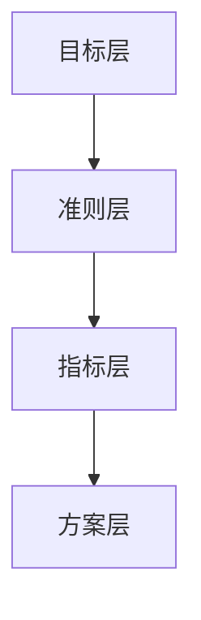
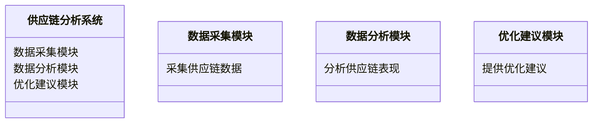
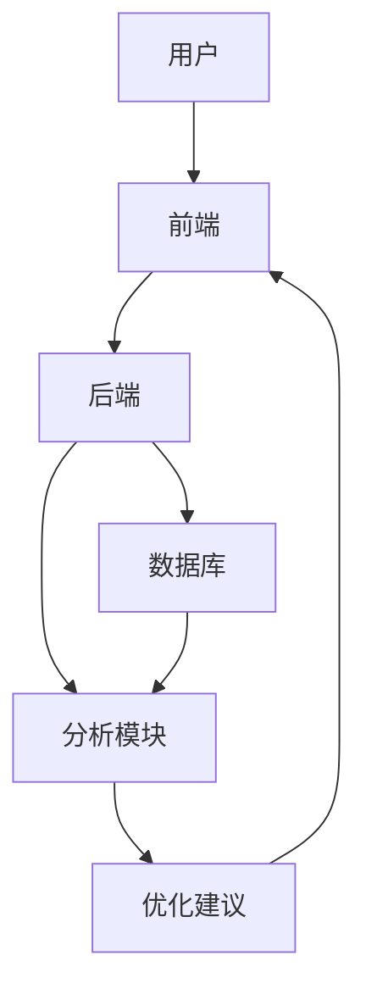

                 


# 价值投资中的供应链分析

> 关键词：供应链分析，价值投资，企业价值，投资策略，风险管理

> 摘要：供应链分析是价值投资中不可或缺的一部分，它帮助企业识别潜在风险和机会，优化资源配置，提升企业价值。本文将从供应链的基本概念出发，逐步分析其核心要素、评估方法和数学模型，并结合实际案例，探讨供应链分析在价值投资中的应用。

---

# 第1章: 供应链分析的基本概念

## 1.1 供应链的基本概念

### 1.1.1 供应链的定义与组成
供应链是指从原材料采购到最终产品交付给消费者的整个流程，包括供应商、制造商、分销商、零售商和消费者等环节。供应链的核心要素包括：

- **供应商**：提供原材料或零部件的企业。
- **制造商**：将原材料转化为产品的企业。
- **分销商**：将产品分发到各个销售渠道的企业。
- **零售商**：直接面向消费者的销售终端。
- **物流**：产品在各环节之间的运输和存储。

### 1.1.2 供应链的运作模式
供应链的运作模式可以分为以下几个步骤：
1. **需求预测**：根据市场趋势和消费者需求预测产品需求。
2. **采购与生产计划**：根据需求预测制定采购和生产计划。
3. **生产与库存管理**：组织生产并监控库存水平。
4. **物流与交付**：将产品送达消费者手中。

### 1.1.3 供应链管理的核心要素
供应链管理的核心要素包括：
- **成本控制**：降低采购、生产、物流等环节的成本。
- **效率提升**：优化供应链各环节的运作效率。
- **风险控制**：识别和应对供应链中的潜在风险。

## 1.2 价值投资的核心理念

### 1.2.1 价值投资的定义与特点
价值投资是一种投资策略，旨在以低于内在价值的价格买入优质资产。其核心理念是寻找被市场低估的企业，长期持有，分享企业成长的收益。

### 1.2.2 价值投资与供应链分析的结合
供应链分析是价值投资的重要组成部分，因为供应链的稳定性和效率直接影响企业的盈利能力。通过分析供应链的各个环节，投资者可以更好地评估企业的核心竞争力和潜在风险。

### 1.2.3 供应链分析在价值投资中的作用
供应链分析在价值投资中的作用包括：
- **识别潜在风险**：发现供应链中的瓶颈和潜在风险，评估企业的抗风险能力。
- **评估企业竞争力**：分析供应链的成本和效率，评估企业的竞争优势。
- **优化投资决策**：通过供应链分析，投资者可以更准确地评估企业的内在价值。

---

# 第2章: 供应链分析的背景与意义

## 2.1 供应链分析的背景

### 2.1.1 全球化背景下的供应链复杂性
全球化使得供应链更加复杂，企业需要依赖全球范围内的供应商和合作伙伴。这种复杂性增加了供应链的风险，例如国际贸易摩擦、地缘政治风险等。

### 2.1.2 数字化与智能化供应链的发展
随着信息技术的发展，供应链逐渐数字化和智能化。企业可以通过大数据分析、人工智能等技术优化供应链管理，提高效率和降低成本。

### 2.1.3 供应链风险对企业价值的影响
供应链中的任何环节出现问题，都会影响企业的生产效率和成本，从而影响企业的盈利能力和市场价值。例如，原材料价格上涨、物流延误等都会对企业的价值产生负面影响。

## 2.2 供应链分析的意义

### 2.2.1 供应链分析对企业竞争力的影响
通过供应链分析，企业可以识别和优化供应链中的低效环节，降低成本，提高效率，增强竞争力。

### 2.2.2 供应链分析对投资决策的价值
供应链分析可以帮助投资者评估企业的供应链稳定性、成本控制能力和抗风险能力，从而做出更明智的投资决策。

### 2.2.3 供应链优化与企业价值提升的关系
优化供应链管理可以降低成本、提高效率、增强抗风险能力，从而提升企业的市场价值和股东价值。

---

# 第3章: 供应链的核心要素分析

## 3.1 供应商分析

### 3.1.1 供应商的稳定性与可靠性
供应商的稳定性与可靠性是供应链分析的重要内容。投资者需要评估供应商的财务状况、生产能力、交货能力等，以确保供应链的稳定性。

### 3.1.2 供应商的成本结构与议价能力
供应商的成本结构和议价能力直接影响企业的采购成本。投资者需要分析供应商的议价能力，评估企业是否能够获得具有竞争力的采购价格。

### 3.1.3 供应商的创新能力与响应速度
供应商的创新能力与响应速度影响企业的研发能力和市场反应速度。投资者需要评估供应商是否能够提供创新的解决方案，以应对市场的变化。

## 3.2 生产与库存管理

### 3.2.1 生产过程的效率与成本控制
生产过程的效率和成本控制直接影响企业的盈利能力。投资者需要分析企业的生产流程是否优化，是否存在浪费，是否能够降低成本。

### 3.2.2 库存管理的优化策略
库存管理的优化策略包括库存控制、库存周转率等指标。投资者需要分析企业的库存管理是否科学，是否存在库存积压或短缺的问题。

### 3.2.3 生产与库存的动态平衡
生产与库存的动态平衡是供应链管理的重要内容。投资者需要分析企业是否能够根据市场需求调整生产计划，保持库存与生产之间的动态平衡。

## 3.3 物流与分销网络

### 3.3.1 物流成本的构成与优化
物流成本包括运输、仓储、包装等费用。投资者需要分析物流成本的构成，评估企业是否能够通过优化物流流程降低成本。

### 3.3.2 分销网络的覆盖与效率
分销网络的覆盖与效率直接影响企业的市场渗透能力和销售效率。投资者需要分析企业的分销网络是否合理，是否存在覆盖不足或效率低下的问题。

### 3.3.3 物流与供应链效率的关系
物流效率直接影响供应链的整体效率。投资者需要分析企业是否能够通过优化物流管理提高供应链效率，降低成本。

---

# 第4章: 供应链分析的方法与工具

## 4.1 供应链分析的主要方法

### 4.1.1 层次分析法（AHP）
层次分析法（AHP）是一种常用的决策分析方法，适用于多因素决策问题。通过构建层次结构，分析各因素的权重，评估供应链的综合表现。

### 4.1.2 SWOT分析法
SWOT分析法是一种简单有效的分析工具，用于评估供应链的优势、劣势、机会和威胁。

### 4.1.3 网络分析法
网络分析法通过构建供应链的网络结构，分析各节点之间的关系，评估供应链的整体效率和风险。

## 4.2 供应链分析的工具

### 4.2.1 数据可视化工具（如Tableau）
数据可视化工具可以帮助投资者直观地展示供应链的数据，发现潜在的问题和机会。

### 4.2.2 供应链管理软件（如ERP系统）
供应链管理软件可以帮助企业实现供应链的信息化管理，优化供应链各环节的运作。

### 4.2.3 数据挖掘与建模工具
数据挖掘与建模工具可以帮助投资者分析供应链的大数据，发现潜在的模式和趋势，支持决策。

---

# 第5章: 供应链评估的数学模型与算法

## 5.1 供应链评估的数学模型

### 5.1.1 供应链综合评分模型
供应链综合评分模型是一种常用的评估方法，通过多个指标对供应链进行综合评分，评估供应链的整体表现。

### 5.1.2 供应链成本优化模型
供应链成本优化模型用于分析供应链的成本构成，优化成本分配，降低整体成本。

### 5.1.3 供应链风险评估模型
供应链风险评估模型用于评估供应链中的潜在风险，预测风险对供应链的影响，制定应对策略。

## 5.2 算法原理与流程图

### 5.2.1 层次分析法（AHP）流程图


### 5.2.2 Python实现
```python
import numpy as np
from scipy.cluster import hierarchy

# 示例数据：供应链各环节的评分
data = np.array([[0.8, 0.6, 0.7],
                 [0.7, 0.9, 0.6],
                 [0.6, 0.8, 0.8]])

# 计算供应链综合评分
sum_data = np.sum(data, axis=1)
average = np.mean(sum_data)
```

---

# 第6章: 系统分析与架构设计方案

## 6.1 问题场景介绍
供应链分析系统需要解决的问题包括：供应链各环节的数据采集、分析和优化。系统需要支持多因素分析、数据可视化和优化建议。

## 6.2 系统功能设计

### 6.2.1 系统功能模块
- **数据采集模块**：采集供应链各环节的数据。
- **数据分析模块**：对数据进行分析，评估供应链的综合表现。
- **优化建议模块**：根据分析结果，提供优化建议。

### 6.2.2 领域模型（Mermaid 类图）


## 6.3 系统架构设计

### 6.3.1 系统架构图


---

# 第7章: 项目实战

## 7.1 环境安装
需要安装Python、numpy、pandas、scipy等库。

## 7.2 核心实现

### 7.2.1 数据采集
```python
import pandas as pd
data = pd.read_csv('supply_chain.csv')
```

### 7.2.2 数据分析
```python
from scipy.cluster import hierarchy
import numpy as np

data_matrix = data.values
distance_matrix = np.zeros((len(data_matrix), len(data_matrix)))

for i in range(len(data_matrix)):
    for j in range(len(data_matrix)):
        distance_matrix[i][j] = np.sum(abs(data_matrix[i] - data_matrix[j]))
```

### 7.2.3 优化建议
```python
from sklearn.cluster import AgglomerativeClustering

model = AgglomerativeClustering(n_clusters=3)
clusters = model.fit_predict(data_matrix)
print(clusters)
```

## 7.3 案例分析
以某制造企业为例，分析其供应链的优化过程。

---

# 第8章: 总结与展望

## 8.1 核心观点总结
供应链分析是价值投资的重要组成部分，通过分析供应链的各个环节，投资者可以更好地评估企业的价值和风险。

## 8.2 未来趋势与挑战
随着数字化和智能化的发展，供应链分析将更加依赖大数据和人工智能技术。同时，全球化的供应链也将面临更多的风险和挑战。

## 8.3 最佳实践 tips
- **数据驱动决策**：利用数据和模型优化供应链管理。
- **持续监控**：定期监控供应链的运行状况，及时调整策略。
- **风险管理**：识别和应对供应链中的潜在风险。

---

# 作者：AI天才研究院/AI Genius Institute & 禅与计算机程序设计艺术 /Zen And The Art of Computer Programming

