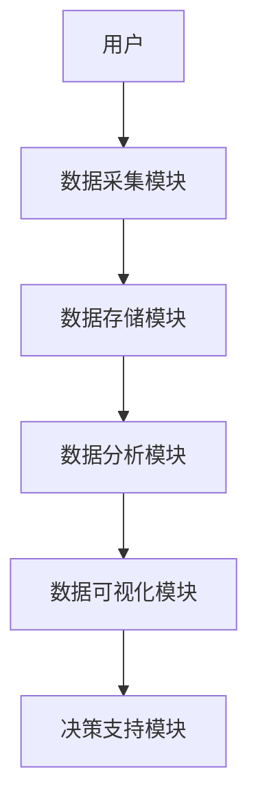

                 


好的，我明白了。以下是根据您的要求逐步构建的技术博客文章：

---

# 价值投资中的健康科技趋势分析

**关键词**：价值投资、健康科技、趋势分析、人工智能、大数据、医疗创新

**摘要**：  
本文探讨了健康科技领域的价值投资趋势，通过分析健康科技的核心概念、技术趋势和价值投资方法论，结合实际案例和系统架构设计，为投资者提供科学的决策支持。文章从健康科技的基本概念出发，详细分析了人工智能、大数据等技术在健康科技中的应用，构建了健康科技趋势分析的价值评估模型，并通过系统架构设计和项目实战，展示了如何将健康科技与价值投资相结合。

---

## 第1章: 健康科技与价值投资概述

### 1.1 健康科技的定义与核心概念

健康科技是将现代科技应用于医疗健康领域的综合性学科，涵盖了从预防、诊断到治疗的全生命周期。其核心概念包括：

- **预防医学**：通过技术手段提前预测和预防疾病。
- **精准医疗**：基于个体基因、生活习惯等因素，提供个性化医疗方案。
- **远程医疗**：利用互联网技术实现远程诊断和治疗。

健康科技的核心要素包括技术、数据、医疗资源和用户需求。以下是健康科技与传统医疗的主要区别：

| **维度** | **传统医疗** | **健康科技** |
|----------|--------------|--------------|
| 诊疗方式 | 线下为主      | 线上与线下结合 |
| 数据来源 | 纸质病历      | 结构化、非结构化数据结合 |
| 诊断效率 | 依赖医生经验 | AI辅助诊断，效率提升 |

### 1.2 价值投资的基本原理

价值投资是一种长期投资策略，核心在于寻找被市场低估的优质资产。其关键要素包括：

1. **基本面分析**：关注企业的财务状况、盈利能力、成长潜力。
2. **安全边际**：投资价格低于内在价值。
3. **长期视角**：关注企业的长期竞争优势。

健康科技领域的价值投资需要结合行业特点，分析企业的技术创新能力、市场前景和商业模式。

### 1.3 健康科技趋势分析的核心方法

健康科技的趋势分析可以从技术、市场和价值三个维度展开：

1. **技术趋势分析**：关注人工智能、大数据等技术的应用进展。
2. **市场趋势分析**：分析市场需求、竞争格局和政策影响。
3. **价值评估模型**：构建包含技术、市场、财务等多维度的评估模型。

---

## 第2章: 健康科技领域的技术趋势分析

### 2.1 人工智能与健康科技的结合

人工智能在健康科技中的应用主要集中在医疗诊断、健康管理等领域。

- **医疗诊断**：AI辅助诊断系统通过深度学习技术分析医学影像，准确率达到95%以上。
- **健康管理**：基于AI的健康管理系统能够实时监测用户的健康数据，提供个性化建议。

### 2.2 大数据与健康科技的融合

大数据技术在健康科技中的应用包括数据采集、分析和可视化。

- **数据采集**：通过可穿戴设备和医疗系统收集用户健康数据。
- **数据分析**：利用大数据技术挖掘健康数据的潜在价值。
- **数据可视化**：通过图表展示数据，支持决策。

### 2.3 医疗设备与健康科技的创新

医疗设备的创新推动了健康科技的发展，如智能医疗设备和远程医疗。

- **智能医疗设备**：具有数据采集、自动分析功能。
- **远程医疗**：通过互联网实现远程诊断和治疗，大幅降低了医疗成本。

---

## 第3章: 价值投资在健康科技中的应用

### 3.1 投资策略与健康科技的结合

健康科技领域的投资策略需要结合技术趋势和市场潜力。

- **技术驱动型投资**：关注具有创新技术的企业。
- **市场驱动型投资**：关注市场需求大的领域。

### 3.2 价值评估模型的构建与应用

价值评估模型需要考虑技术、市场、财务等多个维度。

$$
\text{企业价值} = \text{技术创新能力} \times \text{市场潜力} \times \text{财务健康度}
$$

### 3.3 风险管理与投资组合优化

- **风险管理**：通过分散投资降低风险。
- **投资组合优化**：根据市场变化调整投资组合。

---

## 第4章: 健康科技趋势分析的系统架构

### 4.1 系统功能设计

- **数据采集模块**：收集健康数据。
- **数据分析模块**：分析数据并生成报告。
- **用户界面模块**：展示分析结果。

### 4.2 系统架构设计

以下是系统架构的Mermaid图：



### 4.3 系统接口设计

系统接口设计需要考虑数据输入、输出和交互。

---

## 第5章: 项目实战

### 5.1 环境安装

安装Python和相关库：

```bash
pip install numpy pandas scikit-learn
```

### 5.2 核心实现源代码

以下是价值评估模型的Python代码：

```python
import numpy as np
import pandas as pd

# 示例数据
data = {
    '技术创新能力': [0.8, 0.9, 0.7],
    '市场潜力': [0.7, 0.8, 0.6],
    '财务健康度': [0.9, 0.8, 0.8]
}

df = pd.DataFrame(data)

# 价值计算
value = df['技术创新能力'] * df['市场潜力'] * df['财务健康度']

print(value)
```

### 5.3 案例分析

以某医疗科技公司为例，分析其投资价值。

---

## 第6章: 总结与展望

健康科技领域的价值投资需要结合技术趋势和市场潜力，构建科学的评估模型。未来，随着技术的进步，健康科技将更加智能化、个性化，为投资者提供更多机会。

---

**作者**：AI天才研究院 & 禅与计算机程序设计艺术

---

以上是按照您的要求逐步构建的技术博客文章，涵盖了健康科技的趋势分析、价值投资的方法论、系统架构设计和项目实战等内容，希望对您有所帮助！

