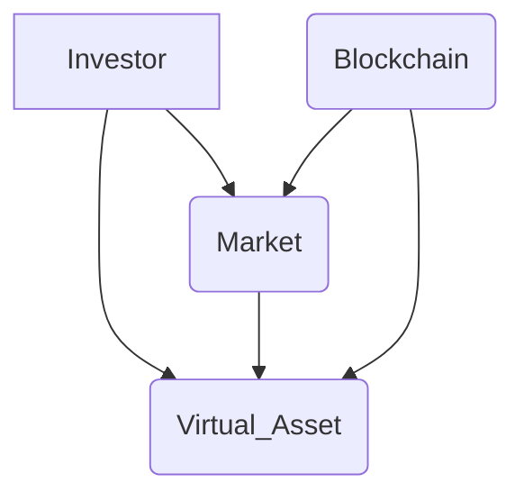
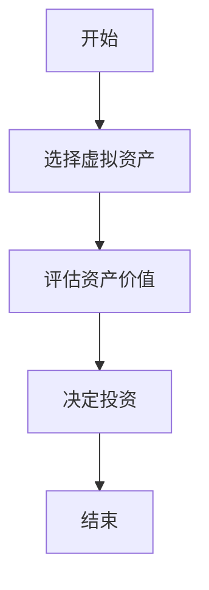
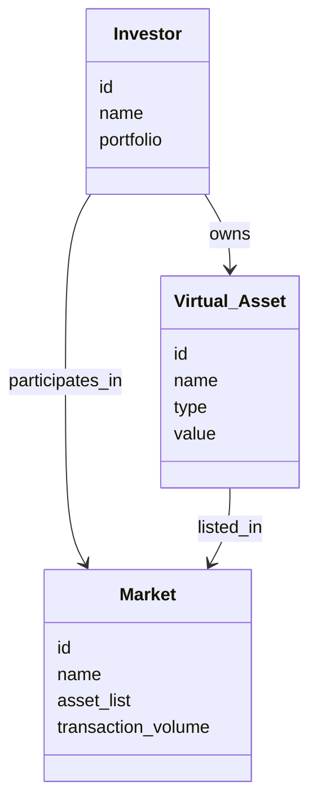
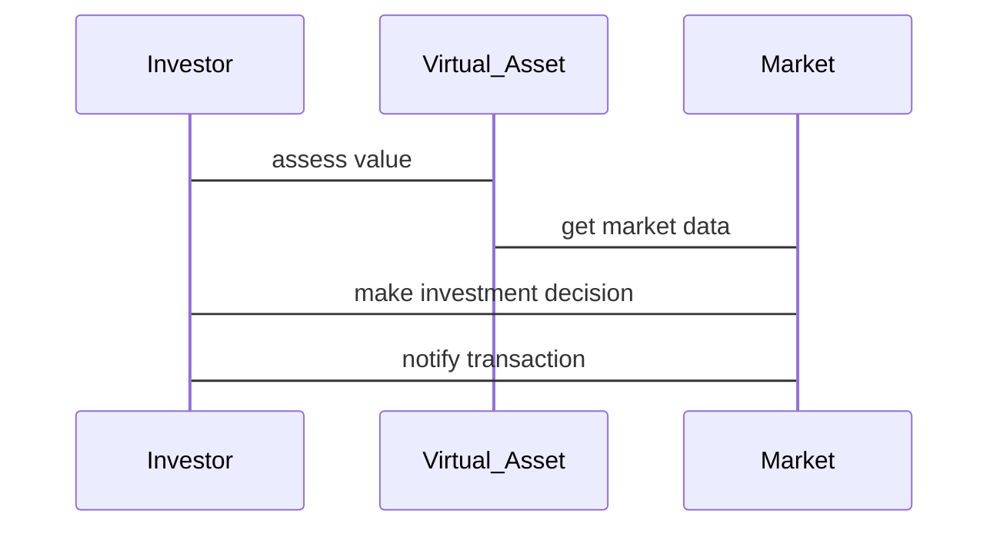
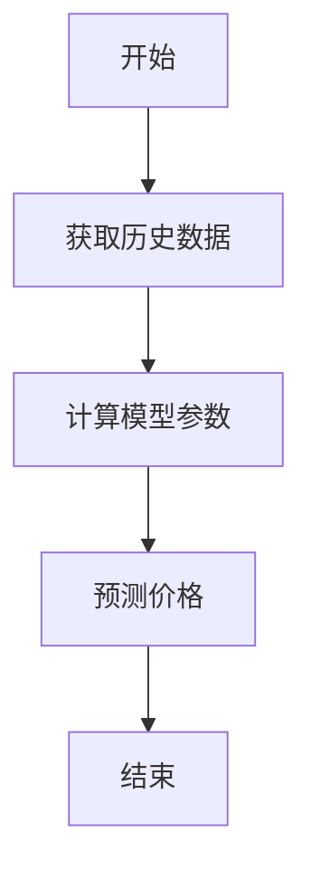
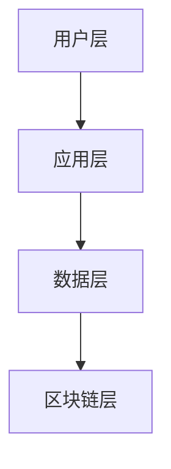
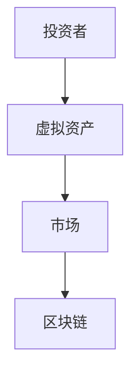
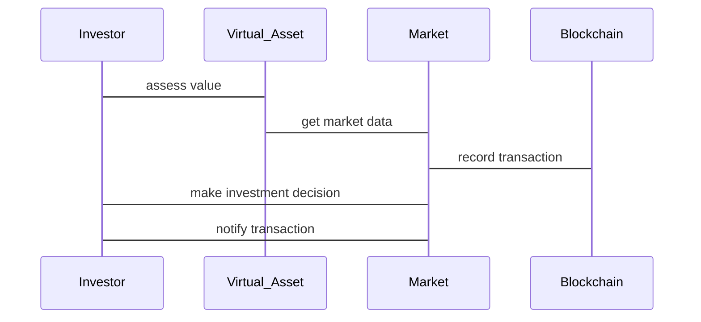

                 


# 价值投资中的元宇宙概念解析

> 关键词：元宇宙，价值投资，虚拟经济，数字资产，NFT，区块链，虚拟货币

> 摘要：本文从元宇宙的概念出发，结合价值投资的基本原理，深入探讨元宇宙经济体系中的投资机会与风险，构建元宇宙价值评估模型，并通过算法实现对元宇宙虚拟资产的价值预测。文章还结合实际案例，分析元宇宙价值投资的系统架构与实现方案，最后总结了元宇宙价值投资的未来发展趋势与投资策略。

---

# 第1章 元宇宙与价值投资的背景介绍

## 1.1 元宇宙的基本概念与核心要素

### 1.1.1 元宇宙的定义与特征

元宇宙（Metaverse）是一个虚拟的、持续的、可交互的三维数字世界，通过区块链、虚拟现实（VR）、增强现实（AR）、人工智能（AI）、物联网（IoT）等技术构建，用户可以在其中进行社交、娱乐、工作、学习等各类活动。元宇宙的核心特征包括：

- **持续性**：元宇宙是一个持续运行的数字空间，不受物理世界时间的限制。
- **可交互性**：用户可以通过虚拟现实设备与元宇宙中的物体和用户进行交互。
- **去中心化**：元宇宙的运行机制基于区块链技术，具有去中心化的特点。
- **经济系统**：元宇宙中存在虚拟货币、NFT（非同质化代币）等经济体系。

### 1.1.2 元宇宙的核心要素组成

元宇宙的核心要素包括：

1. **虚拟现实技术**：构建用户沉浸式的虚拟环境。
2. **区块链技术**：实现元宇宙中数字资产的去中心化和确权。
3. **人工智能技术**：提供智能化的交互体验。
4. **虚拟经济体系**：包括虚拟货币、NFT、数字商品等。
5. **社交网络**：用户可以在元宇宙中建立社交关系。

### 1.1.3 元宇宙与现实世界的边界与外延

元宇宙与现实世界的边界主要体现在：

- **技术边界**：元宇宙依赖于虚拟现实、区块链等技术实现。
- **经济边界**：元宇宙中的经济体系与现实世界通过虚拟货币和数字资产连接。
- **社会边界**：元宇宙中的社交活动与现实世界存在互动。

元宇宙的外延包括：

- **虚拟资产**：如NFT、虚拟货币等。
- **数字商品**：如虚拟土地、虚拟装备等。
- **虚拟服务**：如虚拟教育、虚拟医疗等。

---

## 1.2 价值投资的基本概念与原则

### 1.2.1 价值投资的定义与核心理念

价值投资是一种投资策略，其核心理念是通过分析企业的基本面，寻找被市场低估的投资标的进行长期投资。价值投资强调以下几点：

1. **内在价值**：投资标的的真实价值。
2. **安全边际**：投资价格低于内在价值。
3. **长期视角**：关注企业的长期盈利能力。

### 1.2.2 价值投资的基本原则与策略

价值投资的基本原则包括：

- **深入研究**：对企业的财务状况、行业地位、竞争优势等进行深入分析。
- **长期持有**：避免短期市场波动的干扰。
- **分散投资**：降低投资风险。

### 1.2.3 价值投资在传统金融中的应用

在传统金融中，价值投资主要应用于股票、债券等金融资产的投资。投资者通过分析企业的财务报表、行业地位、竞争优势等因素，寻找具有长期增长潜力的优质企业进行投资。

---

## 1.3 元宇宙与价值投资的结合点

### 1.3.1 元宇宙中的虚拟经济与虚拟资产

元宇宙中的虚拟经济体系包括虚拟货币（如比特币、以太坊）和数字资产（如NFT）。这些虚拟资产具有以下特点：

- **稀缺性**：NFT具有唯一性和不可替代性。
- **流动性**：虚拟货币可以在不同的虚拟平台之间流通。
- **经济价值**：虚拟资产的价值取决于市场供需关系。

### 1.3.2 元宇宙中的投资机会与风险

元宇宙的投资机会主要体现在以下几个方面：

- **虚拟货币**：如比特币、以太坊等。
- **NFT**：如数字艺术品、虚拟土地等。
- **数字商品**：如虚拟装备、虚拟道具等。

元宇宙的投资风险包括：

- **市场波动风险**：虚拟资产价格波动较大。
- **技术风险**：元宇宙的技术实现依赖于区块链、虚拟现实等技术，技术不成熟可能会影响投资价值。
- **政策风险**：虚拟资产的监管政策不确定性较高。

### 1.3.3 元宇宙价值投资的核心问题与挑战

元宇宙价值投资的核心问题是如何评估虚拟资产的真实价值。挑战包括：

- **评估标准不统一**：虚拟资产的价值评估缺乏统一的标准。
- **数据不透明**：虚拟资产的交易数据可能存在不透明的问题。
- **市场流动性不足**：部分虚拟资产的流动性较低，影响其投资价值。

---

# 第2章 元宇宙价值投资的核心概念与联系

## 2.1 元宇宙价值评估模型的原理

### 2.1.1 元宇宙价值评估的理论基础

元宇宙价值评估的理论基础包括：

- **经济学理论**：如供需理论、资产定价理论等。
- **区块链技术**：虚拟资产的去中心化特性。
- **大数据分析**：通过对虚拟资产的历史交易数据进行分析，寻找价格波动规律。

### 2.1.2 元宇宙价值评估的核心要素

元宇宙价值评估的核心要素包括：

1. **虚拟资产的稀缺性**：如NFT的唯一性。
2. **虚拟资产的使用场景**：如NFT的用途。
3. **虚拟资产的市场流动性**：如虚拟货币的交易活跃度。

### 2.1.3 元宇宙价值评估的数学模型

元宇宙价值评估的数学模型可以表示为：

$$
V = f(s, l, u)
$$

其中：
- \( V \) 表示虚拟资产的价值。
- \( s \) 表示虚拟资产的稀缺性。
- \( l \) 表示虚拟资产的市场流动性。
- \( u \) 表示虚拟资产的使用场景。

---

## 2.2 元宇宙价值投资的实体关系图

### 2.2.1 元宇宙价值投资的ER实体关系图

以下是元宇宙价值投资的ER实体关系图：

```mermaid
erDiagram
    actor Investor {
        id : integer
        name : string
    }
    class Virtual_Asset {
        id : integer
        name : string
        type : string
        value : float
        transaction_history : string
    }
    class Market {
        id : integer
        name : string
        asset_list : string
        transaction_volume : float
    }
    class Blockchain {
        id : integer
        name : string
        asset_records : string
    }
    Investor -> Virtual_Asset : owns
    Investor -> Market : participates_in
    Virtual_Asset -> Market : listed_in
    Blockchain -> Virtual_Asset : records
    Blockchain -> Market : tracks
```

### 2.2.2 元宇宙价值投资的系统架构图

以下是元宇宙价值投资的系统架构图：



### 2.2.3 元宇宙价值投资的流程图

以下是元宇宙价值投资的流程图：



---

## 2.3 元宇宙价值投资的系统架构设计

### 2.3.1 系统功能模块划分

元宇宙价值投资系统的功能模块包括：

1. **资产评估模块**：对虚拟资产进行价值评估。
2. **市场分析模块**：分析虚拟资产的市场趋势。
3. **投资决策模块**：基于评估结果和市场分析结果，做出投资决策。
4. **交易执行模块**：执行虚拟资产的买卖交易。

### 2.3.2 系统功能的领域模型设计

以下是元宇宙价值投资系统的领域模型设计：



### 2.3.3 系统功能的交互设计

以下是元宇宙价值投资系统的交互设计：



---

# 第3章 元宇宙价值投资的算法原理

## 3.1 元宇宙价值预测算法的数学模型

### 3.1.1 元宇宙价值预测的数学公式

元宇宙价值预测的数学公式可以表示为：

$$
P_{\text{predicted}} = a \cdot P_{\text{current}} + b \cdot V + c \cdot T
$$

其中：
- \( P_{\text{predicted}} \) 表示预测的虚拟资产价格。
- \( P_{\text{current}} \) 表示当前虚拟资产价格。
- \( V \) 表示虚拟资产的价值。
- \( T \) 表示时间因素。
- \( a, b, c \) 是模型参数。

### 3.1.2 元宇宙价值预测的算法流程

以下是元宇宙价值预测的算法流程：



### 3.1.3 元宇宙价值预测的案例分析

以下是一个简单的元宇宙价值预测案例：

假设我们有一个虚拟货币的价格历史数据，我们可以通过线性回归模型预测其未来的价格。

```python
import numpy as np

# 历史价格数据
prices = np.array([10, 20, 30, 40, 50])

# 计算平均值
mean_price = np.mean(prices)

# 计算回归系数
covariance = np.cov(prices, np.array([1, 2, 3, 4, 5]))
variance = np.var(prices)

# 回归系数
beta = covariance / variance

# 预测未来价格
future_price = beta * 6 + mean_price - beta * 1
print(future_price)
```

---

## 3.2 元宇宙价值投资的机器学习算法

### 3.2.1 基于时间序列的预测算法

基于时间序列的预测算法可以用于预测虚拟资产的未来价格。常用的时间序列算法包括ARIMA和LSTM。

### 3.2.2 基于深度学习的预测模型

基于深度学习的预测模型可以用于分析虚拟资产的市场情绪，从而辅助价值投资决策。常用的深度学习模型包括LSTM和Transformer。

### 3.2.3 基于NLP的情感分析算法

基于NLP的情感分析算法可以用于分析虚拟资产相关的社交媒体情绪，从而辅助价值投资决策。

---

# 第4章 元宇宙价值投资的系统架构设计

## 4.1 元宇宙价值投资系统的功能设计

### 4.1.1 系统功能模块划分

元宇宙价值投资系统的功能模块包括：

1. **数据采集模块**：采集虚拟资产的交易数据。
2. **数据处理模块**：对虚拟资产的交易数据进行清洗和预处理。
3. **价值评估模块**：对虚拟资产进行价值评估。
4. **投资决策模块**：基于评估结果和市场分析结果，做出投资决策。

### 4.1.2 系统功能的领域模型设计

以下是元宇宙价值投资系统的领域模型设计：


### 4.1.3 系统功能的交互设计

以下是元宇宙价值投资系统的交互设计：


---

## 4.2 元宇宙价值投资系统的架构图

### 4.2.1 系统架构的分层设计

以下是元宇宙价值投资系统的分层设计：



### 4.2.2 系统架构的模块划分

以下是元宇宙价值投资系统的模块划分：



### 4.2.3 系统架构的交互流程

以下是元宇宙价值投资系统的交互流程：



---

## 4.3 元宇宙价值投资系统的接口设计

### 4.3.1 系统接口的定义与规范

元宇宙价值投资系统的接口包括：

1. **虚拟资产评估接口**：对虚拟资产进行价值评估。
2. **市场数据接口**：获取虚拟资产的市场数据。
3. **交易接口**：执行虚拟资产的买卖交易。

### 4.3.2 系统接口的交互流程

以下是元宇宙价值投资系统的接口交互流程：


### 4.3.3 系统接口的实现方式

元宇宙价值投资系统的接口实现方式包括：

1. **REST API**：通过HTTP协议实现接口。
2. **WebSocket**：通过实时通信协议实现接口。
3. **区块链智能合约**：通过智能合约实现接口。

---

# 第5章 元宇宙价值投资的项目实战

## 5.1 元宇宙价值投资项目的环境搭建

### 5.1.1 开发环境的安装与配置

元宇宙价值投资项目的开发环境包括：

- **操作系统**：Windows、macOS、Linux。
- **开发工具**：PyCharm、VS Code。
- **虚拟环境**：Python虚拟环境。

### 5.1.2 数据源的获取与处理

元宇宙价值投资项目的数据源包括：

- **虚拟货币价格数据**：可以从CoinMarketCap等平台获取。
- **NFT交易数据**：可以从OpenSea等平台获取。

### 5.1.3 开发工具的使用与配置

开发工具的使用与配置包括：

- **Python**：安装Python 3.x。
- **库的安装**：安装Pandas、NumPy、Scikit-learn等库。

## 5.2 元宇宙价值投资项目的核心实现

### 5.2.1 价值评估模型的实现

以下是价值评估模型的实现代码：

```python
import numpy as np
import pandas as pd

# 数据加载
data = pd.read_csv('virtual_asset_data.csv')

# 数据预处理
data = data.dropna()
data = data[['price', 'volume', 'market_cap']]

# 模型训练
from sklearn.linear_model import LinearRegression
model = LinearRegression()
model.fit(data[['volume', 'market_cap']], data['price'])

# 模型预测
new_volume = 1000000
new_market_cap = 100000000
predicted_price = model.predict([[new_volume, new_market_cap]])
print(predicted_price)
```

### 5.2.2 机器学习算法的实现

以下是机器学习算法的实现代码：

```python
import numpy as np
import pandas as pd
from sklearn.preprocessing import MinMaxScaler
from tensorflow.keras.models import Sequential
from tensorflow.keras.layers import LSTM, Dense

# 数据加载
data = pd.read_csv('virtual_asset_data.csv')

# 数据预处理
scaler = MinMaxScaler()
data_scaled = scaler.fit_transform(data['price'].values.reshape(-1, 1))

# 模型训练
model = Sequential()
model.add(LSTM(128, input_shape=(1, 1)))
model.add(Dense(1))
model.compile(optimizer='adam', loss='mean_squared_error')

model.fit(data_scaled, epochs=100, batch_size=32)

# 模型预测
new_data = data_scaled[-32:]
new_data = new_data.reshape(1, 32, 1)
predicted_price = model.predict(new_data)
predicted_price = scaler.inverse_transform(predicted_price)
print(predicted_price)
```

---

## 5.3 元宇宙价值投资项目的案例分析与解读

### 5.3.1 案例分析

以下是一个NFT价值投资的案例分析：

假设我们有一个NFT项目，其历史交易数据如下：

| 日期 | NFT价格（ETH） |
|------|----------------|
| 2023-01-01 | 0.1 |
| 2023-01-02 | 0.15 |
| 2023-01-03 | 0.2 |
| 2023-01-04 | 0.25 |
| 2023-01-05 | 0.3 |

通过线性回归模型预测未来的NFT价格：

$$
P_{\text{predicted}} = 0.05 \cdot t + 0.05
$$

其中，\( t \) 表示时间，单位为天。

---

## 5.4 元宇宙价值投资项目的总结与小结

通过上述项目实战，我们可以看到元宇宙价值投资的核心在于对虚拟资产的价值评估和市场趋势的预测。通过机器学习算法和大数据分析，我们可以提高虚拟资产的价值评估的准确性，从而做出更明智的投资决策。

---

# 第6章 元宇宙价值投资的总结与展望

## 6.1 元宇宙价值投资的未来发展趋势

随着元宇宙技术的不断发展，元宇宙价值投资的未来发展趋势包括：

1. **技术进步**：区块链、虚拟现实、人工智能等技术的进一步发展将推动元宇宙价值投资的深入发展。
2. **市场成熟**：元宇宙市场的逐步成熟将提高虚拟资产的价值评估的准确性。
3. **监管完善**：虚拟资产的监管政策将逐步完善，为元宇宙价值投资提供更稳定的市场环境。

---

## 6.2 元宇宙价值投资的注意事项与最佳实践

### 6.2.1 注意事项

1. **市场风险**：虚拟资产价格波动较大，需注意市场风险。
2. **技术风险**：元宇宙技术尚未成熟，需注意技术风险。
3. **政策风险**：虚拟资产的监管政策不确定性较高，需注意政策风险。

### 6.2.2 最佳实践

1. **深入研究**：对虚拟资产的基本面进行深入研究。
2. **分散投资**：避免将所有资金投入单一虚拟资产。
3. **长期视角**：关注虚拟资产的长期价值，避免短期波动的干扰。

---

## 6.3 元宇宙价值投资的拓展阅读

1. **区块链技术**：深入学习区块链技术，了解虚拟资产的底层实现。
2. **机器学习算法**：进一步学习机器学习算法，提高虚拟资产的价值评估的准确性。
3. **元宇宙经济体系**：研究元宇宙的经济体系，了解虚拟资产的经济价值。

---

# 作者

作者：AI天才研究院/AI Genius Institute & 禅与计算机程序设计艺术 /Zen And The Art of Computer Programming

---

**本文是关于元宇宙价值投资的系统性分析与实践指南，旨在为投资者提供理论支持与实践指导，帮助读者更好地理解和把握元宇宙经济体系中的投资机会与风险。**

