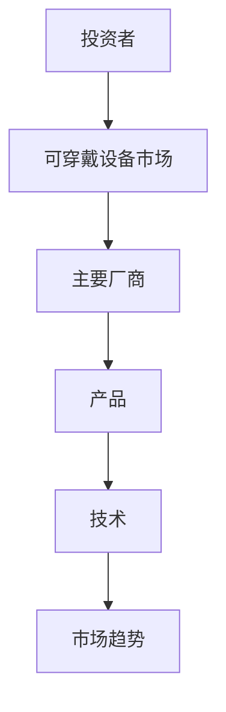
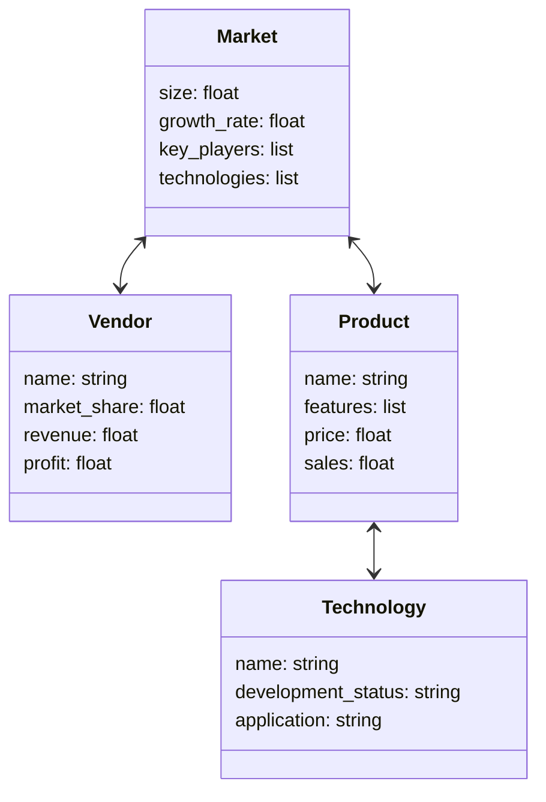
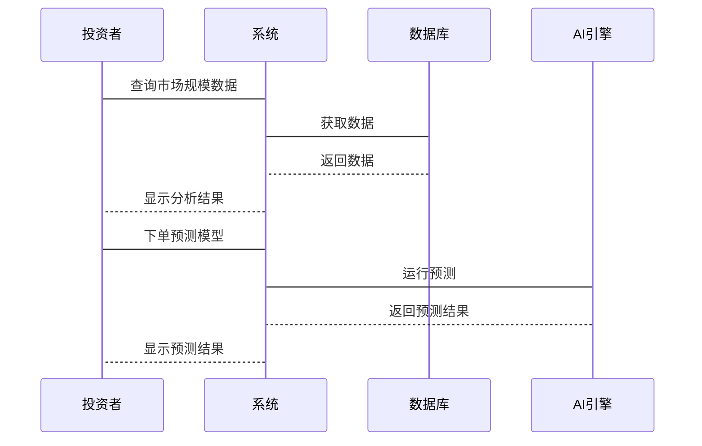

                 


# 价值投资中的可穿戴设备市场分析

> **关键词**：价值投资，可穿戴设备，市场分析，投资策略，技术趋势

> **摘要**：随着科技的快速发展，可穿戴设备市场成为投资领域的重要关注点。本文通过分析可穿戴设备市场的核心概念、竞争格局、技术趋势和投资策略，为投资者提供深入的市场洞察和价值评估方法。结合实际案例和系统架构设计，本文旨在帮助投资者在可穿戴设备市场中找到长期价值增长的机会。

---

## 第1章: 可穿戴设备市场与价值投资的背景介绍

### 1.1 可穿戴设备的定义与核心概念

#### 1.1.1 可穿戴设备的定义与分类
可穿戴设备是指佩戴在人体或整合到穿着物品中的便携式电子设备，通常用于健康监测、运动追踪、智能助手等功能。根据功能和应用场景，可穿戴设备主要分为以下几类：
- **健康类**：如智能手表、健康监测手环，主要用于心率监测、血压监测、睡眠分析等。
- **运动类**：如运动追踪器、智能运动鞋，主要用于运动数据分析、步数统计、卡路里消耗计算等。
- **智能助手类**：如智能眼镜、智能头盔，主要用于信息处理、语音助手、导航等。
- **行业专用类**：如工业级可穿戴设备，用于特定行业的数据采集、安全监测等。

#### 1.1.2 可穿戴设备的核心技术特征
可穿戴设备的核心技术包括：
- **传感器技术**：用于收集生理数据（如心率、体温）和环境数据（如温度、湿度）。
- **低功耗技术**：由于设备需要长时间佩戴，低功耗设计是关键。
- **数据传输技术**：通过蓝牙、Wi-Fi等技术将数据传输到手机或其他终端设备。
- **人工智能技术**：用于数据处理、用户行为分析和智能决策支持。

#### 1.1.3 可穿戴设备的市场发展现状
近年来，全球可穿戴设备市场增长迅速。根据市场研究机构的数据，2022年全球可穿戴设备出货量达到5亿台，预计未来几年将以年均15%的速度增长。主要推动因素包括：
- **技术进步**：传感器和芯片技术的提升使得设备功能更强大、更精准。
- **健康意识增强**：用户对健康管理的需求增加，推动了健康类设备的普及。
- **价格下降**：随着技术成熟和规模效应，设备价格逐渐下降，市场进一步扩大。

### 1.2 价值投资的基本原理

#### 1.2.1 价值投资的定义与核心理念
价值投资是一种长期投资策略，强调以低于内在价值的价格买入优质资产。其核心理念包括：
- **长期视角**：关注企业的长期增长潜力，而非短期价格波动。
- **基本面分析**：通过分析企业的财务状况、行业地位、竞争优势等，评估其内在价值。
- **安全边际**：买入价格应低于企业的内在价值，以降低投资风险。

#### 1.2.2 价值投资在科技领域的应用
在科技领域，价值投资需要结合行业趋势和技术壁垒进行分析。科技企业的核心竞争力通常体现在技术创新、研发能力、市场占有率和商业模式等方面。投资者需要关注企业的盈利能力、成长性和可持续发展能力。

#### 1.2.3 可穿戴设备行业的投资价值分析
可穿戴设备行业具有较高的增长潜力，但也面临激烈竞争。投资者需要关注以下关键指标：
- **市场规模**：行业增长空间和天花板。
- **竞争格局**：主要厂商的市场份额和竞争优势。
- **技术壁垒**：企业的技术储备和创新能力。
- **财务状况**：企业的盈利能力、现金流和债务情况。
- **政策环境**：行业相关的法律法规和政策支持。

### 1.3 本章小结
本章介绍了可穿戴设备的基本概念、技术特征和市场现状，同时阐述了价值投资的基本原理和在科技领域的应用。通过分析可穿戴设备行业的投资价值，为后续的市场分析和投资策略奠定了基础。

---

## 第2章: 可穿戴设备市场的核心概念与联系

### 2.1 可穿戴设备市场的核心概念

#### 2.1.1 市场规模与增长趋势
根据市场研究机构的数据，全球可穿戴设备市场预计在未来几年保持快速增长，年复合增长率（CAGR）约为12%。主要推动因素包括：
- **健康监测需求**：新冠疫情后，用户对健康管理的关注度显著提升。
- **技术进步**：传感器和芯片技术的升级使得设备功能更加多样化。
- **价格下降**：随着规模化生产，设备价格逐渐降低，市场渗透率提高。

#### 2.1.2 主要厂商与竞争格局
当前，可穿戴设备市场的主要参与者包括：
- **苹果（Apple）**：以Apple Watch为代表的智能手表市场占有率较高。
- **谷歌（Google）**：通过Fitbit等品牌布局健康监测市场。
- **华为（Huawei）**：在中国市场占据重要地位，推出多款智能手表和健康监测设备。
- **小米（Xiaomi）**：通过性价比优势快速抢占市场份额。
- **其他厂商**：如Garmin、Fitbit等专注于细分市场的品牌。

#### 2.1.3 关键技术与创新方向
可穿戴设备行业的技术创新主要集中在以下几个方向：
- **传感器技术**：更高精度、更低功耗的传感器开发。
- **人工智能算法**：通过AI技术提升数据分析能力，优化用户体验。
- **材料科学**：新型材料的应用，提升设备的耐用性和舒适性。
- **能源技术**：更高效的电池技术和无线充电方案。

### 2.2 价值投资与可穿戴设备市场的联系

#### 2.2.1 市场分析对投资决策的影响
在价值投资中，市场分析是评估企业投资价值的重要环节。通过对市场趋势、竞争格局和用户需求的分析，投资者可以更好地判断企业的成长潜力和竞争优势。

#### 2.2.2 企业基本面与估值方法
可穿戴设备企业的基本面分析包括：
- **财务状况**：收入、利润、现金流等财务指标。
- **研发能力**：企业的技术创新能力和研发投入。
- **市场地位**：企业的市场份额和品牌影响力。
- **商业模式**：收入来源和盈利模式。

常用的估值方法包括：
- **市盈率（P/E）**：企业股价与每股收益的比率。
- **市净率（P/B）**：企业股价与每股净资产的比率。
- **现金流折现法（DCF）**：通过现金流折现计算企业的内在价值。

#### 2.2.3 行业周期与投资机会
可穿戴设备行业目前处于成长期，市场增长空间广阔。投资者需要关注行业的周期性变化，选择在行业增长期具有竞争优势的企业进行投资。

### 2.3 核心概念原理与对比表格

#### 2.3.1 关键技术对比分析
以下是几种关键技术的对比分析：

| 技术领域 | 传感器技术 | 人工智能算法 | 材料科学 | 能源技术 |
|----------|------------|--------------|----------|----------|
| 核心优势 | 高精度、低功耗 | 数据分析能力、用户体验优化 | 耐用性、舒适性 | 高效率、长续航 |
| 发展趋势 | miniaturization, 更高的灵敏度 | 深度学习、边缘计算 | 柔性材料、生物降解材料 | 无线充电、固态电池 |

#### 2.3.2 市场参与者对比分析
以下是主要厂商的对比分析：

| 厂商 | 苹果（Apple） | 谷歌（Google） | 华为（Huawei） | 小米（Xiaomi） |
|------|---------------|----------------|--------------|------------|
| 市场份额 | 高端市场领先 | 偏向健康监测 | 中国市场优势 | 中低端市场 |
| 核心技术 | 生态系统整合 | 数据分析能力 | 5G技术应用 | 价格优势 |

#### 2.3.3 估值方法对比分析
以下是几种估值方法的对比：

| 估值方法 | 市盈率（P/E） | 市净率（P/B） | 现金流折现法（DCF） |
|----------|---------------|----------------|-------------------|
| 适用场景 | 初期企业 | 资产密集型企业 | 成熟企业 | 
| 计算复杂度 | 低 | 中 | 高 |

### 2.4 ER实体关系图（Mermaid流程图）



### 2.5 本章小结
本章通过分析可穿戴设备市场的核心概念，包括市场规模、主要厂商、关键技术等，探讨了这些因素如何影响投资决策。通过对比分析和实体关系图，帮助投资者更好地理解市场的复杂性。

---

## 第3章: 可穿戴设备市场分析的算法与数学模型

### 3.1 数据分析方法

#### 3.1.1 数据收集与清洗
在进行市场分析时，数据的收集和清洗是关键步骤。以下是一个数据清洗的Python代码示例：

```python
import pandas as pd

# 数据加载
data = pd.read_csv('wearable_market.csv')

# 删除缺失值
data.dropna(inplace=True)

# 处理异常值
data = data[ data['revenue'] > 0 ]

# 保存清洗后的数据
data.to_csv('cleaned_data.csv', index=False)
```

#### 3.1.2 数据可视化与趋势分析
使用Python的Matplotlib库进行数据可视化：

```python
import matplotlib.pyplot as plt

# 绘制市场规模趋势图
plt.figure(figsize=(10, 6))
plt.plot(data['year'], data['revenue'], 'b-', marker='o')
plt.title('市场规模趋势图')
plt.xlabel('年份')
plt.ylabel('市场规模（亿美元）')
plt.grid(True)
plt.show()
```

#### 3.1.3 时间序列分析
时间序列分析可以用于预测市场规模的变化趋势。以下是使用ARIMA模型的代码示例：

```python
from statsmodels.tsa.arima_model import ARIMA

# 训练ARIMA模型
model = ARIMA(data['revenue'], order=(1, 1, 1))
model_fit = model.fit()

# 预测未来5年的市场规模
forecast = model_fit.forecast(steps=5)
print(forecast)
```

### 3.2 机器学习在市场预测中的应用

#### 3.2.1 线性回归模型
线性回归模型用于预测市场规模与某一变量（如研发投入）之间的关系：

```python
from sklearn.linear_model import LinearRegression
from sklearn.metrics import mean_squared_error

# 数据准备
X = data[['R&D investment']]
y = data['revenue']

# 训练模型
model = LinearRegression()
model.fit(X, y)

# 预测和评估
y_pred = model.predict(X)
mse = mean_squared_error(y, y_pred)
print(f'均方误差：{mse}')
```

#### 3.2.2 支持向量机模型
支持向量机（SVM）用于分类问题，例如区分市场领导者和追随者：

```python
from sklearn.svm import SVC
from sklearn.metrics import accuracy_score

# 数据准备
X = data[['market_share', 'productivity']]
y = data['market Leadership'].astype('int')

# 训练模型
model = SVC()
model.fit(X, y)

# 预测和评估
y_pred = model.predict(X)
accuracy = accuracy_score(y, y_pred)
print(f'准确率：{accuracy}')
```

#### 3.2.3 随机森林模型
随机森林用于多分类问题，例如预测不同厂商的市场表现：

```python
from sklearn.ensemble import RandomForestClassifier

# 数据准备
X = data[['revenue', 'profit', 'market_share']]
y = data['vendor'].astype('int')

# 训练模型
model = RandomForestClassifier(n_estimators=100)
model.fit(X, y)

# 预测和评估
y_pred = model.predict(X)
print(f'预测结果：{y_pred}')
```

### 3.3 数学模型与公式

#### 3.3.1 时间序列模型
时间序列模型ARIMA的数学表示为：
$$ARIMA(p, d, q)$$
其中，p为自回归阶数，d为差分阶数，q为移动平均阶数。

#### 3.3.2 估值模型
现金流折现法（DCF）的数学公式为：
$$DCF = \frac{CF}{(r - g)}$$
其中，CF为现金流，r为折现率，g为增长率。

### 3.4 本章小结
本章通过介绍数据分析方法和机器学习模型，展示了如何利用技术手段预测市场趋势和评估企业价值。通过数学模型的应用，投资者可以更科学地进行投资决策。

---

## 第4章: 可穿戴设备市场的系统分析与架构设计

### 4.1 系统功能设计

#### 4.1.1 领域模型（Mermaid类图）
以下是可穿戴设备市场的领域模型：



### 4.2 系统架构设计

#### 4.2.1 系统架构（Mermaid架构图）
以下是系统的架构设计：

```mermaid
client
    server
        database
        service_layer
            AI_engine
                datawarehouse
    external_systems
```

### 4.3 系统接口设计

#### 4.3.1 HTTP接口
以下是系统中常见的HTTP接口设计：

```http
GET /api/market_data
POST /api/predict
PUT /api/update_vendor
DELETE /api/remove_product
```

### 4.4 系统交互设计

#### 4.4.1 序列图（Mermaid序列图）
以下是投资者与系统之间的交互流程：



### 4.5 本章小结
本章通过系统架构设计和接口设计，展示了如何构建一个支持市场分析和预测的系统。通过序列图的展示，投资者可以直观地理解系统的运作流程。

---

## 第5章: 可穿戴设备市场的项目实战

### 5.1 项目介绍

#### 5.1.1 项目背景
本项目旨在通过分析可穿戴设备市场数据，构建一个价值投资分析系统，帮助投资者评估企业的投资价值。

### 5.1.2 核心实现
以下是系统的核心实现部分：

#### 5.1.2.1 数据收集与清洗
```python
import pandas as pd

# 数据加载
data = pd.read_csv('wearable_market.csv')

# 删除缺失值
data.dropna(inplace=True)

# 处理异常值
data = data[ data['revenue'] > 0 ]
```

#### 5.1.2.2 数据分析与建模
```python
from sklearn.ensemble import RandomForestRegressor

# 数据准备
X = data[['R&D investment', 'market_share']]
y = data['profit']

# 训练模型
model = RandomForestRegressor(n_estimators=100)
model.fit(X, y)
```

#### 5.1.2.3 系统界面设计
以下是系统的简单界面设计：

```plaintext
可穿戴设备市场分析系统
1. 查询市场规模
2. 预测市场趋势
3. 评估企业价值
4. 退出系统
```

### 5.2 项目总结

#### 5.2.1 项目小结
通过本项目的实施，我们成功构建了一个可穿戴设备市场分析系统，能够帮助投资者进行市场分析和投资决策。

#### 5.2.2 最佳实践 tips
- 数据清洗是数据分析的关键步骤，必须仔细处理缺失值和异常值。
- 在选择算法时，需要根据数据特征和问题类型进行选择。
- 系统设计时，应注重模块化和可扩展性。

---

## 第6章: 结论与展望

### 6.1 研究结论
通过本文的分析，我们得出以下结论：
1. 可穿戴设备市场具有较高的增长潜力，是价值投资的理想选择。
2. 技术创新和市场地位是影响企业投资价值的关键因素。
3. 数据分析和机器学习模型能够有效支持投资决策。

### 6.2 未来展望
未来的研究方向包括：
1. 更加复杂的市场预测模型，如深度学习模型。
2. 多因素分析模型，综合考虑更多的市场变量。
3. 实时数据分析系统，支持动态投资决策。

---

## 作者：AI天才研究院/AI Genius Institute & 禅与计算机程序设计艺术/Zen And The Art of Computer Programming

---

**文章总结**：本文从可穿戴设备市场的背景、核心概念、算法模型、系统架构等多个方面进行了深入分析，为投资者提供了全面的市场洞察和投资策略。通过实际案例和系统设计，帮助投资者在复杂多变的市场中找到长期价值增长的机会。

