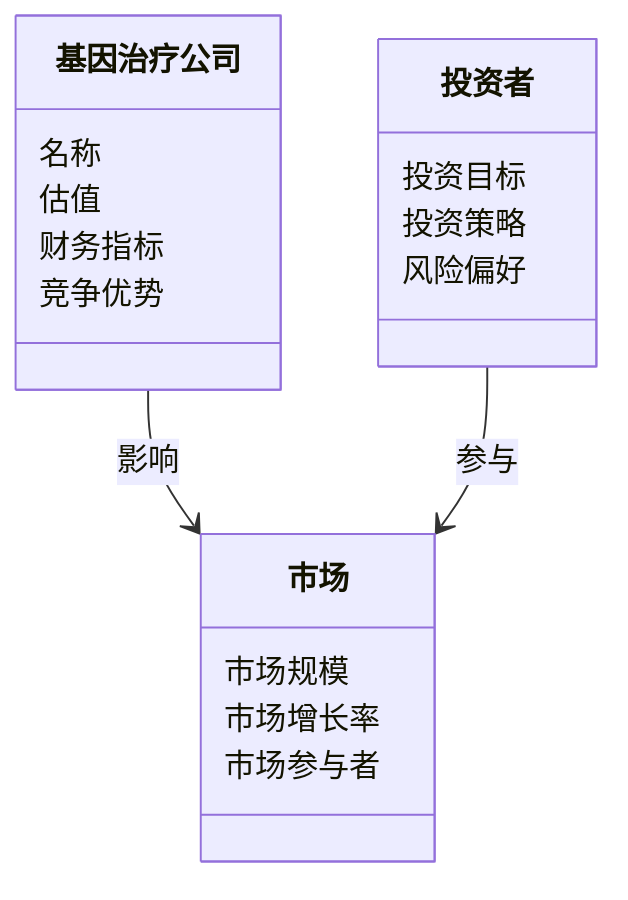
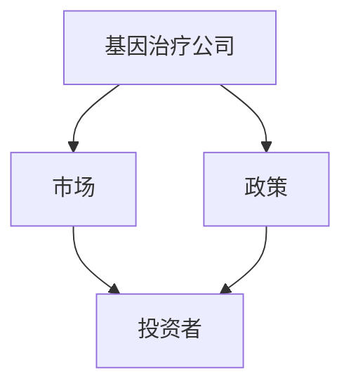
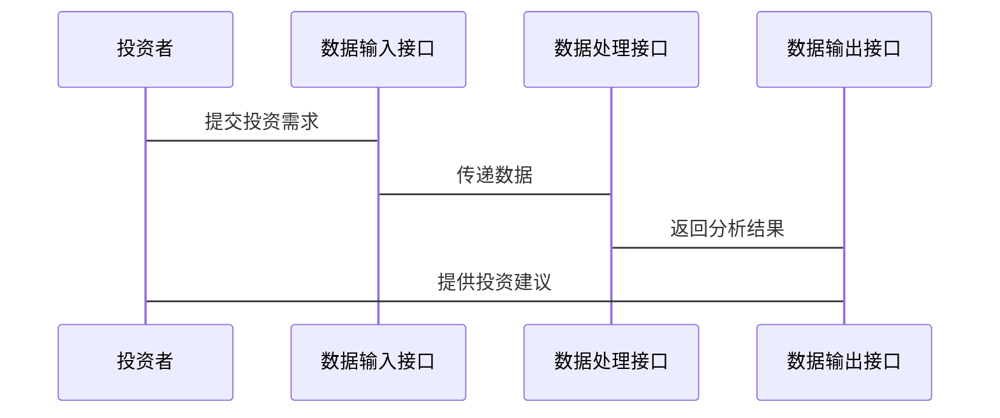

                 


# 价值投资中的基因治疗市场前景

## 关键词：
价值投资、基因治疗、市场前景、投资分析、生物技术、医疗健康、基因疗法

## 摘要：
基因治疗作为现代医学的重要突破，正在改变全球医疗健康行业。随着技术的不断进步和市场的逐步成熟，基因治疗领域吸引了越来越多投资者的关注。本文从价值投资的角度，系统分析基因治疗的市场前景，探讨其投资价值和潜在机会。通过结合科学基础、技术进展、市场现状和投资策略，为投资者提供全面的分析框架和实战指导。

---

## 第一部分: 基因治疗的科学基础

### 1.1 基因治疗的基本概念

#### 1.1.1 基因治疗的定义
基因治疗（Gene Therapy）是通过引入、删除或修正基因来治疗或预防疾病的方法。其核心目标是修复或替代缺陷基因，从而治疗遗传病、癌症、免疫疾病等。

#### 1.1.2 基因治疗的原理
基因治疗的基本原理包括以下几个步骤：
1. 识别目标基因：确定导致疾病的缺陷基因。
2. 设计治疗方案：选择合适的基因编辑工具（如CRISPR-Cas9）。
3. 输送载体：将正常基因或编辑工具递送到目标细胞。
4. 表达与修复：正常基因在目标细胞中表达，修复缺陷。

#### 1.1.3 基因治疗的分类
基因治疗主要分为以下几类：
- 替代性基因疗法：引入正常基因替代缺陷基因。
- 基因编辑疗法：通过编辑基因序列修复缺陷。
- 基因增强疗法：增强正常基因的功能。

### 1.2 基因治疗的技术进展

#### 1.2.1 基因编辑技术（如CRISPR）
CRISPR-Cas9技术是一种革命性的基因编辑工具，能够高效、精准地编辑基因组。其工作原理如下：
1. 引导RNA（gRNA）与目标DNA序列配对。
2. Cas9酶切割目标DNA双链。
3. 细胞修复机制引入基因编辑。

#### 1.2.2 基因疗法的应用领域
基因治疗目前主要应用于以下领域：
- 遗传性疾病：如镰状细胞贫血症、囊性纤维化。
- 癌症：通过基因编辑增强免疫系统对癌细胞的识别能力。
- 免疫疾病：如类风湿性关节炎、多发性硬化症。

#### 1.2.3 基因治疗的临床案例
全球范围内，基因治疗已经取得了一些突破性进展：
- **Luxturna**：首个被批准的基因疗法药物，用于治疗遗传性视网膜炎。
- **Zolgensma**：治疗罕见遗传病脊髓小脑性共济失调的基因疗法。

### 1.3 基因治疗的市场现状

#### 1.3.1 全球基因治疗市场概述
基因治疗市场近年来快速增长，主要驱动因素包括：
- 技术进步：基因编辑技术的突破降低了治疗成本。
- 市场需求：患者对个性化治疗的需求增加。
- 政策支持：各国政府出台政策支持基因治疗研发。

#### 1.3.2 基因治疗的市场规模与增长趋势
根据市场研究机构的数据，全球基因治疗市场规模预计将以年均20%以上的速度增长，到2030年市场规模将超过1000亿美元。

#### 1.3.3 基因治疗的主要参与者
全球范围内，基因治疗领域的参与者主要包括：
- **制药公司**：如辉瑞、罗氏、百时美施贵宝。
- **基因治疗初创公司**：如CRISPR Therapeutics、Editas Medicine。
- **学术机构**：与制药公司合作开展临床试验。

---

## 第二部分: 价值投资的基本原理

### 2.1 价值投资的核心概念

#### 2.1.1 价值投资的定义
价值投资是一种投资策略，旨在通过寻找市场价格低于其内在价值的资产，以实现长期收益。其核心理念是“买入便宜的资产并长期持有”。

#### 2.1.2 价值投资的主要原则
1. **安全边际**：买入价格低于内在价值。
2. **长期视角**：关注企业的长期盈利能力。
3. **基本面分析**：通过财务指标和行业分析评估企业价值。

#### 2.1.3 价值投资的适用场景
价值投资适用于以下场景：
- 市场低估：资产市场价格低于其真实价值。
- 稳定增长：企业具有稳定的盈利能力和增长潜力。

### 2.2 价值投资的分析方法

#### 2.2.1 财务指标分析
关键财务指标包括：
- **市盈率（P/E）**：股价与每股收益的比率。
- **市净率（P/B）**：股价与每股净资产的比率。
- **自由现金流（FCF）**：企业经营活动产生的现金流。

#### 2.2.2 行业分析与竞争分析
1. **行业分析**：评估行业的发展前景和竞争格局。
2. **竞争分析**：分析企业的竞争优势和市场地位。

#### 2.2.3 管理团队评估
管理团队的能力和战略规划是企业成功的关键因素。投资者需要关注：
- 管理层的经验与能力。
- 公司的战略规划与执行能力。

### 2.3 价值投资的成功案例

#### 2.3.1 历史上的经典投资案例
- **巴菲特投资可口可乐**：通过长期持有可口可乐股票，巴菲特获得了丰厚的回报。
- **彼得·林奇的投资策略**：通过基本面分析寻找低估股票。

#### 2.3.2 价值投资在科技行业的应用
- **微软投资人工智能**：通过长期持有微软股票，投资者获得了人工智能领域的技术红利。
- **亚马逊的早期投资**：早期投资者通过价值投资获得了巨大的回报。

#### 2.3.3 价值投资的风险与挑战
1. **市场波动**：短期市场波动可能影响资产价格。
2. **信息不对称**：投资者可能无法准确评估企业的内在价值。

---

## 第三部分: 基因治疗与价值投资的结合

### 3.1 基因治疗的市场前景分析

#### 3.1.1 基因治疗的市场潜力
基因治疗市场具有巨大的潜力，特别是在癌症和遗传病治疗领域。随着技术进步和成本下降，基因治疗将逐渐成为主流治疗方式。

#### 3.1.2 基因治疗的未来发展趋势
1. **技术突破**：基因编辑技术的进一步优化和应用。
2. **政策支持**：各国政府继续出台政策支持基因治疗研发。
3. **市场扩展**：基因治疗应用领域不断扩展，涵盖更多疾病。

#### 3.1.3 基因治疗的政策环境
全球范围内，基因治疗的监管政策逐步完善，例如：
- 美国FDA批准了多个基因治疗产品。
- 欧盟也在积极推动基因治疗的临床试验和商业化。

### 3.2 价值投资在基因治疗领域的应用

#### 3.2.1 基因治疗公司的估值方法
1. **DCF模型**：通过现金流折现计算公司价值。
2. **相对估值法**：与同行业公司进行比较。

#### 3.2.2 基因治疗公司的财务分析
1. **收入与利润**：关注公司的收入增长和盈利能力。
2. **研发投入**：评估公司的创新能力。

#### 3.2.3 基因治疗公司的竞争分析
1. **市场地位**：分析公司在行业中的地位。
2. **竞争优势**：评估公司的技术优势和市场拓展能力。

### 3.3 基因治疗领域的投资机会

#### 3.3.1 创新性基因疗法的投资价值
1. **技术领先企业**：投资具有技术优势的公司。
2. **临床试验进展**：关注处于后期临床试验的公司。

#### 3.3.2 基因治疗企业的成长性分析
1. **市场扩展**：公司是否能够拓展更多的治疗领域。
2. **研发管线**：公司是否有丰富的研发管线。

#### 3.3.3 基因治疗市场的风险与回报
1. **技术风险**：基因治疗技术可能存在不确定性。
2. **市场风险**：市场竞争可能影响公司的盈利能力。

---

## 第四部分: 基因治疗市场的数学模型与分析

### 4.1 基因治疗市场的数学模型

#### 4.1.1 市场规模预测模型
市场规模预测模型可以通过以下公式计算：
$$
\text{市场规模} = \text{人口基数} \times \text{发病率} \times \text{治疗费用}
$$

#### 4.1.2 投资回报率计算公式
投资回报率（ROI）计算公式：
$$
\text{ROI} = \frac{\text{净利润}}{\text{初始投资}} \times 100\%
$$

#### 4.1.3 市场增长率分析
市场增长率可以通过以下公式计算：
$$
\text{市场增长率} = \frac{\text{当年市场规模} - \text{前一年市场规模}}{\text{前一年市场规模}} \times 100\%
$$

### 4.2 基因治疗公司的估值模型

#### 4.2.1 现金流折现模型（DCF）
现金流折现模型的核心步骤如下：
1. 估算未来现金流。
2. 确定折现率。
3. 计算现值。

#### 4.2.2 市盈率与市净率分析
市盈率（P/E）和市净率（P/B）是常用的估值指标：
- 市盈率 = 股价 / 每股收益
- 市净率 = 股价 / 每股净资产

#### 4.2.3 市场比较法
市场比较法通过与同行业公司进行比较，评估公司的相对价值。

### 4.3 数学模型的实际应用

#### 4.3.1 市场规模预测的案例分析
假设某国人口为1亿，某种遗传病的发病率为0.1%，治疗费用为10万美元/人，则市场规模为：
$$
100,000,000 \times 0.001 \times 100,000 = 10,000,000 \text{美元}
$$

#### 4.3.2 投资回报率的计算与解读
假设某基因治疗公司净利润为1000万美元，初始投资为5000万美元，则：
$$
\text{ROI} = \frac{10,000,000}{50,000,000} \times 100\% = 20\%
$$

#### 4.3.3 估值模型的优缺点分析
- **优点**：能够量化公司的价值。
- **缺点**：假设条件可能影响结果的准确性。

---

## 第五部分: 基因治疗市场的系统架构设计

### 5.1 系统分析与架构设计方案

#### 5.1.1 问题场景介绍
基因治疗市场分析需要考虑多个因素，包括技术、市场、政策等。

#### 5.1.2 系统功能设计（领域模型）
领域模型如下：


#### 5.1.3 系统架构设计（架构图）
系统架构设计如下：


### 5.2 系统接口设计与交互流程

#### 5.2.1 系统接口设计
系统接口包括：
- 数据输入接口：接收基因治疗公司的财务数据和市场数据。
- 数据处理接口：对数据进行分析和处理。
- 数据输出接口：输出分析结果。

#### 5.2.2 系统交互流程（序列图）
系统交互流程如下：


---

## 第六部分: 项目实战

### 6.1 环境配置

#### 6.1.1 安装必要的工具
需要安装以下工具：
- Python编程语言
- 数据分析库（如Pandas、NumPy）
- 绘图工具（如Matplotlib）

#### 6.1.2 安装基因治疗相关数据集
可以从公开数据源获取基因治疗公司的财务数据和市场数据。

### 6.2 系统核心实现源代码

#### 6.2.1 数据分析代码
```python
import pandas as pd
import numpy as np

# 加载数据
data = pd.read_csv('gene_therapy_companies.csv')

# 计算市盈率
data['PE'] = data['股价'] / data['每股收益']

# 找出市盈率低于行业平均水平的公司
industry_avg_pe = data['PE'].mean()
value_stocks = data[data['PE'] < industry_avg_pe]
```

#### 6.2.2 估值模型代码
```python
def calculate_dcf(cash_flows, discount_rate):
    present_value = sum(cash_flows / (1 + discount_rate)**i for i in range(len(cash_flows)))
    return present_value

# 示例计算
cash_flows = [10, 20, 30, 40]
discount_rate = 0.1
dcf_value = calculate_dcf(cash_flows, discount_rate)
print(f"DCF 值为: {dcf_value}")
```

### 6.3 代码应用解读与分析

#### 6.3.1 数据分析代码解读
上述代码从数据集中加载基因治疗公司的数据，计算市盈率，并筛选出市盈率低于行业平均水平的公司，作为潜在的价值投资标的。

#### 6.3.2 估值模型代码解读
DCF模型代码通过现金流折现计算公司的内在价值。投资者可以根据公司的现金流和贴现率计算其合理估值。

### 6.4 实际案例分析和详细讲解剖析

#### 6.4.1 案例分析
以某基因治疗公司为例，假设其财务数据如下：
- 股价：50美元
- 每股收益：5美元
- 自由现金流：1000万美元
- 折现率：10%

计算市盈率：
$$
\text{PE} = \frac{50}{5} = 10
$$

计算DCF值：
$$
\text{DCF} = \frac{10,000,000}{1.1} + \frac{12,000,000}{1.1^2} + \frac{15,000,000}{1.1^3}
$$

---

## 第七部分: 最佳实践、小结、注意事项、拓展阅读

### 7.1 最佳实践

#### 7.1.1 投资策略
1. **长期视角**：关注企业的长期价值。
2. **分散投资**：避免过度集中。
3. **持续学习**：关注行业动态和技术进展。

#### 7.1.2 风险管理
1. **设定止损点**：控制投资风险。
2. **定期评估**：及时调整投资组合。

### 7.2 小结
基因治疗市场具有巨大的潜力，但也伴随着较高的风险。通过价值投资的方法，投资者可以在基因治疗领域找到具有长期增长潜力的企业。本文通过科学分析和数学建模，为投资者提供了系统的分析框架和实战指导。

### 7.3 注意事项

1. **信息准确性**：确保数据来源可靠。
2. **模型假设**：合理评估模型的假设条件。
3. **市场变化**：关注行业动态和政策变化。

### 7.4 拓展阅读
1. **书籍推荐**：《价值投资实战策略》、《基因治疗的未来》。
2. **研究报告**：关注行业内的研究报告和市场分析。

---

## 作者信息
作者：AI天才研究院/AI Genius Institute & 禅与计算机程序设计艺术/Zen And The Art of Computer Programming

---

本文通过系统的分析和详细的案例，为投资者提供了基因治疗领域的价值投资策略和实战指南。希望读者能够通过本文，更好地理解和把握基因治疗市场的投资机会。

