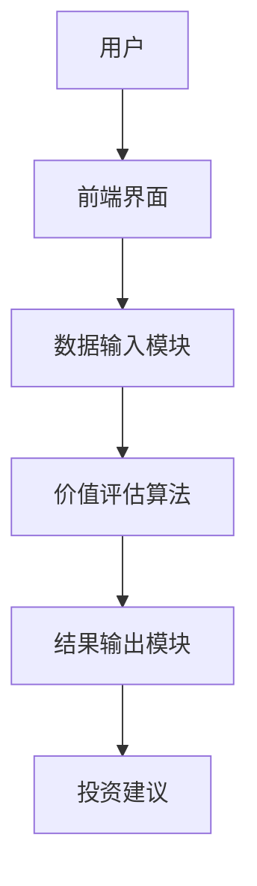
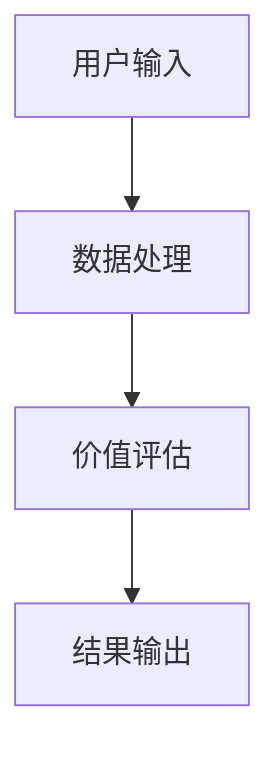
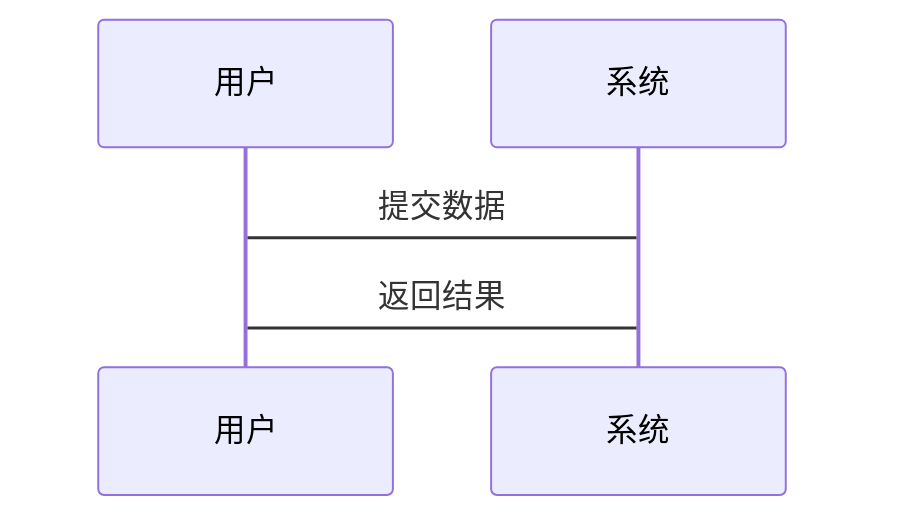

                 


# 价值投资中的太空旅游基础设施分析

## 关键词：
太空旅游、价值投资、基础设施、经济分析、投资策略、市场趋势、风险管理

## 摘要：
太空旅游作为新兴的商业领域，正在吸引越来越多的投资。本文将深入分析太空旅游基础设施的价值投资机会，探讨其市场潜力、行业竞争、政策风险及投资策略。通过构建数学模型和分析算法，本文将揭示太空旅游基础设施的投资价值，并提供实际案例分析，帮助投资者做出明智决策。

---

# 第一部分：背景介绍

## 第1章：太空旅游基础设施的兴起

### 1.1 太空旅游的定义与背景
#### 1.1.1 太空旅游的定义
太空旅游是指通过商业航班或其他交通工具，将普通人送入太空进行短期旅行或观光的活动。其核心基础设施包括发射设施、轨道服务和空间站。

#### 1.1.2 太空旅游的发展历程
- 20世纪60年代：太空探索的起步阶段，主要由政府主导。
- 21世纪：私营企业（如SpaceX、Blue Origin）推动商业太空旅行的发展。
- 当前：太空旅馆、月球基地等概念逐渐成为现实。

#### 1.1.3 太空旅游的市场现状与未来趋势
- 当前市场规模：初步估计为每年数亿美元。
- 未来趋势：随着技术进步和成本下降，市场将快速增长。

### 1.2 价值投资的基本概念
#### 1.2.1 价值投资的定义
价值投资是一种投资策略，通过分析公司的基本面，寻找被市场低估的投资机会。

#### 1.2.2 价值投资的核心理念
- 购买低于内在价值的资产。
- 长期持有，等待市场重新定价。

#### 1.2.3 价值投资在现代金融中的应用
- 股票投资：寻找被低估的公司。
- 不动产投资：寻找被低估的房地产。
- 新兴领域：如太空旅游基础设施。

### 1.3 太空旅游基础设施与价值投资的结合
#### 1.3.1 太空旅游基础设施的行业特点
- 高技术门槛：需要先进的航天技术。
- 高风险：技术失败可能导致重大损失。
- 高回报：成功运营后利润丰厚。

#### 1.3.2 价值投资在太空旅游基础设施中的应用
- 分析公司的财务状况。
- 评估市场需求。
- 考察竞争优势。

#### 1.3.3 太空旅游基础设施对全球经济的影响
- 刺激相关产业发展。
- 提供新的经济增长点。
- 推动技术进步。

---

# 第二部分：核心概念与联系

## 第2章：太空旅游基础设施的核心要素

### 2.1 太空旅游基础设施的构成
#### 2.1.1 发射设施
- 发射平台：如SpaceX的发射场。
- 监测系统：用于实时跟踪发射过程。

#### 2.1.2 轨道服务
- 轨道运输：将游客送入太空。
- 卫星服务：支持太空旅游的技术保障。

#### 2.1.3 空间站与旅馆
- 空间站：如国际空间站（ISS）。
- 太空旅馆：未来的豪华太空酒店。

#### 2.1.4 安全与监管
- 安全标准：确保太空旅行的安全性。
- 监管机构：如NASA、 FAA。

### 2.2 太空旅游市场的参与者
#### 2.2.1 政府机构
- 角色：制定政策、提供监管。
- 例子：NASA、ESA。

#### 2.2.2 私营企业
- 代表公司：SpaceX、Blue Origin、 Virgin Galactic。
- 优势：技术创新、成本控制。

#### 2.2.3 投资者与消费者
- 投资者：寻找高回报的机会。
- 消费者：愿意为太空旅行付费的个人。

### 2.3 太空旅游基础设施的经济价值
#### 2.3.1 市场需求分析
- 高端消费者：愿意为独特体验付费。
- 企业客户：用于品牌宣传或团队建设。

#### 2.3.2 成本与收益分析
- 投资成本：发射设施、研发费用。
- 收益：门票收入、广告收入。

#### 2.3.3 行业竞争分析
- 竞争格局：寡头垄断。
- 核心竞争力：技术、成本、品牌。

---

## 第3章：太空旅游基础设施的价值评估模型

### 3.1 价值评估模型的构建
#### 3.1.1 模型的输入变量
- 技术实力：研发能力、专利数量。
- 市场潜力：市场规模、增长速度。
- 财务状况：收入、利润、现金流。

#### 3.1.2 模型的输出结果
- 投资价值评分：分为A、B、C三个等级。
- 投资建议：买入、持有、卖出。

#### 3.1.3 模型的适用范围
- 适用于私营企业。
- 适用于早期阶段的太空旅游公司。

### 3.2 模型的核心算法
#### 3.2.1 算法的数学模型
$$ V = \sum_{i=1}^{n} w_i x_i $$
其中，\( V \) 为基础设施的价值，\( w_i \) 为权重，\( x_i \) 为输入变量。

#### 3.2.2 算法的实现步骤
1. 收集数据：包括财务数据、市场数据、技术数据。
2. 确定权重：根据经验或历史数据确定权重。
3. 计算价值：代入公式，得出结果。
4. 输出建议：根据结果给出投资建议。

### 3.3 模型的验证与优化
#### 3.3.1 数据来源与处理
- 数据来源：公开财报、市场报告。
- 数据清洗：处理缺失值、异常值。

#### 3.3.2 模型的训练与测试
- 训练数据：用于模型训练。
- 测试数据：用于模型验证。

#### 3.3.3 模型的优化与改进
- 参数调整：优化权重。
- 方法改进：引入机器学习算法。

---

## 第4章：太空旅游基础设施与价值投资的关系

### 4.1 太空旅游基础设施对价值投资的影响
#### 4.1.1 市场风险分析
- 技术风险：技术失败可能导致投资失败。
- 市场风险：市场需求不足可能导致投资失败。

#### 4.1.2 行业周期分析
- 周期性：太空旅游属于新兴产业，周期较长。
- 周期波动：受政策和技术影响较大。

#### 4.1.3 政策风险分析
- 政策变化：政府政策可能影响行业。
- 监管风险：法规变化可能增加成本。

### 4.2 价值投资对太空旅游基础设施的推动作用
#### 4.2.1 资本的流入与退出机制
- 资本流入：吸引风险投资。
- 退出机制：通过IPO或并购退出。

#### 4.2.2 投资者行为对市场的影响
- 投资者信心：影响市场波动。
- 投资决策：推动技术创新。

#### 4.2.3 价值投资在太空旅游基础设施中的长期收益
- 长期回报：随着行业成熟，投资价值上升。
- 资产配置：分散投资风险。

---

# 第三部分：系统分析与架构设计

## 第5章：系统功能设计

### 5.1 项目介绍
- 项目目标：构建太空旅游基础设施的价值评估系统。
- 项目范围：涵盖发射设施、轨道服务和空间站。

### 5.2 系统架构设计
#### 5.2.1 系统架构图


#### 5.2.2 数据流图


### 5.3 系统接口设计
#### 5.3.1 系统接口
- 输入接口：接收用户数据。
- 输出接口：返回评估结果。

#### 5.3.2 接口描述
- 输入接口：HTTP POST请求。
- 输出接口：JSON格式返回。

### 5.4 系统交互设计
#### 5.4.1 交互流程
1. 用户输入数据。
2. 系统处理数据。
3. 系统返回结果。

#### 5.4.2 交互图


---

## 第6章：项目实战

### 6.1 环境安装
- 安装Python和相关库（如numpy、pandas）。

### 6.2 核心实现
```python
def value_assessment(data):
    weights = [0.4, 0.3, 0.3]
    value = sum(weights[i] * data[i] for i in range(len(weights)))
    return value
```

### 6.3 代码解读
- 输入：公司数据。
- 输出：价值评分。

### 6.4 实际案例分析
- 案例：SpaceX的价值评估。
- 分析：基于模型得出投资建议。

### 6.5 项目小结
- 成功因素：模型准确、数据可靠。
- 改进建议：引入更多变量。

---

## 第7章：总结与展望

### 7.1 总结
- 本文分析了太空旅游基础设施的价值投资机会。
- 提出了价值评估模型和投资策略。

### 7.2 展望
- 未来发展方向：技术进步、政策支持。
- 潜在挑战：技术风险、政策风险。

---

## 附录

### 附录A：数据来源
- 公开财报。
- 市场报告。

### 附录B：工具介绍
- Python编程语言。
- Mermaid图表工具。

### 附录C：术语表
- 价值投资：寻找被低估的资产。
- 太空旅游：商业化的太空旅行。

---

## 作者信息

作者：AI天才研究院/AI Genius Institute & 禅与计算机程序设计艺术 /Zen And The Art of Computer Programming

---

通过以上目录和内容设计，文章将系统地分析太空旅游基础设施的价值投资机会，为投资者提供科学的决策依据。

