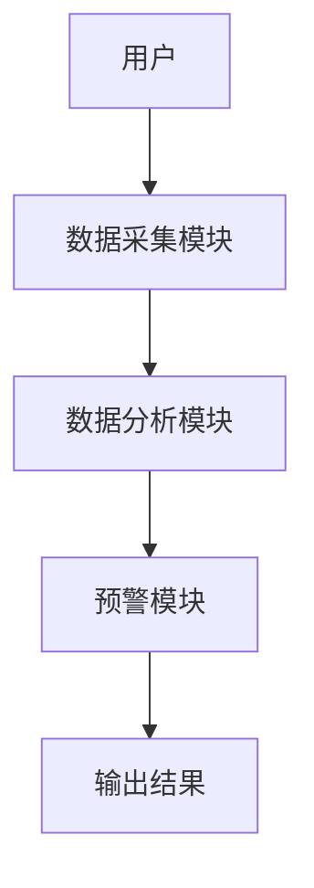

                 


# 《价值投资中的政策红利捕捉》

## 关键词：价值投资、政策红利、投资策略、系统架构、数学模型

## 摘要：  
本文探讨了如何通过捕捉政策红利进行价值投资，分析了政策红利的来源、识别方法和数学模型，并详细讲解了系统架构设计和实战案例。文章从背景介绍、核心概念、算法原理到项目实战，层层深入，为投资者提供了理论与实践相结合的指导。

---

# 第1章: 政策红利的基本概念

## 1.1 政策红利的定义与特点
### 1.1.1 政策红利的定义
政策红利是指政府政策变化带来的市场机会或行业利好，通常表现为税收优惠、行业补贴、产业扶持等。

### 1.1.2 政策红利的核心特点
- **周期性**：政策红利往往与经济周期密切相关。
- **行业性**：不同行业对政策红利的敏感度不同。
- **不确定性**：政策红利的出现具有一定的不可预测性。

### 1.1.3 政策红利与传统投资的区别
- **传统投资**：注重企业的基本面和财务指标。
- **政策红利投资**：关注政策变化对企业或行业的潜在影响。

## 1.2 政策红利的来源
### 1.2.1 经济周期与政策调整
经济周期波动会导致政府调整货币政策和财政政策，从而影响市场。

### 1.2.2 政府政策的影响
政府出台的政策，如税收减免、行业补贴等，直接或间接影响市场。

### 1.2.3 行业政策的驱动
行业-specific政策，如环保政策、科技政策等，对特定行业产生影响。

## 1.3 政策红利的识别方法
### 1.3.1 政策红利的识别标准
- 政策的出台背景
- 政策的实施力度
- 政策对行业的影响

### 1.3.2 政策红利的识别工具
- 数据分析工具（如Excel、Python）
- 行业研究报告
- 媒体新闻

### 1.3.3 政策红利的识别流程
1. 收集政策信息
2. 分析政策对行业的影响
3. 评估政策的实施效果

## 1.4 本章小结
政策红利是价值投资中的重要机会，正确识别和捕捉政策红利需要结合宏观经济分析和行业研究。

---

# 第2章: 政策红利的分析与预测

## 2.1 宏观经济分析
### 2.1.1 宏观经济指标与政策红利的关系
- GDP增长率
- 失业率
- 消费者价格指数（CPI）

### 2.1.2 宏观经济政策对市场的影响
- 货币政策
- 财政政策

### 2.1.3 宏观经济环境对政策红利的预测
- 通过宏观经济指标预测政策变化

## 2.2 行业政策分析
### 2.2.1 行业政策的解读
- 行业补贴
- 税收优惠
- 市场准入政策

### 2.2.2 行业政策对市场的影响
- 增加行业竞争力
- 提高企业利润

### 2.2.3 行业政策的未来趋势
- 绿色经济
- 数字经济

## 2.3 政策红利的数学模型
### 2.3.1 政策红利的数学模型构建
- 综合考虑宏观经济和行业政策的影响
- 使用加权平均模型

$$ P = \sum_{i=1}^{n} w_i \cdot x_i $$
其中，\( w_i \) 是政策因素的权重，\( x_i \) 是政策因素的具体数值。

### 2.3.2 政策红利的预测方法
- 时间序列分析
- 回归分析
- 机器学习算法

## 2.4 本章小结
通过宏观经济和行业政策的分析，结合数学模型，可以有效预测政策红利的影响。

---

# 第3章: 政策红利捕捉的系统架构

## 3.1 系统功能设计
### 3.1.1 数据采集模块
- 政策数据采集
- 行业数据采集

### 3.1.2 数据分析模块
- 数据清洗
- 数据分析
- 数据可视化

### 3.1.3 预警模块
- 政策变化预警
- 行业风险预警

## 3.2 系统架构设计
### 3.2.1 系统架构图


## 3.3 系统接口设计
### 3.3.1 数据接口
- 数据输入接口
- 数据输出接口

### 3.3.2 用户接口
- �界面前端
- 后台管理

## 3.4 系统交互流程
### 3.4.1 用户输入
- 政策查询
- 行业分析

### 3.4.2 系统处理
- 数据分析
- 预警触发

### 3.4.3 用户反馈
- 分析结果
- 预警信息

## 3.5 本章小结
系统架构设计为政策红利捕捉提供了技术支持，确保数据处理和分析的高效性。

---

# 第4章: 项目实战

## 4.1 环境配置
### 4.1.1 系统环境
- 操作系统：Windows/Mac/Linux
- 开发工具：Python、Jupyter Notebook
- 数据库：MySQL/PostgreSQL

## 4.2 核心实现
### 4.2.1 数据采集
```python
import requests
url = "https://www.policy.com/api/policies"
response = requests.get(url)
data = response.json()
print(data)
```

### 4.2.2 数据分析
```python
import pandas as pd
df = pd.DataFrame(data)
print(df.head())
```

### 4.2.3 数据可视化
```python
import matplotlib.pyplot as plt
plt.plot(df['policy_date'], df['policy_score'])
plt.title('Policy Trend')
plt.xlabel('Date')
plt.ylabel('Score')
plt.show()
```

## 4.3 案例分析
### 4.3.1 案例背景
- 行业：新能源
- 政策：政府出台新能源补贴政策

### 4.3.2 案例分析
通过数据分析和模型预测，发现新能源行业在政策红利下具有较高的投资价值。

## 4.4 本章小结
通过实战案例，验证了政策红利捕捉系统的有效性和实用性。

---

# 第5章: 总结与展望

## 5.1 总结
- 政策红利是价值投资的重要机会
- 通过系统架构和数学模型，可以有效捕捉政策红利

## 5.2 未来展望
- 更复杂的数学模型
- 更智能化的系统架构
- 更多行业的应用案例

---

# 作者：AI天才研究院/AI Genius Institute & 禅与计算机程序设计艺术 /Zen And The Art of Computer Programming

