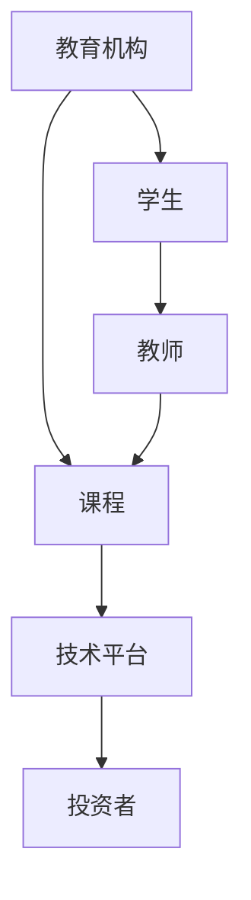
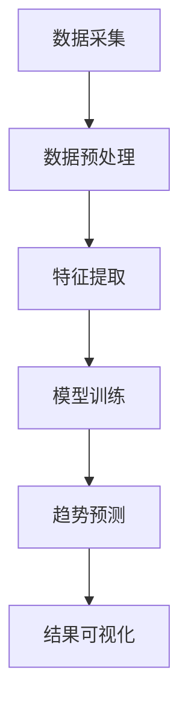
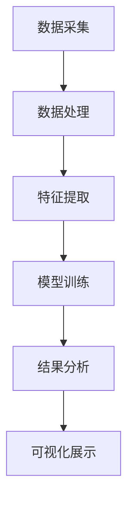

                 


# 价值投资中的教育科技趋势分析

> 关键词：价值投资、教育科技、趋势分析、算法原理、数学模型、系统架构、项目实战

> 摘要：本文从价值投资的角度，系统分析教育科技领域的趋势，结合算法原理、数学模型和系统架构，提供具体的项目实战案例，深入探讨教育科技的投资价值与未来发展。

---

## 第1章：教育科技的定义与发展趋势

### 1.1 教育科技的定义与核心要素

#### 1.1.1 教育科技的定义
教育科技（EdTech）是指利用技术手段优化和创新教育模式的领域。其核心在于通过技术手段解决传统教育中的痛点，提升教学效率和学习体验。

#### 1.1.2 教育科技的核心要素
- **技术驱动**：包括人工智能、大数据、云计算等技术。
- **数据驱动**：通过数据分析优化教学策略。
- **个性化学习**：基于学生特点提供定制化学习方案。

#### 1.1.3 教育科技的边界与外延
教育科技不仅限于线上教育，还包括混合式教学、智能硬件等领域。

---

### 1.2 教育科技的发展历程

#### 1.2.1 传统教育模式的局限性
- 教学效率低。
- 学生参与度不足。
- 资源分配不均。

#### 1.2.2 技术驱动教育变革的阶段
1. **电子化阶段**：早期的多媒体教学工具。
2. **网络化阶段**：在线教育平台的兴起。
3. **智能化阶段**：人工智能技术的应用。

#### 1.2.3 当前教育科技的发展现状
- 在线教育、智能题库、虚拟现实教学等领域快速发展。

---

### 1.3 教育科技与价值投资的结合

#### 1.3.1 教育科技行业的投资价值
- 市场需求大。
- 技术进步推动行业创新。
- 个性化学习趋势。

#### 1.3.2 价值投资在教育科技中的应用
- 关注企业的核心竞争力。
- 分析市场潜力和竞争格局。

#### 1.3.3 教育科技趋势分析的必要性
- 帮助投资者识别高增长领域。
- 提供科学的投资决策依据。

---

## 第2章：教育科技的核心概念与联系

### 2.1 教育科技的核心概念原理

#### 2.1.1 技术驱动的教育模式创新
- 人工智能辅助教学。
- 大数据优化教学策略。

#### 2.1.2 数据驱动的教育决策
- 分析学习数据，优化教学方案。
- 个性化学习路径设计。

#### 2.1.3 个性化学习的实现路径
- 基于学生特点设计学习方案。
- 动态调整教学内容。

---

### 2.2 核心概念属性特征对比表格

| **属性**        | **传统教育**       | **教育科技**        |
|-----------------|--------------------|---------------------|
| 教学模式         | 线下为主           | 线上与线下结合      |
| 资源分配         | 不均衡             | 更加均衡            |
| 学习体验         | 单一               | 个性化、多样化      |

---

### 2.3 ER实体关系图架构



---

## 第3章：教育科技趋势分析的算法原理

### 3.1 算法原理概述

#### 3.1.1 数据驱动的教育趋势预测
- 利用历史数据预测未来趋势。
- 数据来源：市场数据、用户行为数据等。

#### 3.1.2 机器学习在教育科技中的应用
- 分类算法：预测企业成功概率。
- 回归算法：分析市场增长率。

#### 3.1.3 时间序列分析在趋势预测中的作用
- 使用ARIMA模型预测市场变化。

---

### 3.2 算法流程图



---

### 3.3 算法实现代码

```python
# 示例代码：时间序列分析模型
import pandas as pd
from statsmodels.tsa.arima_model import ARIMA

# 数据加载
data = pd.read_csv('education_trend.csv')

# 模型训练
model = ARIMA(data, order=(5, 1, 0))
model_fit = model.fit()

# 预测未来趋势
future_predictions = model_fit.forecast(steps=10)
```

---

## 第4章：数学模型与公式解析

### 4.1 回归分析模型

$$ y = \beta_0 + \beta_1x_1 + \beta_2x_2 + \epsilon $$

其中：
- $y$ 是目标变量（如企业估值）。
- $x_1, x_2$ 是自变量（如用户数量、市场占有率）。
- $\beta_0, \beta_1, \beta_2$ 是回归系数。
- $\epsilon$ 是误差项。

---

### 4.2 时间序列分析模型

$$ ARIMA(p, d, q) $$

其中：
- $p$ 是自回归阶数。
- $d$ 是差分阶数。
- $q$ 是移动平均阶数。

---

## 第5章：系统分析与架构设计方案

### 5.1 系统架构设计



---

### 5.2 系统功能设计

- **数据采集**：收集市场数据。
- **数据处理**：清洗和预处理。
- **特征提取**：提取关键特征。
- **模型训练**：训练预测模型。
- **结果分析**：分析预测结果。
- **可视化展示**：展示分析结果。

---

## 第6章：项目实战

### 6.1 环境安装与配置

- 安装Python和相关库（如Pandas、Scikit-learn）。
- 数据集下载与准备。

---

### 6.2 核心实现代码

```python
# 示例代码：用户行为分析
import pandas as pd
import matplotlib.pyplot as plt

# 数据加载
data = pd.read_csv('user_behavior.csv')

# 数据可视化
data['timestamp'].plot()
plt.show()
```

---

### 6.3 实战案例分析

- 案例背景：某教育科技公司投资分析。
- 数据分析：预测公司未来增长。
- 结果解读：基于模型预测的投资建议。

---

## 第7章：总结与展望

### 7.1 总结

- 教育科技领域的投资价值显著。
- 算法和模型在趋势分析中的作用重要。

### 7.2 注意事项

- 数据质量影响分析结果。
- 模型需要持续优化。

### 7.3 拓展阅读

- 《教育科技的未来趋势》。
- 《价值投资实战案例》。

---

## 作者：AI天才研究院 & 禅与计算机程序设计艺术

