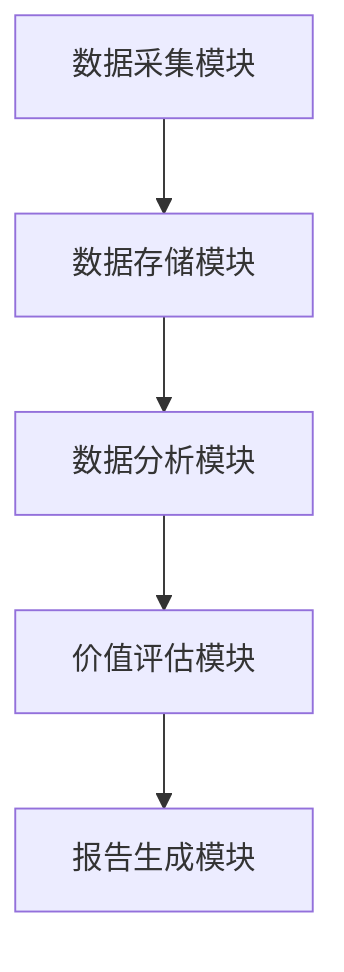

                 


# 价值投资中的数据资产评估

---

## 关键词：数据资产评估、价值投资、数据分析、机器学习、投资策略

---

## 摘要

在当前数据驱动的投资环境中，数据资产评估已成为价值投资的重要组成部分。本文详细探讨了数据资产评估的核心概念、算法原理、系统架构设计以及项目实战，结合实际案例，展示了如何利用数据分析和机器学习模型进行数据资产评估，为投资者提供科学决策依据。

---

# 第1章：数据资产评估的背景与重要性

## 1.1 数据资产评估的基本概念

### 1.1.1 数据资产的定义与特征

数据资产是指企业或个人所拥有的，能够为其创造经济价值的数据资源。其主要特征包括：

- **可衡量性**：数据资产的价值可以通过量化指标进行评估。
- **可流动性**：数据资产可以通过交易或共享产生收益。
- **动态性**：数据的价值会随着市场变化而变化。

### 1.1.2 数据资产评估在价值投资中的重要性

在价值投资中，数据资产评估能够帮助投资者识别高价值的数据资源，优化投资组合，并提高决策的准确性。通过科学的数据评估，投资者可以更好地理解市场的潜在价值和风险。

### 1.1.3 数据资产评估的边界与外延

数据资产评估的边界包括数据的来源、质量和适用性，而外延则涉及数据的应用场景和潜在影响。

---

## 1.2 数据资产评估的核心要素

### 1.2.1 数据的来源与质量

数据来源包括内部数据和外部数据，其质量直接影响评估结果。高质量的数据应具备准确性、完整性和一致性。

### 1.2.2 数据的分析方法与模型

常用的数据分析方法包括回归分析、聚类分析和时间序列分析等。选择合适的模型是确保评估准确性的关键。

### 1.2.3 数据的价值实现路径

数据价值的实现路径包括数据清洗、特征提取、模型构建和价值评估。

---

# 第2章：数据资产评估的核心概念与方法论

## 2.1 数据资产评估的原理

### 2.1.1 数据的经济价值来源

数据的价值来源于其在市场中的应用潜力和对决策的影响。

### 2.1.2 数据资产评估的核心原理

通过分析数据的特征、市场表现和潜在影响，利用数学模型计算其价值。

### 2.1.3 数据资产评估的数学模型

常用的数学模型包括线性回归模型和随机森林模型。

---

## 2.2 数据资产评估的主要方法

### 2.2.1 市场法

基于市场交易数据进行评估，适用于有大量可比数据的情况。

### 2.2.2 收益法

通过预测数据带来的收益进行评估，适用于长期投资。

### 2.2.3 成本法

基于数据获取和处理的成本进行评估，适用于成本可控的情况。

---

## 2.3 数据资产评估方法的对比分析

### 2.3.1 各种方法的优缺点对比

| 方法 | 优点 | 缺点 |
|------|------|------|
| 市场法 | 数据可比性强 | 数据获取困难 |
| 收益法 | 考虑长期收益 | 预测难度大 |
| 成本法 | 计算简单 | 忽略市场价值 |

### 2.3.2 数据资产评估方法的选择依据

根据数据的特性和投资目标选择合适的方法。

---

# 第3章：数据资产评估的算法原理

## 3.1 数据资产评估的算法原理

### 3.1.1 线性回归模型

使用线性回归模型对数据进行预测和评估。

```python
import numpy as np
import matplotlib.pyplot as plt

# 示例数据
x = np.array([1, 2, 3, 4, 5])
y = np.array([2, 4, 5, 4, 6])

# 计算斜率和截距
slope, intercept = np.polyfit(x, y, 1)

# 绘制图形
plt.scatter(x, y)
plt.plot(x, slope * x + intercept)
plt.show()
```

### 3.1.2 随机森林模型

使用随机森林模型进行数据分类和回归分析。

```python
from sklearn.ensemble import RandomForestRegressor

# 示例数据
X = [[1], [2], [3], [4], [5]]
y = [2, 4, 5, 4, 6]

# 模型训练
model = RandomForestRegressor(n_estimators=100)
model.fit(X, y)

# 预测
print(model.predict([[3]]))
```

---

## 3.2 数据资产评估算法的实现步骤

### 3.2.1 数据预处理

包括数据清洗、特征工程和数据标准化。

### 3.2.2 模型选择

根据数据特性选择合适的算法。

### 3.2.3 模型训练与调优

通过交叉验证和超参数优化提升模型性能。

### 3.2.4 模型评估与部署

评估模型效果并将其部署到实际应用中。

---

# 第4章：数据资产评估的系统架构设计

## 4.1 系统功能设计

### 4.1.1 数据采集模块

负责收集数据并进行初步处理。

### 4.1.2 数据分析模块

包括特征提取和模型训练。

### 4.1.3 价值评估模块

计算数据的价值并生成报告。

### 4.1.4 报告生成模块

将评估结果整理成易于理解的报告。

---

## 4.2 系统架构设计

### 4.2.1 系统架构图



---

## 4.3 接口设计与交互流程

### 4.3.1 数据接口设计

定义数据输入和输出的格式。

### 4.3.2 用户交互流程

用户输入数据，系统处理后生成报告。

---

# 第5章：数据资产评估的项目实战

## 5.1 项目背景与目标

### 5.1.1 项目背景

介绍项目的基本情况和目标。

### 5.1.2 项目目标

明确项目的预期成果。

---

## 5.2 项目实施步骤

### 5.2.1 环境安装

安装所需的Python库和工具。

### 5.2.2 核心代码实现

编写数据采集、处理和评估的代码。

### 5.2.3 案例分析

通过具体案例展示评估过程和结果。

---

## 5.3 项目总结

### 5.3.1 项目成果

总结项目的实施效果。

### 5.3.2 经验与教训

分享项目中的经验教训。

---

# 第6章：最佳实践与注意事项

## 6.1 最佳实践

### 6.1.1 数据质量的重要性

强调数据质量对评估结果的影响。

### 6.1.2 模型选择的策略

建议根据数据特性选择合适的模型。

### 6.1.3 持续优化

定期更新模型和数据，确保评估的准确性。

---

## 6.2 注意事项

### 6.2.1 数据隐私与安全

确保数据处理过程中的隐私和安全。

### 6.2.2 模型的可解释性

选择可解释性强的模型，便于理解和调整。

### 6.2.3 技术与业务的结合

技术团队与业务团队的紧密合作是成功的关键。

---

# 结语

数据资产评估是价值投资中的重要环节，通过科学的方法和先进的技术，投资者可以更好地识别和利用数据价值，提升投资决策的准确性。

---

# 作者

作者：AI天才研究院 & 禅与计算机程序设计艺术

---

感谢您的耐心阅读，希望本文对您在数据资产评估领域有所帮助！

