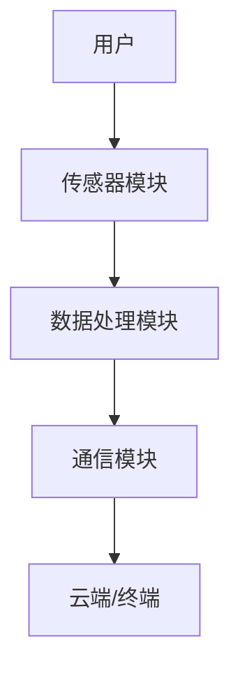
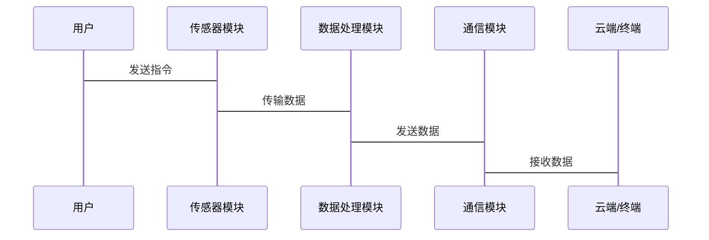
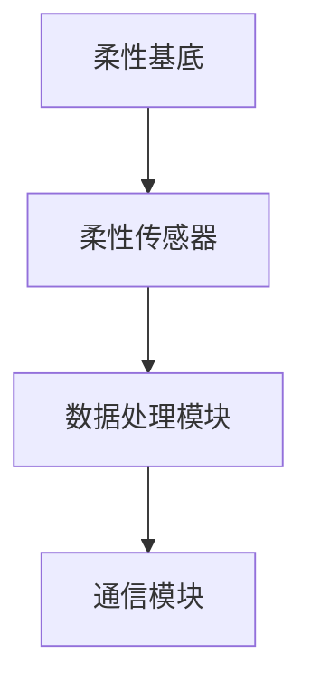

                 

# 价值投资中的新一代柔性电子技术前景

---

## 关键词  
- 价值投资  
- 柔性电子技术  
- 市场前景  
- 投资策略  
- 技术创新  

---

## 摘要  
随着科技的飞速发展，柔性电子技术正逐渐成为改变我们生活的关键力量。本文从价值投资的角度，深入分析了柔性电子技术的核心概念、市场应用以及投资前景。通过对柔性电子技术的材料、制造工艺和应用场景的详细探讨，结合实际案例和系统架构设计，为投资者提供了科学的决策依据。同时，本文还提出了基于技术趋势的最佳投资策略和风险评估方法，帮助投资者在柔性电子技术领域捕捉潜在的高增长机会。

---

## 第1章：柔性电子技术的核心概念与背景

### 1.1 什么是柔性电子技术  
柔性电子技术是指在柔性基底上实现电子功能的新兴技术，其核心在于将电子元件集成到柔软、可延展的材料中。与传统刚性电子器件相比，柔性电子技术具有更高的灵活性、更低的成本和更广泛的应用场景。  

#### 核心术语解释  
- **柔性基底**：一种可弯曲、拉伸的材料，如聚酰亚胺（PI）或透明导电薄膜。  
- **柔性电路**：在柔性基底上形成的电子回路，具有可穿戴性和耐用性。  
- **柔性显示**：基于柔性材料的显示屏，如柔性OLED。  

### 1.2 柔性电子技术的背景与发展趋势  
柔性电子技术的起源可以追溯到20世纪末，但真正的发展始于21世纪初。随着物联网（IoT）、可穿戴设备和医疗电子设备的兴起，柔性电子技术的应用场景不断扩展。  

#### 1.2.1 柔性电子技术的市场需求  
- **医疗健康**：柔性传感器在智能绷带、健康监测设备中的应用。  
- **可穿戴设备**：如智能手表、运动追踪器等。  
- **物联网**：柔性电子技术在智能家居、环境监测中的应用。  

#### 1.2.2 技术创新与投资机会  
柔性电子技术的创新主要集中在材料科学和制造工艺上。例如，柔性OLED的商业化、柔性传感器的灵敏度提升等，均为投资者提供了丰富的机会。  

---

## 第2章：柔性电子技术的核心原理与系统架构

### 2.1 柔性电子技术的材料体系  
柔性电子技术的核心在于材料的选择与优化。以下是几种关键材料及其特性：  

| 材料类型 | 主要特性 | 应用场景 |  
|----------|----------|----------|  
| 柔性基底 | 可弯曲、耐高温 | 显示屏、传感器 |  
| 柔性导电材料 | 高导电性、可拉伸 | 电路连接、触摸屏 |  
| 柔性绝缘材料 | 高绝缘性、透明 | 保护层、封装 |  

#### 2.1.1 柔性材料的制备工艺  
- **涂布法**：将材料均匀涂覆在基底上，适用于薄膜制备。  
- **印刷法**：利用印刷技术在基底上形成图案，适用于大规模生产。  
- **溅射法**：通过物理气相沉积在基底上形成薄膜。  

### 2.2 柔性电子技术的系统架构  

#### 2.2.1 系统功能设计  
柔性电子系统的功能模块包括：  
1. **传感器模块**：采集环境数据（如温度、压力）。  
2. **数据处理模块**：对传感器数据进行处理和分析。  
3. **通信模块**：将数据传输到云端或终端设备。  

#### 2.2.2 系统架构设计  

#### 2.2.3 系统交互设计  

---

## 第3章：柔性电子技术的市场应用与投资分析

### 3.1 医疗健康领域的应用  
柔性电子技术在医疗领域的应用主要集中在健康监测和智能诊断设备。  

#### 3.1.1 柔性传感器在医疗中的应用  
- **智能绷带**：监测伤口愈合情况。  
- **可穿戴健康监测器**：实时监测心率、血压等生命体征。  

#### 3.1.2 医疗领域的投资机会  
- 投资方向：专注于柔性传感器技术的医疗设备公司。  
- 投资策略：关注企业的技术研发能力和市场准入能力。  

### 3.2 消费电子领域的应用  
柔性电子技术在消费电子领域的应用主要集中在可穿戴设备和柔性显示屏。  

#### 3.2.1 柔性显示屏  
- **折叠屏手机**：如三星Galaxy Fold和苹果的折叠屏设计。  
- **可穿戴设备**：如智能手表的柔性OLED屏幕。  

#### 3.2.2 消费电子领域的投资机会  
- 投资方向：关注折叠屏技术的研发和生产。  
- 投资策略：评估企业的技术储备和市场竞争力。  

---

## 第4章：柔性电子技术的投资策略与风险分析

### 4.1 投资策略  
#### 4.1.1 短期投资策略  
- 关注技术创新：投资具有核心技术优势的企业。  
- 关注市场热点：如折叠屏手机的市场推广。  

#### 4.1.2 长期投资策略  
- 关注技术产业化：投资具备大规模生产能力的企业。  
- 关注行业趋势：如医疗电子设备的普及。  

### 4.2 风险分析  
#### 4.2.1 技术风险  
- 技术壁垒：柔性电子技术的研发难度较高。  
- 技术替代：新技术可能取代现有技术。  

#### 4.2.2 市场风险  
- 市场竞争：柔性电子技术的市场竞争日益激烈。  
- 市场需求：技术的实际需求可能低于预期。  

---

## 第5章：柔性电子技术的未来展望与投资建议

### 5.1 未来技术发展趋势  
#### 5.1.1 材料科学的突破  
- 更高导电性的柔性材料：如石墨烯和碳纳米管。  

#### 5.1.2 制造工艺的创新  
- 新型制造技术：如3D打印技术在柔性电子中的应用。  

### 5.2 投资建议  
#### 5.2.1 关注技术创新型企业  
- 投资具有自主知识产权的企业，尤其是材料科学领域的创新公司。  

#### 5.2.2 关注产业链整合  
- 投资能够实现垂直整合的企业，降低生产成本。  

---

## 附录  
### 附录A：柔性电子技术相关的数学公式  

在柔性电子技术的材料科学中，导电性的计算公式为：  
$$ \sigma = \frac{I}{A \times V} $$  
其中，$\sigma$ 表示导电性，$I$ 表示电流，$A$ 表示截面积，$V$ 表示电压。  

### 附录B：柔性电子技术相关的技术图表  

---

## 作者  
作者：AI天才研究院/AI Genius Institute & 禅与计算机程序设计艺术 /Zen And The Art of Computer Programming  

---

以上为文章的完整目录和内容概要，您可以根据实际需求扩展每一章节的具体内容。

