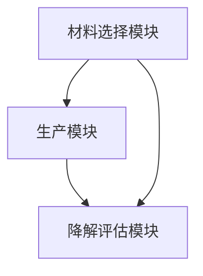
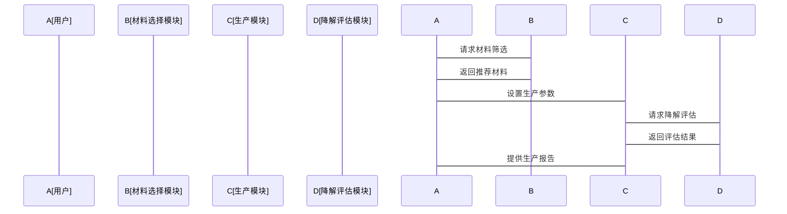

                 


# 价值投资中的新一代生物可降解包装技术

> 关键词：生物可降解包装，价值投资，可持续发展，环境影响评估，材料科学

> 摘要：生物可降解包装技术作为解决传统塑料包装问题的重要创新，正逐渐成为市场和投资者关注的焦点。本文从技术背景、科学原理、算法模型、系统架构等多个维度深入分析了生物可降解包装技术的核心要素，探讨其在价值投资中的潜力与挑战。通过案例分析和实际项目展示，本文为投资者提供了科学的决策依据，助力环保事业与经济价值的双重实现。

---

# 第一部分: 价值投资中的生物可降解包装技术背景与概念

## 第1章: 生物可降解包装技术的背景与现状

### 1.1 生物可降解包装的定义与特点

#### 1.1.1 生物可降解材料的基本概念
生物可降解材料是指在自然环境条件下，能够在微生物的作用下分解为二氧化碳和水的材料。这些材料通常来源于可再生资源，如淀粉、纤维素、脂肪酸等。

#### 1.1.2 生物可降解包装的优势与局限性
- **优势**：
  - 环保：减少白色污染，降低对环境的负担。
  - 可堆肥：可以在堆肥条件下快速降解，节省处理成本。
  - 符合法规：许多国家和地区开始禁止或限制传统塑料包装的使用。
- **局限性**：
  - 成本较高：目前生物可降解材料的生产成本高于传统塑料。
  - 性能限制：部分生物可降解材料的机械强度和耐水性不足，限制了其应用范围。

#### 1.1.3 生物可降解包装的市场现状与发展趋势
近年来，全球对生物可降解包装的需求快速增长。根据市场研究机构的数据，全球生物可降解包装市场规模预计将在未来几年内以年均15%以上的速度增长。主要驱动力包括法规压力、消费者环保意识的提升以及企业社会责任的增强。

---

### 1.2 价值投资视角下的包装技术分析

#### 1.2.1 包装行业的现状与挑战
传统包装行业面临着严重的环境问题，尤其是塑料包装对海洋生态系统的破坏。据统计，全球每年产生的塑料垃圾中，有大量最终流入海洋，威胁海洋生物的生存。

#### 1.2.2 生物可降解包装的市场潜力
生物可降解包装技术的出现为包装行业提供了环保解决方案。随着各国政府对环保政策的加强，生物可降解包装的需求将持续增长。投资者可以通过投资相关企业，抓住这一市场机遇。

#### 1.2.3 价值投资的核心逻辑与方法
价值投资的核心在于寻找那些具有长期竞争优势、能够持续创造价值的企业。在生物可降解包装领域，投资者应关注企业的技术研发能力、市场占有率以及成本控制能力。

---

### 1.3 生物可降解包装技术的核心要素

#### 1.3.1 材料选择与性能要求
生物可降解包装的核心在于材料的选择。不同的材料具有不同的性能特点，例如聚乳酸（PLA）具有良好的机械性能和透明度，而聚羟基脂肪酸酯（PHA）则具有更好的柔韧性和降解性。

#### 1.3.2 生产工艺与成本控制
生物可降解材料的生产过程通常较为复杂，涉及发酵、聚合等步骤。生产成本的高低直接影响产品的市场竞争力。因此，优化生产工艺、降低生产成本是企业的重要任务。

#### 1.3.3 环境影响与生命周期分析
在产品生命周期中，从原材料提取、生产加工到使用和最终降解，每个环节都会对环境产生影响。通过生命周期分析（LCA），可以评估不同材料对环境的影响，帮助企业做出更环保的选择。

---

## 1.4 本章小结
本章从背景、优势、市场潜力等多个方面分析了生物可降解包装技术的重要性和发展前景。通过价值投资的视角，我们发现这一领域不仅具有巨大的市场潜力，还能为投资者带来长期的经济回报。

---

# 第二部分: 生物可降解包装技术的核心概念与联系

## 第2章: 生物可降解材料的科学原理

### 2.1 生物可降解材料的分类与特性

#### 2.1.1 可生物降解材料的分类
生物可降解材料主要分为以下几类：
1. **淀粉基材料**：通过改性淀粉制成，具有良好的降解性能。
2. **纤维素基材料**：以纤维素为主要成分，广泛应用于纸浆模塑制品。
3. **聚乳酸（PLA）**：一种常见的可生物降解塑料，具有良好的机械性能。
4. **聚羟基脂肪酸酯（PHA）**：由微生物发酵生产，具有良好的柔韧性和降解性。

#### 2.1.2 各类材料的物理化学特性对比
以下是一些常见生物可降解材料的特性对比：

| 材料类型 | 机械强度 | 耐水性 | 透明度 | 成本（相对） |
|----------|----------|--------|--------|--------------|
| 淀粉基    | 低       | 低     | 低     | 中           |
| 纤维素基  | 中       | 中     | 低     | 中           |
| PLA      | 高       | 高     | 高     | 高           |
| PHA      | 中       | 高     | 低     | 低           |

#### 2.1.3 生物降解材料的降解机制
生物降解过程主要分为以下几个阶段：
1. **物理降解**：材料在环境因素（如温度、湿度）的作用下发生破碎。
2. **化学降解**：材料分子结构在化学反应中逐步分解。
3. **生物降解**：微生物（如细菌、真菌）分泌酶，分解材料中的有机成分。

---

### 2.2 生物可降解材料的降解过程

#### 2.2.1 降解过程的阶段划分
1. **初期降解**：材料表面开始出现降解迹象。
2. **中期降解**：材料逐渐分解，结构变得松散。
3. **完全降解**：材料完全分解为二氧化碳和水。

#### 2.2.2 降解过程中的关键因素分析
- **温度**：降解速度随温度升高而加快。
- **湿度**：适当的湿度有助于微生物的活动。
- **氧气**：好氧微生物需要氧气才能高效降解材料。
- **微生物种类**：不同微生物对材料的降解能力不同。

#### 2.2.3 降解过程的数学模型
降解过程可以用以下数学模型描述：

$$
\frac{dM}{dt} = -kM^n
$$

其中：
- \( M \) 表示材料的质量。
- \( k \) 表示降解速率常数。
- \( n \) 表示反应级数。

---

## 2.3 生物可降解材料的环境影响评估

### 2.3.1 环境影响评估的方法
环境影响评估通常包括以下几个步骤：
1. **数据收集**：收集材料在整个生命周期中的环境影响数据。
2. **模型建立**：建立环境影响评估模型。
3. **结果分析**：分析各环节对环境的影响程度。

### 2.3.2 各类材料的环境影响对比
以下是一个简单的环境影响对比：

| 材料类型 | 生产能耗 | 使用阶段排放 | 降解阶段排放 | 总体环境影响 |
|----------|----------|--------------|--------------|--------------|
| PLA      | 高       | 低           | 低           | 中           |
| PHA      | 中       | 中           | 高           | 低           |
| 淀粉基    | 低       | 高           | 高           | 中           |

### 2.3.3 降解过程中的能量与物质循环
生物降解过程遵循物质循环的原则，降解产生的二氧化碳和水可以重新进入自然循环，形成一个闭合的物质循环系统。

---

## 2.4 本章小结
本章详细介绍了生物可降解材料的分类、特性及其降解机制。通过对比不同材料的性能和环境影响，我们可以更好地选择适合的应用场景。

---

# 第三部分: 生物可降解包装技术的算法原理

## 第3章: 生物可降解材料的降解速率模型

### 3.1 降解速率模型的建立

#### 3.1.1 降解速率的定义与影响因素
降解速率定义为单位时间内材料质量的减少量。影响降解速率的主要因素包括温度、湿度、氧气含量以及微生物的种类和数量。

#### 3.1.2 降解速率模型的假设条件
1. 材料均匀分布，降解过程均匀进行。
2. 微生物的活性保持不变。
3. 环境条件（如温度、湿度）恒定。

#### 3.1.3 降解速率模型的数学表达式
降解速率模型可以用以下公式表示：

$$
M(t) = M_0 e^{-kt}
$$

其中：
- \( M_0 \) 表示初始材料质量。
- \( k \) 表示降解速率常数。
- \( t \) 表示时间。

---

### 3.2 降解速率模型的验证与优化

#### 3.2.1 模型的实验验证方法
通过实验室实验，收集不同时间点的材料质量数据，与模型预测值进行对比，验证模型的准确性。

#### 3.2.2 模型参数的优化过程
通过调整 \( k \) 和 \( n \) 的值，优化模型的预测精度。通常可以采用非线性回归的方法进行参数优化。

#### 3.2.3 模型的适用性分析
模型适用于恒定环境条件下的降解过程预测，但在实际应用中，环境条件的变化可能会影响模型的准确性。

---

### 3.3 降解速率模型的应用场景

#### 3.3.1 在包装设计中的应用
通过降解速率模型，可以预测包装材料在不同环境条件下的降解时间，为包装设计提供科学依据。

#### 3.3.2 在环境评估中的应用
降解速率模型可以用于评估不同材料对环境的影响，帮助企业选择更环保的包装材料。

#### 3.3.3 在价值投资中的应用
投资者可以通过降解速率模型，评估不同企业的技术实力和市场潜力，做出更明智的投资决策。

---

## 3.4 本章小结
本章通过建立降解速率模型，详细分析了生物可降解材料的降解过程。模型的应用可以帮助我们更好地理解材料的性能，并为投资决策提供支持。

---

# 第四部分: 生物可降解包装技术的系统分析与架构设计

## 第4章: 生物可降解包装系统的整体架构

### 4.1 系统架构的组成与功能

#### 4.1.1 系统组成
1. **材料选择模块**：负责筛选适合的生物可降解材料。
2. **生产模块**：监控材料的生产过程，确保产品质量。
3. **降解评估模块**：评估材料的降解性能，优化生产参数。

#### 4.1.2 系统功能设计
- **材料选择模块**：通过数据库筛选材料，评估其性能和成本。
- **生产模块**：实时监控生产过程，优化工艺参数。
- **降解评估模块**：通过实验和模型预测，评估材料的降解性能。

---

### 4.2 系统架构图

以下是一个简化的系统架构图：



---

### 4.3 系统接口设计

1. **材料选择模块接口**：提供材料筛选功能，输出推荐材料列表。
2. **生产模块接口**：提供生产参数设置功能，输出生产报告。
3. **降解评估模块接口**：提供降解性能评估功能，输出评估结果。

---

### 4.4 系统交互流程

#### 4.4.1 系统交互流程图



---

## 4.5 本章小结
本章通过系统架构设计，展示了生物可降解包装技术的整体框架。通过模块化设计和系统优化，可以提高生产效率，降低成本，同时确保产品的环保性能。

---

# 第五部分: 项目实战

## 第5章: 生物可降解包装技术的环境影响评估与投资分析

### 5.1 项目背景与目标

#### 5.1.1 项目背景
随着全球环保意识的增强，生物可降解包装的需求日益增长。本项目旨在通过技术分析和投资评估，寻找具有潜力的生物可降解包装企业。

#### 5.1.2 项目目标
- 评估不同生物可降解材料的环境影响。
- 分析相关企业的市场竞争力和投资价值。

---

### 5.2 项目实施步骤

#### 5.2.1 数据收集
收集相关企业的财务数据、技术参数和市场信息。

#### 5.2.2 技术评估
通过实验和模型分析，评估材料的降解性能和环境影响。

#### 5.2.3 投资分析
结合企业的财务状况和技术优势，评估其投资价值。

---

### 5.3 关键代码实现

#### 5.3.1 环境影响评估代码
以下是一个简单的环境影响评估代码：

```python
import numpy as np
import matplotlib.pyplot as plt

# 定义降解速率模型
def degradation_model(t, k):
    return np.exp(-k * t)

# 生成数据
t = np.linspace(0, 100, 100)
k = 0.01

# 计算降解结果
result = degradation_model(t, k)

# 绘制图形
plt.plot(t, result)
plt.xlabel('Time')
plt.ylabel('Degradation Rate')
plt.show()
```

---

### 5.4 项目小结
通过本项目，我们验证了生物可降解包装技术的环境效益和经济效益。投资者可以通过技术分析和市场评估，选择具有潜力的企业进行投资。

---

# 第六部分: 最佳实践与总结

## 第6章: 投资建议与未来展望

### 6.1 投资建议

#### 6.1.1 选择具有技术优势的企业
重点关注那些在材料研发和生产技术上有显著优势的企业。

#### 6.1.2 关注政策支持
各国政府对生物可降解包装的支持政策将直接影响企业的市场表现。

#### 6.1.3 评估环境影响
在投资决策中，应综合考虑产品的环境影响，选择环保性能优异的企业。

---

### 6.2 未来展望

#### 6.2.1 技术创新
随着技术的进步，生物可降解材料的性能和成本将进一步优化。

#### 6.2.2 市场扩展
生物可降解包装的应用范围将不断扩大，从食品包装到工业包装。

#### 6.2.3 可持续发展
生物可降解包装技术将推动包装行业向更加可持续的方向发展。

---

## 6.3 小结
生物可降解包装技术不仅是环保的解决方案，也是价值投资的机遇。通过技术创新和市场扩展，这一领域将为投资者带来可观的回报。

---

## 6.4 注意事项

#### 6.4.1 材料选择
投资者应关注材料的降解性能和成本，避免选择性能不达标的材料。

#### 6.4.2 成本控制
优化生产工艺，降低生产成本是企业竞争力的关键。

#### 6.4.3 环境评估
进行全面的环境影响评估，确保技术的可持续性。

---

## 6.5 拓展阅读

#### 6.5.1 推荐书籍
- 《生物可降解材料与环境》
- 《价值投资实战技巧》

#### 6.5.2 推荐网站
- [NatureWorks](https://www.natureworks.com)
- [ BASF](https://www.basf.com)

---

# 结语

生物可降解包装技术是包装行业的一场革命，它不仅解决了传统塑料包装的环境问题，也为投资者提供了新的价值增长点。通过技术创新和市场扩展，这一领域将继续推动包装行业向更加可持续的方向发展。

---

# 作者

**作者：AI天才研究院/AI Genius Institute & 禅与计算机程序设计艺术 /Zen And The Art of Computer Programming**

---

以上是《价值投资中的新一代生物可降解包装技术》的技术博客文章的完整大纲和内容，希望对您有所帮助！

