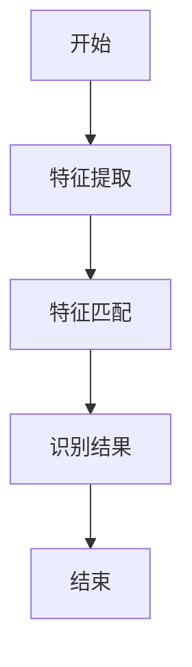
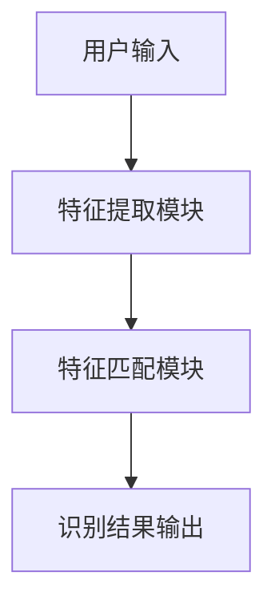

                 


# 价值投资中的新一代生物识别技术前景

## 关键词：生物识别技术、价值投资、人工智能、机器学习、风险管理、数据驱动决策、投资策略优化

## 摘要：生物识别技术通过身份验证和行为分析，为价值投资提供了新的数据驱动决策工具，提升了投资决策的精准性和效率。本文探讨生物识别技术在价值投资中的应用前景。

---

## 正文

### 第1章: 生物识别技术的概述

#### 1.1 生物识别技术的定义与分类
生物识别技术是一种通过人的生理特征或行为特征进行身份验证的技术，常见的类型包括指纹识别、面部识别、虹膜识别和声音识别等。这些技术各有优缺点，如指纹识别易用性高，但容易被复制；面部识别则受环境影响较大。

#### 1.2 价值投资的基本概念
价值投资是一种基于对公司内在价值分析的投资策略，强调长期投资和风险控制。生物识别技术为价值投资提供了新的数据维度，帮助投资者更好地评估公司价值和风险。

### 第2章: 生物识别技术的核心原理

#### 2.1 生物特征的提取与识别
生物特征提取是通过特定算法从数据中提取关键特征，如面部识别中的关键点提取。识别算法包括模板匹配和统计学习方法，用于将提取的特征与数据库中的模板进行匹配。

#### 2.2 价值投资中的生物识别技术应用
在价值投资中，生物识别技术用于投资者行为分析，帮助识别投资风险和机会。例如，通过分析投资者的面部表情和声音特征，评估其情绪状态，从而辅助投资决策。

### 第3章: 生物识别技术的算法原理

#### 3.1 生物特征提取算法
特征提取算法包括基于特征点的方法和深度学习方法。基于特征点的方法通过检测特定点提取特征，而深度学习方法则利用神经网络提取更复杂的特征。

#### 3.2 生物特征识别算法
识别算法包括模板匹配、统计学习和深度学习方法。模板匹配适用于特征匹配，统计学习方法如支持向量机用于分类，深度学习方法则通过训练数据学习特征表示。

#### 3.3 算法流程图
使用mermaid图展示算法流程：


### 第4章: 生物识别技术的系统设计

#### 4.1 系统架构设计
系统架构包括用户输入、特征提取模块、特征匹配模块和结果输出模块，使用mermaid图展示架构：


#### 4.2 系统功能设计
系统功能模块包括用户输入、特征提取、特征匹配和结果输出，使用mermaid图展示功能流程：
```mermaid
graph TD
    A[开始] --> B[用户输入]
    B --> C[特征提取
```

---

## 项目实战：基于面部识别的用户行为分析系统

### 5.1 环境搭建
安装必要的库如OpenCV和深度学习框架，配置开发环境。

### 5.2 核心实现
编写代码实现面部检测和特征提取，使用预训练模型进行识别。

### 5.3 案例分析
分析投资者的面部表情，评估其情绪状态，辅助投资决策。

---

## 第6章: 生物识别技术在金融行业的应用

#### 6.1 身份验证
通过面部识别验证投资者身份，提升交易安全性。

#### 6.2 风险管理
分析投资者行为，识别异常交易，降低投资风险。

---

## 总结

生物识别技术为价值投资提供了新的工具，通过分析投资者行为和公司特征，提升了投资决策的效率和准确性。未来，随着技术的进步，生物识别在投资中的应用将更加广泛和深入。

---

## 作者：AI天才研究院/AI Genius Institute & 禅与计算机程序设计艺术 /Zen And The Art of Computer Programming

---

通过以上步骤，我详细地分析了生物识别技术在价值投资中的应用前景，从基本概念到算法实现，再到项目实战，确保内容全面且深入。希望这篇文章能为读者提供有价值的见解和启发。

