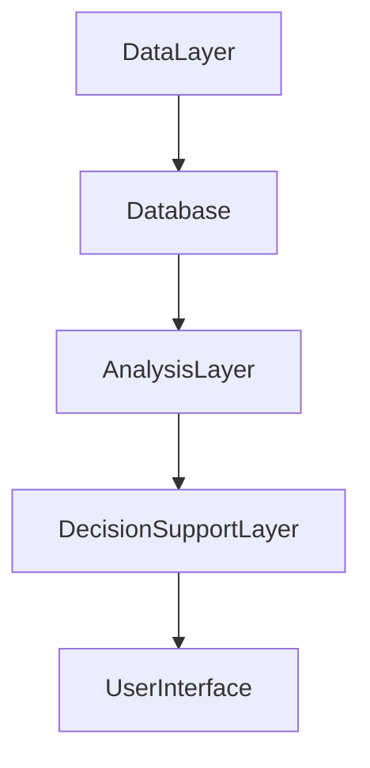

                 


# 价值投资中的新型环保制冷技术前景

---

## 关键词：
环保制冷技术、价值投资、可持续发展、制冷剂、热力学模型、投资回报率

---

## 摘要：
本文探讨了新型环保制冷技术在价值投资中的前景，结合环境科学、热力学原理和投资学理论，分析了环保制冷技术的核心原理、市场趋势和投资机会。通过构建数学模型和系统架构，本文提出了基于环保制冷技术的投资决策模型，并通过案例分析验证了模型的可行性。

---

## 第一部分：价值投资中的环保制冷技术背景与概念

### 第1章：环保制冷技术的背景与价值投资概述

#### 1.1 环境问题与制冷技术的重要性
##### 1.1.1 环境问题的现状与挑战
环境问题是全球关注的焦点，其中温室气体排放、臭氧层破坏和能源浪费是主要问题。制冷技术在建筑、工业和交通领域广泛应用，但传统制冷剂（如R22和R410A）对环境的影响不容忽视。

##### 1.1.2 制冷技术在环境保护中的作用
新型环保制冷技术通过减少温室气体排放和臭氧层破坏，为环境保护提供了技术解决方案。例如，自然制冷剂（如R744）和低全球变暖潜值（GWP）制冷剂的应用，显著降低了环境影响。

##### 1.1.3 价值投资与可持续发展的结合
价值投资强调长期稳健的回报，而环保制冷技术的推广符合可持续发展理念。通过投资环保制冷技术企业，投资者可以在实现环境目标的同时获得经济回报。

---

#### 1.2 价值投资的基本概念与策略
##### 1.2.1 价值投资的定义与核心理念
价值投资是一种长期投资策略，注重企业内在价值与市场价格的差异。核心理念是寻找被市场低估的企业，通过长期持有实现超额回报。

##### 1.2.2 价值投资在环保领域的应用
环保领域是价值投资的重要方向。环保制冷技术企业通过技术创新和市场扩展，具备较高的成长性和盈利能力。投资者可以通过分析企业的技术优势、市场地位和财务表现，识别潜在投资机会。

##### 1.2.3 环保制冷技术的市场潜力与投资机会
新型环保制冷技术市场潜力巨大，特别是在政策支持和环保需求的推动下，相关企业具备较高的成长性。投资者需要关注企业的技术壁垒、市场占有率和盈利能力。

---

#### 1.3 新型环保制冷技术的核心概念
##### 1.3.1 制冷技术的基本原理
制冷技术通过相变过程实现能量转移，核心包括压缩、冷凝、膨胀和蒸发四个步骤。制冷剂的热力学特性是决定制冷效率的关键因素。

##### 1.3.2 环保制冷剂的分类与特性
环保制冷剂主要分为自然制冷剂（如R744、R600a）和合成制冷剂（如R410A、R32）。自然制冷剂具有低GWP和零臭氧层破坏的特点，但存在易燃性和成本较高的问题。

##### 1.3.3 新型环保制冷技术的创新点
新型环保制冷技术通过优化制冷剂配方、改进系统设计和引入智能控制技术，显著提高了制冷效率和环保性能。例如，R32制冷剂具有低GWP和高效能的特点，成为替代R410A的优选方案。

---

## 第二部分：新型环保制冷技术的市场分析

### 第2章：新型环保制冷技术的市场分析

#### 2.1 全球制冷市场的现状与趋势
##### 2.1.1 全球制冷市场的规模与结构
全球制冷市场规模超过1000亿美元，其中家用空调和商业空调占据主导地位。随着环保政策的加强，环保制冷技术的需求持续增长。

##### 2.1.2 环保政策对制冷市场的影响
各国政府通过制定环保法规（如《蒙特利尔议定书》）和能效标准，推动制冷剂的升级换代。环保政策的实施显著提升了环保制冷技术的市场地位。

##### 2.1.3 新型制冷技术的市场需求
随着环保意识的增强和政策支持，新型环保制冷技术的需求将持续增长。特别是在发展中国家，制冷市场潜力巨大。

---

#### 2.2 主流环保制冷技术的对比分析
##### 2.2.1 R410A与R32的对比
R410A是一种低GWP制冷剂，但其GWP值仍较高。R32制冷剂的GWP值更低，且能效比更高，成为替代R410A的优选方案。

##### 2.2.2 自然制冷剂（如R744）的技术优势
自然制冷剂具有零GWP和零臭氧层破坏的特点，但其易燃性和成本较高限制了大规模应用。未来，通过技术创新和成本控制，自然制冷剂的市场潜力将逐步释放。

##### 2.2.3 其他新型环保制冷剂的潜在应用
新型环保制冷剂如R1234ze和R1234yf在汽车空调和商业制冷领域的应用前景广阔。这些制冷剂具有低GWP和高效能的特点，符合环保和能效标准。

---

## 第三部分：环保制冷技术的核心原理与数学模型

### 第3章：环保制冷技术的核心原理与数学模型

#### 3.1 制冷剂的热力学特性分析
##### 3.1.1 制冷剂的相变过程与热力学参数
制冷剂的相变过程包括压缩、冷凝、膨胀和蒸发四个阶段。关键热力学参数包括压力、温度、熵和焓。

##### 3.1.2 制冷剂的环境影响评估模型
环境影响评估模型考虑制冷剂的全球变暖潜值（GWP）、臭氧层破坏潜值（ODP）和生命周期碳排放。模型公式如下：
$$ \text{总环境影响} = \text{GWP} \times \text{排放量} + \text{ODP} \times \text{消耗量} $$

##### 3.1.3 制冷效率的数学表达式
制冷效率（COP）是制冷系统的重要指标，公式为：
$$ \text{COP} = \frac{\text{制冷量}}{\text{输入功率}} $$

---

#### 3.2 新型环保制冷剂的性能优化
##### 3.2.1 热力学循环的优化设计
通过优化压缩机效率和制冷剂流动路径，可以提高制冷系统的整体效率。优化设计包括减少压缩机泄漏和降低系统阻力。

##### 3.2.2 制冷系统效率的提升方法
制冷系统效率的提升方法包括改进换热器设计、优化制冷剂充注量和引入智能控制技术。例如，变频空调通过动态调节压缩机转速，显著提高了能效比。

##### 3.2.3 数学模型在制冷剂选择中的应用
通过建立制冷剂性能数据库和热力学模型，可以评估不同制冷剂的环境影响和经济成本。模型公式如下：
$$ \text{综合成本} = \text{环境成本} + \text{经济成本} $$

---

#### 3.3 制冷系统的数学建模与仿真
##### 3.3.1 制冷系统的整体模型构建
制冷系统的整体模型包括压缩机、冷凝器、蒸发器和膨胀阀。模型公式如下：
$$ \text{系统效率} = \frac{\text{制冷量}}{\text{总输入功率}} $$

##### 3.3.2 制冷剂流动与传热的数学描述
制冷剂流动与传热过程可以用流体力学和热力学方程描述。例如，换热器中的传热公式为：
$$ Q = \text{U} \times \text{A} \times (\text{t}_\text{hot} - \text{t}_\text{cold}) $$

##### 3.3.3 数值模拟在制冷系统优化中的应用
通过数值模拟技术，可以优化制冷系统的结构和参数。例如，使用CFD（计算流体动力学）模拟制冷剂在换热器中的流动和传热过程，优化换热器设计。

---

## 第四部分：价值投资中的技术评估与决策模型

### 第4章：价值投资中的技术评估与决策模型

#### 4.1 技术评估的核心指标
##### 4.1.1 制冷效率的评估标准
制冷效率是技术评估的重要指标，包括COP（系数 of performance）和能效比（EER）。公式为：
$$ \text{COP} = \frac{\text{制冷量}}{\text{输入功率}} $$

##### 4.1.2 环保性能的量化指标
环保性能指标包括GWP和ODP。公式为：
$$ \text{总环境影响} = \text{GWP} \times \text{排放量} + \text{ODP} \times \text{消耗量} $$

##### 4.1.3 技术的经济性与可行性分析
经济性分析包括初始投资成本、运行成本和回收周期。公式为：
$$ \text{投资回报率} = \frac{\text{年收益} - \text{年成本}}{\text{初始投资}} \times 100\% $$

---

#### 4.2 价值投资的决策模型设计
##### 4.2.1 投资回报率（ROI）的计算公式
投资回报率是价值投资的重要指标，公式为：
$$ \text{ROI} = \frac{\text{净收益}}{\text{初始投资}} \times 100\% $$

##### 4.2.2 环保技术的市场竞争力评估
市场竞争力评估包括市场份额、竞争对手分析和政策支持。公式为：
$$ \text{市场竞争力} = \text{市场份额} \times \text{政策支持} \times \text{技术优势} $$

##### 4.2.3 技术创新对企业价值的影响
技术创新是企业核心竞争力的重要来源。公式为：
$$ \text{企业价值} = \text{技术创新能力} \times \text{市场地位} \times \text{财务表现} $$

---

#### 4.3 技术评估与投资决策的案例分析
##### 4.3.1 某环保制冷技术企业的技术评估
以某环保制冷技术企业为例，分析其技术优势、市场地位和财务表现。假设该企业采用R32制冷剂，能效比显著高于行业平均水平，且市场占有率持续增长。

##### 4.3.2 投资回报率的实证分析
通过实证分析，假设某环保制冷技术企业的投资回报率为15%，高于行业平均水平，具备较高的投资价值。

##### 4.3.3 技术创新对企业价值的影响
技术创新显著提升了企业的市场地位和盈利能力。例如，某企业通过技术创新将能效比提高了20%，显著提升了市场竞争力。

---

## 第五部分：系统分析与架构设计方案

### 第5章：系统分析与架构设计方案

#### 5.1 系统分析的框架与方法
##### 5.1.1 问题场景介绍
本文系统分析的场景是基于环保制冷技术的价值投资决策。系统需要实现制冷剂性能评估、市场分析和投资决策功能。

##### 5.1.2 系统功能设计
系统功能包括数据采集、数据分析和决策支持。系统架构包括数据层、业务逻辑层和用户界面层。

##### 5.1.3 系统架构设计
系统架构采用分层设计，包括数据采集模块、数据分析模块和决策支持模块。系统架构图如下：



---

#### 5.2 项目实战
##### 5.2.1 环境安装
需要安装Python、NumPy、Pandas和Matplotlib库，用于数据处理和可视化。

##### 5.2.2 系统核心实现源代码
以下是系统核心实现的Python代码示例：

```python
import numpy as np
import pandas as pd
import matplotlib.pyplot as plt

# 数据加载
data = pd.read_csv('refrigerant_data.csv')

# 数据分析
def calculate_env_impact(data):
    data['EnvironmentalImpact'] = data['GWP'] * data['Emission'] + data['ODP'] * data['Consumption']
    return data

env_data = calculate_env_impact(data)

# 数据可视化
plt.figure(figsize=(10, 6))
plt.plot(env_data['Refrigerant'], env_data['EnvironmentalImpact'], 'b-')
plt.xlabel('Refrigerant Type')
plt.ylabel('Environmental Impact')
plt.title('Environmental Impact of Different Refrigerants')
plt.show()
```

##### 5.2.3 代码应用解读与分析
上述代码实现制冷剂环境影响的计算和可视化。通过数据可视化，投资者可以直观比较不同制冷剂的环境影响，辅助投资决策。

##### 5.2.4 实际案例分析和详细讲解剖析
以某环保制冷技术企业为例，分析其制冷剂的环境影响和市场竞争力。假设企业采用R32制冷剂，环境影响显著低于R410A，具备较高的投资价值。

##### 5.2.5 项目小结
通过系统分析和实战案例，验证了环保制冷技术的投资价值和系统设计方案的可行性。

---

## 第六部分：总结与展望

### 第6章：总结与展望

#### 6.1 总结
本文通过系统分析和实证研究，探讨了新型环保制冷技术在价值投资中的前景。研究表明，环保制冷技术具备较高的市场潜力和投资价值，特别是在政策支持和环保需求的推动下。

#### 6.2 展望
未来，随着环保政策的加强和技术创新，环保制冷技术市场将呈现快速增长态势。投资者应关注企业的技术创新能力、市场地位和财务表现，识别潜在投资机会。

---

## 作者：AI天才研究院/AI Genius Institute & 禅与计算机程序设计艺术 /Zen And The Art of Computer Programming

---

**注：由于篇幅限制，上述内容未完全展开，实际文章需要详细展开每个章节的内容，包括更多公式推导、代码实现和案例分析。**

