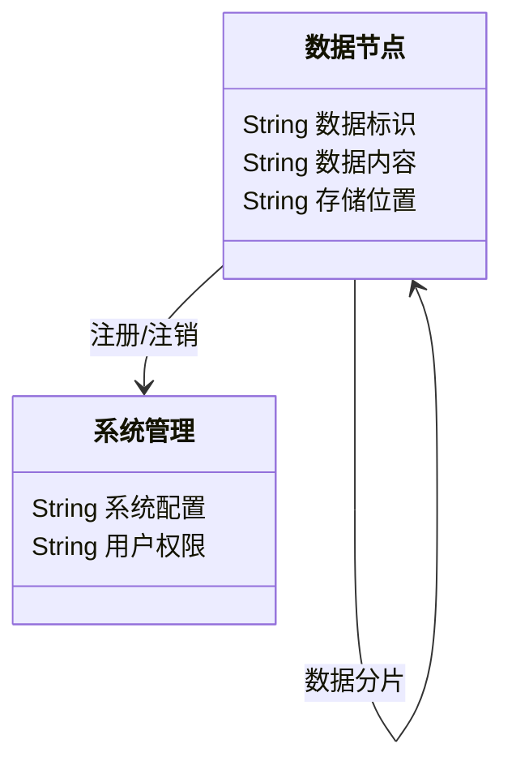
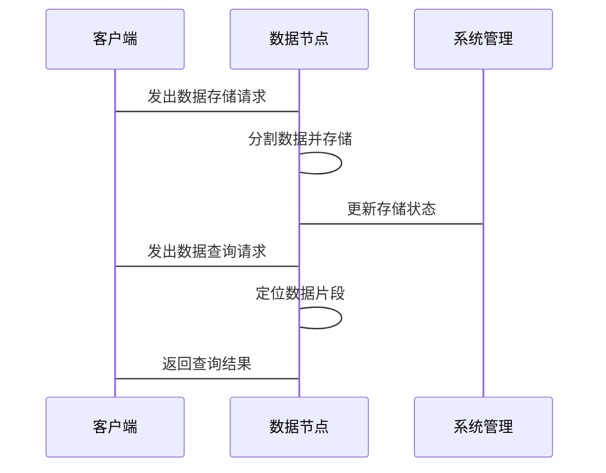

                 


# 价值投资中的新型高容量数据存储技术

> **关键词**：价值投资，高容量数据存储，分布式存储，区块链，数据压缩，数据加密，系统架构  
> **摘要**：随着金融市场的快速发展，数据存储技术在价值投资中的重要性日益凸显。本文深入探讨了高容量数据存储技术的核心概念、算法原理、系统设计及其在价值投资中的应用。通过分析分布式存储、区块链、数据压缩和加密等技术，本文为投资者提供了高效、安全的数据存储解决方案，帮助他们在复杂多变的市场环境中做出明智的投资决策。

---

## 第一部分: 价值投资中的数据存储技术背景

## 第1章: 价值投资与高容量数据存储概述

### 1.1 价值投资的基本概念

#### 1.1.1 价值投资的定义与核心理念
价值投资是一种以基本面分析为基础的投资策略，强调通过分析企业的财务状况、行业地位、竞争优势等因素，寻找被市场低估的投资标的。在价值投资中，数据是投资者做出决策的核心依据，因此高效、可靠的数据存储技术至关重要。

#### 1.1.2 数据在价值投资中的重要性
- 数据是价值投资的基石，包括财务报表、市场趋势、行业分析等。
- 数据的完整性和准确性直接影响投资决策的正确性。
- 大数据时代，数据量的快速增长对存储技术提出了更高要求。

#### 1.1.3 高容量数据存储技术的必要性
- 随着金融市场数据量的指数级增长，传统的存储技术已无法满足需求。
- 高容量数据存储技术能够处理海量数据，支持复杂的数据分析任务。
- 高效的数据存储技术能够提升数据分析的效率，帮助投资者快速获取关键信息。

### 1.2 高容量数据存储技术的背景

#### 1.2.1 数据存储技术的发展历程
- **传统存储技术**：包括磁盘、磁带等，容量有限，读写速度较慢。
- **云存储技术**：基于互联网的存储解决方案，提供高扩展性和灵活性。
- **分布式存储技术**：通过多节点协作实现数据的分布式存储，提升可靠性和性能。

#### 1.2.2 金融数据的特点与存储挑战
- **数据量大**：金融市场每天产生的数据量以PB级计。
- **数据类型多样**：包括结构化数据（如股票价格、财务报表）和非结构化数据（如新闻、社交媒体数据）。
- **数据安全性要求高**：金融数据涉及敏感信息，必须确保存储的安全性。

#### 1.2.3 高容量数据存储技术的应用场景
- **高频交易**：需要快速读取和处理大量数据，支持实时决策。
- **大数据分析**：通过海量数据挖掘，发现市场趋势和投资机会。
- **风险管理**：利用历史数据进行风险评估和预测。

### 1.3 本章小结
本章介绍了价值投资的基本概念，强调了数据在投资决策中的重要性，并提出了高容量数据存储技术的必要性。随着金融数据的快速增长，传统的存储技术已无法满足需求，高容量数据存储技术成为价值投资中的关键支撑。

---

## 第二部分: 高容量数据存储技术的核心概念与原理

## 第2章: 高容量数据存储技术的核心概念

### 2.1 数据存储技术的分类与对比

#### 2.1.1 磁盘存储、磁带存储、云存储的对比
| 技术 | 优点 | 缺点 | 适用场景 |
|------|------|------|----------|
| 磁盘存储 | 快速读写，支持随机访问 | 容量有限，成本高 | 适合小规模数据存储 |
| 磁带存储 | 容量大，成本低 | 读写速度慢，不支持随机访问 | 适合大规模归档存储 |
| 云存储 | 高扩展性，灵活性高 | 可能存在数据安全风险 | 适合海量数据存储和弹性扩展 |

#### 2.1.2 分布式存储与集中式存储的优缺点
- **分布式存储**：通过多节点协作存储数据，具有高可用性和容错性，适合处理大规模数据。
- **集中式存储**：数据集中在单个节点或少数几个节点，管理简单但存在单点故障风险。

#### 2.1.3 压缩存储与非压缩存储的适用场景
- **压缩存储**：通过数据压缩算法减少存储空间占用，适用于对存储空间要求高的场景。
- **非压缩存储**：直接存储原始数据，适用于对数据读取速度要求高的场景。

### 2.2 高容量数据存储的关键技术

#### 2.2.1 分布式文件系统
- **分布式文件系统**：通过将文件分布在多个节点上，提升存储容量和性能。
- **实现原理**：数据分片、元数据管理、负载均衡。

#### 2.2.2 去中心化存储技术
- **区块链技术**：通过区块链的去中心化特性，确保数据的安全性和不可篡改性。
- **应用场景**：金融数据存档、交易记录存储。

#### 2.2.3 高可用性存储系统
- **高可用性**：通过冗余设计和故障容错，确保存储系统的可用性。
- **实现方法**：数据备份、负载均衡、故障切换。

### 2.3 数据存储的性能优化

#### 2.3.1 并行存储与串行存储的效率对比
- **并行存储**：通过并行处理提升数据读写速度，适用于大规模数据存储。
- **串行存储**：按顺序处理数据，适用于小规模数据存储。

#### 2.3.2 数据分片技术
- **数据分片**：将数据分割成多个片段，分别存储在不同的节点上。
- **实现优势**：提升存储效率，降低单点故障风险。

#### 2.3.3 缓存机制与存储优化
- **缓存机制**：通过缓存热点数据，减少对底层存储的访问压力。
- **优化策略**：基于数据访问频率和时间的有效性进行缓存。

### 2.4 本章小结
本章详细介绍了高容量数据存储技术的核心概念，包括分布式存储、去中心化存储和高可用性存储系统。通过对比不同存储技术的优缺点，帮助读者选择适合的存储方案。

---

## 第三部分: 高容量数据存储技术的算法与数学模型

## 第3章: 数据存储算法的数学模型

### 3.1 哈希算法与数据分布

#### 3.1.1 哈希函数的定义与作用
- **哈希函数**：将任意长度的输入映射到固定长度的输出（哈希值）。
- **作用**：快速定位数据存储位置，提升数据读写效率。

#### 3.1.2 哈希碰撞的概率计算
- **哈希碰撞**：不同的输入得到相同的哈希值。
- **碰撞概率公式**：$$P \approx \frac{1}{2^{n}}$$，其中$n$是哈希值的长度。

#### 3.1.3 分布式哈希表的实现原理
- **分布式哈希表**：通过哈希函数将数据分布到多个节点上。
- **实现优势**：提升数据访问效率，避免单点故障。

### 3.2 数据压缩算法

#### 3.2.1 压缩算法的分类与对比
| 算法 | 压缩比 | 优缺点 |
|------|------|------|
| ZIP | 高 | 压缩比高，支持多种文件格式 |
| Gzip | 高 | 压缩速度快，适合流式数据 |

#### 3.2.2 常见压缩算法的数学模型
- **LZ77算法**：基于滑动窗口的压缩算法，通过记录重复数据块的位置和长度进行压缩。

#### 3.2.3 数据压缩对存储容量的影响
- **压缩比**：$$ \text{压缩比} = \frac{\text{原始大小}}{\text{压缩后大小}} $$
- **存储优化**：通过压缩算法减少存储空间占用。

### 3.3 数据加密算法

#### 3.3.1 加密算法的分类与作用
- **对称加密**：如AES算法，加密速度快，适用于大量数据加密。
- **非对称加密**：如RSA算法，安全性高，适用于数据签名和认证。

#### 3.3.2 加密强度与存储性能的关系
- **加密强度**：$$ \text{加密强度} = \text{密钥长度} \times \text{算法复杂度} $$
- **性能影响**：加密强度越高，存储性能越低。

### 3.4 本章小结
本章通过数学模型和算法分析，详细介绍了哈希算法、数据压缩算法和加密算法在高容量数据存储中的应用。通过公式推导和对比分析，帮助读者理解这些算法的原理和优化方法。

---

## 第四部分: 高容量数据存储技术的系统设计与实现

## 第4章: 高容量数据存储系统的架构设计

### 4.1 系统功能设计

#### 4.1.1 领域模型设计


#### 4.1.2 系统架构设计


### 4.2 系统接口设计

#### 4.2.1 数据存储接口
- **接口定义**：`void storeData(String key, String value)`
- **实现步骤**：
  1. 生成哈希值，确定存储位置。
  2. 将数据分割成多个片段，分别存储在不同的节点上。
  3. 更新系统管理模块，记录数据存储状态。

#### 4.2.2 数据查询接口
- **接口定义**：`String retrieveData(String key)`
- **实现步骤**：
  1. 根据哈希值定位数据存储位置。
  2. 从指定节点读取数据片段。
  3. 组合数据片段，返回完整数据。

### 4.3 系统交互设计


### 4.4 本章小结
本章通过系统架构设计和接口设计，详细介绍了高容量数据存储系统的实现方案。通过领域模型和系统架构图，展示了数据存储的流程和组件之间的关系。

---

## 第五部分: 项目实战与优化

## 第5章: 高容量数据存储技术的项目实战

### 5.1 环境安装与配置

#### 5.1.1 环境要求
- 操作系统：Linux（推荐）或Windows。
- 硬件要求：多核处理器，大内存，高速存储设备。
- 软件要求：分布式存储框架（如Hadoop、Kafka）、区块链框架（如Ethereum、Hyperledger）。

### 5.2 核心代码实现

#### 5.2.1 数据分片代码
```python
def distribute_data(data, num_shards):
    shards = [[] for _ in range(num_shards)]
    for i, item in enumerate(data):
        shard_index = i % num_shards
        shards[shard_index].append(item)
    return shards
```

#### 5.2.2 哈希函数实现
```python
def hash_function(key):
    return hash(key) % 1000003
```

#### 5.2.3 加密算法实现
```python
import hashlib

def encrypt_data(data, key):
    cipher = hashlib.new('aes', key=key)
    return cipher.encrypt(data)
```

### 5.3 项目优化与测试

#### 5.3.1 性能测试
- **测试工具**：使用JMeter进行压力测试。
- **测试指标**：IOPS（每秒输入输出操作数）、吞吐量、响应时间。

#### 5.3.2 系统优化
- **负载均衡**：通过动态调整数据分片策略，均衡各节点的负载。
- **容错机制**：通过冗余存储和故障切换，提升系统的可靠性。

### 5.4 本章小结
本章通过项目实战，详细介绍了高容量数据存储技术的实现过程。通过代码实现和系统优化，展示了如何在实际应用中提升数据存储的效率和可靠性。

---

## 第六部分: 高容量数据存储技术的高级主题

## 第6章: 高容量数据存储技术的前沿技术与挑战

### 6.1 前沿技术探讨

#### 6.1.1 AI在数据存储中的应用
- **AI优化存储**：通过机器学习算法优化数据分片和存储位置选择。
- **自适应存储系统**：根据数据访问模式动态调整存储策略。

#### 6.1.2 区块链技术的进一步应用
- **智能合约**：通过区块链智能合约实现自动化数据存储和管理。
- **跨链存储**：通过跨链技术实现不同区块链之间的数据互通。

### 6.2 数据存储的安全性与合规性

#### 6.2.1 数据隐私保护
- **数据加密**：通过加密算法保护数据隐私。
- **访问控制**：通过权限管理控制数据访问范围。

#### 6.2.2 数据合规性
- **数据保留政策**：确保数据存储符合法规要求。
- **数据备份与恢复**：通过定期备份和灾难恢复计划，确保数据的安全性。

### 6.3 未来的研究方向

#### 6.3.1 新型存储技术
- **非易失性存储器**：如NAND Flash，提升存储效率和持久性。
- **量子存储技术**：利用量子技术实现更高效的存储和传输。

#### 6.3.2 数据存储的智能化
- **自适应存储系统**：通过AI技术实现存储系统的智能化管理。
- **智能数据压缩**：通过机器学习算法优化数据压缩算法。

### 6.4 本章小结
本章探讨了高容量数据存储技术的前沿技术与挑战，展望了未来的研究方向。通过引入AI和区块链技术，进一步提升数据存储的效率和安全性。

---

## 作者：AI天才研究院/AI Genius Institute & 禅与计算机程序设计艺术 /Zen And The Art of Computer Programming

---

### 本文章到此结束。

