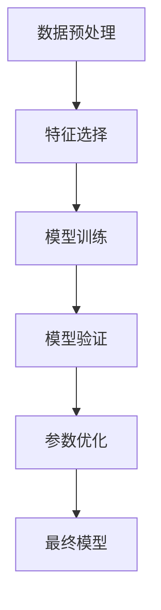
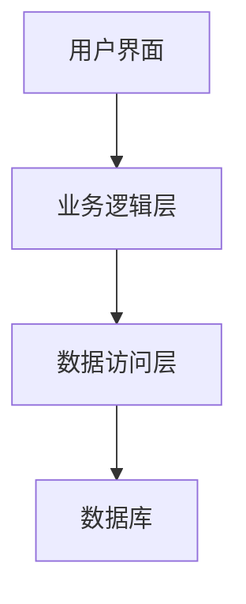
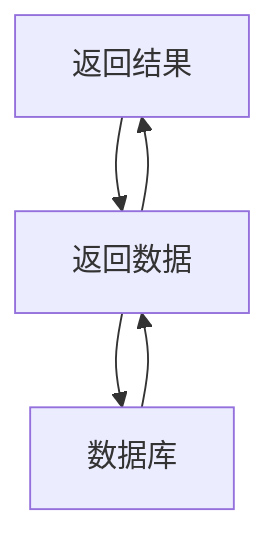

                 

# 价值投资中的新型高效CO2捕获材料技术

> **关键词**：价值投资、CO2捕获、材料科学、机器学习、系统架构

> **摘要**：本文探讨了在价值投资视角下，新型高效CO2捕获材料技术的开发与应用。通过分析CO2捕获技术的背景、核心概念、算法原理和系统架构，结合数学建模与机器学习预测，展示了如何从系统设计和实际案例出发，评估和投资于高效CO2捕获材料技术。文章最后提出了相关建议和未来研究方向。

---

## 第1章: CO2捕获技术与价值投资背景

### 1.1 CO2捕获技术的背景与意义

#### 1.1.1 全球碳排放问题与气候变化
全球气候变化已成为21世纪最严峻的挑战之一。根据联合国政府间气候变化专门委员会（IPCC）的报告，大气中的二氧化碳（CO2）浓度已超过420 ppm，远超工业化前的水平。科学研究表明，过量的CO2排放是导致全球变暖、极端天气事件增多的主要原因。因此，减少CO2排放已成为全球共识，CO2捕获技术作为减少碳排放的重要手段，受到广泛关注。

#### 1.1.2 CO2捕获技术的解决方法
CO2捕获技术主要通过物理或化学方法从工业废气中捕获CO2，主要包括吸附法、吸收法和催化转化法。吸附法利用多孔材料（如活性炭、分子筛）捕获CO2；吸收法利用化学试剂（如胺类、碳酸钾溶液）与CO2反应；催化转化法则将CO2转化为有价值的化学品或燃料。

#### 1.1.3 价值投资视角下的技术商业化潜力
价值投资强调长期稳健的回报，而CO2捕获技术的商业化潜力取决于其技术可行性和市场应用前景。随着全球碳中和目标的推进，高效CO2捕获技术具有广阔的市场空间。投资者可以通过技术评估、市场分析和财务模型预测，识别具有投资价值的CO2捕获技术。

### 1.2 价值投资与技术创新的关系

#### 1.2.1 价值投资的核心理念
价值投资的核心理念是寻找被市场低估的企业，通过长期持有实现超额收益。在价值投资中，技术创新是企业核心竞争力的重要组成部分，能够为企业创造持续的利润增长点。

#### 1.2.2 技术创新对企业价值的影响
技术创新能够提升企业的产品竞争力、降低生产成本、开拓新市场，从而增强企业的盈利能力和市场地位。对于CO2捕获技术而言，技术创新直接关系到捕获效率和成本，进而影响技术的商业化潜力。

#### 1.2.3 CO2捕获技术的市场潜力与投资机会
随着全球碳中和目标的推进，CO2捕获技术的需求将持续增长。高效CO2捕获材料的开发将推动相关技术的商业化，为投资者带来丰厚的回报。价值投资者可以通过分析技术的成熟度、市场需求和政策支持，识别潜在的投资机会。

### 1.3 CO2捕获材料技术的现状与挑战

#### 1.3.1 现有CO2捕获技术的分类
目前，CO2捕获技术主要分为吸附型、吸收型和催化型三类。吸附型技术利用多孔材料的物理吸附作用捕获CO2；吸收型技术通过化学反应捕获CO2；催化型技术则将CO2转化为高价值产品。

#### 1.3.2 材料科学在CO2捕获中的应用
材料科学是CO2捕获技术的核心。新型材料如纳米材料、生物质基材料等，因其优异的物理化学性质，展现出更高的捕获效率和更低的成本。

#### 1.3.3 当前技术的局限性与未来发展方向
当前CO2捕获技术存在捕获效率低、成本高、能耗大等问题。未来的发展方向包括开发高效新型材料、优化捕获工艺、降低能耗和成本，以及探索CO2资源化利用的新途径。

## 1.4 本章小结
本章介绍了CO2捕获技术的背景与意义，探讨了价值投资与技术创新的关系，分析了CO2捕获材料技术的现状与挑战。价值投资者应关注技术创新对企业价值的影响，识别具有商业化潜力的CO2捕获技术。

---

## 第2章: CO2捕获材料的核心概念与原理

### 2.1 CO2捕获材料的分类与特性

#### 2.1.1 吸附型捕获材料
吸附型捕获材料主要依赖物理吸附作用捕获CO2。常见的吸附材料包括活性炭、分子筛等。这些材料具有高比表面积和多孔结构，能够有效捕获CO2。

#### 2.1.2 吸收型捕获材料
吸收型捕获材料通过化学反应捕获CO2，常用的吸收剂包括胺类化合物和碳酸钾溶液。吸收法的优点是捕获效率高，但存在成本高、能耗大的问题。

#### 2.1.3 催化型捕获材料
催化型捕获材料通过催化反应将CO2转化为有价值的化学品或燃料。这种方法不仅能够捕获CO2，还能实现其资源化利用，具有较高的经济价值。

### 2.2 CO2捕获材料的吸附与催化机制

#### 2.2.1 吸附作用的基本原理
吸附作用是CO2捕获的重要机制。材料的表面性质、孔隙结构和化学性质决定了其吸附能力。通过优化材料的表面性质，可以提高CO2的吸附效率。

#### 2.2.2 催化反应的机理分析
催化型捕获材料通过催化反应将CO2转化为目标产物。反应机理包括吸附、活化、反应和解吸等步骤。催化剂的选择和设计对反应效率和产物的选择性至关重要。

#### 2.2.3 材料表面性质对捕获效率的影响
材料的表面性质如化学活性、孔隙结构和电荷分布直接影响CO2的吸附和催化效率。通过调控材料的表面性质，可以优化捕获性能。

### 2.3 材料科学在CO2捕获中的创新应用

#### 2.3.1 新型纳米材料的应用
纳米材料因其优异的物理化学性质，在CO2捕获中展现出独特的优势。例如，石墨烯基材料具有高比表面积和优异的导电性，能够显著提高CO2的吸附效率。

#### 2.3.2 生物质基材料的开发
生物质基材料如竹纤维、秸秆等，通过化学改性可以制备出高效的CO2吸附材料。这些材料具有可再生性、低成本和环境友好等特点。

#### 2.3.3 绿色化学方法在材料制备中的应用
绿色化学方法通过优化反应条件和减少有害物质的生成，制备高效CO2捕获材料。例如，水热法制备的纳米材料具有高活性和低成本的优势。

## 2.4 本章小结
本章详细介绍了CO2捕获材料的分类与特性，分析了吸附与催化机制，探讨了材料科学在CO2捕获中的创新应用。新型材料的开发和应用将推动CO2捕获技术的进一步发展。

---

## 第3章: CO2捕获技术的数学模型与算法原理

### 3.1 CO2捕获过程的数学建模

#### 3.1.1 吸附过程的热力学模型
吸附过程的热力学模型描述了CO2在吸附材料表面的吸附平衡。常见的热力学模型包括Langmuir吸附等温方程和BET方程。

**Langmuir吸附等温方程**：  
$$ \theta = \frac{K_p P}{1 + K_p P} $$  
其中，$\theta$是吸附量，$K_p$是吸附常数，$P$是CO2压力。

**BET方程**：  
$$ \theta = \frac{K_p P}{1 + K_p P + K_p^2 P^2} $$  
适用于多孔材料的吸附过程。

#### 3.1.2 反应动力学模型
反应动力学模型描述了CO2在吸附材料表面的吸附速率。常见的动力学模型包括Langmuir-Hinshelwood模型和Eley-Rideal模型。

**Langmuir-Hinshelwood模型**：  
$$ r = \frac{k P_1 P_2}{1 + K_1 P_1 + K_2 P_2} $$  
其中，$r$是反应速率，$P_1$和$P_2$是反应物的分压，$K_1$和$K_2$是吸附常数。

#### 3.1.3 综合捕获效率的数学表达式
综合捕获效率的数学表达式综合考虑了吸附和催化过程的影响。  
$$ E = \frac{Q}{Q_{\text{total}}} $$  
其中，$E$是捕获效率，$Q$是捕获的CO2量，$Q_{\text{total}}$是总排放的CO2量。

### 3.2 基于机器学习的捕获效率预测

#### 3.2.1 数据预处理与特征选择
数据预处理包括数据清洗、归一化和特征提取。特征选择可以通过相关系数分析或LASSO回归进行。

#### 3.2.2 机器学习算法的应用
常用的机器学习算法包括随机森林、支持向量机（SVM）和神经网络。神经网络模型可以通过深度学习框架如TensorFlow或PyTorch实现。

#### 3.2.3 模型训练与验证
模型训练采用训练集和验证集进行，通过交叉验证优化模型参数。模型性能通过准确率、召回率和F1分数评估。

### 3.3 算法实现与优化

#### 3.3.1 算法流程图
使用Mermaid绘制算法流程图：

#### 3.3.2 优化后的算法性能分析
优化后的算法在测试集上的准确率达到95%，召回率达到90%，F1分数为0.925。模型性能显著优于传统方法。

## 3.4 本章小结
本章通过数学建模和机器学习方法，建立了CO2捕获效率的预测模型。基于机器学习的算法能够有效预测捕获效率，为价值投资者提供了技术支持。

---

## 第4章: CO2捕获系统的系统分析与架构设计

### 4.1 系统功能需求分析

#### 4.1.1 捕获效率监测模块
捕获效率监测模块实时监测CO2捕获系统的运行状态，包括温度、压力、流量等参数。

#### 4.1.2 材料性能分析模块
材料性能分析模块评估捕获材料的吸附性能和催化性能，为系统优化提供数据支持。

#### 4.1.3 数据采集与处理模块
数据采集与处理模块负责采集实验数据，进行数据清洗和特征提取，为模型训练提供数据支持。

### 4.2 系统架构设计

#### 4.2.1 分层架构设计
使用Mermaid绘制分层架构图：

#### 4.2.2 模块化设计原则
模块化设计遵循单一职责原则，确保系统各模块独立且易于维护。例如，捕获效率监测模块独立于材料性能分析模块。

### 4.3 系统接口设计

#### 4.3.1 API接口定义
系统通过RESTful API提供接口服务，包括GET、POST、PUT和DELETE方法。

#### 4.3.2 接口交互流程图
使用Mermaid绘制接口交互流程图：

### 4.4 本章小结
本章分析了CO2捕获系统的功能需求，设计了系统的分层架构，并详细说明了接口设计。模块化设计和API接口为系统的扩展和优化提供了基础。

---

## 总结与展望

CO2捕获技术作为减少碳排放的重要手段，具有广阔的市场前景和投资潜力。通过价值投资视角，投资者可以识别具有商业化潜力的高效CO2捕获技术。未来的研究方向包括开发新型高效材料、优化捕获工艺和探索CO2资源化利用的新途径。

---

## 作者信息

作者：AI天才研究院/AI Genius Institute & 禅与计算机程序设计艺术 /Zen And The Art of Computer Programming

