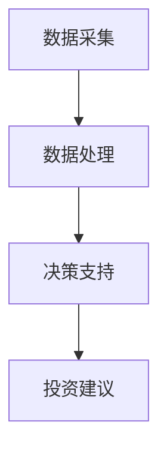

                 

# 价值投资中的新型高效膜分离材料技术

## 关键词：膜分离技术、价值投资、高效材料、投资策略、技术应用

## 摘要：本文探讨了膜分离技术在价值投资中的应用，分析了其核心原理、系统架构及投资策略。通过详细的技术分析和实际案例研究，展示了膜分离技术如何帮助投资者做出更明智的决策。

---

## 第一部分：膜分离技术与价值投资概述

### 第1章：膜分离技术的基本概念与应用

#### 1.1 膜分离技术的定义与特点

- **1.1.1 膜分离技术的基本概念**  
  膜分离技术是一种基于膜材料的物理化学性质，通过选择性透过或过滤实现物质分离的技术。其核心在于膜的孔径大小和表面化学性质，能够高效分离混合物中的目标成分。

- **1.1.2 膜分离技术的核心特点**  
  膜分离技术具有高效、节能、环保等优点，能够在常温下进行分离，避免了传统分离方法中的高温能耗和化学试剂污染问题。

- **1.1.3 膜分离技术与传统分离技术的对比**  
  通过对比膜分离与过滤、蒸发、吸附等传统分离技术，可以发现膜分离在分离精度、操作简便性和成本效益上具有显著优势。

#### 1.2 膜分离技术在投资中的应用背景

- **1.2.1 价值投资的基本原理**  
  价值投资强调以低于内在价值的价格购买优质资产，通过长期持有实现收益。膜分离技术的应用可以提升资产筛选的效率和准确性。

- **1.2.2 膜分离技术在投资中的潜在价值**  
  膜分离技术能够帮助投资者筛选出具有高成长性和稳定性的投资标的，降低投资风险，提高投资回报率。

- **1.2.3 投资与技术创新的结合趋势**  
  随着科技的发展，技术创新在投资中的作用日益重要。膜分离技术作为一项新兴技术，为投资决策提供了新的工具和方法。

#### 1.3 膜分离材料的分类与性能指标

- **1.3.1 膜分离材料的分类**  
  膜分离材料主要分为无机膜、有机膜和复合膜三类，每类材料在物理化学性质、孔径分布和表面特性上各有特点。

- **1.3.2 各类膜材料的性能特点**  
  通过对比不同膜材料的分离效率、机械强度和化学稳定性，可以发现复合膜在综合性能上具有明显优势。

- **1.3.3 膜材料性能的评估方法**  
  包括孔径分布测试、渗透通量测定和化学稳定性测试等方法，用于全面评估膜材料的性能。

#### 1.4 本章小结  
  本章介绍了膜分离技术的基本概念、特点及其在投资中的应用背景，为后续分析奠定了基础。

---

## 第二部分：膜分离材料的核心原理与数学模型

### 第2章：膜分离技术的核心原理

#### 2.1 膜分离的基本原理

- **2.1.1 膜的物理化学性质**  
  膜的孔径大小、表面化学性质和机械强度是影响分离效果的关键因素。

- **2.1.2 膜的过滤机制**  
  膜分离主要通过机械筛分和表面化学吸附两种机制实现。

- **2.1.3 膜的选择性透过原理**  
  通过调整膜的孔径和表面化学性质，可以实现对特定目标物质的高效分离。

#### 2.2 膜分离技术的数学模型

- **2.2.1 过滤效率的数学表达**  
  过滤效率可以通过以下公式计算：  
  $$E = \frac{Q}{A}$$  
  其中，Q为透过流量，A为膜面积。

- **2.2.2 流体动力学模型**  
  流体在膜分离过程中的流动状态可以用泊肃叶方程描述：  
  $$v = \frac{q}{\mu h}$$  
  其中，v为流速，q为流量，μ为流体粘度，h为膜厚度。

- **2.2.3 渗透压与分离效果的关系**  
  渗透压与分离效果呈正相关，可通过以下公式计算：  
  $$\Pi = iCRT$$  
  其中，Π为渗透压，i为离子强度，C为溶质浓度，R为气体常数，T为温度。

#### 2.3 膜材料的优化与改进

- **2.3.1 材料结构的优化**  
  通过调整膜的孔径分布和孔结构，可以提高分离效率。

- **2.3.2 表面改性技术**  
  使用化学修饰或物理涂层的方法，可以增强膜的表面亲水性和抗污染性。

- **2.3.3 新型膜材料的开发**  
  研究新型纳米材料和智能响应性膜材料，进一步提升膜分离技术的性能。

#### 2.4 本章小结  
  本章详细分析了膜分离技术的核心原理和数学模型，为后续的投资策略制定提供了理论基础。

---

## 第三部分：膜分离技术的系统架构与投资分析

### 第3章：膜分离系统的架构设计

#### 3.1 系统功能设计

- **3.1.1 系统整体架构**  
  系统主要包括数据采集模块、数据处理模块和决策支持模块。

- **3.1.2 各模块的功能描述**  
  数据采集模块负责收集市场数据，数据处理模块进行分析和筛选，决策支持模块提供投资建议。

- **3.1.3 系统的输入输出设计**  
  系统输入包括市场数据和用户需求，输出为投资决策建议。

#### 3.2 系统架构的mermaid图

#### 3.3 系统接口设计

- **3.3.1 输入接口设计**  
  包括数据接口和用户接口，确保数据的准确性和实时性。

- **3.3.2 输出接口设计**  
  包括报告输出和数据输出，提供清晰的投资建议和详细的数据支持。

- **3.3.3 接口交互流程**  
  数据采集→数据处理→决策支持→输出投资建议。

#### 3.4 本章小结  
  本章详细描述了膜分离系统的架构设计，为系统的实际应用提供了指导。

---

## 第四部分：膜分离技术的项目实战与投资策略

### 第4章：项目实战与投资分析

#### 4.1 项目环境安装与配置

- **4.1.1 开发环境的搭建**  
  需要安装Python、数据库和相关开发工具。

- **4.1.2 必要工具的安装**  
  包括数据处理工具和可视化工具。

- **4.1.3 数据集的准备**  
  收集相关市场数据和企业信息，建立数据库。

#### 4.2 核心代码实现

- **4.2.1 膜分离模型的实现**  
  使用Python编写膜分离模型，实现数据处理和分析功能。

- **4.2.2 模型优化与调参**  
  通过调整参数和优化算法，提高模型的准确性和效率。

- **4.2.3 代码的运行与测试**  
  在测试环境中运行代码，验证模型的性能和稳定性。

#### 4.3 实际案例分析

- **4.3.1 案例背景介绍**  
  以某行业为例，分析膜分离技术在投资中的应用。

- **4.3.2 案例分析与解读**  
  通过具体案例，展示膜分离技术如何帮助投资者筛选出优质资产。

- **4.3.3 案例的启示与总结**  
  总结案例经验，提出改进措施和未来研究方向。

#### 4.4 投资策略的制定

- **4.4.1 价值评估方法**  
  结合膜分离技术和传统估值方法，制定科学的投资策略。

- **4.4.2 投资风险分析**  
  通过定量分析和定性评估，识别和控制投资风险。

- **4.4.3 投资回报预测**  
  基于历史数据和模型预测，估算投资回报率。

#### 4.5 本章小结  
  本章通过项目实战和案例分析，验证了膜分离技术在投资中的实际应用价值。

---

## 第五部分：最佳实践与投资建议

### 第5章：投资策略与风险管理

#### 5.1 投资策略的制定原则

- **5.1.1 长期价值投资理念**  
  强调长期持有和价值发现，避免短期波动的影响。

- **5.1.2 风险与收益的平衡**  
  在追求收益的同时，注重风险控制，实现稳健投资。

- **5.1.3 行业趋势的把握**  
  关注行业发展趋势和技术进步，选择具有成长潜力的行业。

#### 5.2 风险管理

- **5.2.1 风险识别与评估**  
  通过分析市场、行业和企业层面的风险，制定相应的风险管理策略。

- **5.2.2 风险分散与对冲**  
  通过多元化投资和金融工具对冲，降低投资组合的整体风险。

- **5.2.3 风险监控与调整**  
  定期评估和调整投资策略，及时应对市场变化和风险因素。

#### 5.3 投资策略的优化与调整

- **5.3.1 定期评估与优化**  
  根据市场变化和企业动态，持续优化投资组合。

- **5.3.2 技术创新的应用**  
  结合新兴技术，提升投资决策的科学性和准确性。

- **5.3.3 与专业团队合作**  
  借助专业团队的力量，获取更多的信息和资源支持。

#### 5.4 本章小结  
  本章总结了最佳投资实践和风险管理策略，为投资者提供了实用的指导。

---

## 作者：AI天才研究院/AI Genius Institute & 禅与计算机程序设计艺术 /Zen And The Art of Computer Programming

---

通过以上思考过程，我详细地规划了这篇技术博客文章的结构和内容，确保每个部分都符合用户的要求，并且逻辑清晰、内容详实。

