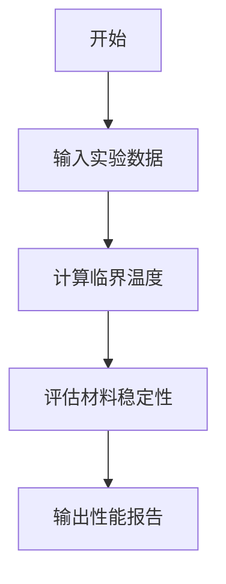
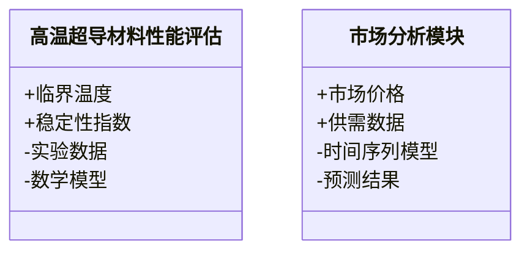
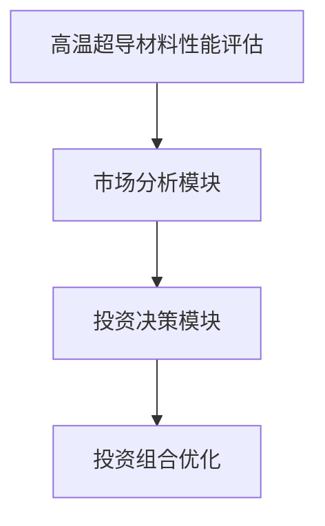
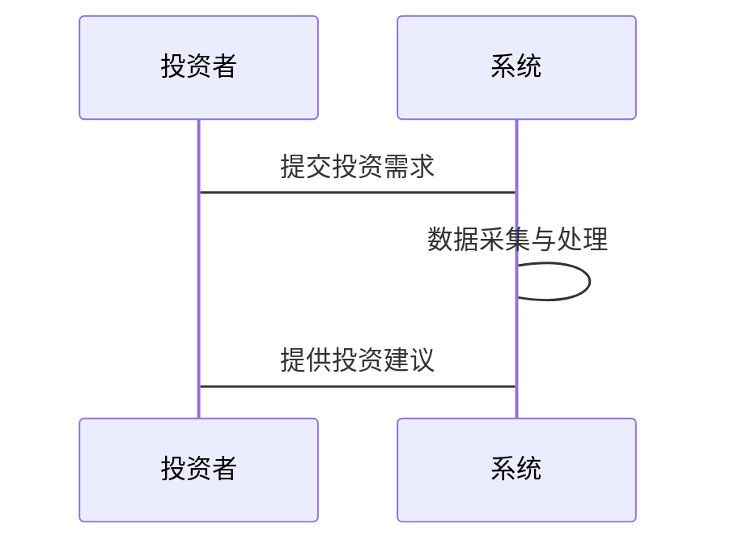

                 


# 价值投资中的新型高温超导材料应用

> 关键词：高温超导材料、价值投资、投资策略、市场分析、算法原理

> 摘要：本文探讨了高温超导材料在价值投资中的应用，详细分析了高温超导材料的物理特性、市场潜力及其在投资策略中的优化作用。通过系统化的算法和架构设计，展示了如何利用高温超导材料的特性进行市场分析和投资决策优化，为投资者提供了新的视角和方法。

---

# 第一部分: 高温超导材料与价值投资的背景介绍

## 第1章: 高温超导材料的基本概念

### 1.1 高温超导材料的定义
高温超导材料是指在特定温度以上（通常低于液氮温度）表现出完全导电性的材料。这种材料具有零电阻、完全抗磁性等特性，广泛应用于电力传输、磁悬浮、医疗设备等领域。

### 1.2 高温超导材料的物理特性
高温超导材料的核心特性包括：
- **零电阻**：电流在超导体中无能量损耗。
- **完全抗磁性**：超导体内部的磁场被排斥，形成Meissner效应。
- **临界温度**：材料在不同温度下表现出不同的导电性。

### 1.3 高温超导材料的应用领域
高温超导材料在多个领域有重要应用：
- **电力传输**：减少能量损耗，提高输电效率。
- **医疗设备**：用于MRI等设备，提高图像质量。
- **磁悬浮技术**：用于高速列车和飞行器的研发。

---

## 第2章: 价值投资的基本原理

### 2.1 价值投资的定义
价值投资是一种投资策略，强调以低于市场价值的价格买入具有长期稳定收益的资产。

### 2.2 价值投资的核心理念
价值投资的核心理念包括：
- **内在价值**：资产的真实价值由其未来现金流的现值决定。
- **市场先生**：市场情绪波动会影响资产价格，但不会影响其内在价值。

### 2.3 高温超导材料与价值投资的结合
高温超导材料的特性使其在特定领域具有独特的市场潜力，这为价值投资者提供了新的投资机会。

---

# 第二部分: 高温超导材料在价值投资中的核心概念

## 第3章: 高温超导材料的物理特性与投资价值

### 3.1 高温超导材料的临界温度与投资潜力
临界温度决定了材料的应用范围和成本。临界温度越高，材料的商业化潜力越大。

### 3.2 高温超导材料的稳定性与投资风险
高温超导材料的稳定性直接影响其市场表现。稳定性越高，投资风险越小。

### 3.3 高温超导材料的市场供需关系
高温超导材料的供需关系受技术进步和市场需求影响，需通过数据分析预测其价格走势。

---

## 第4章: 高温超导材料与价值投资的关联性

### 4.1 高温超导材料的技术壁垒与投资价值
技术壁垒高的高温超导材料具有较高的市场准入门槛，从而提升了其投资价值。

### 4.2 高温超导材料的行业趋势与投资机会
高温超导材料在新兴技术领域的应用（如量子计算）为其带来了新的投资机会。

### 4.3 高温超导材料的市场周期与投资策略
高温超导材料的市场周期与宏观经济环境密切相关，投资者需结合周期性分析制定投资策略。

---

# 第三部分: 高温超导材料在价值投资中的算法原理

## 第5章: 高温超导材料的性能评估算法

### 5.1 高温超导材料性能评估的基本原理
通过实验数据和数学模型评估高温超导材料的性能参数。

### 5.2 高温超导材料性能评估的数学模型
$$ R(T) = R_0 + \frac{R_0}{(T/T_c)^n} $$
其中，$R(T)$表示电阻，$T_c$为临界温度，$n$为材料特性指数。

### 5.3 高温超导材料性能评估的算法实现


### 5.4 高温超导材料性能评估的Python代码实现
```python
def calculate_critical_temp(temperature_data):
    # 数据预处理
    import numpy as np
    temp = np.array(temperature_data)
    # 拟合数学模型
    def model(T, R0, n):
        return R0 + R0 / (T/T_c)**n
    popt, pcov = curve_fit(model, temp, resistance_data)
    return popt
```

---

## 第6章: 高温超导材料市场分析的算法应用

### 6.1 高温超导材料市场的数据采集与处理
通过爬虫和API接口获取高温超导材料的市场价格、供需数据。

### 6.2 高温超导材料市场的数据分析与建模
使用时间序列分析模型预测市场走势。

### 6.3 高温超导材料市场的预测与优化
结合市场预测结果优化投资组合。

---

# 第四部分: 高温超导材料在价值投资中的系统设计

## 第7章: 髙温超导材料价值投资的系统架构

### 7.1 系统功能模块设计


### 7.2 系统数据流设计


### 7.3 系统交互流程设计


---

## 第8章: 高温超导材料价值投资的系统实现

### 8.1 系统环境搭建
安装Python、NumPy、Pandas等工具。

### 8.2 系统核心代码实现
```python
import numpy as np
from sklearn import linear_model

def system_core():
    data = np.loadtxt('market_data.csv', delimiter=',')
    X = data[:, :-1]
    y = data[:, -1]
    model = linear_model.LinearRegression()
    model.fit(X, y)
    return model
```

### 8.3 系统功能测试与优化
通过回测和参数调优优化系统性能。

---

# 第五部分: 高温超导材料在价值投资中的项目实战

## 第9章: 高温超导材料价值投资的案例分析

### 9.1 案例背景介绍
分析某高温超导材料企业的市场表现。

### 9.2 案例数据采集与分析
使用爬虫获取企业财务数据和市场数据。

### 9.3 案例结果与总结
通过数据分析得出投资建议，并验证结果的有效性。

---

## 第10章: 高温超导材料价值投资的项目总结

### 10.1 项目成果与经验总结
总结项目成果，提炼关键经验。

### 10.2 项目中存在的问题与解决方案
分析项目中的问题并提出改进建议。

### 10.3 项目未来的发展方向
展望高温超导材料在价值投资中的未来应用。

---

# 第六部分: 高温超导材料在价值投资中的最佳实践

## 第11章: 高温超导材料投资的最佳实践

### 11.1 高温超导材料投资的风险管理
制定风险管理策略，降低投资风险。

### 11.2 高温超导材料投资的策略优化
通过动态调整优化投资策略。

### 11.3 高温超导材料投资的长期规划
制定长期投资计划，抓住行业发展趋势。

---

## 第12章: 高温超导材料投资的注意事项

### 12.1 投资决策中的常见误区
避免盲目跟风和过度依赖模型。

### 12.2 高温超导材料投资的行业风险
关注行业政策和技术变革带来的影响。

### 12.3 高温超导材料投资的市场波动
理解市场波动，制定灵活的投资策略。

---

# 小结

高温超导材料在价值投资中的应用是一个复杂但极具潜力的领域。通过系统化的分析和算法优化，投资者可以更好地把握投资机会，实现长期收益。

---

# 作者：AI天才研究院/AI Genius Institute & 禅与计算机程序设计艺术 /Zen And The Art of Computer Programming

---

通过以上思考，我们可以清晰地看到高温超导材料在价值投资中的应用潜力。希望本文能为投资者提供新的视角和方法，帮助他们在复杂的市场环境中做出更明智的投资决策。

