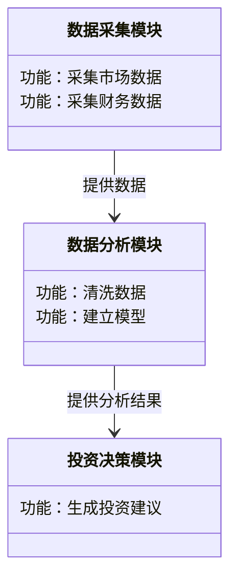
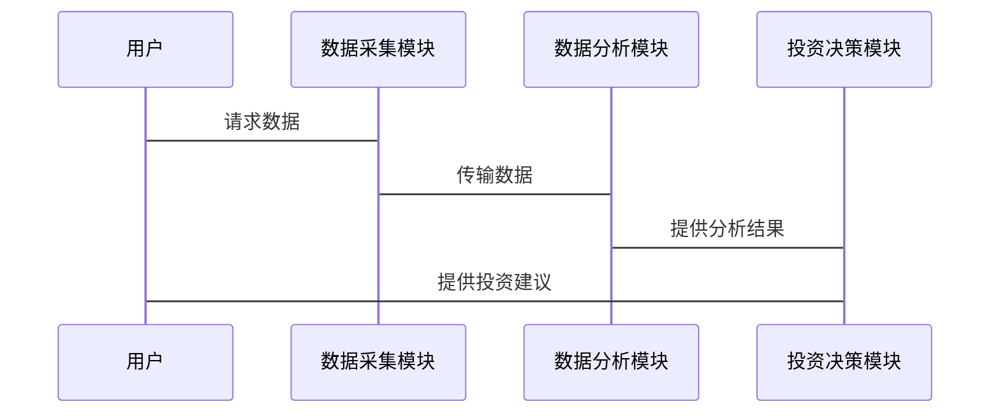

                 


# 《价值投资中的新能源革命分析》

---

## 关键词：
- 价值投资
- 新能源革命
- 投资分析
- 产业变革
- 可持续发展

---

## 摘要：
本文旨在探讨新能源革命对价值投资领域的影响，分析新能源行业如何改变传统的投资策略。通过详细阐述新能源行业的核心概念、价值投资的基本原理以及两者的结合方式，文章帮助投资者理解新能源革命带来的机遇与挑战。结合实际案例和系统设计，本文提供了一套新能源行业的价值投资分析框架，帮助投资者在新能源领域做出更明智的投资决策。

---

# 第一部分: 新能源革命与价值投资的背景

## 第1章: 新能源革命的背景与价值投资的结合

### 1.1 新能源革命的背景
- **1.1.1 新能源革命的定义与特征**  
  新能源革命是指全球范围内向清洁能源转型的过程，其核心是减少对化石能源的依赖，推动可再生能源的大规模应用。新能源革命具有技术创新快、政策驱动强、市场潜力大等特点。
  
- **1.1.2 新能源革命对全球经济的影响**  
  新能源革命正在重塑全球能源结构，推动相关产业的升级。它不仅改变了能源供应方式，还催生了新的经济增长点，例如电动汽车、太阳能电池板和风力发电设备的制造。

- **1.1.3 新能源与传统能源的对比分析**  
  从环境影响、成本、技术门槛等方面，分析新能源与传统能源的优劣。例如，新能源具有环境友好、资源分布广泛的特点，而传统能源则依赖有限的化石资源，且对环境造成较大污染。

### 1.2 价值投资的基本概念
- **1.2.1 价值投资的定义与核心理念**  
  价值投资是一种长期投资策略，强调以低于内在价值的价格购买优质资产。其核心理念是寻找市场低估的公司，并长期持有。

- **1.2.2 价值投资的理论基础**  
  价值投资的理论基础包括基本面分析、安全边际概念以及长期持有的策略。它强调对公司的财务状况、行业地位和管理层能力的深入研究。

- **1.2.3 价值投资在不同领域的应用**  
  价值投资不仅适用于传统行业，也逐渐在新能源领域展现出其独特优势。随着新能源行业的快速发展，价值投资的方法需要结合行业的特殊性进行调整。

### 1.3 新能源革命与价值投资的结合
- **1.3.1 新能源革命对投资领域的影响**  
  新能源革命为投资者提供了新的投资机会，例如投资于电动汽车、储能技术等领域。同时，它也对传统的能源投资模式提出了挑战。

- **1.3.2 新能源行业的投资机会与挑战**  
  新能源行业的投资机会包括技术创新带来的市场增长、政策支持带来的市场扩张等。挑战则包括技术风险、市场竞争加剧、政策变化等。

- **1.3.3 价值投资在新能源领域的独特优势**  
  价值投资在新能源领域的独特优势体现在对行业长期趋势的把握、对优质公司的筛选以及对安全边际的重视。

---

# 第二部分: 新能源行业的核心分析框架

## 第2章: 新能源行业的核心概念与联系

### 2.1 新能源行业的核心概念
- **2.1.1 新能源行业的产业链分析**  
  新能源行业的产业链包括上游的原材料供应、中游的设备制造以及下游的应用场景。例如，太阳能行业的上游包括硅料生产，中游包括光伏组件制造，下游包括电站建设。

- **2.1.2 新能源行业的关键技术与创新**  
  新能源行业的关键技术包括太阳能电池技术、储能技术、智能电网技术等。这些技术的创新推动了行业的快速发展。

- **2.1.3 新能源行业的市场结构与竞争格局**  
  新能源行业呈现出寡头垄断与差异化竞争并存的市场结构。大型企业凭借技术、资金和品牌优势占据主导地位，而中小型企业则通过专注于特定领域寻求突破。

### 2.2 价值投资与新能源行业的核心联系
- **2.2.1 价值投资在新能源行业的应用领域**  
  价值投资在新能源行业的应用领域包括对电池技术领先企业的投资、对储能技术创新企业的投资等。

- **2.2.2 新能源行业的财务指标与估值方法**  
  新能源行业的财务指标包括ROE（净资产收益率）、毛利率、研发投入占比等。估值方法则需要结合行业特点，例如采用市盈率（P/E）或市净率（P/B）等指标。

- **2.2.3 新能源行业的风险评估与投资决策**  
  新能源行业的风险包括政策风险、技术风险、市场风险等。价值投资者需要通过深入分析这些风险，做出明智的投资决策。

### 2.3 新能源行业与价值投资的关系图解
- **2.3.1 新能源行业与价值投资的关系表格对比**  
  以下是一个对比表格，展示了新能源行业与价值投资在核心要素上的异同：

| 核心要素 | 新能源行业 | 价值投资 |
|----------|------------|----------|
| 目标     | 实现清洁能源转型 | 寻找被低估的优质资产 |
| 关键因素 | 技术创新、政策支持 | 财务状况、行业地位 |
| 风险     | 技术风险、政策风险 | 市场风险、流动性风险 |

- **2.3.2 新能源行业与价值投资的ER实体关系图**  
  以下是一个简化的ER实体关系图：

```mermaid
erDiagram
    actor 投资者 {
        <属性> 投资金额
        <属性> 投资期限
    }
    actor 新能源企业 {
        <属性> 企业规模
        <属性> 技术水平
    }
    actor 金融市场 {
        <属性> 市场波动
        <属性> 市场风险
    }
    投资者 --> 新能源企业 : 投资
    新能源企业 --> 金融市场 : 上市
    金融市场 --> 投资者 : 估值
```

---

# 第三部分: 新能源行业的价值投资分析方法

## 第3章: 新能源行业的价值投资分析框架

### 3.1 新能源行业的价值投资分析方法
- **3.1.1 新能源行业的市场分析方法**  
  市场分析方法包括市场规模分析、市场增长预测、市场结构分析等。例如，可以通过分析全球新能源汽车的市场规模，预测未来几年的增长趋势。

- **3.1.2 新能源行业的财务分析方法**  
  财务分析方法包括对公司的收入、利润、现金流等指标的分析。例如，分析一家新能源企业的毛利率是否稳定，是否具备成本优势。

- **3.1.3 新能源行业的风险管理方法**  
  风险管理方法包括识别潜在风险、评估风险影响、制定应对策略等。例如，分析政策变化对新能源行业的影响，并制定相应的投资策略。

### 3.2 新能源行业的价值投资分析模型
- **3.2.1 新能源行业的PE分析模型**  
  PE（市盈率）= 股价 / 每股净利润。通过比较新能源行业的PE值与行业平均水平，可以判断其是否被高估或低估。

- **3.2.2 新能源行业的DCF分析模型**  
  DCF（现金流折现法）通过预测未来现金流，折现到现值来评估公司价值。适用于新能源行业中的成长型企业。

- **3.2.3 新能源行业的SWOT分析模型**  
  SWOT分析模型用于分析企业的优势、劣势、机会和威胁。例如，分析一家新能源企业的技术优势和市场竞争劣势。

---

# 第四部分: 新能源行业的系统分析与架构设计

## 第4章: 新能源行业的系统分析与架构设计

### 4.1 新能源行业的系统功能设计
- **4.1.1 系统功能模块**  
  新能源行业的分析系统可以分为数据采集模块、数据分析模块、投资决策模块等。每个模块的功能如下：
  - 数据采集模块：收集新能源行业的市场数据、财务数据等。
  - 数据分析模块：对收集的数据进行清洗、分析和建模。
  - 投资决策模块：基于分析结果，生成投资建议。

- **4.1.2 系统功能设计的Mermaid类图**  
  以下是一个简化的系统功能设计类图：



### 4.2 新能源行业的系统架构设计
- **4.2.1 系统架构设计的Mermaid架构图**  
  以下是一个简化的系统架构设计图：

```mermaid
container 新能源行业分析系统 {
    数据采集模块
    数据分析模块
    投资决策模块
    用户界面
}
```

- **4.2.2 系统接口设计**  
  系统需要与外部数据源（如股票交易所）进行接口对接，获取实时数据。接口设计需要考虑数据格式、数据频率、数据安全等因素。

- **4.2.3 系统交互的Mermaid序列图**  
  以下是一个简化的系统交互序列图：



---

# 第五部分: 项目实战与最佳实践

## 第5章: 项目实战

### 5.1 项目实战环境安装
- **5.1.1 环境安装步骤**  
  1. 安装Python 3.x
  2. 安装相关库：pandas、numpy、scikit-learn、matplotlib
  3. 安装Jupyter Notebook用于数据分析和可视化

### 5.2 核心实现
- **5.2.1 数据分析核心代码**  
  ```python
  import pandas as pd
  import numpy as np

  # 假设我们有一个新能源企业的财务数据
  df = pd.read_csv('new_energy_data.csv')
  df['PE'] = df['股价'] / df['每股净利润']
  df['毛利率'] = (df['营业收入'] - df['营业成本']) / df['营业收入']
  ```

- **5.2.2 投资决策模型核心代码**  
  ```python
  from sklearn.linear_model import LinearRegression

  # 使用线性回归模型预测新能源行业的PE值
  model = LinearRegression()
  model.fit(df[['营业收入', '净利润']], df['PE'])
  ```

### 5.3 案例分析与结果解读
- **5.3.1 数据分析案例**  
  假设我们分析一家新能源企业的PE值，发现其PE值低于行业平均水平，说明该企业可能被低估，具有投资价值。

- **5.3.2 投资决策案例**  
  通过模型预测，未来一年新能源行业的PE值可能会上涨，建议投资者在当前价位买入相关股票。

### 5.4 项目小结
- 本项目通过实际数据分析和建模，验证了新能源行业的投资价值。投资者可以根据分析结果，制定相应的投资策略。

## 第6章: 最佳实践与注意事项

### 6.1 最佳实践
- **6.1.1 投资策略**  
  投资者应关注新能源行业的技术创新、政策支持以及企业财务状况，制定长期投资计划。

- **6.1.2 风险管理**  
  投资者应分散投资风险，避免过度集中在单一领域或公司。

### 6.2 小结
- 新能源革命为价值投资提供了新的机遇，但同时也带来了新的挑战。投资者需要结合行业特点，制定合理的投资策略。

### 6.3 注意事项
- **6.3.1 数据来源的可靠性**  
  数据来源应权威可靠，避免使用错误或过时的数据。

- **6.3.2 模型的局限性**  
  分析模型仅供参考，实际投资需结合市场实际情况进行调整。

---

# 结语

新能源革命正在改变全球能源结构，为价值投资提供了新的机遇。通过系统的分析和科学的投资策略，投资者可以在新能源领域实现长期稳定的投资回报。未来，随着技术的不断进步和政策的持续支持，新能源行业将继续保持快速发展的态势，为投资者提供更多的投资机会。

---

# 作者：AI天才研究院 & 禅与计算机程序设计艺术

---

