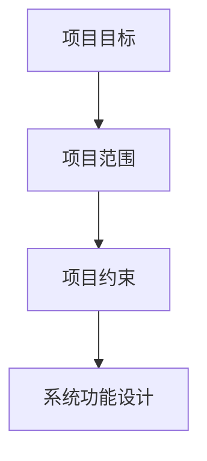
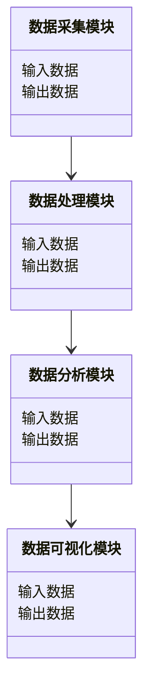
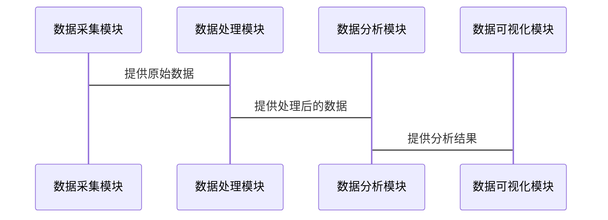

                 

# 价值投资中的智慧城市机会

## 关键词：智慧城市，价值投资，大数据，人工智能，物联网，投资机会，系统架构

## 摘要：本文深入探讨了智慧城市建设中的价值投资机会，分析了智慧城市的定义与核心要素，结合价值投资的基本概念，详细阐述了智慧城市中的大数据、人工智能和物联网等技术的应用。通过构建智慧城市的价值评估模型，结合实际案例，为投资者提供了系统化的投资分析方法和实战指导，帮助投资者在智慧城市建设中把握投资机会，实现价值最大化。

---

## 第一部分：智慧城市的定义与价值投资的背景

### 第1章：智慧城市的定义与价值投资的背景

#### 1.1 智慧城市的定义与核心要素

##### 1.1.1 智慧城市的定义
智慧城市建设是通过先进的信息技术和数据驱动的管理方式，将城市中的各个系统和资源进行智能化整合，以提高城市的运行效率、居民生活质量和社会的整体竞争力。智慧城市的本质是通过技术创新和数据共享，实现城市资源的最优配置和高效管理。

**核心概念术语说明：**
- **智慧城市（Smart City）**：利用信息技术和数据驱动的方式，优化城市资源管理和服务提供。
- **大数据技术（Big Data）**：通过对海量数据的采集、处理和分析，提供决策支持。
- **人工智能（AI）**：通过机器学习和深度学习等技术，实现智能化的预测和决策。

**问题背景：**
随着城市化进程的加快，城市面临资源紧张、环境污染、交通拥堵等一系列问题。传统的城市管理方式难以应对日益复杂的城市发展需求，智慧城市建设成为解决这些问题的重要手段。

**问题描述：**
智慧城市建设的目标是通过技术创新和数据共享，实现城市资源的最优配置和高效管理。然而，如何在智慧城市建设中找到投资机会，实现价值最大化，是投资者关注的核心问题。

**边界与外延：**
智慧城市建设的范围包括交通、能源、医疗、教育等多个领域，其核心是通过技术创新和数据共享，实现城市的智能化管理。

**概念结构与核心要素组成：**

以下是智慧城市建设的核心要素：

| **核心要素** | **定义** | **作用** |
|---------------|-----------|-----------|
| 大数据技术    | 数据采集、处理和分析的技术 | 提供决策支持，优化资源配置 |
| 人工智能技术  | 模拟人类智能的技术 | 实现智能化预测和决策 |
| 物联网技术    | 物物相连的互联网技术 | 实现城市设备的互联互通 |
| 云计算技术    | 提供弹性计算资源的技术 | 支持大数据处理和存储 |
| 数字化服务    | 基于数字技术的服务模式 | 提高居民生活质量和社会效率 |

---

#### 1.1.2 智慧城市的核心要素

智慧城市的建设涉及多个领域的技术整合和协同工作。以下是智慧城市建设的核心要素：

1. **数据采集与处理：**
   - 通过传感器、摄像头等设备采集城市中的各种数据，如交通流量、环境数据、能源消耗等。
   - 使用大数据技术对采集的数据进行清洗、存储和分析。

2. **数据共享与应用：**
   - 建立城市级的数据共享平台，实现各部门之间的数据互联互通。
   - 通过数据分析，提供城市管理决策支持，优化资源配置。

3. **智能化服务：**
   - 基于人工智能技术，实现智能化的预测和决策，如智能交通调度、智能能源管理等。
   - 提供个性化的居民服务，如智能医疗、智能教育等。

4. **系统集成与管理：**
   - 建立统一的系统集成平台，实现城市各子系统的协同运行。
   - 通过实时监控和反馈，优化城市运行效率。

---

#### 1.1.3 智慧城市的发展历程

智慧城市建设经历了以下几个阶段：

1. **初期阶段（2000年之前）：**
   - 主要以信息化建设为核心，如电子政务、电子商务等。
   - 数据孤岛现象严重，各部门之间缺乏数据共享。

2. **发展阶段（2000-2010年）：**
   - 大数据技术的应用逐渐普及，城市数据的采集和处理能力显著提升。
   - 开始出现智慧交通、智慧医疗等试点项目。

3. **成熟阶段（2010年至今）：**
   - 人工智能和物联网技术的快速发展，推动智慧城市建设进入智能化阶段。
   - 城市各系统之间的协同能力显著增强，智能化服务逐步普及。

---

#### 1.2 价值投资的基本概念

##### 1.2.1 价值投资的定义
价值投资是一种投资策略，强调以低于资产内在价值的价格买入优质资产，长期持有，等待其价值回归。价值投资者通常关注企业的基本面，如盈利能力、财务状况和行业地位等。

**核心概念术语说明：**
- **价值投资（Value Investment）**：以低于资产内在价值的价格买入优质资产的投资策略。
- **内在价值（Intrinsic Value）**：资产在市场中应体现的合理价值，通常通过基本面分析得出。
- **安全边际（Margin of Safety）**：买入价格与资产内在价值之间的差距，提供风险缓冲。

**问题背景：**
在传统投资中，投资者往往被短期市场波动所困扰，难以实现长期稳定的收益。价值投资通过关注企业的内在价值，帮助投资者在市场波动中保持理性，实现长期稳健的投资回报。

**问题描述：**
价值投资的核心在于识别被低估的资产，通过深入分析企业的基本面，找到具有持续竞争优势的企业进行投资。然而，在智慧城市建设中，如何将价值投资的理念应用于智慧城市项目，是一个值得深入探讨的问题。

**边界与外延：**
价值投资的应用范围广泛，不仅限于股票投资，还可以应用于房地产、基础设施等领域。在智慧城市建设中，价值投资的重点是识别具有长期发展潜力的智慧城市项目。

**概念结构与核心要素组成：**

以下是价值投资的核心要素：

| **核心要素** | **定义** | **作用** |
|---------------|-----------|-----------|
| 内在价值      | 资产的合理价值 | 作为买入价格的参考 |
| 安全边际      | 买入价格与内在价值的差距 | 提供风险缓冲，确保投资安全 |
| 基本面分析    | 对企业财务状况、行业地位等的分析 | 识别具有竞争优势的企业 |

---

#### 1.2.2 价值投资的核心原则

1. **投资优质资产：**
   - 选择具有持续竞争优势的企业或项目，确保投资的长期性。
   - 重点关注企业的盈利能力、财务状况和管理团队。

2. **安全边际：**
   - 买入价格应低于资产的内在价值，确保投资的安全性。
   - 安全边际的存在可以缓冲市场波动带来的风险。

3. **长期持有：**
   - 价值投资强调长期持有，避免频繁交易。
   - 长期持有可以减少交易成本，并享受复利效应。

---

#### 1.2.3 价值投资在现代经济中的应用

1. **股票投资：**
   - 通过基本面分析，选择具有持续增长潜力的优质股票。
   - 重点关注企业的盈利能力、财务状况和行业地位。

2. **房地产投资：**
   - 选择具有升值潜力的房地产项目进行投资。
   - 关注区域经济发展、人口增长和政策支持等因素。

3. **基础设施投资：**
   - 投资于具有长期收益的基础设施项目，如智慧交通、智慧能源等。
   - 关注项目的收益能力、运营成本和政策支持。

---

### 第2章：智慧城市与价值投资的结合

#### 2.1 智慧城市的技术基础

##### 2.1.1 大数据技术

**问题背景：**
智慧城市建设需要处理海量数据，包括交通流量、环境数据、能源消耗等。大数据技术是智慧城市建设的核心技术之一。

**问题描述：**
大数据技术在智慧城市建设中的应用包括数据采集、处理、分析和可视化。通过大数据技术，可以实现城市资源的优化配置和高效管理。

**核心概念与联系：**
以下是大数据技术在智慧城市建设中的应用：

1. **数据采集：**
   - 通过传感器、摄像头等设备采集城市中的各种数据。
   - 数据采集是智慧城市建设的基础，没有数据，智慧城市建设无从谈起。

2. **数据处理：**
   - 对采集的数据进行清洗、转换和存储。
   - 数据处理的目的是确保数据的准确性和可用性。

3. **数据分析：**
   - 使用大数据分析技术，对数据进行挖掘和分析。
   - 数据分析的目的是发现数据中的规律，为城市管理决策提供支持。

4. **数据可视化：**
   - 将分析结果以图形化的方式展示出来。
   - 数据可视化有助于更好地理解和应用分析结果。

**算法原理：**
大数据分析的核心算法包括：

1. **数据清洗：**
   - 去除噪声数据，确保数据的准确性。
   - 数据清洗是大数据分析的第一步，也是非常重要的一步。

2. **数据挖掘：**
   - 使用机器学习算法，从数据中提取有用的信息。
   - 常用的机器学习算法包括线性回归、决策树、随机森林等。

3. **数据可视化：**
   - 使用图表、图形等方式展示数据分析结果。
   - 数据可视化工具包括Tableau、Power BI、Python的Matplotlib等。

---

##### 2.1.2 人工智能技术

**问题背景：**
人工智能技术在智慧城市建设中的应用越来越广泛，尤其是在智能交通、智能医疗等领域。人工智能技术可以帮助城市实现智能化的管理和服务。

**问题描述：**
人工智能技术在智慧城市建设中的应用包括智能交通调度、智能能源管理、智能医疗诊断等。通过人工智能技术，可以提高城市管理的效率和精准度。

**核心概念与联系：**
以下是人工智能技术在智慧城市建设中的应用：

1. **智能交通调度：**
   - 基于实时交通数据，优化交通信号灯的控制。
   - 减少交通拥堵，提高交通效率。

2. **智能能源管理：**
   - 基于能源消耗数据，优化能源分配。
   - 降低能源浪费，提高能源利用效率。

3. **智能医疗诊断：**
   - 基于患者的医疗数据，提供智能化的诊断建议。
   - 提高医疗诊断的准确性和效率。

**算法原理：**
人工智能的核心算法包括：

1. **机器学习：**
   - 通过训练数据，建立预测模型。
   - 常用的机器学习算法包括线性回归、支持向量机（SVM）、随机森林等。

2. **深度学习：**
   - 基于神经网络，实现更复杂的模式识别。
   - 常用的深度学习算法包括卷积神经网络（CNN）、循环神经网络（RNN）等。

3. **自然语言处理（NLP）：**
   - 对文本数据进行处理和分析。
   - 常用的NLP算法包括词袋模型、TF-IDF、Word2Vec等。

---

##### 2.1.3 物联网技术

**问题背景：**
物联网技术在智慧城市建设中的应用可以帮助城市实现设备的互联互通，提高城市管理的效率。

**问题描述：**
物联网技术在智慧城市建设中的应用包括智能交通、智能能源、智能医疗等领域。通过物联网技术，可以实现城市设备的智能化管理。

**核心概念与联系：**
以下是物联网技术在智慧城市建设中的应用：

1. **智能交通：**
   - 通过物联网技术，实现交通信号灯的智能控制。
   - 提高交通效率，减少拥堵。

2. **智能能源：**
   - 通过物联网技术，实现能源设备的智能监控。
   - 提高能源利用效率，减少浪费。

3. **智能医疗：**
   - 通过物联网技术，实现医疗设备的智能监控。
   - 提高医疗服务质量，降低医疗成本。

**算法原理：**
物联网技术的核心算法包括：

1. **设备通信：**
   - 通过无线通信技术（如Wi-Fi、蓝牙、ZigBee等），实现设备之间的互联互通。
   - 设备通信是物联网技术的基础，确保设备之间的数据传输。

2. **数据采集：**
   - 通过传感器等设备，采集城市中的各种数据。
   - 数据采集是物联网技术的重要组成部分，为后续的数据处理和分析提供基础。

3. **数据传输：**
   - 通过网络将采集的数据传输到数据中心。
   - 数据传输的稳定性和安全性是物联网技术的重要保障。

---

#### 2.2 智慧城市的价值投资机会

##### 2.2.1 智慧交通的投资机会

**问题背景：**
随着城市化进程的加快，交通拥堵问题日益严重。智慧交通的投资机会主要在于通过技术创新提高交通效率，降低交通成本。

**问题描述：**
智慧交通的投资机会包括智能交通调度、智能停车管理、智能公共交通等领域。通过智慧交通技术，可以提高交通效率，降低交通成本。

**核心概念与联系：**
以下是智慧交通的投资机会：

1. **智能交通调度：**
   - 通过实时交通数据，优化交通信号灯的控制。
   - 提高交通效率，减少拥堵。

2. **智能停车管理：**
   - 通过停车位的实时监控，优化停车资源的分配。
   - 提高停车效率，减少交通拥堵。

3. **智能公共交通：**
   - 通过公共交通的智能化管理，提高公共交通的效率。
   - 减少私家车使用，降低交通拥堵。

**算法原理：**
智慧交通的核心算法包括：

1. **交通流预测：**
   - 通过历史交通数据，预测未来的交通流量。
   - 使用时间序列分析、机器学习等方法进行预测。

2. **交通信号灯控制：**
   - 通过实时交通数据，优化交通信号灯的控制。
   - 使用模糊逻辑、遗传算法等方法进行优化。

3. **路径优化：**
   - 通过实时交通数据，优化车辆的行驶路径。
   - 使用Dijkstra算法、A*算法等方法进行路径优化。

---

##### 2.2.2 智慧能源的投资机会

**问题背景：**
随着能源需求的增加和环境问题的加剧，智慧能源的投资机会主要在于通过技术创新提高能源利用效率，减少能源浪费。

**问题描述：**
智慧能源的投资机会包括智能电网、智能能源管理、智能能源存储等领域。通过智慧能源技术，可以提高能源利用效率，减少能源浪费。

**核心概念与联系：**
以下是智慧能源的投资机会：

1. **智能电网：**
   - 通过智能电网技术，实现能源的智能分配和管理。
   - 提高能源利用效率，减少能源浪费。

2. **智能能源管理：**
   - 通过能源消耗数据，优化能源分配。
   - 提高能源利用效率，减少能源浪费。

3. **智能能源存储：**
   - 通过智能能源存储技术，实现能源的高效存储和管理。
   - 提高能源利用效率，减少能源浪费。

**算法原理：**
智慧能源的核心算法包括：

1. **能源消耗预测：**
   - 通过历史能源消耗数据，预测未来的能源需求。
   - 使用时间序列分析、机器学习等方法进行预测。

2. **能源分配优化：**
   - 通过实时能源消耗数据，优化能源的分配。
   - 使用线性规划、整数规划等方法进行优化。

3. **能源存储管理：**
   - 通过能源存储数据，优化能源的存储和管理。
   - 使用动态规划、遗传算法等方法进行优化。

---

##### 2.2.3 智慧医疗的投资机会

**问题背景：**
随着人口老龄化和医疗需求的增加，智慧医疗的投资机会主要在于通过技术创新提高医疗服务效率，降低医疗成本。

**问题描述：**
智慧医疗的投资机会包括智能医疗诊断、智能医疗管理、智能医疗设备等领域。通过智慧医疗技术，可以提高医疗服务效率，降低医疗成本。

**核心概念与联系：**
以下是智慧医疗的投资机会：

1. **智能医疗诊断：**
   - 通过医疗数据的分析，提高医疗诊断的准确性和效率。
   - 使用机器学习、深度学习等技术进行疾病诊断。

2. **智能医疗管理：**
   - 通过医疗数据的分析，优化医疗资源的分配。
   - 提高医疗服务效率，降低医疗成本。

3. **智能医疗设备：**
   - 通过智能医疗设备的使用，提高医疗服务质量。
   - 减少医疗资源的浪费，提高医疗效率。

**算法原理：**
智慧医疗的核心算法包括：

1. **医疗数据分析：**
   - 通过对医疗数据的分析，提高医疗诊断的准确性。
   - 使用机器学习、深度学习等技术进行医疗数据分析。

2. **医疗资源优化：**
   - 通过医疗资源数据的分析，优化医疗资源的分配。
   - 使用线性规划、整数规划等方法进行优化。

3. **医疗设备管理：**
   - 通过对医疗设备的实时监控，优化医疗设备的使用效率。
   - 使用物联网技术实现医疗设备的智能管理。

---

### 第3章：智慧城市的核心技术分析

#### 3.1 大数据技术在智慧城市中的应用

**问题背景：**
大数据技术在智慧城市建设中的应用是智慧城市建设的核心技术之一。通过大数据技术，可以实现城市资源的优化配置和高效管理。

**问题描述：**
大数据技术在智慧城市建设中的应用包括数据采集、处理、分析和可视化。通过大数据技术，可以提高城市管理的效率和精准度。

**核心概念与联系：**
以下是大数据技术在智慧城市建设中的应用：

1. **数据采集：**
   - 通过传感器、摄像头等设备采集城市中的各种数据。
   - 数据采集是智慧城市建设的基础，没有数据，智慧城市建设无从谈起。

2. **数据处理：**
   - 对采集的数据进行清洗、转换和存储。
   - 数据处理的目的是确保数据的准确性和可用性。

3. **数据分析：**
   - 使用大数据分析技术，对数据进行挖掘和分析。
   - 数据分析的目的是发现数据中的规律，为城市管理决策提供支持。

4. **数据可视化：**
   - 将分析结果以图形化的方式展示出来。
   - 数据可视化有助于更好地理解和应用分析结果。

**算法原理：**
大数据分析的核心算法包括：

1. **数据清洗：**
   - 去除噪声数据，确保数据的准确性。
   - 数据清洗是大数据分析的第一步，也是非常重要的一步。

2. **数据挖掘：**
   - 使用机器学习算法，从数据中提取有用的信息。
   - 常用的机器学习算法包括线性回归、决策树、随机森林等。

3. **数据可视化：**
   - 使用图表、图形等方式展示数据分析结果。
   - 数据可视化工具包括Tableau、Power BI、Python的Matplotlib等。

---

#### 3.2 人工智能技术在智慧城市中的应用

**问题背景：**
人工智能技术在智慧城市建设中的应用越来越广泛，尤其是在智能交通、智能医疗等领域。人工智能技术可以帮助城市实现智能化的管理和服务。

**问题描述：**
人工智能技术在智慧城市建设中的应用包括智能交通调度、智能能源管理、智能医疗诊断等。通过人工智能技术，可以提高城市管理的效率和精准度。

**核心概念与联系：**
以下是人工智能技术在智慧城市建设中的应用：

1. **智能交通调度：**
   - 基于实时交通数据，优化交通信号灯的控制。
   - 减少交通拥堵，提高交通效率。

2. **智能能源管理：**
   - 基于能源消耗数据，优化能源分配。
   - 降低能源浪费，提高能源利用效率。

3. **智能医疗诊断：**
   - 基于患者的医疗数据，提供智能化的诊断建议。
   - 提高医疗诊断的准确性和效率。

**算法原理：**
人工智能的核心算法包括：

1. **机器学习：**
   - 通过训练数据，建立预测模型。
   - 常用的机器学习算法包括线性回归、支持向量机（SVM）、随机森林等。

2. **深度学习：**
   - 基于神经网络，实现更复杂的模式识别。
   - 常用的深度学习算法包括卷积神经网络（CNN）、循环神经网络（RNN）等。

3. **自然语言处理（NLP）：**
   - 对文本数据进行处理和分析。
   - 常用的NLP算法包括词袋模型、TF-IDF、Word2Vec等。

---

#### 3.3 物联网技术在智慧城市中的应用

**问题背景：**
物联网技术在智慧城市建设中的应用可以帮助城市实现设备的互联互通，提高城市管理的效率。

**问题描述：**
物联网技术在智慧城市建设中的应用包括智能交通、智能能源、智能医疗等领域。通过物联网技术，可以实现城市设备的智能化管理。

**核心概念与联系：**
以下是物联网技术在智慧城市建设中的应用：

1. **智能交通：**
   - 通过物联网技术，实现交通信号灯的智能控制。
   - 提高交通效率，减少拥堵。

2. **智能能源：**
   - 通过物联网技术，实现能源设备的智能监控。
   - 提高能源利用效率，减少浪费。

3. **智能医疗：**
   - 通过物联网技术，实现医疗设备的智能监控。
   - 提高医疗服务质量，降低医疗成本。

**算法原理：**
物联网技术的核心算法包括：

1. **设备通信：**
   - 通过无线通信技术（如Wi-Fi、蓝牙、ZigBee等），实现设备之间的互联互通。
   - 设备通信是物联网技术的基础，确保设备之间的数据传输。

2. **数据采集：**
   - 通过传感器等设备，采集城市中的各种数据。
   - 数据采集是物联网技术的重要组成部分，为后续的数据处理和分析提供基础。

3. **数据传输：**
   - 通过网络将采集的数据传输到数据中心。
   - 数据传输的稳定性和安全性是物联网技术的重要保障。

---

## 第四部分：智慧城市项目投资实战

### 第4章：智慧城市项目投资的系统架构设计

#### 4.1 项目需求分析

**问题背景：**
在智慧城市建设中，项目需求分析是投资决策的重要依据。通过需求分析，可以明确项目的建设目标、范围和约束条件。

**问题描述：**
项目需求分析包括项目目标、范围、约束条件等方面。通过需求分析，可以为项目的后续实施提供指导。

**核心概念与联系：**
以下是项目需求分析的核心要素：

1. **项目目标：**
   - 明确项目的建设目标，如提高交通效率、降低能源消耗等。
   - 项目目标是项目实施的指南，确保项目方向正确。

2. **项目范围：**
   - 确定项目的建设范围，如覆盖哪些区域、涉及哪些系统等。
   - 项目范围的明确可以避免项目实施中的范围蔓延。

3. **项目约束：**
   - 确定项目的实施约束，如预算、时间、技术限制等。
   - 项目约束是项目实施的重要限制条件，需要在项目管理中充分考虑。

**系统架构设计：**
以下是项目需求分析的系统架构设计：

---

#### 4.2 系统功能设计

**问题背景：**
系统功能设计是智慧城市建设的核心环节。通过系统功能设计，可以明确系统的功能模块和交互流程。

**问题描述：**
系统功能设计包括功能模块划分、功能描述、功能交互流程等方面。通过系统功能设计，可以为项目的后续实施提供指导。

**核心概念与联系：**
以下是系统功能设计的核心要素：

1. **功能模块划分：**
   - 根据项目需求，将系统划分为若干功能模块，如数据采集模块、数据处理模块、数据分析模块等。
   - 功能模块的划分有助于系统的模块化开发和管理。

2. **功能描述：**
   - 对每个功能模块进行详细的功能描述，明确模块的输入、输出和处理逻辑。
   - 功能描述是系统开发的重要依据，确保开发人员理解需求。

3. **功能交互流程：**
   - 绘制功能交互流程图，明确系统中各模块之间的交互关系。
   - 功能交互流程图有助于系统的整体设计和协调开发。

**系统架构设计：**
以下是系统功能设计的系统架构设计：

---

#### 4.3 接口设计

**问题背景：**
接口设计是系统开发的重要环节。通过接口设计，可以明确系统各模块之间的接口定义和交互方式。

**问题描述：**
接口设计包括接口定义、接口交互流程、接口测试等方面。通过接口设计，可以确保系统各模块之间的协同工作。

**核心概念与联系：**
以下是接口设计的核心要素：

1. **接口定义：**
   - 明确接口的输入、输出和调用方式。
   - 接口定义是系统模块之间通信的基础，确保模块之间的数据交换顺畅。

2. **接口交互流程：**
   - 绘制接口交互流程图，明确系统各模块之间的交互关系。
   - 接口交互流程图有助于系统的整体设计和协调开发。

3. **接口测试：**
   - 对接口进行测试，确保接口的正确性和稳定性。
   - 接口测试是系统集成的重要环节，确保系统各模块之间的协同工作。

**系统架构设计：**
以下是接口设计的系统架构设计：

---

### 第5章：智慧城市项目投资的数学模型与算法实现

#### 5.1 投资回报率（ROI）模型

**问题背景：**
投资回报率（ROI）是衡量投资项目收益的重要指标。通过ROI模型，可以量化投资项目的价值，为投资决策提供依据。

**问题描述：**
ROI模型的核心在于计算投资项目的净收益与投资成本的比率。ROI = (净收益 / 投资成本) × 100%。

**数学模型：**
$$ ROI = \frac{\text{净收益}}{\text{投资成本}} \times 100\% $$

**算法实现：**
以下是ROI模型的算法实现：

1. **计算净收益：**
   - 净收益 = 投资收益 - 投资成本

2. **计算ROI：**
   - ROI = (净收益 / 投资成本) × 100%

**案例分析：**
假设某智慧交通项目的投资成本为100万元，投资收益为150万元，计算ROI：

$$ ROI = \frac{150 - 100}{100} \times 100\% = 50\% $$

---

#### 5.2 机器学习算法在投资分析中的应用

**问题背景：**
机器学习算法在投资分析中的应用可以帮助投资者发现数据中的规律，提高投资决策的准确性。

**问题描述：**
机器学习算法在投资分析中的应用包括股票预测、风险评估、投资组合优化等领域。通过机器学习算法，可以提高投资分析的效率和准确性。

**核心概念与联系：**
以下是机器学习算法在投资分析中的应用：

1. **股票预测：**
   - 通过对历史股价数据的分析，预测未来股价走势。
   - 常用的算法包括线性回归、支持向量机（SVM）、随机森林等。

2. **风险评估：**
   - 通过对投资项目的分析，评估项目的风险程度。
   - 常用的算法包括逻辑回归、随机森林、XGBoost等。

3. **投资组合优化：**
   - 通过对投资项目数据的分析，优化投资组合的收益与风险比。
   - 常用的算法包括均值-方差优化、风险中性组合优化等。

**算法实现：**
以下是机器学习算法在投资分析中的应用示例：

1. **线性回归：**
   - 用于股票价格预测。
   - 模型公式：
     $$ y = \beta_0 + \beta_1 x + \epsilon $$

2. **支持向量机（SVM）：**
   - 用于股票价格预测和风险评估。
   - 模型公式：
     $$ y = \text{sign}(\beta_0 + \beta_1 x_1 + \beta_2 x_2 + \dots + \beta_n x_n) $$

3. **随机森林：**
   - 用于股票价格预测和风险评估。
   - 模型公式：
     $$ y = \text{median}(\text{预测值}) $$

---

### 第6章：智慧城市项目投资的实战案例分析

#### 6.1 某市智慧交通项目投资分析

**问题背景：**
某市智慧交通项目是智慧城市建设的重要组成部分。通过智慧交通技术，可以提高交通效率，减少交通拥堵。

**问题描述：**
某市智慧交通项目的投资分析包括项目成本、投资收益、投资回报率等方面。通过投资分析，可以评估项目的可行性和投资价值。

**核心概念与联系：**
以下是某市智慧交通项目投资分析的核心要素：

1. **项目成本：**
   - 包括设备采购、系统开发、人员培训等费用。
   - 项目成本是投资分析的重要组成部分，需要详细估算。

2. **投资收益：**
   - 包括交通效率提升带来的经济效益、社会效益等。
   - 投资收益是评估项目价值的重要指标。

3. **投资回报率（ROI）：**
   - 通过ROI模型，计算项目的投资回报率。
   - ROI = (投资收益 - 项目成本) / 项目成本 × 100%

**案例分析：**
假设某市智慧交通项目的投资成本为500万元，投资收益为750万元，计算ROI：

$$ ROI = \frac{750 - 500}{500} \times 100\% = 50\% $$

---

#### 6.2 智慧能源项目投资分析

**问题背景：**
某市智慧能源项目是智慧城市建设的重要组成部分。通过智慧能源技术，可以提高能源利用效率，减少能源浪费。

**问题描述：**
某市智慧能源项目的投资分析包括项目成本、投资收益、投资回报率等方面。通过投资分析，可以评估项目的可行性和投资价值。

**核心概念与联系：**
以下是某市智慧能源项目投资分析的核心要素：

1. **项目成本：**
   - 包括设备采购、系统开发、人员培训等费用。
   - 项目成本是投资分析的重要组成部分，需要详细估算。

2. **投资收益：**
   - 包括能源利用效率提升带来的经济效益、社会效益等。
   - 投资收益是评估项目价值的重要指标。

3. **投资回报率（ROI）：**
   - 通过ROI模型，计算项目的投资回报率。
   - ROI = (投资收益 - 项目成本) / 项目成本 × 100%

**案例分析：**
假设某市智慧能源项目的投资成本为300万元，投资收益为450万元，计算ROI：

$$ ROI = \frac{450 - 300}{300} \times 100\% = 50\% $$

---

## 第五部分：总结与展望

### 第7章：总结与展望

#### 7.1 总结

智慧城市建设为投资者提供了丰富的投资机会。通过智慧城市建设，可以提高城市管理的效率和精准度，实现城市资源的优化配置和高效管理。在智慧城市建设中，投资者应关注大数据、人工智能、物联网等技术的应用，抓住投资机会，实现投资收益的最大化。

#### 7.2 展望

随着智慧城市建设的深入发展，未来将有更多的投资机会。投资者应密切关注智慧城市建设的最新技术和市场动态，抓住投资机会，实现投资收益的最大化。同时，投资者还应关注智慧城市建设中的风险，制定科学的投资策略，确保投资的长期稳健。

---

## 附录

### A. 作者简介

**作者：** AI天才研究院/AI Genius Institute & 禅与计算机程序设计艺术 /Zen And The Art of Computer Programming

**简介：** 作者是人工智能领域的资深专家，专注于智慧城市建设与价值投资的结合，拥有丰富的实战经验和技术积累。

