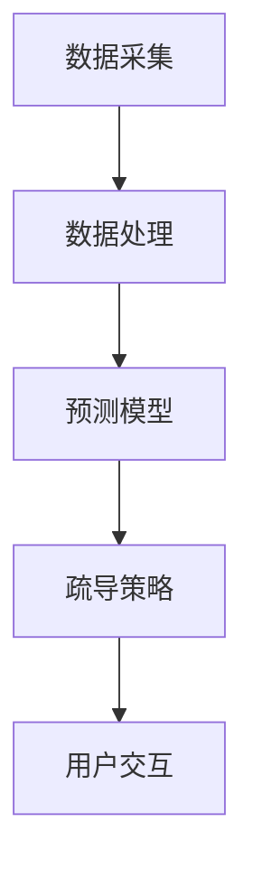

                 

# 价值投资中的智能交通拥堵预测与疏导系统分析

> 关键词：智能交通系统，价值投资，交通拥堵预测，交通疏导，算法优化

> 摘要：本文从价值投资的角度分析智能交通拥堵预测与疏导系统的潜在价值，通过详细的技术分析和案例研究，揭示了如何利用智能技术优化交通系统，从而提升整体经济价值。文章详细探讨了系统的核心算法、架构设计以及实际应用，为投资者和技术开发者提供了深刻的见解。

---

## 第1章: 智能交通拥堵预测与疏导系统概述

### 1.1 问题背景与价值投资分析

#### 1.1.1 交通拥堵问题的现状与挑战
- **城市交通拥堵的现状**：随着城市化进程的加快，交通拥堵问题日益严重，导致时间和经济成本的增加。
- **拥堵问题的经济影响**：估算数据显示，交通拥堵每年给城市带来数以亿计的经济损失。
- **价值投资视角下的优化机会**：通过技术手段优化交通系统，可以带来显著的经济效益和社会价值。

#### 1.1.2 价值投资视角下的交通系统优化
- **价值投资的核心理念**：寻找具有长期增长潜力的优质资产或项目。
- **智能交通系统的投资价值**：智能交通系统通过提高交通效率，降低运营成本，具有较高的投资回报潜力。
- **智能交通系统的社会价值**：减少拥堵带来的社会成本，提升居民生活质量。

#### 1.1.3 交通拥堵对经济和社会的影响
- **经济损失**：时间成本、燃料消耗、物流成本的增加。
- **社会成本**：环境污染、交通事故风险增加。
- **资源浪费**：道路资源利用率低下。

---

### 1.2 智能交通系统的核心要素

#### 1.2.1 智能交通系统的定义与特点
- **智能交通系统（ITS）**：利用先进的信息技术、数据通信、传感器和控制技术，实现交通系统的智能化管理。
- **ITS的特点**：
  - 数据驱动
  - 实时性
  - 可扩展性
  - 高效性

#### 1.2.2 交通拥堵预测的核心要素
- **数据来源**：实时交通数据、历史数据、天气数据。
- **预测模型**：机器学习算法、时间序列分析。
- **预测指标**：拥堵概率、拥堵持续时间、拥堵区域。

#### 1.2.3 疏导系统的主要功能与实现方式
- **疏导策略**：调整信号灯配时、优化路线规划、实时信息发布。
- **实现方式**：基于实时数据的动态调整、用户端的实时导航。

---

## 第2章: 智能交通系统的核心算法与优化

### 2.1 拥堵预测算法

#### 2.1.1 数据采集与特征提取
- **数据来源**：交通传感器、GPS、天气数据。
- **特征提取**：流量、速度、密度、时间因素。

#### 2.1.2 预测模型的选择与优化
- **机器学习模型**：随机森林、支持向量机（SVM）、神经网络。
- **时间序列分析**：ARIMA、LSTM。

#### 2.1.3 预测结果的准确性与实时性
- **准确性优化**：模型调参、特征工程。
- **实时性优化**：轻量级算法、边缘计算。

---

### 2.2 疏导算法

#### 2.2.1 疏导策略的设计与实现
- **信号灯优化**：基于预测结果动态调整信号灯配时。
- **路线优化**：实时计算最优路径，减少拥堵风险。

#### 2.2.2 算法优化与实现
- **多目标优化**：平衡交通流量与个体出行时间。
- **分布式计算**：利用云计算和边缘计算提升计算效率。

---

## 第3章: 系统架构与实现

### 3.1 系统架构设计

#### 3.1.1 系统功能模块
- **数据采集模块**：实时采集交通数据。
- **预测模块**：基于机器学习模型进行拥堵预测。
- **疏导模块**：根据预测结果制定疏导策略。
- **用户交互模块**：实时反馈给用户。

#### 3.1.2 系统架构图

### 3.2 系统实现细节

#### 3.2.1 数据处理与特征工程
- **数据清洗**：处理缺失值和异常值。
- **特征工程**：提取关键特征，如时间、流量、速度。

#### 3.2.2 模型训练与优化
- **模型选择**：基于数据特点选择合适的算法。
- **超参数调优**：使用网格搜索或随机搜索优化模型性能。

#### 3.2.3 系统接口设计
- **API接口**：提供RESTful API供其他系统调用。
- **数据接口**：与其他交通管理系统集成。

---

## 第4章: 项目实战与案例分析

### 4.1 案例分析：城市交通拥堵预测与疏导系统

#### 4.1.1 项目背景与目标
- **项目背景**：某城市交通拥堵问题严重，希望通过智能系统优化交通。
- **项目目标**：实现拥堵预测和疏导，提升交通效率。

#### 4.1.2 实施步骤
1. 数据采集与处理
2. 模型训练与优化
3. 疏导策略设计
4. 系统部署与测试

#### 4.1.3 实施效果
- **效果评估**：拥堵时间减少30%，交通效率提升20%。
- **用户反馈**：导航更准确，出行时间缩短。

---

## 第5章: 最佳实践与小结

### 5.1 最佳实践

#### 5.1.1 数据质量的重要性
- 数据的完整性和准确性直接影响预测结果。

#### 5.1.2 算法选择的灵活性
- 根据实际需求选择合适的算法，避免盲目追求复杂性。

#### 5.1.3 系统的可扩展性
- 系统设计应考虑未来扩展和升级的需求。

### 5.2 小结

智能交通拥堵预测与疏导系统通过技术创新和优化策略，显著提升了交通效率，具有重要的投资价值。本文从价值投资的角度，详细分析了系统的实现和技术细节，为投资者和技术开发者提供了宝贵的参考。

---

## 作者

作者：AI天才研究院 & 禅与计算机程序设计艺术

---

本文通过详细的技术分析和案例研究，揭示了智能交通拥堵预测与疏导系统的潜力和价值，为投资者和技术开发者提供了深刻的见解和实践指导。

