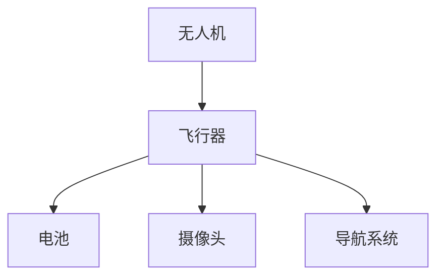
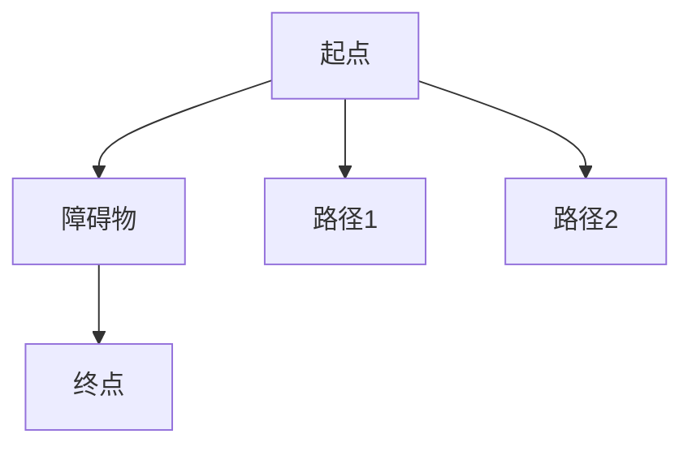

                 


# 价值投资中的智能交通无人机配送系统分析

---

## 关键词  
智能交通、无人机配送、价值投资、物流系统、投资分析、无人机技术、路径优化

---

## 摘要  
本文从价值投资的角度，系统分析智能交通无人机配送系统的技术原理、市场潜力和投资价值。文章首先介绍无人机配送系统的发展背景及其在智能交通中的应用前景，然后深入分析系统的硬件与软件架构、通信与数据处理技术，探讨无人机配送系统的成本与收益模型。接着，文章提出基于路径优化的系统优化策略，并通过数学模型和实际案例分析验证其可行性。最后，本文总结无人机配送系统的投资价值，并展望未来的发展方向。

---

## 第1章 智能交通无人机配送系统的发展背景

### 1.1 无人机配送系统的概念与特点  
无人机配送系统是一种利用无人机进行物品配送的智能物流系统。其核心特点包括：  
1. **自动化**：无人机能够自动完成任务规划、路径导航和配送。  
2. **高效性**：无人机配送速度快，尤其适用于偏远地区或紧急配送场景。  
3. **灵活性**：无人机可以在复杂地形中灵活飞行，适应多种配送需求。  
4. **低成本**：相比传统物流，无人机配送可以降低人工和运输成本。  

#### 1.1.1 无人机配送系统的应用场景  
无人机配送系统广泛应用于以下场景：  
- **偏远地区物流**：解决偏远地区物流难题。  
- **城市短途配送**：在城市中提供快速、便捷的配送服务。  
- **应急物资运输**：在灾害救援等紧急情况下快速运输物资。  

#### 1.1.2 智能交通系统中的无人机配送  
智能交通系统（ITS）通过整合无人机配送技术，可以实现交通资源的优化配置。无人机配送系统与智能交通系统的结合，能够提高物流效率，减少交通拥堵。

### 1.2 无人机配送系统的价值投资分析  
价值投资的核心在于识别具有长期增长潜力的项目。无人机配送系统的市场潜力巨大，尤其是在物流效率和成本控制方面具有显著优势。

#### 1.2.1 无人机配送系统的市场潜力  
根据市场研究机构的预测，全球无人机配送市场规模将快速增长，年复合增长率预计超过30%。这主要得益于无人机技术的成熟和物流行业对高效配送的需求。

#### 1.2.2 无人机配送系统的成本优势  
与传统物流相比，无人机配送系统的硬件成本和运营成本相对较低。特别是在偏远地区，无人机配送可以显著降低物流成本。

#### 1.2.3 无人机配送系统的投资回报  
无人机配送系统的投资回报周期短，且回报率高。通过优化路径规划和降低运营成本，可以进一步提高投资回报率。

---

## 第2章 无人机配送系统的技术分析

### 2.1 系统硬件构成  
无人机配送系统的硬件主要包括：  
1. **无人机**：包括飞行器、电池、摄像头等。  
2. **导航系统**：GPS、惯性导航等。  
3. **通信设备**：无线电通信模块。  

#### 2.1.1 无人机的硬件组成  
无人机的硬件组成可以用以下mermaid图表示：



### 2.2 系统软件架构  
无人机配送系统的软件架构包括任务调度、路径规划和数据处理三个部分。

#### 2.2.1 系统控制算法  
系统控制算法是无人机配送的核心。常用算法包括：  
1. **路径规划算法**：如A*算法和Dijkstra算法。  
2. **任务调度算法**：如贪心算法和动态规划算法。  

#### 2.2.2 路径规划算法  
路径规划算法可以通过以下mermaid图表示：



### 2.3 无人机配送系统的通信与数据处理  
无人机配送系统的通信与数据处理是确保系统高效运行的关键。

#### 2.3.1 无人机与地面站的通信协议  
无人机与地面站的通信协议可以用以下表格表示：

| 通信模块 | 描述                     |  
|----------|--------------------------|  
| 无线电通信 | 无人机与地面站的无线通信模块 |  
| 数据传输 | 数据的加密与传输模块    |  

---

## 第3章 无人机配送系统的价值评估模型

### 3.1 价值评估模型的构建  
价值评估模型是基于无人机配送系统的成本和收益进行分析。

#### 3.1.1 成本分析  
无人机配送系统的成本主要包括硬件成本、软件开发成本和运营成本。

#### 3.1.2 收益预测  
收益预测基于无人机配送系统的市场占有率和单次配送的收益。

### 3.2 成本与收益分析  
通过构建数学模型，可以对无人机配送系统的成本和收益进行定量分析。

#### 3.2.1 数学模型  
收益公式：  
$$收益 = 单次收益 \times 配送次数$$  

成本公式：  
$$成本 = 硬件成本 + 软件开发成本 + 运营成本$$  

### 3.3 投资回报分析  
通过分析投资回报周期和净现值，可以评估无人机配送系统的投资价值。

---

## 第4章 无人机配送系统的优化策略

### 4.1 系统优化的目标  
系统优化的目标是提高配送效率和降低运营成本。

#### 4.1.1 路径优化  
路径优化是无人机配送系统的核心优化策略。通过数学模型和算法实现路径优化。

#### 4.1.2 成本控制  
成本控制是通过优化硬件和软件设计，降低系统整体成本。

---

## 第5章 无人机配送系统的项目实战

### 5.1 项目环境搭建  
项目环境包括无人机硬件、地面站和通信设备的搭建。

#### 5.1.1 硬件安装  
无人机硬件的安装需要按照说明书进行。

#### 5.1.2 软件开发  
软件开发包括任务调度、路径规划和数据处理模块的开发。

### 5.2 核心代码实现  
以下是无人机配送系统的路径规划算法实现代码：

```python
import math

def a_star(start, end, obstacles):
    # 初始化开放列表和闭合列表
    open_list = []
    closed_list = []
    # 起点加入开放列表
    start_node = Node(start)
    start_node.g = 0
    start_node.h = 0
    start_node.f = 0
    heapq.heappush(open_list, (start_node.f, start_node))
    
    while open_list:
        current_node = heapq.heappop(open_list)
        if current_node.pos == end:
            return reconstruct_path(current_node)
        for neighbor in neighbors(current_node):
            if neighbor in closed_list:
                continue
            new_node = Node(neighbor)
            new_node.g = current_node.g + distance(current_node.pos, new_node.pos)
            new_node.h = heuristic(new_node.pos, end)
            new_node.f = new_node.g + new_node.h
            heapq.heappush(open_list, (new_node.f, new_node))
            closed_list.append(current_node)
    return None
```

### 5.3 项目测试与优化  
项目测试包括路径规划测试、通信测试和整体性能测试。

---

## 第6章 总结与展望

### 6.1 本章总结  
本文从价值投资的角度，系统分析了智能交通无人机配送系统的技术原理和市场潜力。通过构建价值评估模型和优化策略，验证了无人机配送系统的投资价值。

### 6.2 未来展望  
未来，随着无人机技术的进一步发展，无人机配送系统将在物流、应急救援等领域发挥更大的作用。同时，人工智能和大数据技术的结合将为无人机配送系统带来更多的创新机遇。

---

## 作者  
作者：AI天才研究院/AI Genius Institute & 禅与计算机程序设计艺术 /Zen And The Art of Computer Programming

