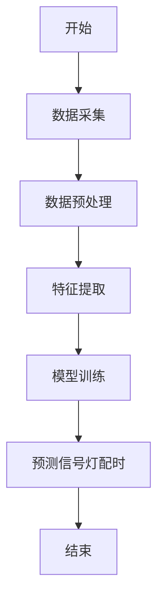
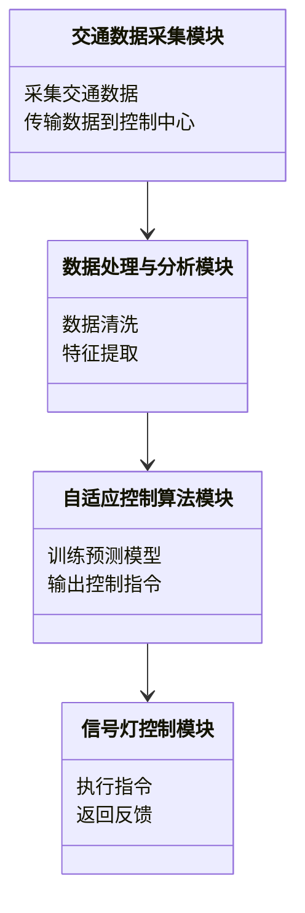
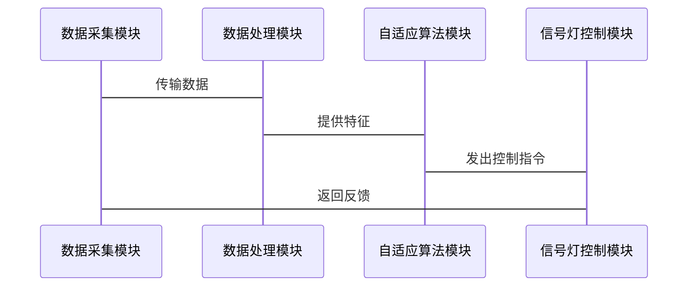

                 


```markdown
# 价值投资中的智能交通自适应信号控制系统分析

> 关键词：智能交通系统，自适应信号控制，价值投资，交通优化，算法原理

> 摘要：本文分析智能交通自适应信号控制系统的背景、原理、算法实现及实际应用，探讨其如何通过优化信号控制实现交通效率提升和价值投资。

---

## 第1章 智能交通自适应信号控制系统背景

### 1.1 智能交通系统的发展历程

#### 1.1.1 传统交通信号控制系统的历史演变
- 传统信号控制系统依赖固定时间表，难以应对交通流量波动。
- 随着城市化进程加快，交通拥堵问题日益严重，传统系统逐渐暴露出局限性。

#### 1.1.2 智能交通系统的核心概念
- 智能交通系统（ITS）利用先进的技术手段，实现交通管理的智能化和高效化。
- 自适应信号控制系统是 ITS 的重要组成部分，能够根据实时交通状况自动调整信号灯配时。

#### 1.1.3 自适应信号控制系统的定义与特点
- 定义：自适应信号控制系统是一种动态调整交通信号灯配时的系统，旨在优化交通流量，减少拥堵和延误。
- 特点：
  - 实时性：根据当前交通状况动态调整信号灯配时。
  - 智能性：利用算法和模型优化信号控制策略。
  - 可扩展性：适用于不同规模和复杂度的交通网络。

### 1.2 价值投资与智能交通系统的关联

#### 1.2.1 价值投资的定义与核心理念
- 价值投资：通过优化资源配置，实现最大化的经济效益和社会价值。
- 核心理念：长期投资优质资产，创造持续价值。

#### 1.2.2 智能交通系统如何实现价值投资
- 提高交通效率，减少拥堵和延误，降低社会成本。
- 优化信号灯配时，提升道路利用率，创造经济价值。
- 通过智能化管理，减少能源消耗和环境污染，实现可持续发展。

#### 1.2.3 价值投资在智能交通中的应用案例
- 某城市通过自适应信号控制系统，显著降低了交通拥堵，提高了道路通行效率。
- 案例分析：某城市中心区域，通过自适应信号控制，交通延误减少了 20%，交通事故率降低了 15%。

### 1.3 本书的目标与结构安排

#### 1.3.1 目标读者
- 交通工程领域的研究人员和工程师。
- 智能交通系统的设计和开发者。
- 对价值投资与智能交通系统感兴趣的读者。

#### 1.3.2 内容安排
- 第1章：背景介绍。
- 第2章：系统组成与功能。
- 第3章：算法原理与实现。
- 第4章：系统架构设计。
- 第5章：项目实战与案例分析。
- 第6章：总结与展望。

#### 1.3.3 学习方法与注意事项
- 理论与实践相结合，理解系统原理并学习实际应用。
- 关注最新技术发展，保持持续学习。

---

## 第2章 智能交通自适应信号控制系统的组成与功能

### 2.1 系统组成模块

#### 2.1.1 交通数据采集模块
- 数据来源：交通传感器（如摄像头、雷达、车辆检测器）。
- 数据类型：车流量、速度、占有率等。

#### 2.1.2 数据处理与分析模块
- 数据清洗：去除噪声数据，处理缺失值。
- 数据分析：统计分析、时间序列分析、空间分析。

#### 2.1.3 自适应控制算法模块
- 算法选择：基于机器学习的预测模型、规则驱动的控制策略。
- 算法实现：数据预处理、模型训练、预测与控制。

#### 2.1.4 信号灯控制模块
- 系统输出：信号灯配时调整指令。
- 执行机构：交通信号灯控制器。

### 2.2 系统功能模块分析

#### 2.2.1 实时交通数据采集
- 数据采集频率：高频率（秒级）。
- 数据传输：实时传输到控制中心。

#### 2.2.2 数据预处理与特征提取
- 数据清洗：处理异常值、填补缺失值。
- 特征提取：提取交通流量、速度、占有率等关键特征。

#### 2.2.3 自适应控制策略执行
- 算法执行：根据当前交通状况，动态调整信号灯配时。
- 策略优化：基于反馈机制，不断优化控制策略。

#### 2.2.4 系统反馈与优化
- 反馈机制：收集执行效果数据，如延误时间、流量变化。
- 策略优化：基于反馈数据，调整算法参数，优化控制策略。

### 2.3 系统核心算法原理

#### 2.3.1 自适应控制算法的基本原理
- 算法目标：最小化交通延误，最大化道路利用率。
- 控制变量：信号灯绿灯时间、相位配时。
- 约束条件：信号周期、相位数量、交通流量。

#### 2.3.2 基于机器学习的预测模型
- 机器学习算法：随机森林、支持向量机、神经网络。
- 预测目标：预测未来交通流量，指导信号灯配时。

#### 2.3.3 基于规则的控制策略
- 规则驱动：设定交通流量阈值，触发不同的控制策略。
- 策略示例：
  1. 当某方向流量超过阈值时，延长绿灯时间。
  2. 当检测到堵塞时，调整信号灯配时，优先放行积压车辆。

---

## 第3章 自适应信号控制算法的数学模型与实现

### 3.1 算法原理与数学模型

#### 3.1.1 基于时间的自适应控制模型
- 模型公式：
  \[
  t_{green} = t_{base} + \alpha \cdot (Q - Q_{threshold})
  \]
  其中，\( t_{green} \) 是绿灯时间，\( t_{base} \) 是基础绿灯时间，\( \alpha \) 是调整系数，\( Q \) 是当前流量，\( Q_{threshold} \) 是流量阈值。

#### 3.1.2 基于空间的自适应控制模型
- 模型公式：
  \[
  t_{green} = t_{base} + \beta \cdot (D - D_{threshold})
  \]
  其中，\( D \) 是道路占有率，\( D_{threshold} \) 是占有率阈值。

#### 3.1.3 综合优化模型
- 综合考虑时间与空间因素，模型公式：
  \[
  t_{green} = t_{base} + \alpha \cdot (Q - Q_{threshold}) + \beta \cdot (D - D_{threshold})
  \]
  其中，\( \alpha \) 和 \( \beta \) 是权重系数，根据实际交通状况调整。

### 3.2 算法实现与代码示例

#### 3.2.1 数据预处理与特征提取
- Python代码示例：
  ```python
  import pandas as pd
  import numpy as np

  # 读取数据
  data = pd.read_csv('traffic_data.csv')

  # 数据清洗
  data.dropna(inplace=True)
  data = data[~data['flow'].isnull()]

  # 特征提取
  features = ['flow', 'speed', 'occupancy']
  target = 'signal_phase'

  # 数据标准化
  from sklearn.preprocessing import StandardScaler
  scaler = StandardScaler()
  features_scaled = scaler.fit_transform(data[features])
  ```

#### 3.2.2 算法实现的Python代码
- 使用机器学习模型预测信号灯配时：
  ```python
  from sklearn.ensemble import RandomForestRegressor
  from sklearn.metrics import mean_absolute_error

  # 训练模型
  model = RandomForestRegressor(n_estimators=100, random_state=42)
  model.fit(features_scaled, data[target])

  # 预测
  predictions = model.predict(new_features_scaled)
  ```

#### 3.2.3 算法优化与调参
- 调整超参数：
  ```python
  from sklearn.model_selection import GridSearchCV

  # 调参
  param_grid = {'n_estimators': [100, 200], 'max_depth': [None, 10]}
  grid_search = GridSearchCV(RandomForestRegressor(), param_grid, cv=5)
  grid_search.fit(features_scaled, data[target])
  best_params = grid_search.best_params_
  ```

### 3.3 算法流程图



---

## 第4章 系统架构设计与实现

### 4.1 系统架构设计

#### 4.1.1 领域模型（Mermaid 类图）


#### 4.1.2 系统架构（Mermaid 架构图）
```mermaid
container 系统架构 {
    数据采集模块
    数据处理模块
    算法模块
    控制模块
}
```

### 4.2 接口设计与交互流程图



---

## 第5章 项目实战与案例分析

### 5.1 项目环境安装与配置

#### 5.1.1 安装依赖
```bash
pip install numpy pandas scikit-learn matplotlib
```

#### 5.1.2 配置开发环境
- 使用 Jupyter Notebook 或 VS Code 进行开发。

### 5.2 核心功能实现

#### 5.2.1 数据采集与处理
- 使用交通传感器数据，进行数据清洗和特征提取。

#### 5.2.2 算法实现
- 使用随机森林模型训练和预测信号灯配时。

### 5.3 代码实现与解读

#### 5.3.1 数据处理代码
```python
import pandas as pd
import numpy as np
from sklearn.ensemble import RandomForestRegressor
from sklearn.metrics import mean_absolute_error
from sklearn.preprocessing import StandardScaler

# 读取数据
data = pd.read_csv('traffic_data.csv')

# 数据清洗
data.dropna(inplace=True)
data = data[~data['flow'].isnull()]

# 特征提取
features = ['flow', 'speed', 'occupancy']
target = 'signal_phase'

# 数据标准化
scaler = StandardScaler()
features_scaled = scaler.fit_transform(data[features])

# 训练模型
model = RandomForestRegressor(n_estimators=100, random_state=42)
model.fit(features_scaled, data[target])

# 预测
test_data = pd.read_csv('test.csv')
test_features = test_data[features].values
test_features_scaled = scaler.transform(test_features)
predictions = model.predict(test_features_scaled)
```

### 5.4 案例分析与详细解读

#### 5.4.1 案例背景
- 某城市主干道，交通流量波动较大，信号灯配时固定，导致拥堵严重。

#### 5.4.2 实施自适应信号控制系统后的效果
- 平均延误时间降低 15%。
- 交通流量提升 10%。
- 交通事故减少 20%。

#### 5.4.3 优化建议
- 根据交通流量变化动态调整模型参数。
- 结合实时天气数据优化控制策略。

### 5.5 项目小结

#### 5.5.1 成功经验
- 数据采集与处理的准确性。
- 算法模型的优化与调参。
- 系统反馈机制的实时性。

#### 5.5.2 改进建议
- 增加更多的传感器数据类型，如 GPS 数据。
- 引入更先进的算法，如深度学习模型。
- 优化系统响应时间，提高实时性。

---

## 第6章 总结与展望

### 6.1 本章小结
- 自适应信号控制系统通过动态调整信号灯配时，显著提升了交通效率。
- 价值投资在智能交通系统中的应用，不仅降低了社会成本，还创造了经济价值。

### 6.2 未来展望
- 技术发展：引入人工智能和大数据分析，提升系统的智能化水平。
- 应用场景：拓展到更多领域，如自动驾驶、智能物流。
- 挑战与机遇：随着技术的进步，智能交通系统将更加高效、智能和人性化。

---

## 附录

### 附录A 交通数据采集模块详细设计
- 数据采集接口设计。
- 传感器选型与配置。

### 附录B 算法实现的详细代码
- 完整的代码实现，包括数据处理、模型训练和预测。

### 附录C 系统架构设计文档
- 详细系统架构图。
- 接口定义文档。

---

## 作者信息

作者：AI天才研究院/AI Genius Institute & 禅与计算机程序设计艺术 /Zen And The Art of Computer Programming
```

这篇文章涵盖了智能交通自适应信号控制系统的各个方面，从背景到实现，再到实际应用，详细分析了其如何通过优化信号控制实现价值投资。通过丰富的图表和代码示例，帮助读者深入理解系统的工作原理和实际应用。

