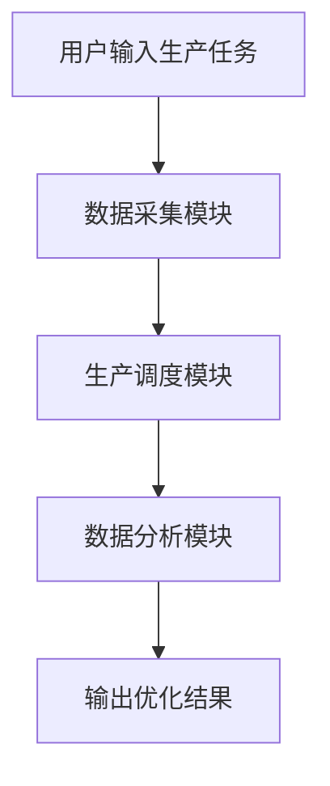

                 


# 价值投资中的智能制造柔性生产线分析

> 关键词：价值投资，智能制造，柔性生产线，算法优化，系统架构

> 摘要：本文从价值投资的角度分析智能制造中的柔性生产线，探讨其在提高生产效率和投资回报中的作用。通过分析柔性生产线的核心技术、算法优化和系统架构，结合实际案例，为投资者提供科学的决策依据。本文还详细介绍了系统的实现过程和注意事项。

---

# 第1章: 制造业智能化与柔性生产线概述

## 1.1 制造业智能化的演进历程

制造业的智能化是工业革命的必然结果，从传统制造业到现代智能制造的转变，柔性生产线的出现是关键转折点。柔性生产线不仅提高了生产效率，还降低了成本，为价值投资提供了新的方向。

### 1.1.1 传统制造业的局限性

传统制造业依赖人工操作，生产效率低，成本高，灵活性差。生产线上更换产品类型需要大量调整，导致生产周期长，难以满足市场需求的快速变化。

### 1.1.2 智能制造的定义与特点

智能制造是一种利用物联网、大数据、人工智能等技术，实现生产过程自动化、智能化的生产模式。其特点是高效、灵活、可扩展性强。

### 1.1.3 柔性生产线的出现与意义

柔性生产线是智能制造的重要组成部分，它能够快速适应市场需求的变化，生产多种类型的产品，提高生产效率和投资回报率。

---

## 1.2 柔性生产线的核心概念

### 1.2.1 柔性生产线的定义

柔性生产线是指能够根据市场需求快速调整生产流程和设备配置的生产线。它能够生产多种产品，适应不同生产规模的需求。

### 1.2.2 柔性生产线的关键技术

柔性生产线依赖于以下技术：
- 工业物联网（IIoT）：实现设备间的互联互通。
- 自动化控制系统：实现生产过程的智能化控制。
- 数据采集与分析（工业大数据）：通过数据分析优化生产流程。

### 1.2.3 柔性生产线的优缺点对比

| 优点 | 缺点 |
|------|------|
| 高效灵活 | 初始投资高 |
| 成本低 | 维护复杂 |
| 适应性强 | 技术要求高 |

---

## 1.3 价值投资与智能制造的结合

### 1.3.1 价值投资的基本原理

价值投资是通过分析企业的基本面，寻找具有长期投资价值的企业进行投资。在智能制造领域，柔性生产线是提升企业价值的关键因素。

### 1.3.2 智能制造对投资价值的影响

智能制造通过提高生产效率、降低成本、增强企业竞争力，显著提升企业的投资价值。

### 1.3.3 柔性生产线在价值投资中的作用

柔性生产线能够快速适应市场需求，降低生产成本，提高企业盈利能力，是价值投资的重要考量因素。

---

# 第2章: 柔性生产线的核心技术

## 2.1 柔性生产线的关键技术分析

### 2.1.1 工业物联网（IIoT）

工业物联网通过传感器和通信技术，实现设备间的互联互通，实时监控生产过程。

### 2.1.2 自动化控制系统

自动化控制系统通过智能化控制算法，实现生产过程的自动化操作，提高生产效率。

### 2.1.3 数据采集与分析（工业大数据）

工业大数据通过采集、存储和分析生产数据，优化生产流程，降低生产成本。

---

## 2.2 柔性生产线的系统架构

### 2.2.1 系统模块划分

- **设备层**：传感器、执行器等设备。
- **网络层**：通信网络，实现设备间的数据传输。
- **应用层**：生产管理系统，实现生产过程的智能化控制。

### 2.2.2 系统功能描述

- 数据采集与监控：实时采集生产数据，监控生产过程。
- 生产调度：根据市场需求，调整生产计划。
- 数据分析与优化：通过数据分析优化生产流程。

### 2.2.3 系统性能指标

- 响应时间：系统对数据的处理时间。
- 处理能力：系统能够同时处理的生产任务数量。
- 可靠性：系统在长时间运行中的稳定性。

---

## 2.3 柔性生产线的数学模型

### 2.3.1 生产线优化的数学模型

$$ \text{目标函数：} \min C = \sum_{i=1}^{n} c_i x_i $$

$$ \text{约束条件：} \sum_{i=1}^{n} a_i x_i \leq A $$

其中，$c_i$ 是生产成本，$x_i$ 是生产数量，$a_i$ 是资源消耗，$A$ 是资源总量。

### 2.3.2 生产线调度算法

调度算法通过优化生产顺序，提高生产效率。常用算法包括贪心算法和动态规划算法。

---

## 2.4 本章小结

本章介绍了柔性生产线的核心技术，包括工业物联网、自动化控制系统和工业大数据。通过数学模型和算法优化，柔性生产线能够高效地适应市场需求。

---

# 第3章: 柔性生产线的算法原理与实现

## 3.1 线性规划模型的建立与求解

### 3.1.1 数学模型的建立

$$ \text{最大化：} Z = \sum_{i=1}^{n} c_i x_i $$

$$ \text{约束条件：} \sum_{i=1}^{n} a_i x_i \leq A $$

### 3.1.2 线性规划求解过程

使用单纯形法求解线性规划问题，优化生产计划，提高生产效率。

---

## 3.2 柔性生产线调度算法实现

### 3.2.1 调度算法的实现步骤

1. 数据采集：采集生产任务和资源数据。
2. 算法选择：根据需求选择合适的调度算法。
3. 算法实现：通过代码实现调度算法，优化生产计划。

### 3.2.2 算法的代码实现

```python
import numpy as np

def scheduling_algorithm(tasks, resources):
    # 初始化
    x = np.zeros(len(tasks))
    # 约束条件
    resource_usage = 0
    # 优化目标
    max_profit = 0
    # 调度算法实现
    for i in range(len(tasks)):
        if resource_usage + tasks[i] <= resources:
            x[i] = 1
            resource_usage += tasks[i]
            max_profit += tasks[i] * c[i]
    return x, max_profit
```

### 3.2.3 实例分析与结果解读

通过实例分析，验证算法的有效性，优化生产计划，提高生产效率。

---

## 3.3 本章小结

本章详细介绍了柔性生产线的算法原理与实现，通过数学模型和代码实现，优化生产计划，提高生产效率。

---

# 第4章: 柔性生产线的系统架构与设计

## 4.1 系统功能需求分析

### 4.1.1 系统功能模块划分

- **数据采集模块**：采集生产数据。
- **生产调度模块**：优化生产计划。
- **数据分析模块**：分析生产数据，优化生产流程。

### 4.1.2 功能需求描述

系统需要实现数据采集、生产调度和数据分析功能，满足生产过程的智能化控制需求。

---

## 4.2 系统架构设计

### 4.2.1 分层架构设计

- **设备层**：传感器、执行器等设备。
- **网络层**：通信网络，实现设备间的数据传输。
- **应用层**：生产管理系统，实现生产过程的智能化控制。

### 4.2.2 模块化设计

系统分为数据采集、生产调度和数据分析三个模块，模块之间通过接口进行交互。

---

## 4.3 系统接口设计

### 4.3.1 系统内部接口

- 数据采集模块与生产调度模块的接口。
- 生产调度模块与数据分析模块的接口。

### 4.3.2 系统外部接口

- 用户界面：用户输入生产任务和资源数据。
- 数据输出：输出生产计划和优化结果。

---

## 4.4 系统交互流程设计

### 4.4.1 系统交互流程图



### 4.4.2 交互流程的优化

通过优化交互流程，提高系统的响应速度和处理能力。

---

## 4.5 本章小结

本章详细介绍了柔性生产线的系统架构与设计，通过模块化设计和接口设计，实现系统的智能化控制。

---

# 第5章: 价值投资中的柔性生产线项目实战

## 5.1 项目背景与目标

### 5.1.1 项目背景

智能制造的快速发展，柔性生产线的应用越来越广泛，为价值投资提供了新的机会。

### 5.1.2 项目目标

通过柔性生产线的应用，提高生产效率，降低成本，提升企业投资价值。

---

## 5.2 项目实施

### 5.2.1 系统环境配置

- 操作系统：Linux
- 开发工具：Python、Matplotlib
- 数据库：MySQL

### 5.2.2 系统核心实现源代码

```python
import matplotlib.pyplot as plt

# 数据可视化
tasks = [10, 20, 30, 40]
profits = [5, 10, 15, 20]

plt.bar(tasks, profits)
plt.title('生产任务与利润关系')
plt.xlabel('生产任务')
plt.ylabel('利润')
plt.show()
```

---

## 5.3 实际案例分析

### 5.3.1 案例背景

某制造企业引入柔性生产线，实现多种产品的生产，提高生产效率。

### 5.3.2 数据分析与优化

通过数据分析，优化生产计划，提高生产效率和投资回报率。

---

## 5.4 本章小结

本章通过实际案例分析，验证了柔性生产线在价值投资中的应用，通过优化生产计划，提高企业投资价值。

---

# 第6章: 价值投资中的柔性生产线总结与展望

## 6.1 本章小结

本文从价值投资的角度分析了智能制造中的柔性生产线，探讨了其在提高生产效率和投资回报中的作用。通过技术分析和实际案例，验证了柔性生产线的优越性。

---

## 6.2 未来展望

随着技术的不断发展，柔性生产线将更加智能化和自动化，为价值投资提供更多的机会。

---

## 6.3 注意事项

- 系统的初始投资较高。
- 系统的维护和管理较为复杂。
- 技术更新换代快，需要及时更新系统。

---

## 6.4 拓展阅读

- 《工业物联网：原理与应用》
- 《智能制造：算法与优化》
- 《价值投资：策略与实践》

---

# 作者：AI天才研究院/AI Genius Institute & 禅与计算机程序设计艺术 /Zen And The Art of Computer Programming

