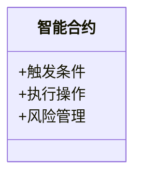
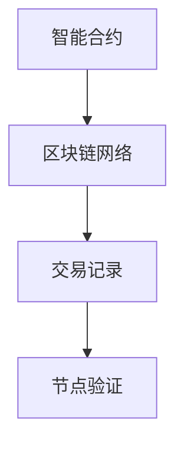

                 


# 价值投资中的智能合约应用前景

> 关键词：智能合约，价值投资，区块链，金融工具，风险管理，自动化交易，智能合约设计

> 摘要：智能合约作为区块链技术的重要组成部分，正在逐步改变金融领域的运作方式。本文从价值投资的角度出发，详细探讨智能合约的应用前景，分析其在股票投资、基金投资和风险管理中的具体应用。通过数学模型和算法原理的深入解析，结合实际案例，揭示智能合约在价值投资中的潜力和挑战。

---

## 第1章: 智能合约与价值投资概述

### 1.1 智能合约的核心概念

智能合约是一种基于区块链技术的自动化协议，用于在满足特定条件时自动执行或约束某种行为。其核心特点包括：

- **自动化执行**：智能合约在预设条件下自动触发交易或操作。
- **不可篡改性**：存储在区块链上的智能合约无法被修改或删除。
- **去中心化**：智能合约运行在去中心化的区块链网络上，避免单点故障。

### 1.2 价值投资的基本原理

价值投资是一种长期投资策略，强调以低于资产内在价值的价格购买优质资产。其核心在于对企业的深入分析和长期持有。

### 1.3 智能合约与价值投资的结合点

智能合约可以用于实现以下功能：

- **自动化投资决策**：基于预设的市场数据和条件，自动执行买卖操作。
- **风险管理**：通过智能合约设定止损和止盈机制，自动管理投资风险。
- **透明化与信任**：智能合约的不可篡改性和透明性增强了投资者的信任。

---

## 第2章: 智能合约的核心原理与数学模型

### 2.1 智能合约的执行机制

智能合约的执行机制包括以下几个步骤：

1. **触发条件**：当满足特定条件（如价格达到某个阈值）时，触发智能合约。
2. **自动执行**：智能合约根据预设规则自动执行交易或操作。
3. **不可篡改性**：所有交易记录在区块链上，确保数据的安全性和不可篡改性。

### 2.2 智能合约的区块链环境

区块链的共识机制确保了智能合约的安全性和可靠性。常见的共识机制包括：

- **工作量证明（PoW）**：通过计算哈希函数找到特定的随机数来验证区块。
- **权益证明（PoS）**：根据持币量和时间来选择验证节点。

### 2.3 智能合约的数学模型

智能合约的哈希函数是其核心数学模型之一，常用的哈希函数包括：

- **SHA-256**：一种广泛应用于区块链的哈希函数，确保数据的唯一性和完整性。
- **MD5**：另一种常用的哈希函数，用于数据的校验和。

---

## 第3章: 智能合约的算法原理

### 3.1 智能合约的自动执行流程

智能合约的执行流程可以表示为：

$$
\text{触发条件} \rightarrow \text{智能合约执行} \rightarrow \text{交易完成}
$$

### 3.2 智能合约的加密算法

加密算法是智能合约安全性的基石。常用的加密算法包括：

- **RSA**：基于大整数分解的公钥加密算法。
- **椭圆曲线加密（ECC）**：一种基于椭圆曲线数学的公钥加密算法。

### 3.3 智能合约的签名与验证

数字签名是智能合约的重要组成部分，其验证过程可以表示为：

$$
\text{签名} = \text{哈希值} \times \text{私钥}
$$

---

## 第4章: 价值投资中的智能合约应用

### 4.1 智能合约在股票投资中的应用

智能合约可以用于股票投资的自动化交易，例如：

$$
\text{价格} \geq \text{目标价} \rightarrow \text{自动买入}
$$

### 4.2 智能合约在基金投资中的应用

智能合约可以用于基金投资的自动分配和赎回，例如：

$$
\text{基金净值} \leq \text{赎回价} \rightarrow \text{自动赎回}
$$

### 4.3 智能合约在风险管理中的应用

智能合约可以用于设定止损和止盈机制，例如：

$$
\text{价格} \leq \text{止损价} \rightarrow \text{自动卖出}
$$

---

## 第5章: 智能合约的系统分析与架构设计

### 5.1 智能合约的系统功能设计

智能合约的系统功能设计包括：

- **触发条件**：价格、时间等。
- **执行操作**：买入、卖出等。
- **风险管理**：止损、止盈等。

### 5.2 智能合约的领域模型设计

领域模型设计可以表示为：



### 5.3 智能合约的系统架构设计

系统架构设计可以表示为：



---

## 第6章: 项目实战

### 6.1 环境安装

安装Solidity编译器和以太坊节点：

```bash
npm install -g solc
```

### 6.2 核心实现源代码

以下是一个简单的智能合约代码：

```solidity
// SPDX-License-Identifier: MIT
pragma solidity ^0.8.0;

contract ValueInvestment {
    uint256 public targetPrice = 100;

    function buy() public {
        require(msg.value >= targetPrice, "Insufficient funds");
        // 自动买入逻辑
    }

    function sell() public {
        // 自动卖出逻辑
    }
}
```

### 6.3 代码解读与分析

- `targetPrice`：目标价格。
- `buy`函数：检查资金是否足够，如果足够则执行买入操作。
- `sell`函数：执行卖出操作。

### 6.4 实际案例分析

假设目标价格为100，当价格达到100时，智能合约自动执行买入操作：

$$
\text{价格} \geq 100 \rightarrow \text{自动买入}
$$

---

## 第7章: 总结与展望

### 7.1 总结

智能合约在价值投资中的应用前景广阔，可以通过自动化交易、风险管理等功能提升投资效率和安全性。

### 7.2 展望

未来，智能合约将在更多金融领域得到应用，例如跨境支付、供应链金融等。

---

## 作者信息

作者：AI天才研究院/AI Genius Institute & 禅与计算机程序设计艺术 /Zen And The Art of Computer Programming

