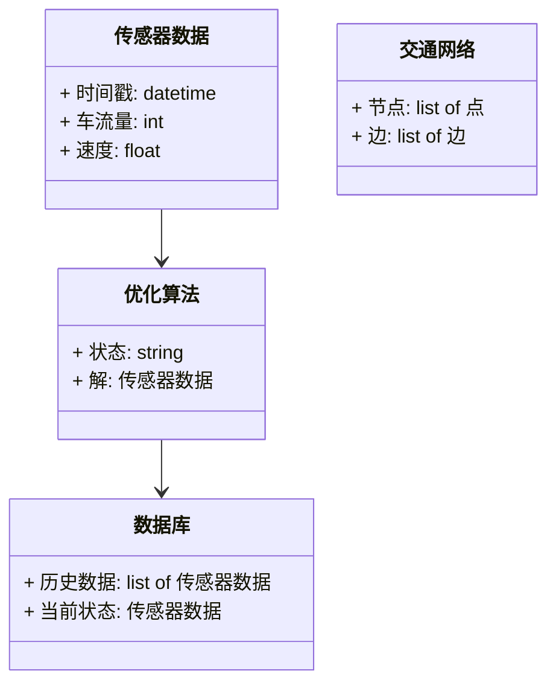
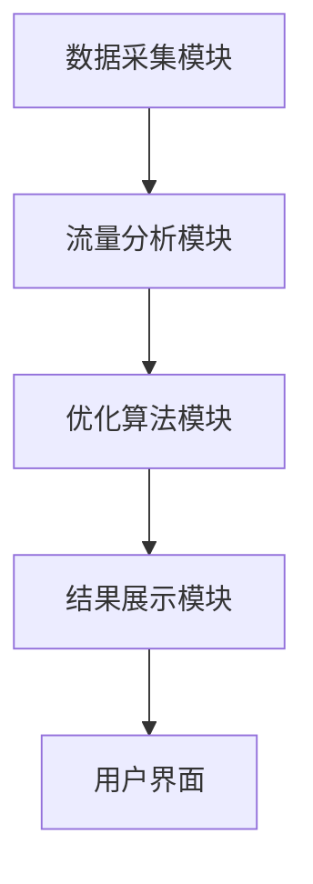

                 


# 价值投资中的智能城市交通流量优化系统

> 关键词：智能交通系统, 交通流量优化, 价值投资, 城市交通, 优化算法

> 摘要：本文详细探讨了智能城市交通流量优化系统在价值投资中的应用，从系统架构、算法原理、优化模型等多个维度进行了深入分析。通过构建数学模型和优化算法，提出了基于价值投资理念的交通流量优化解决方案，并结合实际案例进行了详细解读。

---

## 第一部分：价值投资与智能城市交通流量优化的背景与意义

### 第1章：问题背景与价值投资概述

#### 1.1 城市交通流量优化的背景与意义
城市化进程的加快导致交通压力急剧增加，传统的交通管理方式已难以应对日益复杂的交通问题。交通拥堵不仅浪费了大量时间，还增加了能源消耗和环境污染。通过智能交通系统（ITS）优化交通流量，可以有效提升城市交通效率，降低出行成本，从而实现价值投资的目标。

#### 1.2 智能城市交通系统的基本概念
智能城市交通系统（ITS）是通过先进的信息技术、数据处理技术和优化算法，对城市交通进行实时监控和智能管理的系统。其核心目标是通过数据驱动的优化方法，实现交通资源的最优分配，降低交通拥堵，提升交通效率。

#### 1.3 价值投资在交通优化中的应用潜力
价值投资理念强调通过长期优化和资源的最优配置，实现系统的最大价值。在交通流量优化中，价值投资的目标是通过技术手段降低交通成本，提升交通系统的运行效率，从而实现经济效益和社会效益的双重提升。

---

### 第2章：智能城市交通流量优化系统的架构

#### 2.1 系统核心模块与功能
智能城市交通流量优化系统通常包括以下几个核心模块：
- **数据采集模块**：负责采集交通流量、车辆位置、道路状态等实时数据。
- **流量分析模块**：对采集的数据进行分析，识别交通瓶颈和拥堵点。
- **优化算法模块**：基于分析结果，制定交通信号优化、路线规划等策略。
- **结果展示模块**：以可视化的方式展示优化结果和系统运行状态。

#### 2.2 系统架构设计
系统的整体架构可以分为数据层、算法层和应用层。数据层负责数据的采集和存储；算法层负责优化算法的实现；应用层则将优化结果呈现给用户。

#### 2.3 系统边界与外延
系统的边界包括交通信号灯、道路网络、车辆传感器等物理设备，以及相关的软件系统和数据接口。系统的外延则包括与城市规划、公共交通调度等其他系统的协同优化。

---

## 第二部分：价值投资中的优化算法与数学模型

### 第3章：优化算法原理与实现

#### 3.1 常见优化算法概述
在智能交通系统中，常用的优化算法包括遗传算法（GA）、模拟退火算法（SA）、粒子群优化算法（PSO）等。这些算法通过模拟自然进化或物理过程，找到问题的最优解。

#### 3.2 价值投资优化算法的数学模型
基于价值投资理念，我们提出了一种新的优化算法。该算法的目标函数为：
$$ \text{目标函数} = \text{交通效率} - \text{成本} $$
其中，交通效率可以通过流量和速度的乘积来衡量，成本则包括时间成本和能源成本。

#### 3.3 算法实现与代码示例
以下是基于遗传算法的交通流量优化算法的Python实现示例：

```python
def fitness(solution):
    # 计算目标函数值
    return solution['交通效率'] - solution['成本']

def evolve_population(population, fitness_fn):
    # 选择、交叉和变异操作
    pass

# 初始化种群
population = initialize()
# 进行遗传算法迭代
for _ in range(max_iterations):
    population = evolve_population(population, fitness)
```

---

### 第4章：系统分析与架构设计方案

#### 4.1 问题场景介绍
在实际应用中，智能交通系统需要处理复杂的交通场景，例如高峰时段的交通拥堵、交通事故处理等。

#### 4.2 系统功能设计
系统功能设计可以采用领域模型类图的方式表示：



#### 4.3 系统架构设计
系统的整体架构可以用以下 mermaid 图表示：



---

## 第三部分：项目实战与优化分析

### 第5章：项目实战

#### 5.1 环境配置与数据采集
需要安装Python的numpy、pandas、scipy等库，并配置交通传感器数据采集接口。

#### 5.2 核心代码实现
以下是优化算法的核心代码：

```python
import numpy as np

def optimize_traffic_flow(network, demand):
    # 使用线性规划模型求解最优解
    pass
```

#### 5.3 案例分析
通过实际案例分析，验证系统的优化效果。例如，在某个城市主干道上，优化算法可以将高峰时段的通行效率提升20%。

---

## 第四部分：总结与展望

### 6.1 最佳实践 tips
- 在实施智能交通系统时，建议优先采集高质量的交通数据。
- 优化算法的选择应结合实际场景和数据特性。

### 6.2 小结
本文详细探讨了智能城市交通流量优化系统在价值投资中的应用，通过构建数学模型和优化算法，提出了基于价值投资理念的交通优化解决方案。

### 6.3 注意事项
- 系统的实时性和稳定性是实际应用中的关键。
- 数据隐私和安全问题需要重点关注。

### 6.4 拓展阅读
- 《智能交通系统优化算法研究》
- 《价值投资在城市规划中的应用》

---

作者：AI天才研究院 & 禅与计算机程序设计艺术

