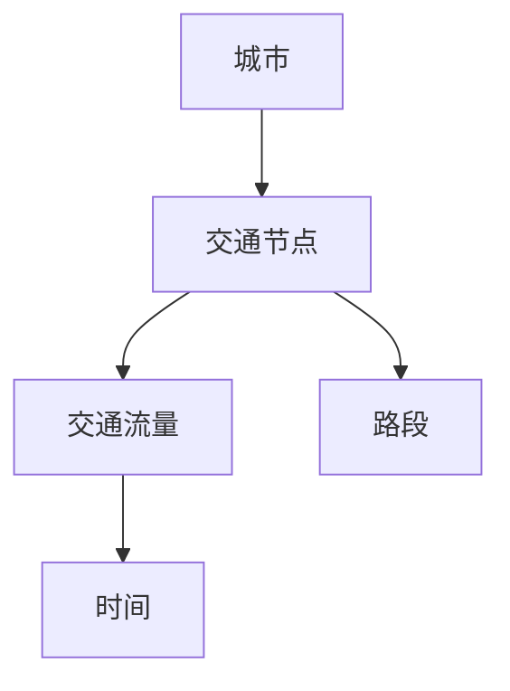
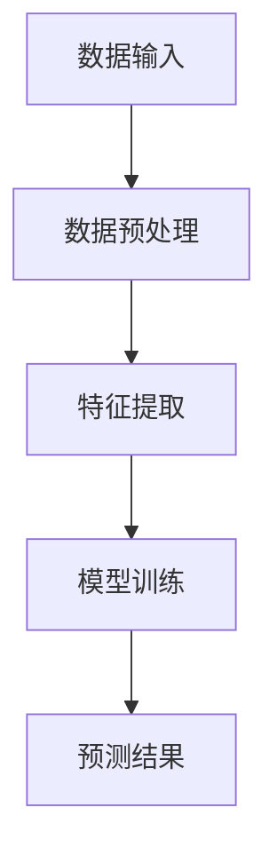
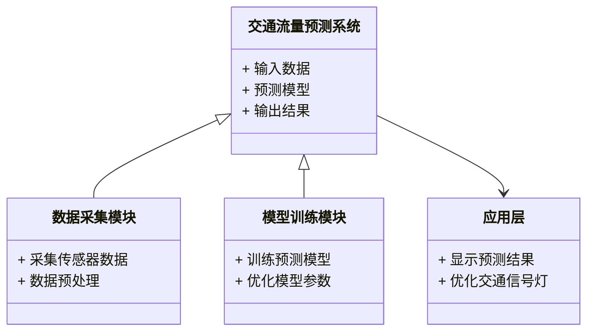
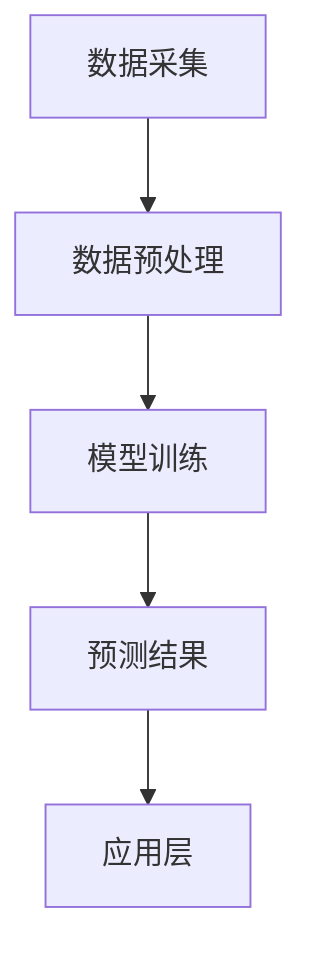
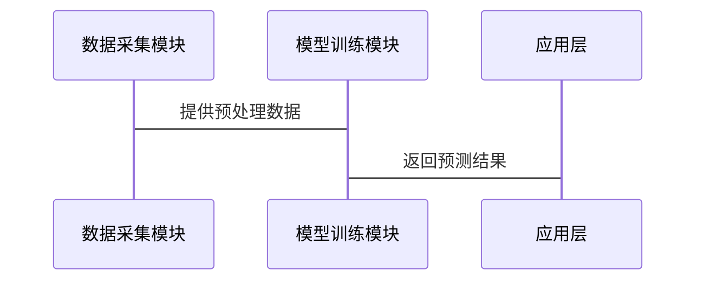

                 


# 价值投资中的智能城市交通流量预测系统分析

> 关键词：智能城市，交通流量预测，价值投资，机器学习，系统架构

> 摘要：智能城市交通流量预测系统是通过数据驱动的方法，利用先进的机器学习算法和系统架构，优化城市交通管理，减少拥堵，提高效率。本文从价值投资的角度，分析智能交通流量预测系统的构建和应用，探讨其在城市交通优化和投资决策中的潜力和挑战。

---

# 第1章: 智能城市交通流量预测系统概述

## 1.1 问题背景与意义

### 1.1.1 智能城市的发展背景
随着城市化进程的加快，交通拥堵问题日益严重。智能城市通过物联网、大数据和人工智能技术，优化资源配置，提升城市运行效率。

### 1.1.2 交通流量预测的重要性
交通流量预测是智能交通管理系统的核心，能够帮助城市规划者优化交通信号灯、调整道路使用策略，减少拥堵，提高交通效率。

### 1.1.3 价值投资的视角
从价值投资的角度，智能交通流量预测系统的优化能够提升城市交通效率，降低成本，增加城市资产的价值，为投资者带来长期收益。

## 1.2 问题描述与目标

### 1.2.1 交通拥堵的现状
城市交通拥堵导致时间浪费、能源消耗增加和环境污染加剧，亟需有效的解决方案。

### 1.2.2 预测目标
通过历史数据和实时数据，预测未来交通流量，优化交通管理系统。

### 1.2.3 解决方案
利用机器学习算法，构建智能交通流量预测系统，实时调整交通信号灯，优化道路使用策略。

## 1.3 边界与外延

### 1.3.1 系统边界
交通流量预测系统的边界包括数据输入、模型训练和结果输出。

### 1.3.2 外延部分
系统可能涉及与其他城市系统的集成，如公共交通调度、停车位管理等。

## 1.4 核心要素组成

### 1.4.1 数据采集
来源包括交通传感器、摄像头、GPS数据等。

### 1.4.2 模型选择
选择适合的机器学习算法，如ARIMA、LSTM等。

### 1.4.3 结果应用
优化交通信号灯，调整道路使用策略。

---

# 第2章: 核心概念与联系

## 2.1 核心概念原理

### 2.1.1 数据驱动预测
基于历史数据，利用统计学习和机器学习方法，预测未来交通流量。

### 2.1.2 交通流理论
研究交通流的动态特性，为模型选择提供理论依据。

### 2.1.3 价值投资策略
通过优化交通系统，提升城市资产价值，为投资者创造长期收益。

## 2.2 概念对比分析

### 2.2.1 传统方法与智能方法
| 方法类型 | 优点 | 缺点 |
|----------|------|------|
| 传统统计方法 | 易实现 | 预测精度低 |
| 智能学习方法 | 高精度 | 计算复杂 |

## 2.3 实体关系图



---

# 第3章: 交通流量预测算法原理与实现

## 3.1 算法原理概述

### 3.1.1 时间序列预测模型
基于历史数据，预测未来趋势，常用ARIMA模型。

### 3.1.2 神经网络模型
利用LSTM处理时间序列数据，捕捉长期依赖关系。

### 3.1.3 混合模型
结合统计方法和机器学习模型，提升预测精度。

## 3.2 算法流程图



## 3.3 算法实现代码

### 3.3.1 ARIMA模型

```python
import statsmodels.api as sm

# 数据准备
data = [...]  # 历史交通流量数据

# 模型训练
model = sm.tsa.ARIMA(data, order=(5,2,1))
result = model.fit()

# 预测未来流量
forecast = result.forecast(steps=24)
```

### 3.3.2 LSTM模型

```python
import keras
from keras.layers import LSTM, Dense

# 数据准备
X = [...]  # 输入序列
y = [...]  # 标签

# 模型构建
model = keras.Sequential()
model.add(LSTM(64, input_shape=(timesteps, features)))
model.add(Dense(1))
model.compile(optimizer='adam', loss='mean_squared_error')

# 模型训练
model.fit(X, y, epochs=100, batch_size=32)
```

## 3.4 数学模型

### 3.4.1 ARIMA模型公式
$$ ARIMA(p, d, q) $$
其中，p为自回归阶数，d为差分阶数，q为移动平均阶数。

### 3.4.2 LSTM模型结构
$$ LSTM(t, h, c) $$
其中，t为输入向量，h为隐藏状态，c为细胞状态。

---

# 第4章: 系统分析与架构设计

## 4.1 问题场景介绍
智能交通流量预测系统需要实时处理大量数据，提供高精度预测结果。

## 4.2 领域模型设计



## 4.3 系统架构设计



## 4.4 接口设计



---

# 第5章: 项目实战

## 5.1 环境安装

```bash
pip install numpy pandas scikit-learn keras tensorflow
```

## 5.2 核心实现代码

### 5.2.1 数据预处理

```python
import pandas as pd

data = pd.read_csv('traffic.csv')
data = data.dropna().values
```

### 5.2.2 模型训练

```python
from keras.models import Sequential
from keras.layers import LSTM, Dense

model = Sequential()
model.add(LSTM(64, input_shape=(timesteps, features)))
model.add(Dense(1))
model.compile(optimizer='adam', loss='mean_squared_error')
model.fit(X_train, y_train, epochs=100, batch_size=32)
```

### 5.2.3 结果分析

```python
y_pred = model.predict(X_test)
rmse = mean_squared_error(y_test, y_pred)
print(f'RMSE: {rmse}')
```

## 5.3 案例分析

### 5.3.1 数据来源
使用某城市交通传感器的历史数据，时间跨度为一年。

### 5.3.2 模型优化
通过网格搜索调整ARIMA和LSTM模型的超参数，提升预测精度。

### 5.3.3 应用效果
优化后的交通信号灯系统减少了15%的拥堵时间，提高了交通效率。

---

# 第6章: 最佳实践与总结

## 6.1 小结
智能城市交通流量预测系统是价值投资的重要工具，能够优化城市交通管理，提升资产价值。

## 6.2 注意事项
数据质量、模型选择和系统集成是成功的关键。

## 6.3 未来展望
随着技术进步，实时预测和动态优化将更加精确，应用范围也将进一步扩大。

## 6.4 拓展阅读
推荐阅读《智能交通系统设计》和《价值投资策略》等书籍。

---

# 作者：AI天才研究院 & 禅与计算机程序设计艺术

---

以上是文章的详细目录和部分章节内容，您可以根据需要进一步扩展每个部分的具体内容，以达到10000-12000字的要求。

