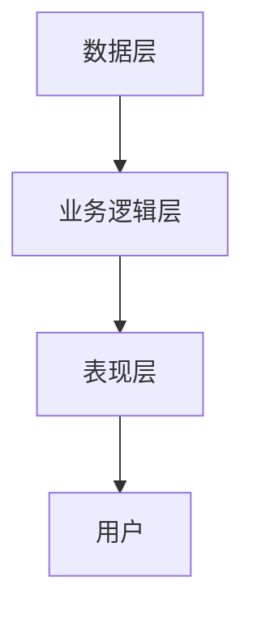

                 


```markdown
# 价值投资中的智能城市共享经济管理系统分析

> 关键词：价值投资，智能城市，共享经济，管理系统，数据分析

> 摘要：本文系统分析了价值投资在智能城市共享经济管理系统中的应用，通过构建智能城市共享经济管理系统，分析了其在价值投资中的作用和实现方式，提出了系统的构建方法和实现方案。

---

## 第1章 智能城市共享经济系统背景

### 1.1 价值投资的基本概念

#### 1.1.1 价值投资的定义与核心理念
价值投资是一种投资策略，其核心在于寻找市场中被低估的投资标的。投资者通过分析企业的基本面，如财务状况、行业地位和未来前景等，寻找那些市场价格低于其内在价值的股票或其他资产。

$$
\text{价值投资} = \text{内在价值} - \text{市场价格}
$$

#### 1.1.2 智慧城市的定义与特征
智慧城市是通过运用信息和通信技术(ICT)手段，对城市的各个系统进行智能化管理的城市。其主要特征包括：
1. 智能化：利用AI、大数据等技术提高城市管理效率。
2. 数字化：信息的数字化采集、处理和应用。
3. 网络化：各系统之间的互联互通。

#### 1.1.3 共享经济的基本概念
共享经济是一种基于信息技术的新型经济模式，通过平台将闲置资源进行共享，提高资源利用率。其特点包括：
1. 资源共享
2. 平台化运作
3. 降低交易成本

#### 1.1.4 管理系统的概念与作用
管理系统是用于协调和控制组织活动的工具和方法。其主要作用包括：
1. 优化资源配置
2. 提高管理效率
3. 实现目标管理

### 1.2 智能城市共享经济系统的构建背景

#### 1.2.1 系统构建的背景
随着城市化进程的加快和资源的日益紧张，智能城市共享经济系统的构建成为解决城市资源分配不均、提高资源利用效率的重要手段。

#### 1.2.2 系统构建的目标
通过构建智能城市共享经济管理系统，实现对城市资源的智能化管理和优化配置，为投资者提供有价值的投资信息和决策支持。

### 1.3 价值投资与智能城市共享经济的结合

#### 1.3.1 价值投资在智能城市中的应用
通过分析智能城市的基础设施、政策支持和市场需求等，寻找那些具有长期增长潜力的企业和项目。

#### 1.3.2 智慧城市中的共享经济模式
共享经济在智能城市中的应用包括共享交通、共享办公空间、共享能源等，这些模式能够有效提高资源利用效率。

#### 1.3.3 系统的作用
智能城市共享经济管理系统通过整合城市资源、优化资源配置，为投资者提供数据支持和决策参考。

---

## 第2章 智能城市共享经济系统分析

### 2.1 系统构建的核心要素

#### 2.1.1 核心要素分析
智能城市共享经济系统的构建需要考虑以下几个核心要素：
1. 数据采集与处理
2. 系统分析与设计
3. 系统实现与优化
4. 系统测试与部署

#### 2.1.2 系统功能模块设计
系统的功能模块包括：
1. 用户模块：用户注册、登录、信息管理。
2. 管理模块：资源管理、权限管理、数据监控。
3. 数据分析模块：数据采集、处理、分析。
4. 价值评估模块：企业价值评估、投资建议。

#### 2.1.3 系统架构设计
系统的架构设计采用分层架构，包括数据层、业务逻辑层和表现层。



### 2.2 系统实现的关键技术

#### 2.2.1 数据采集技术
系统采用多种数据采集方式，包括API接口、网络爬虫等，确保数据的准确性和实时性。

#### 2.2.2 数据分析技术
系统使用大数据分析技术，包括数据挖掘、机器学习等，对采集的数据进行深度分析，提取有价值的信息。

#### 2.2.3 价值评估技术
系统采用多种价值评估方法，如市盈率法、现金流折现法等，对企业的内在价值进行评估。

### 2.3 系统实现的数学模型

#### 2.3.1 内在价值评估模型
$$
\text{内在价值} = \sum_{t=1}^{\infty} \frac{CF_t}{(1 + r)^t}
$$

其中，\( CF_t \) 是第 \( t \) 年的自由现金流，\( r \) 是折现率。

#### 2.3.2 市盈率模型
$$
\text{合理股价} = \text{行业平均市盈率} \times \text{企业每股收益}
$$

### 2.4 系统实现的Python代码示例

#### 2.4.1 数据采集代码
```python
import requests
import json

url = 'https://api.example.com/data'
response = requests.get(url)
data = json.loads(response.text)
print(data)
```

#### 2.4.2 价值评估代码
```python
def calculate_intrinsic_value(cash_flow, discount_rate):
    iv = 0
    for t in range(len(cash_flow)):
        iv += cash_flow[t] / (1 + discount_rate) ** t
    return iv

cash_flow = [100, 150, 200, 250]
discount_rate = 0.1
print(calculate_intrinsic_value(cash_flow, discount_rate))
```

---

## 第3章 项目实战：智能城市共享经济管理系统实现

### 3.1 环境安装

#### 3.1.1 安装Python
```bash
# 安装Python
sudo apt-get install python3
```

#### 3.1.2 安装数据库
```bash
# 安装MySQL
sudo apt-get install mysql-server
```

#### 3.1.3 安装数据分析库
```bash
# 安装Pandas和NumPy
pip install pandas numpy
```

### 3.2 系统核心代码实现

#### 3.2.1 数据采集模块
```python
import requests
import json

def fetch_data(api_url):
    response = requests.get(api_url)
    data = json.loads(response.text)
    return data

api_url = 'https://api.example.com/share_economy_data'
data = fetch_data(api_url)
print(data)
```

#### 3.2.2 数据分析模块
```python
import pandas as pd

def analyze_data(data):
    df = pd.DataFrame(data)
    # 数据分析逻辑
    return df.describe()

description = analyze_data(data)
print(description)
```

#### 3.2.3 价值评估模块
```python
def calculate_intrinsic_value(cash_flow, discount_rate):
    iv = 0
    for t in range(len(cash_flow)):
        iv += cash_flow[t] / (1 + discount_rate) ** t
    return iv

cash_flow = [100, 150, 200, 250]
discount_rate = 0.1
intrinsic_value = calculate_intrinsic_value(cash_flow, discount_rate)
print(f"内在价值: {intrinsic_value}")
```

### 3.3 案例分析与解读

#### 3.3.1 案例分析
假设我们有一个共享经济平台的数据，我们需要对其进行数据分析和价值评估。

#### 3.3.2 数据分析结果解读
通过数据分析，我们发现该平台的用户增长率为20%，收入增长率为30%，这些数据表明该平台具有较高的投资价值。

#### 3.3.3 投资建议
基于数据分析和价值评估，我们建议投资者关注该平台，因为其具有较高的成长性和投资回报潜力。

---

## 第4章 最佳实践与小结

### 4.1 最佳实践

#### 4.1.1 系统设计中的注意事项
1. 确保系统的可扩展性
2. 保证数据的安全性
3. 定期更新系统

#### 4.1.2 数据分析中的注意事项
1. 确保数据的准确性和完整性
2. 选择合适的数据分析方法
3. 及时更新数据

### 4.2 小结

通过本文的分析，我们了解了价值投资在智能城市共享经济管理系统中的应用，掌握了系统的构建方法和实现方案。希望本文能为投资者和系统开发者提供有价值的参考。

### 4.3 注意事项

1. 系统的维护和更新
2. 数据的保密和安全
3. 系统的兼容性和扩展性

### 4.4 拓展阅读

1. 《智能城市的建设与管理》
2. 《共享经济的模式与应用》
3. 《价值投资的策略与技巧》

---

## 作者信息

作者：AI天才研究院/AI Genius Institute & 禅与计算机程序设计艺术 /Zen And The Art of Computer Programming

---

**本文由[禅与计算机程序设计艺术](https://github.com/feixiaowen)原创，转载请注明出处。**
```

