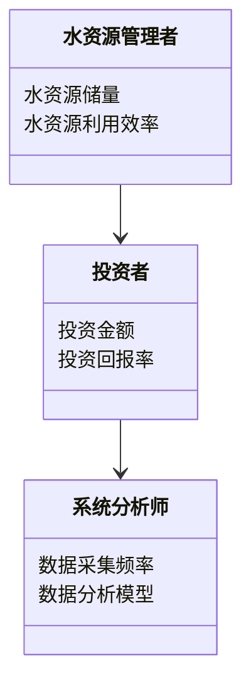
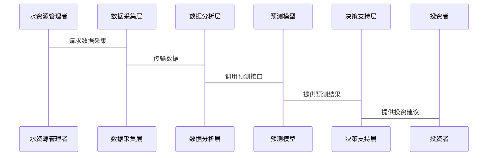

                 


# 价值投资中的智能城市水资源管理系统分析

> 关键词：智能城市，水资源管理，价值投资，系统分析，算法，数学模型

> 摘要：本文将从价值投资的角度分析智能城市水资源管理系统的构建与优化，探讨如何通过智能化手段提升水资源管理效率，降低投资风险，实现资源的可持续利用。

---

## 第一部分: 智慧城市水资源管理与价值投资概述

### 第1章: 智慧城市水资源管理与价值投资概述

#### 1.1 智慧城市水资源管理的背景与意义

##### 1.1.1 城市水资源管理的现状与挑战
城市化进程的加快导致水资源供需矛盾日益突出。传统水资源管理模式存在数据采集不全面、分析手段单一、决策效率低等问题，难以应对复杂的城市水资源管理需求。

##### 1.1.2 智慧城市水资源管理的核心理念
智慧化、数据化、网络化是智慧城市水资源管理的核心理念。通过智能化技术手段，实现水资源的实时监测、智能分析和优化决策。

##### 1.1.3 价值投资在水资源管理中的作用
价值投资关注长期收益和风险控制。在水资源管理中，价值投资可以优化资源配置，降低投资成本，提高投资回报率。

#### 1.2 智能城市水资源管理系统的概念与特点

##### 1.2.1 系统的定义
智能城市水资源管理系统是基于物联网、大数据、人工智能等技术构建的，用于实现水资源实时监测、智能分析和优化决策的综合系统。

##### 1.2.2 系统的主要功能与特点
- **实时监测**：通过传感器和物联网技术，实时采集水资源数据。
- **智能分析**：利用机器学习和数据分析技术，预测水资源变化趋势。
- **优化决策**：基于分析结果，提供最优资源配置建议。

##### 1.2.3 系统的架构与组成部分
- 数据采集层：传感器、物联网设备。
- 数据分析层：数据清洗、特征提取、模型训练。
- 决策支持层：预测模型、优化算法、决策建议。

#### 1.3 价值投资与水资源管理的结合

##### 1.3.1 价值投资的基本概念
价值投资是一种长期投资策略，注重分析资产的内在价值，寻找被市场低估的投资机会。

##### 1.3.2 水资源管理中的投资机会
- 智能设备的投资：传感器、监测设备等硬件设施。
- 数据分析与优化算法的投资：软件开发、算法优化。
- 可持续水资源管理的投资：绿色技术、环保项目。

##### 1.3.3 智能系统对投资决策的影响
智能系统能够提供实时数据支持和优化建议，帮助投资者做出更科学的投资决策。

#### 1.4 本章小结

---

## 第二部分: 智能城市水资源管理系统的核心概念与联系

### 第2章: 智能城市水资源管理系统的核心概念

#### 2.1 系统核心概念的定义与属性

##### 2.1.1 数据采集与处理
- 数据采集：通过传感器获取水资源相关数据。
- 数据清洗：去除噪声数据，保证数据质量。
- 数据存储：将清洗后的数据存储到数据库中。

##### 2.1.2 智能分析与预测
- 数据分析：利用统计学方法和机器学习算法，分析数据特征。
- 时间序列预测：基于历史数据，预测未来水资源变化趋势。

##### 2.1.3 决策支持与优化
- 优化算法：如线性规划、遗传算法等，用于资源分配和优化决策。
- 决策支持：基于预测结果，提供最优资源配置建议。

#### 2.2 核心概念的对比分析

##### 2.2.1 数据采集与处理的对比
- 数据采集：实时性高，但数据可能存在噪声。
- 数据处理：通过清洗和预处理，提升数据质量。

##### 2.2.2 智能分析与预测的对比
- 统计分析：适用于小规模数据，计算简单。
- 机器学习：适用于大规模数据，预测精度高。

##### 2.2.3 决策支持与优化的对比
- 线性规划：适用于线性问题，计算效率高。
- 遗传算法：适用于非线性问题，全局搜索能力强。

#### 2.3 系统核心概念的ER实体关系图

```mermaid
erDiagram
    actor 投资者 {
        <属性> 投资金额
        <属性> 投资回报率
    }
    actor 水资源管理者 {
        <属性> 水资源储量
        <属性> 水资源利用效率
    }
    actor 系统分析师 {
        <属性> 数据采集频率
        <属性> 数据分析模型
    }
    投资者 --> 投资回报率
    水资源管理者 --> 水资源储量
    系统分析师 --> 数据分析模型
```

---

## 第三部分: 智能城市水资源管理系统的核心算法与数学模型

### 第3章: 智能城市水资源管理系统的算法原理

#### 3.1 数据采集与处理算法

##### 3.1.1 数据采集流程
1. 传感器采集数据。
2. 数据传输到数据中心。
3. 数据清洗和预处理。

##### 3.1.2 数据清洗与预处理
- 删除异常值。
- 填充缺失值。
- 标准化数据。

##### 3.1.3 数据存储与管理
- 使用数据库存储清洗后的数据。
- 建立数据索引，便于快速查询。

#### 3.2 智能分析与预测算法

##### 3.2.1 时间序列预测模型
- 使用ARIMA模型进行时间序列预测。

##### 3.2.2 机器学习算法
- 线性回归模型：用于预测水资源需求。
- 支持向量机（SVM）：用于分类问题。

##### 3.2.3 神经网络模型
- LSTM网络：适用于时间序列预测。

#### 3.3 决策支持与优化算法

##### 3.3.1 线性规划模型
目标函数：
$$ \text{max} \quad \sum_{i=1}^{n} c_i x_i $$
约束条件：
$$ \sum_{i=1}^{n} a_i x_i \leq b $$
$$ x_i \geq 0 $$

##### 3.3.2 遗传算法
- 初始化种群。
- 计算适应度。
- 选择、交叉、变异。
- 保留最优解。

#### 3.4 代码实现与分析

##### 3.4.1 时间序列预测代码示例

```python
from statsmodels.tsa.arima_model import ARIMA
import pandas as pd

# 加载数据
data = pd.read_csv('water_resource.csv')

# 拟合ARIMA模型
model = ARIMA(data['water_level'], order=(1, 1, 1))
model_fit = model.fit()

# 预测未来值
forecast = model_fit.forecast(steps=5)
print(forecast)
```

##### 3.4.2 机器学习模型代码示例

```python
from sklearn.linear_model import LinearRegression
import numpy as np

# 数据准备
X = np.array([[1], [2], [3], [4]])
y = np.array([2, 4, 6, 8])

# 训练模型
model = LinearRegression()
model.fit(X, y)

# 预测
print(model.predict([[5]]))
```

---

## 第四部分: 系统分析与架构设计方案

### 第4章: 系统分析与架构设计方案

#### 4.1 问题场景介绍
城市水资源管理中存在的问题：数据分散、管理效率低、决策滞后。

#### 4.2 项目介绍
构建一个智能城市水资源管理系统，实现水资源的实时监测、智能分析和优化决策。

#### 4.3 系统功能设计

##### 4.3.1 领域模型设计



##### 4.3.2 系统架构设计

```mermaid
container 智能城市水资源管理系统 {
    component 数据采集层 {
        传感器
        物联网设备
    }
    component 数据分析层 {
        数据清洗模块
        特征提取模块
        模型训练模块
    }
    component 决策支持层 {
        预测模型
        优化算法
        决策建议
    }
}
```

#### 4.4 系统接口设计

##### 4.4.1 API接口设计
- 数据采集接口：`GET /api/data`
- 数据分析接口：`POST /api/analysis`
- 决策支持接口：`POST /api/decision`

#### 4.5 系统交互设计



---

## 第五部分: 项目实战

### 第5章: 项目实战

#### 5.1 环境安装

##### 5.1.1 系统环境
- 操作系统：Linux
- 数据库：MySQL
- 开发工具：PyCharm

##### 5.1.2 依赖安装
```bash
pip install statsmodels scikit-learn mermaid.py
```

#### 5.2 系统核心实现

##### 5.2.1 数据采集代码

```python
import serial

# 串口通信
ser = serial.Serial('COM1', 9600)
data = ser.readline().decode()
print(data)
```

##### 5.2.2 数据分析代码

```python
from sklearn.svm import SVC

# 训练模型
model = SVC()
model.fit(X_train, y_train)

# 预测
print(model.predict(X_test))
```

#### 5.3 实际案例分析

##### 5.3.1 案例背景
某城市水资源短缺，希望通过智能系统优化资源配置。

##### 5.3.2 数据分析结果
预测未来水资源需求，优化投资方案。

##### 5.3.3 投资建议
基于预测结果，提出最优投资方案。

#### 5.4 项目小结

---

## 第六部分: 最佳实践与总结

### 第6章: 最佳实践与总结

#### 6.1 最佳实践 tips

##### 6.1.1 数据质量管理
确保数据的实时性、准确性和完整性。

##### 6.1.2 系统安全性
加强系统安全性，防止数据泄露和网络攻击。

##### 6.1.3 持续优化
定期更新模型和算法，提升系统性能。

#### 6.2 小结

#### 6.3 注意事项

##### 6.3.1 数据隐私
保护用户数据隐私，遵守相关法律法规。

##### 6.3.2 系统稳定性
确保系统稳定运行，避免因故障导致数据丢失。

##### 6.3.3 投资风险
合理评估投资风险，避免过度投资。

#### 6.4 拓展阅读

##### 6.4.1 智能城市相关书籍
- 《智慧城市的建设与管理》
- 《数据驱动的城市规划》

##### 6.4.2 价值投资相关书籍
- 《投资学原理》
- 《价值投资实战技巧》

---

## 作者：AI天才研究院/AI Genius Institute & 禅与计算机程序设计艺术 /Zen And The Art of Computer Programming

