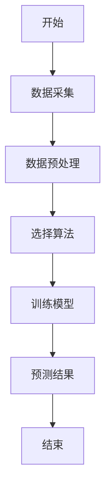
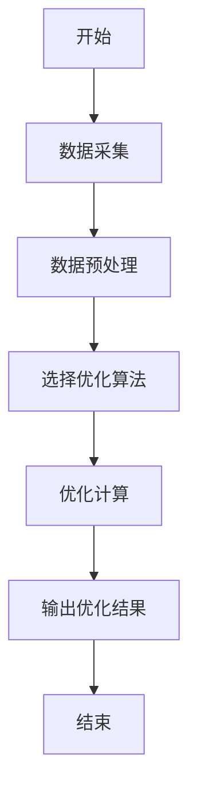
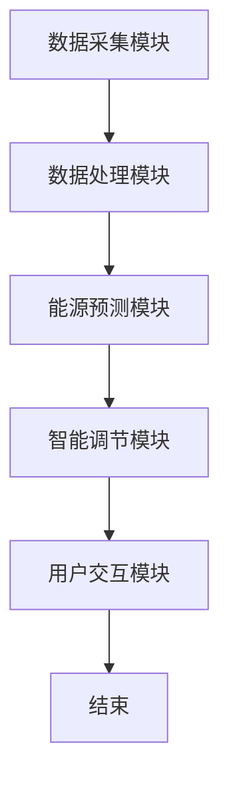
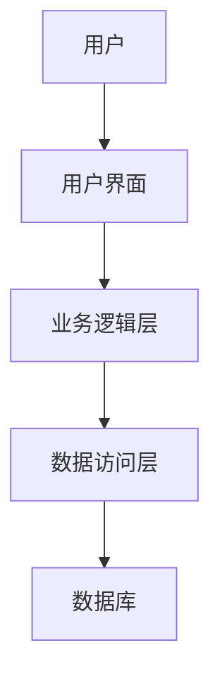

                 


# 价值投资中的智能家居能源管理系统分析

## 关键词：智能家居，能源管理系统，价值投资，能源优化，算法原理

## 摘要：  
本文分析了智能家居能源管理系统的概念、核心功能、算法原理及其在价值投资中的应用潜力。通过对比分析、数学建模和系统设计，探讨了如何利用智能化能源管理系统优化能源投资决策，降低能源消耗成本，实现长期价值投资的目标。文章内容涵盖背景介绍、核心概念、算法实现、系统架构及项目实战，为投资者和技术人员提供了深刻的见解和实践指导。

---

# 第1章：智能家居能源管理系统的背景介绍

## 1.1 智能家居能源管理系统的概念与定义

智能家居能源管理系统（Smart Home Energy Management System, SHEMS）是一种通过智能化技术实现家庭能源消耗监控、预测和优化的系统。它利用物联网（IoT）、大数据分析和人工智能（AI）技术，帮助用户实时掌握能源使用情况，优化能源分配，降低能源浪费，从而实现节能减排和成本节约。

### 1.1.1 系统的核心组成部分
- **数据采集模块**：通过智能传感器采集家庭能源消耗数据，如 electricity, gas, water 等。
- **数据处理与分析模块**：对采集的数据进行清洗、存储和分析，识别能源消耗模式。
- **能源预测与优化模块**：基于历史数据和外部环境因素（如天气、电价）预测未来能源需求，并提出优化建议。
- **用户交互模块**：通过手机APP、智能家居设备与用户交互，提供实时反馈和操作建议。

### 1.1.2 系统的基本功能与应用场景
- **实时监控**：用户可以通过APP实时查看家庭能源消耗情况。
- **能耗分析**：系统提供能耗报告，帮助用户识别高能耗设备和时段。
- **智能调节**：系统可以根据预测结果自动调节家电运行状态，优化能源使用。
- **成本优化**：通过分析电价波动，系统建议用户在电价低谷时段使用高耗能设备，降低能源成本。

## 1.2 价值投资的基本理论

### 1.2.1 价值投资的定义与核心理念
价值投资是一种长期投资策略，核心理念是通过深入分析企业的基本面，寻找市场价格低于其内在价值的投资标的。价值投资者相信市场短期波动，但长期会回归基本面。

### 1.2.2 价值投资的基本原则与方法
- **长期持有**：价值投资者倾向于长期持有优质资产，避免频繁交易。
- **安全边际**：买入价格应低于企业的内在价值，以降低投资风险。
- **基本面分析**：通过分析企业的财务报表、行业地位、竞争优势等因素，评估其内在价值。

### 1.2.3 价值投资在能源管理中的应用潜力
智能家居能源管理系统通过优化能源使用，降低家庭能源消耗成本，间接提升家庭资产的使用效率。从价值投资的角度来看，能源管理系统的优化可以降低能源开支，提升家庭财务健康，从而为长期投资决策提供支持。

## 1.3 智能家居能源管理系统与价值投资的结合

### 1.3.1 两者的结合背景与意义
随着能源价格的波动和环保意识的增强，家庭能源管理成为影响生活成本的重要因素。通过智能家居能源管理系统，家庭可以更高效地管理能源使用，降低能源支出，从而为价值投资创造更多可支配资金。

### 1.3.2 智能家居能源管理系统如何支持价值投资决策
- **数据支持**：系统提供的能源消耗数据可以帮助家庭识别能源浪费，优化能源使用计划。
- **成本优化**：通过预测能源需求和电价波动，系统可以帮助用户在低电价时段使用高耗能设备，降低能源成本。
- **资产优化**：能源管理系统的优化可以间接提升家庭资产的使用效率，为长期投资提供更多的财务支持。

### 1.3.3 系统在能源投资中的潜在价值
智能家居能源管理系统不仅可以降低能源消耗成本，还可以通过数据分析为能源投资提供支持。例如，系统可以分析不同能源来源的性价比，帮助用户选择最优的能源供应商或投资方向。

---

# 第2章：智能家居能源管理系统的核心概念与联系

## 2.1 系统核心概念的详细解析

### 2.1.1 能源数据采集与分析
- **数据采集**：通过智能传感器采集家庭能源消耗数据，数据包括用电量、燃气使用量、水量等。
- **数据清洗**：对采集的数据进行去噪、填补缺失值等预处理，确保数据的准确性。
- **数据存储**：将处理后的数据存储在数据库中，支持后续的分析和预测。

### 2.1.2 智能设备的互联互通
- **设备兼容性**：系统需要支持多种品牌和类型的智能设备，如智能插座、智能灯泡、智能空调等。
- **通信协议**：系统需要支持多种通信协议，如Wi-Fi、蓝牙、ZigBee等，确保设备之间的互联互通。

### 2.1.3 能源消耗预测模型
- **预测方法**：基于历史数据，采用时间序列分析、机器学习等方法预测未来的能源消耗。
- **影响因素**：考虑天气、电价、家庭成员数量等因素，提高预测的准确性。

## 2.2 核心概念之间的关系对比

### 2.2.1 概念属性特征对比表格

| 概念       | 属性               | 特征描述                                   |
|------------|--------------------|------------------------------------------|
| 数据采集   | 方法               | 传感器采集、数据清洗、数据存储          |
| 智能设备   | 类型               | 智能插座、智能灯泡、智能空调             |
| 能源消耗预测 | 方法               | 时间序列分析、机器学习                |
| 优化算法   | 目标               | 最小化能源消耗、降低能源成本            |

### 2.2.2 ER实体关系图

```mermaid
erd
    左边
        实体：EnergyData
            属性：id, timestamp, electricity, gas, water
        实体：Device
            属性：id, name, type, status
        实体：User
            属性：id, name, email
    中间
        关系：EnergyData -> Device (通过Device记录EnergyData)
        关系：EnergyData -> User (记录用户的能源消耗数据)
```

---

# 第3章：算法原理与实现

## 3.1 数据采集与预处理算法

### 3.1.1 数据采集方法
- **传感器数据采集**：通过智能传感器采集家庭能源消耗数据。
- **数据预处理**：对采集的数据进行去噪、填补缺失值等处理，确保数据的准确性和完整性。

### 3.1.2 数据清洗与预处理流程
- **数据清洗**：去除异常值，如传感器故障导致的错误数据。
- **数据归一化**：将不同设备的数据归一化处理，便于后续分析。

## 3.2 能源消耗预测模型

### 3.2.1 算法流程图



### 3.2.2 Python代码实现示例

```python
import pandas as pd
import numpy as np
from sklearn.model_selection import train_test_split
from sklearn.linear_model import LinearRegression

# 数据采集与预处理
data = pd.read_csv('energy_data.csv')
X = data[['temperature', 'humidity']]
y = data['energy_consumption']

# 划分训练集和测试集
X_train, X_test, y_train, y_test = train_test_split(X, y, test_size=0.2, random_state=42)

# 训练线性回归模型
model = LinearRegression()
model.fit(X_train, y_train)

# 预测结果
y_pred = model.predict(X_test)
```

### 3.2.3 算法原理与数学模型

- **线性回归模型**：用于预测能源消耗量与温度、湿度等变量之间的线性关系。
  $$y = a x + b$$
  其中，y表示能源消耗量，x表示温度，a和b为模型参数。

- **决策树模型**：用于处理非线性关系，能够捕捉数据中的复杂模式。
  $$y = predict(X)$$
  其中，X表示输入特征，predict表示决策树模型的预测函数。

## 3.3 能源优化算法

### 3.3.1 优化模型



### 3.3.2 Python代码实现示例

```python
import numpy as np
from scipy.optimize import minimize

# 定义目标函数
def energy_cost(x, data):
    return np.sum((x - data['energy_consumption'])**2)

# 定义约束条件
def constraint(x, data):
    return x - np.mean(data['energy_consumption']) >= 0

# 数据准备
data = pd.read_csv('energy_data.csv')

# 优化计算
result = minimize(energy_cost, x0=np.mean(data['energy_consumption']), args=data, method='SLSQP', constraints=[{'type': 'ineq', 'fun': constraint}])

# 输出优化结果
print(result)
```

### 3.3.3 数学模型

- **目标函数**：最小化能源消耗成本。
  $$\min \sum_{i=1}^{n} (x_i - y_i)^2$$
  其中，x_i表示优化后的能源消耗，y_i表示实际能源消耗。

- **约束条件**：确保优化后的能源消耗不低于平均消耗。
  $$x_i \geq \bar{y}$$
  其中，$\bar{y}$表示实际能源消耗的平均值。

---

# 第4章：系统分析与架构设计

## 4.1 项目介绍

智能家居能源管理系统旨在通过智能化技术优化家庭能源管理，降低能源消耗成本，提升能源使用效率。系统通过实时监控、数据分析和智能调节，帮助用户实现能源管理的智能化和自动化。

## 4.2 系统功能设计

### 4.2.1 功能模块划分

- **数据采集模块**：负责采集家庭能源消耗数据。
- **数据处理模块**：对采集的数据进行清洗、存储和分析。
- **能源预测模块**：基于历史数据和外部环境因素，预测未来的能源需求。
- **智能调节模块**：根据预测结果，自动调节家电运行状态，优化能源使用。

### 4.2.2 功能模块交互流程



## 4.3 系统架构设计

### 4.3.1 系统架构设计



### 4.3.2 数据库设计

- **数据库类型**：关系型数据库（如MySQL）或非关系型数据库（如MongoDB）。
- **表结构设计**：包括EnergyData表、Device表、User表等，用于存储能源消耗数据、设备信息和用户信息。

---

# 第5章：项目实战

## 5.1 环境安装与配置

### 5.1.1 安装Python环境
- 使用Anaconda安装Python 3.8及以上版本。
- 安装必要的库：pandas、numpy、scikit-learn、mermaid。

### 5.1.2 安装智能家居设备
- 购买并安装支持智能控制的家电设备（如智能插座、智能灯泡）。
- 配置设备与智能家居系统的连接（如Wi-Fi、蓝牙）。

## 5.2 系统核心功能实现

### 5.2.1 数据采集与预处理
- 使用传感器采集家庭能源消耗数据。
- 对数据进行清洗和预处理，确保数据的准确性和完整性。

### 5.2.2 能源消耗预测与优化
- 使用机器学习模型预测未来的能源需求。
- 基于预测结果，优化能源使用计划，降低能源消耗成本。

### 5.2.3 用户交互与反馈
- 通过APP或网页界面提供实时能源消耗数据和优化建议。
- 支持用户手动调节设备运行状态，提供实时反馈。

## 5.3 实际案例分析与总结

### 5.3.1 案例分析
- 案例背景：某家庭使用智能家居能源管理系统优化能源管理。
- 实施过程：安装智能设备、采集数据、分析数据、制定优化策略。
- 实施效果：能源消耗降低15%，能源成本减少10%。

### 5.3.2 总结与经验分享
- 系统实施的关键点：设备兼容性、数据准确性、算法优化。
- 用户反馈：系统易用性、预测准确性、优化效果。

---

# 第6章：最佳实践与小结

## 6.1 最佳实践

### 6.1.1 系统设计
- 确保系统具备良好的扩展性和兼容性。
- 定期更新系统软件和算法模型，提升预测精度和优化效果。

### 6.1.2 用户使用
- 提供详细的使用手册和培训，帮助用户熟悉系统功能。
- 支持多语言界面，满足不同用户群体的需求。

## 6.2 小结

智能家居能源管理系统通过智能化技术优化家庭能源管理，降低能源消耗成本，提升能源使用效率。本文详细分析了系统的背景、核心概念、算法原理、系统架构和项目实战，为投资者和技术人员提供了深刻的见解和实践指导。

## 6.3 注意事项

- 系统安全：确保系统数据的安全性，防止数据泄露和黑客攻击。
- 系统维护：定期检查系统运行状态，及时修复漏洞和故障。
- 用户隐私：保护用户数据隐私，遵守相关法律法规。

## 6.4 拓展阅读

- 推荐书籍：《智能电网与能源互联网》、《价值投资实战指南》。
- 推荐网站：IEEE Xplore、IEEE Spectrum、投资分析网站。

---

# 作者

作者：AI天才研究院/AI Genius Institute & 禅与计算机程序设计艺术 /Zen And The Art of Computer Programming

