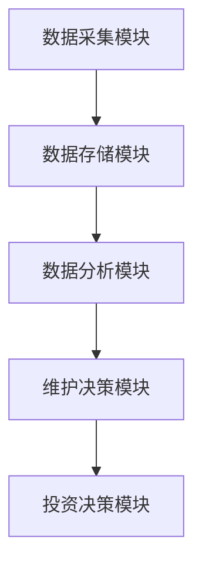
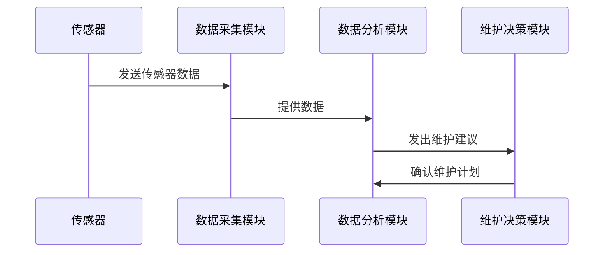

                 


# 价值投资中的智能建筑预测性维护系统分析

## 关键词：智能建筑，预测性维护，价值投资，机器学习，系统架构

## 摘要：  
本文深入探讨了智能建筑预测性维护系统在价值投资中的应用，分析了该系统的背景、核心概念、算法原理、系统架构及项目实战，并结合最佳实践提供了详细的技术分析和见解。

---

## 第一部分：背景介绍

### 第1章：智能建筑预测性维护系统概述

#### 1.1 问题背景
- 智能建筑的定义与特征：智能建筑通过物联网技术实现设备自动化和数据采集。
- 预测性维护的必要性：避免设备故障，降低维护成本。
- 价值投资中的挑战与机遇：数据驱动的决策优化投资回报。

#### 1.2 问题描述
- 预测性维护的核心目标：预测设备故障，提前安排维护。
- 价值投资中的数据依赖性：依赖设备数据进行投资决策。
- 系统性分析的重要性：通过系统分析优化投资策略。

#### 1.3 问题解决
- 数据驱动的解决方案：利用机器学习模型分析设备数据。
- 预测性维护的实施步骤：数据采集、模型训练、维护策略制定。
- 价值投资中的系统性决策：结合市场分析优化投资决策。

#### 1.4 边界与外延
- 系统边界定义：智能建筑内部设备的数据采集与分析。
- 外延应用领域：扩展至其他资产类型和投资策略。
- 与其他系统的接口关系：与建筑管理系统（BMS）和投资管理系统接口。

#### 1.5 概念结构与核心要素
- 核心概念组成：数据采集、预测模型、维护策略。
- 关键要素的相互关系：数据驱动模型，模型指导维护，维护优化投资。
- 系统整体架构：设备、数据、模型、策略四个模块的协同工作。

---

## 第二部分：核心概念与联系

### 第2章：智能建筑预测性维护系统的核心原理

#### 2.1 核心概念原理
- 数据采集与处理：通过传感器实时采集设备数据。
- 预测算法的应用：使用机器学习模型预测设备故障。
- 维护策略的制定：根据预测结果安排维护计划。

#### 2.2 核心概念对比分析
- 数据特征对比：实时性、连续性、多样性。
- 算法性能对比：准确率、计算效率、可解释性。
- 维护策略的有效性对比：成本降低、设备寿命延长、投资回报提升。

#### 2.3 ER实体关系图
- 实体关系分析：设备、传感器、维护记录、投资决策。
- 关系图展示：
  ```mermaid
  er
  table Equipment {
    id
    name
    location
  }
  table Sensor {
    id
    type
    Equipment (id)
  }
  table MaintenanceRecord {
    id
    date
    Equipment (id)
  }
  table InvestmentDecision {
    id
    date
    Equipment (id)
  }
  ```

---

## 第三部分：算法原理讲解

### 第3章：预测性维护算法原理

#### 3.1 算法原理
- 机器学习算法的应用：使用回归分析预测设备寿命。
- 时间序列分析方法：ARIMA模型预测设备状态。
- 回归分析模型：线性回归预测维护成本。

#### 3.2 算法流程图
- 数据预处理流程：清洗、特征提取、标准化。
- 模型训练流程：数据分割、模型训练、评估。
- 预测流程：输入数据、模型预测、结果输出。

#### 3.3 代码实现
```python
import pandas as pd
from sklearn.linear_model import LinearRegression

# 数据加载
data = pd.read_csv('equipment_data.csv')

# 特征与目标变量分离
X = data[['temperature', 'vibration']]
y = data['failure_probability']

# 模型训练
model = LinearRegression()
model.fit(X, y)

# 预测
new_data = pd.DataFrame({'temperature': [80], 'vibration': [15]})
prediction = model.predict(new_data)
print(f'预测故障概率为: {prediction[0]:.2f}')
```

#### 3.4 数学模型
- 线性回归模型：
  $$ y = \beta_0 + \beta_1 x_1 + \beta_2 x_2 + \epsilon $$
- ARIMA模型：
  $$ \phi(L) (X_t - \mu) = \theta(L) \epsilon_t $$

---

## 第四部分：系统分析与架构设计

### 第4章：智能建筑预测性维护系统架构

#### 4.1 问题场景介绍
- 智能建筑设备监控与维护的挑战。
- 价值投资中的数据驱动决策需求。

#### 4.2 项目介绍
- 项目目标：优化设备维护计划，提升投资回报。
- 项目范围：智能建筑设备的预测性维护系统。

#### 4.3 系统功能设计
- 数据采集模块：传感器数据采集。
- 数据分析模块：模型训练与预测。
- 维护决策模块：维护策略制定。

#### 4.4 系统架构图


#### 4.5 系统接口设计
- 数据接口：传感器数据接口、维护记录接口。
- 维护接口：维护计划接口、维护执行接口。

#### 4.6 系统交互图


---

## 第五部分：项目实战

### 第5章：智能建筑预测性维护系统实现

#### 5.1 环境安装
- Python环境：安装pandas、scikit-learn、mermaid等库。

#### 5.2 核心代码实现
- 数据处理代码：
  ```python
  import pandas as pd
  data = pd.read_csv('equipment.csv')
  data.head()
  ```

- 模型训练代码：
  ```python
  from sklearn.ensemble import RandomForestRegressor
  model = RandomForestRegressor()
  model.fit(X, y)
  ```

- 维护策略代码：
  ```python
  import numpy as np
  prediction = model.predict(new_X)
  threshold = 0.8
  maintenance_needed = np.where(prediction > threshold, 'Yes', 'No')
  ```

#### 5.3 代码解读与分析
- 数据处理：加载数据，清洗，特征提取。
- 模型训练：使用随机森林回归模型。
- 维护策略：根据预测结果制定维护计划。

#### 5.4 实际案例分析
- 案例背景：某智能建筑设备的故障预测。
- 数据分析：传感器数据的特征提取。
- 预测结果：设备故障概率预测。
- 投资优化：根据预测结果优化维护计划。

#### 5.5 项目小结
- 系统实现的关键步骤：数据采集、模型训练、维护策略制定。
- 实际应用中的注意事项：数据质量、模型选择、维护成本效益分析。

---

## 第六部分：最佳实践

### 第6章：智能建筑预测性维护系统的最佳实践

#### 6.1 小结
- 核心概念回顾：智能建筑、预测性维护、价值投资。
- 系统架构总结：模块化设计、数据驱动决策。

#### 6.2 注意事项
- 数据质量：确保数据准确性和完整性。
- 模型选择：根据具体场景选择合适算法。
- 成本效益：平衡维护成本与投资回报。

#### 6.3 拓展阅读
- 推荐书籍：《智能建筑技术与应用》、《机器学习实战》。
- 进阶学习：深度学习在预测性维护中的应用。

---

## 作者信息

作者：AI天才研究院/AI Genius Institute & 禅与计算机程序设计艺术 /Zen And The Art of Computer Programming

