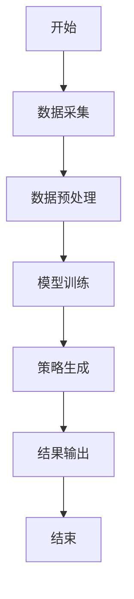
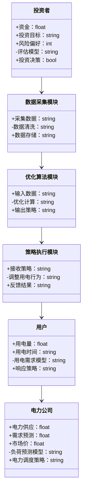
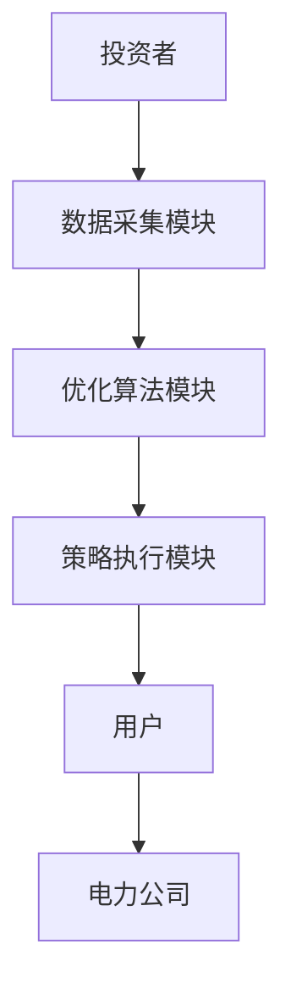
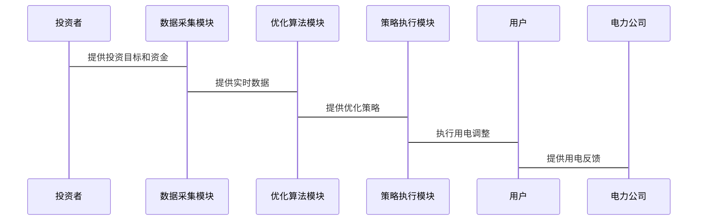

                 


# 价值投资中的智能电网需求响应系统分析

## 关键词：价值投资、智能电网、需求响应系统、优化算法、系统架构

## 摘要：本文从价值投资的角度，深入分析智能电网中的需求响应系统，探讨其在投资决策中的应用。通过系统分析和算法优化，揭示需求响应系统如何帮助投资者实现投资收益最大化。文章内容涵盖智能电网的基本概念、需求响应系统的原理、优化算法的应用、系统架构设计、项目实战以及最佳实践，旨在为投资者提供科学的决策依据。

---

## 第1章: 智能电网与需求响应系统概述

### 1.1 智能电网的基本概念

#### 1.1.1 智能电网的定义与特点
智能电网是一种利用现代信息技术和自动化技术构建的电力系统，具有以下特点：
- **智能化**：通过传感器和数据分析实现智能调节。
- **高效性**：优化电力传输和分配，提高能源利用效率。
- **可扩展性**：能够适应能源结构的变化和用户需求的增长。

#### 1.1.2 智能电网的核心组成部分
智能电网主要由以下几个部分组成：
1. **电力传输网络**：负责电力的长距离传输。
2. **数据采集与监控系统（SCADA）**：实时采集和监控电力系统的运行状态。
3. **能量管理系统（EMS）**：对电力系统的运行进行优化和调度。
4. **智能终端设备**：包括智能电表、智能开关等设备。

#### 1.1.3 智能电网与传统电网的区别
| 特性 | 智能电网 | 传统电网 |
|------|----------|----------|
| 数据采集 | 实时采集，精准分析 | 手动采集，数据滞后 |
| 调度方式 | 自动化调度，智能优化 | 人工调度，效率较低 |
| 用户参与 | 用户可参与需求响应 | 用户被动接受电力供应 |

---

### 1.2 需求响应系统的基本原理

#### 1.2.1 需求响应系统的定义
需求响应系统是一种通过实时数据采集和分析，根据电力供需情况，调整用户用电行为的系统。其核心目标是优化电力资源的配置，降低电力浪费。

#### 1.2.2 需求响应系统的功能模块
1. **数据采集模块**：采集用户的用电数据和电力市场的实时价格。
2. **数据处理模块**：对采集的数据进行清洗、归一化处理。
3. **优化算法模块**：基于优化算法生成用电策略。
4. **策略执行模块**：根据优化结果调整用户的用电行为。

#### 1.2.3 需求响应系统在智能电网中的作用
需求响应系统通过优化电力需求，降低电网的负荷压力，提高电力系统的稳定性。同时，它还能帮助用户降低用电成本，实现节能减排的目标。

---

### 1.3 价值投资与智能电网的结合

#### 1.3.1 价值投资的基本概念
价值投资是一种投资策略，通过分析企业的基本面，寻找那些被市场低估的投资标的，实现长期稳定的收益。

#### 1.3.2 智能电网中的投资机会
智能电网的建设和发展带来了许多投资机会，例如：
- 投资智能电网基础设施建设。
- 投资于智能电网相关技术的研发和推广。
- 投资于需求响应系统的服务提供商。

#### 1.3.3 需求响应系统对投资决策的影响
需求响应系统能够通过实时数据分析，帮助投资者更好地预测电力市场的供需变化，从而做出更科学的投资决策。例如，投资者可以根据需求响应系统提供的数据，判断某一时段的电力需求是否会出现高峰，从而决定是否投资于储能设备或可再生能源项目。

---

## 第2章: 智能电网需求响应系统的核心概念与联系

### 2.1 智能电网需求响应系统的实体关系图

```mermaid
er
  actor: 投资者
  actor: 电力公司
  actor: 用户
  entity: 电力需求
  entity: 响应策略
  entity: 投资评估
  entity: 数据采集
  entity: 优化模型
  entity: 投资回报
  entity: 风险分析
  entity: 技术指标
  entity: 市场动态
  entity: 投资决策
  entity: 系统性能
```

### 2.2 需求响应系统的核心算法原理



### 2.3 算法原理的数学模型

$$
\text{目标函数：} \quad \min_{x} f(x) = x^2 + 2x + 1
$$

### 2.4 算法实现的Python代码示例

```python
def optimize_model(data):
    # 数据预处理
    processed_data = data cleaning
    # 模型训练
    model = train(processed_data)
    # 策略生成
    strategy = generate_strategy(model)
    return strategy
```

---

## 第3章: 智能电网需求响应系统的系统分析与架构设计

### 3.1 系统功能设计



### 3.2 系统架构设计



### 3.3 系统接口设计



---

## 第4章: 智能电网需求响应系统的项目实战

### 4.1 环境安装

```bash
pip install numpy
pip install pandas
pip install scikit-learn
```

### 4.2 核心代码实现

```python
import numpy as np
import pandas as pd
from sklearn.linear_model import LinearRegression

def optimize_model(data):
    # 数据预处理
    processed_data = data.dropna()
    # 模型训练
    model = LinearRegression()
    model.fit(processed_data[['time', 'price']], processed_data['demand'])
    # 策略生成
    strategy = model.predict(processed_data[['time', 'price']])
    return strategy
```

### 4.3 案例分析

假设我们有一个电力公司的数据集，包含电力需求、市场价格和用电时间。我们可以通过上述代码实现需求预测，并根据预测结果生成用电策略，帮助投资者做出最优决策。

---

## 第5章: 最佳实践与总结

### 5.1 最佳实践

1. **数据质量管理**：确保数据的准确性和完整性。
2. **模型优化**：根据实际情况不断优化算法模型。
3. **系统维护**：定期更新系统，确保其稳定运行。

### 5.2 小结

本文从价值投资的角度，深入分析了智能电网中的需求响应系统，探讨了其在投资决策中的应用。通过系统分析和算法优化，揭示了需求响应系统如何帮助投资者实现投资收益最大化。

### 5.3 注意事项

- 在实际应用中，需要注意数据的实时性和准确性。
- 需要结合实际情况，灵活调整算法参数。

### 5.4 拓展阅读

- 《智能电网技术与应用》
- 《价值投资的真谛》

---

## 作者：AI天才研究院 & 禅与计算机程序设计艺术

---

以上就是《价值投资中的智能电网需求响应系统分析》的完整目录大纲和文章内容。通过本文的分析，读者可以深入了解智能电网中的需求响应系统，及其在价值投资中的应用。

