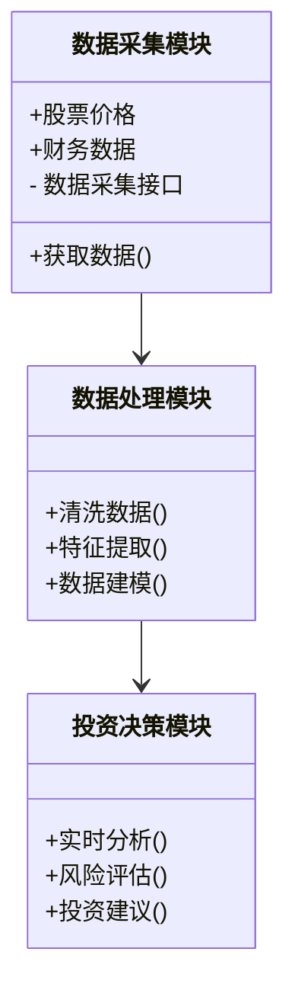
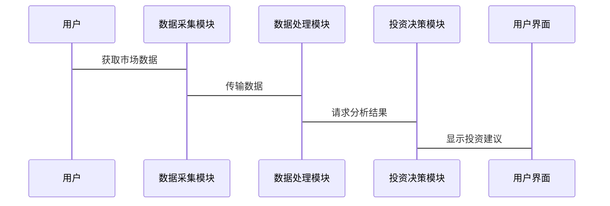

                 


# 价值投资中的智能眼镜技术发展前景

> 关键词：智能眼镜，价值投资，数据分析，投资决策，算法模型，技术应用

> 摘要：本文探讨了智能眼镜技术在价值投资中的应用前景，分析了智能眼镜的核心技术、价值投资的基本原理及其结合的可能性，详细讲解了相关的数据分析算法和数学模型，结合实际案例分析了智能眼镜技术在投资决策中的潜在价值，并展望了未来的发展方向。

---

# 第一部分: 智能眼镜技术与价值投资的背景介绍

## 第1章: 智能眼镜技术概述

### 1.1 智能眼镜的定义与技术基础
#### 1.1.1 智能眼镜的定义
智能眼镜是一种集成了计算机视觉、人工智能和增强现实技术的可穿戴设备，能够通过摄像头、传感器和算法处理环境信息，并通过透明的显示屏将相关信息叠加到用户视野中。

#### 1.1.2 智能眼镜的核心技术
- **计算机视觉**：用于识别和处理环境中的图像信息。
- **人工智能**：用于分析数据并提供决策支持。
- **增强现实**：用于在现实环境中叠加虚拟信息。
- **传感器技术**：用于采集环境数据。

#### 1.1.3 智能眼镜的市场现状
目前，智能眼镜市场主要集中在消费电子和企业级应用领域。消费级智能眼镜主要用于日常生活的信息辅助，而企业级智能眼镜则广泛应用于工业、医疗和金融等领域。

### 1.2 价值投资的基本原理
#### 1.2.1 价值投资的定义
价值投资是一种投资策略，通过分析企业的基本面，寻找市场价格低于其内在价值的投资标的。

#### 1.2.2 价值投资的核心理念
- **安全边际**：购买价格低于内在价值，以降低风险。
- **长期视角**：关注企业的长期盈利能力。
- **基本面分析**：通过财务报表分析企业的财务状况。

#### 1.2.3 价值投资在现代金融中的应用
价值投资在股票、基金和其他金融资产的投资中广泛应用，尤其是在寻找被市场低估的投资标的时。

### 1.3 智能眼镜技术与价值投资的结合
#### 1.3.1 智能眼镜技术在金融领域的潜力
智能眼镜可以通过实时捕捉环境信息，快速获取和分析金融市场数据，帮助投资者做出更明智的投资决策。

#### 1.3.2 智能眼镜技术与价值投资的结合模式
- **数据驱动**：通过智能眼镜实时采集市场数据，辅助价值评估。
- **智能化决策**：利用人工智能算法优化投资决策过程。
- **增强现实显示**：将关键信息以直观的方式呈现给投资者。

---

## 第2章: 智能眼镜技术与价值投资的核心概念与联系

### 2.1 智能眼镜技术的核心原理
#### 2.1.1 智能眼镜的感知技术
智能眼镜通过摄像头和传感器感知环境信息，包括图像、声音、位置和运动数据。

#### 2.1.2 智能眼镜的数据处理能力
智能眼镜内置的人工智能算法可以对采集的数据进行分析和处理，提取有价值的信息。

#### 2.1.3 智能眼镜的交互设计
智能眼镜通过语音指令、手势操作和增强现实显示实现人机交互，提供直观的用户体验。

### 2.2 价值投资的核心要素
#### 2.2.1 财务分析
通过分析企业的财务报表，评估企业的盈利能力、偿债能力和发展潜力。

#### 2.2.2 行业分析
研究企业的所处行业，评估行业的增长潜力和竞争格局。

#### 2.2.3 公司基本面分析
分析企业的管理团队、公司治理和竞争优势，评估企业的长期发展潜力。

### 2.3 智能眼镜技术与价值投资的关联性分析
#### 2.3.1 数据获取效率的提升
智能眼镜可以通过实时数据采集和传输，提高市场数据获取的效率和准确性。

#### 2.3.2 投资决策的智能化
智能眼镜结合人工智能算法，可以辅助投资者进行智能化的投资决策。

#### 2.3.3 风险控制的优化
通过实时监控市场数据和企业动态，智能眼镜可以帮助投资者及时发现和规避潜在风险。

---

## 第3章: 智能眼镜技术在价值投资中的算法原理

### 3.1 数据分析算法
#### 3.1.1 数据清洗与预处理
通过去除噪声数据和缺失值，确保数据的准确性和完整性。

#### 3.1.2 数据特征提取
提取影响投资决策的关键特征，如市盈率、市净率和ROE等。

#### 3.1.3 数据建模与预测
利用机器学习算法建立预测模型，预测企业的未来盈利能力。

### 3.2 投资决策算法
#### 3.2.1 贴现现金流模型
通过预测企业未来现金流，计算其内在价值。

#### 3.2.2 市盈率与市净率分析
通过比较企业的估值指标，评估其市场价格是否合理。

#### 3.2.3 风险评估模型
通过分析企业的财务风险和市场风险，评估其投资价值。

### 3.3 智能眼镜技术在算法中的应用
#### 3.3.1 实时数据分析
智能眼镜可以实时捕捉市场动态，快速更新数据模型。

#### 3.3.2 智能提醒与决策辅助
通过分析市场数据和企业动态，智能眼镜可以向投资者提供及时的投资建议。

#### 3.3.3 数据可视化与投资策略展示
通过增强现实技术，智能眼镜可以将复杂的数据信息直观地展示给投资者。

---

## 第4章: 价值投资中的数学模型与公式

### 4.1 贴现现金流模型
#### 4.1.1 模型公式
$$
\text{企业价值} = \sum_{t=1}^{n} \frac{\text{现金流}}{(1 + r)^t}
$$
其中，$r$ 是折现率，$n$ 是预测的年数。

#### 4.1.2 模型实现
通过Python代码实现贴现现金流模型的计算：

```python
def discounted_cash_flow(cash_flows, discount_rate):
    value = 0
    for t, cf in enumerate(cash_flows):
        value += cf / (1 + discount_rate) ** t
    return value
```

### 4.2 市盈率与市净率分析
#### 4.2.1 市盈率公式
$$
\text{市盈率} = \frac{\text{股票价格}}{\text{每股收益}}
$$

#### 4.2.2 市净率公式
$$
\text{市净率} = \frac{\text{股票价格}}{\text{每股净资产}}
$$

### 4.3 风险评估模型
#### 4.3.1 风险评估公式
$$
\text{风险价值} = \text{标准差} \times \text{风险偏好系数}
$$

---

## 第5章: 系统分析与架构设计方案

### 5.1 问题场景介绍
智能眼镜投资分析系统需要实时采集和处理金融市场数据，提供实时的投资决策支持。

### 5.2 项目介绍
智能眼镜投资分析系统旨在通过智能眼镜实时捕捉市场信息，辅助投资者进行价值评估和投资决策。

### 5.3 系统功能设计
#### 5.3.1 数据采集模块
- 采集股票价格、财务数据等市场信息。
- 使用Mermaid类图展示系统功能模块：



### 5.4 系统架构设计
使用Mermaid绘制系统架构图：


### 5.5 系统交互设计
使用Mermaid绘制交互序列图：



---

## 第6章: 项目实战

### 6.1 环境安装
安装必要的Python库和工具，如Pandas、NumPy和Scikit-learn。

### 6.2 核心实现
实现贴现现金流模型和风险评估模型的代码：

```python
import numpy as np
import pandas as pd
from sklearn import linear_model

# 数据采集与预处理
data = pd.read_csv('market_data.csv')
data = data.dropna()

# 特征提取
features = data[['市盈率', '市净率', 'ROE']]
target = data['股价']

# 数据建模
model = linear_model.LinearRegression()
model.fit(features, target)

# 投资决策
预测股价 = model.predict(new_features)
```

### 6.3 案例分析
通过实际案例分析智能眼镜技术在价值投资中的应用，例如分析某企业的财务数据和市场动态，预测其股价走势。

### 6.4 代码解读
详细解读代码实现，说明每个部分的功能和作用。

---

## 第7章: 总结与展望

### 7.1 总结
智能眼镜技术为价值投资提供了新的可能性，通过实时数据采集和智能化分析，可以提高投资决策的效率和准确性。

### 7.2 展望
随着智能眼镜技术的不断发展，未来可能会出现更多创新的应用场景，如实时市场监控、智能投资顾问和增强现实投资报告等。

### 7.3 最佳实践
- **数据质量**：确保数据的准确性和完整性。
- **模型优化**：不断优化算法，提高预测的准确性。
- **用户体验**：提升智能眼镜的易用性和交互体验。

---

作者：AI天才研究院/AI Genius Institute & 禅与计算机程序设计艺术 /Zen And The Art of Computer Programming

