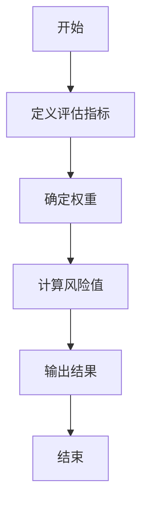
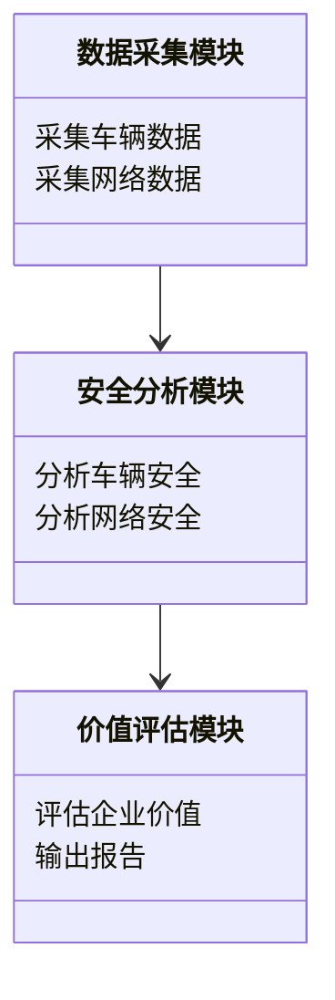

                 


# 价值投资中的智能网联汽车安全系统分析

> 关键词：价值投资、智能网联汽车、安全系统、风险评估、数学模型

> 摘要：本文从价值投资的角度，深入分析智能网联汽车安全系统的核心概念、算法原理、系统架构设计，并通过实际案例展示其在投资决策中的应用。文章结合背景介绍、核心概念、算法流程图、数学公式、系统架构图、项目实战和最佳实践等多方面内容，为投资者提供科学的分析工具和决策依据。

---

# 第一部分: 价值投资中的智能网联汽车安全系统分析基础

## 第1章: 价值投资与智能网联汽车安全系统概述

### 1.1 价值投资的基本概念

#### 1.1.1 价值投资的定义与核心理念
- 价值投资是一种以基本面分析为核心的长期投资策略，强调以低于内在价值的价格买入优质资产。
- 核心理念：寻找被市场低估的企业，通过长期持有实现收益。

#### 1.1.2 智能网联汽车的发展现状
- 智能网联汽车是融合了人工智能、物联网、大数据等技术的新型交通工具。
- 当前发展特点：电动化、智能化、网联化、共享化。

#### 1.1.3 价值投资与智能网联汽车的结合背景
- 智能网联汽车作为未来出行的核心技术，具有广阔市场空间和投资价值。
- 安全系统是智能网联汽车的核心竞争力之一，也是价值投资的重要评估指标。

### 1.2 智能网联汽车安全系统的概念与重要性

#### 1.2.1 智能网联汽车安全系统的组成部分
- 车辆安全：包括自动驾驶系统、车载系统等的安全性。
- 网络安全：防止黑客攻击、数据泄露等网络安全威胁。
- 数据安全：保护用户隐私和车辆数据的安全。

#### 1.2.2 安全系统在智能网联汽车中的作用
- 保障车辆运行的安全性，防止交通事故。
- 防止网络攻击，保护用户隐私和企业数据。
- 提升用户体验，增强品牌竞争力。

#### 1.2.3 价值投资视角下的安全系统评估
- 安全系统是智能网联汽车的核心竞争力之一。
- 优秀的安全系统能够降低企业的法律风险和财务损失。
- 安全系统的投入与回报的平衡是价值投资的重要考量因素。

---

## 第2章: 价值投资中的智能网联汽车安全系统分析框架

### 2.1 价值投资分析的核心要素

#### 2.1.1 企业基本面分析
- 财务状况：收入、利润、现金流等。
- 管理团队：团队能力和战略规划。
- 行业地位：市场占有率、竞争对手分析。

#### 2.1.2 行业竞争分析
- 行业发展趋势：政策支持、技术进步、市场需求。
- 产业链分析：上游供应商、下游客户。
- 行业风险：政策风险、技术风险、市场风险。

#### 2.1.3 财务指标分析
- 市盈率（P/E）：衡量股票的相对价值。
- 市净率（P/B）：衡量股票的资产价值。
- 净利润率：衡量企业的盈利能力。

### 2.2 智能网联汽车安全系统的分析维度

#### 2.2.1 技术层面的安全性评估
- 技术先进性：自动驾驶算法、网络安全技术的创新性。
- 技术成熟度：系统稳定性和可靠性。
- 技术壁垒：专利数量、技术团队实力。

#### 2.2.2 市场层面的竞争力分析
- 市场需求：消费者对安全系统的接受度。
- 市场份额：企业在安全系统领域的市场地位。
- 市场风险：政策变化、市场竞争的影响。

#### 2.2.3 企业层面的管理与研发投入
- 企业管理：研发团队的管理效率。
- 研发投入：企业在安全系统研发上的资金投入。
- 研发成果：专利数量、技术成果的转化能力。

---

## 第3章: 智能网联汽车安全系统的核心算法与数学模型

### 3.1 安全风险评估的算法原理

#### 3.1.1 层次分析法（AHP）在安全评估中的应用
- 层次分析法是一种定性与定量相结合的决策分析方法。
- 应用步骤：
  1. 构建层次结构：目标层、准则层、方案层。
  2. 确定各层权重：通过专家打分法确定权重。
  3. 计算综合得分：根据权重计算各方案的综合得分。
- 优点：能够将复杂的决策问题分解为易于处理的小问题。

#### 3.1.2 安全风险的量化模型
- 风险值公式：
  $$ R = \sum_{i=1}^{n} w_i \cdot r_i $$
  - \( R \)：风险值
  - \( w_i \)：第 \( i \) 个风险因素的权重
  - \( r_i \)：第 \( i \) 个风险因素的风险值

- 示例：假设某智能网联汽车的安全风险因素包括网络安全、数据安全和车辆安全，权重分别为0.4、0.3和0.3。计算得出的风险值为：
  $$ R = 0.4 \times 0.8 + 0.3 \times 0.6 + 0.3 \times 0.7 = 0.32 + 0.18 + 0.21 = 0.71 $$

### 3.2 算法流程图（Mermaid）



---

## 第4章: 智能网联汽车安全系统的系统架构设计

### 4.1 系统功能设计

#### 4.1.1 数据采集模块
- 采集车辆运行数据：车速、加速度、方向盘角度等。
- 采集网络数据：通信数据包、用户行为数据。
- 数据存储：结构化数据存储，便于后续分析。

#### 4.1.2 安全分析模块
- 网络安全分析：检测网络攻击、异常流量。
- 数据安全分析：保护用户隐私和车辆数据。
- 车辆安全分析：评估自动驾驶系统的安全性。

#### 4.1.3 价值评估模块
- 综合评估：根据安全系统的表现，评估企业的投资价值。
- 生成报告：输出安全评估报告和投资建议。

### 4.2 系统架构图（Mermaid）



---

## 第5章: 智能网联汽车安全系统的项目实战

### 5.1 环境安装

```bash
# 安装Python环境
python --version
pip install numpy pandas matplotlib
```

### 5.2 核心实现源代码

```python
import numpy as np
import pandas as pd

def risk_assessment(risk_factors, weights):
    return np.dot(risk_factors, weights)

# 示例数据
risk_factors = np.array([0.8, 0.6, 0.7])
weights = np.array([0.4, 0.3, 0.3])

# 计算风险值
risk_value = risk_assessment(risk_factors, weights)
print("风险值为：", risk_value)
```

---

## 第6章: 最佳实践与小结

### 6.1 小结
- 价值投资与智能网联汽车安全系统的结合是未来投资的重要方向。
- 安全系统的评估需要综合考虑技术、市场和企业等多个维度。
- 算法和数学模型是安全评估的核心工具。

### 6.2 注意事项
- 数据的准确性和完整性是安全评估的基础。
- 投资者需要关注政策变化和技术进步对安全系统的影响。
- 风险评估模型需要根据实际情况进行调整和优化。

### 6.3 拓展阅读
- 推荐阅读《智能网联汽车安全系统设计》和《价值投资实战技巧》。
- 关注行业动态和技术进步，保持对智能网联汽车安全系统的持续学习。

---

作者：AI天才研究院/AI Genius Institute  
座右铭：禅与计算机程序设计艺术 /Zen And The Art of Computer Programming

