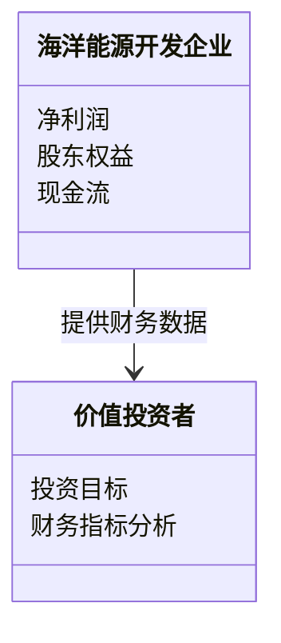
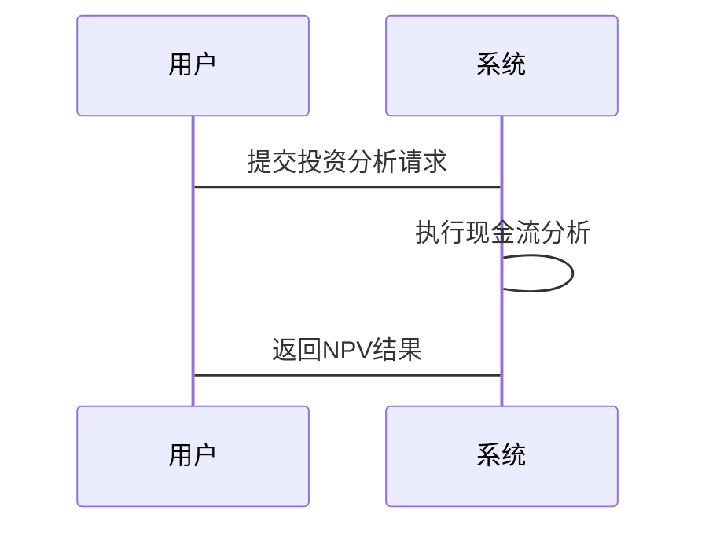

                 


# 价值投资中的海洋能源开发技术前景

---

## 关键词：
- 价值投资
- 海洋能源开发
- 技术前景
- 现金流分析
- 数学模型

---

## 摘要：
本文探讨了价值投资在海洋能源开发中的应用前景，分析了海洋能源的技术潜力、投资机会以及如何通过技术手段评估其投资价值。通过构建数学模型和算法，本文为投资者提供了科学的决策依据。

---

## 第一部分：引言

## 第1章：海洋能源开发与价值投资概述

### 1.1 海洋能源开发的背景与意义
#### 1.1.1 海洋能源的重要性
海洋能源包括潮汐能、波浪能、海流能等，是一种清洁且可再生能源，具有广阔的发展前景。

#### 1.1.2 海洋能源开发的现状
目前，全球海洋能源开发尚处于起步阶段，但技术进步迅速，投资潜力巨大。

#### 1.1.3 价值投资的核心概念
价值投资是一种通过分析企业基本面，寻找被市场低估的投资机会的方法。

---

## 第二部分：海洋能源开发技术背景

## 第2章：海洋能源开发技术的背景与现状

### 2.1 海洋能源的分类与特点
#### 2.1.1 潮汐能
潮汐能利用潮汐水位变化进行发电，技术成熟但受地理位置限制。

#### 2.1.2 波浪能
波浪能利用海浪的运动发电，技术多样但效率较低。

#### 2.1.3 海流能
海流能利用海水流动发电，技术潜力大但开发成本高。

### 2.2 海洋能源开发的技术挑战
#### 2.2.1 技术难题
如设备耐腐蚀性、能量转换效率等问题。

#### 2.2.2 成本问题
海洋能源开发初期投资大，回报周期长。

#### 2.2.3 环境影响
开发过程中可能对海洋生态造成影响。

### 2.3 全球海洋能源开发的现状
#### 2.3.1 主要国家的开发情况
如英国、挪威在潮汐能开发方面处于领先地位。

#### 2.3.2 技术进步与发展趋势
如新材料的应用和高效能转换技术的突破。

---

## 第三部分：价值投资的核心概念与分析框架

## 第3章：价值投资的核心要素

### 3.1 价值投资的基本原理
#### 3.1.1 市场有效性的假设
市场有时会出现非理性波动，价值投资者寻找被低估的资产。

#### 3.1.2 安全边际的概念
通过买入价格低于内在价值的资产，降低投资风险。

#### 3.1.3 财务指标的分析
如市盈率、市净率、股息率等指标的分析。

### 3.2 海洋能源开发企业的财务分析
#### 3.2.1 收益能力分析
如净利润增长率、ROE等指标。

#### 3.2.2 资产负债分析
如资产负债率、流动比率等指标。

#### 3.2.3 现金流分析
现金流是企业健康的重要指标，尤其对海洋能源开发企业。

### 3.3 投资价值的评估模型
#### 3.3.1 现金流贴现模型
通过DCF模型评估企业未来现金流的现值。

#### 3.3.2 市盈率与市净率分析
比较企业估值与行业平均水平的差异。

#### 3.3.3 股东权益分析
评估股东权益的增长潜力。

---

## 第四部分：算法原理与数学模型

## 第4章：算法原理与数学模型

### 4.1 现金流贴现模型的算法原理
#### 4.1.1 算法流程
1. 预测未来现金流。
2. 估计折现率。
3. 计算净现值（NPV）。
4. 评估投资可行性。

#### 4.1.2 算法实现
```python
def calculate_npv(cash_flows, discount_rate):
    npv = 0
    for i, cash_flow in enumerate(cash_flows):
        npv += cash_flow / (1 + discount_rate) ** i
    return npv
```

### 4.2 现金流模型的数学表达
$$ NPV = \sum_{t=0}^{n} \frac{CF_t}{(1 + r)^t} $$

其中：
- \( CF_t \) 表示第 \( t \) 年的现金流。
- \( r \) 表示折现率。

---

## 第五部分：系统分析与架构设计

## 第5章：系统分析与架构设计方案

### 5.1 项目场景介绍
设计一个评估海洋能源开发项目投资价值的系统。

### 5.2 系统功能设计
#### 5.2.1 领域模型


### 5.3 系统架构设计


### 5.4 系统接口设计


---

## 第六部分：项目实战

## 第6章：项目实战

### 6.1 环境安装
安装Python和必要的库，如numpy、pandas。

### 6.2 核心代码实现
```python
import numpy as np
import pandas as pd

def calculate_discounted_cash_flows(cash_flows, discount_rate):
    return np.npv(discount_rate, cash_flows)

# 示例数据
cash_flows = [-100, 50, 60, 70]
discount_rate = 0.1

result = calculate_discounted_cash_flows(cash_flows, discount_rate)
print("净现值:", result)
```

### 6.3 实际案例分析
分析一家海洋能源开发企业的现金流，计算其NPV。

### 6.4 项目小结
总结项目实施过程中的经验与教训。

---

## 第七部分：结论与展望

## 第7章：结论与展望

### 7.1 主要结论
价值投资在海洋能源开发中具有重要作用，需结合技术分析和财务分析。

### 7.2 投资建议
投资者应关注技术成熟、财务健康的企业。

### 7.3 注意事项
注意技术风险和市场波动。

### 7.4 未来展望
随着技术进步，海洋能源的投资价值将逐步显现。

---

## 参考文献
- 书籍：《价值投资实战策略》
- 网站：国际可再生能源机构（IRENA）报告

---

## 附录

### 附录A：关键术语解释
- 现金流：企业在一定时期内的资金流入和流出。

### 附录B：代码说明
详细解释上述代码的功能和实现细节。

---

## 作者
作者：AI天才研究院  
联系邮箱：info@aitiyanji.com  

--- 

**（完）**

