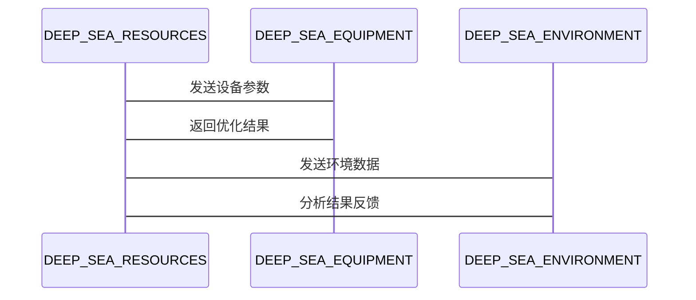

                 


# 价值投资中的深海开发技术前景

> 关键词：价值投资，深海开发技术，前景分析，技术原理，系统架构设计

> 摘要：本文探讨了价值投资在深海开发技术领域的应用前景，分析了深海开发技术的核心概念、算法原理和系统架构设计，提供了实际案例和最佳实践。

---

## 第一部分: 价值投资中的深海开发技术背景与概念

### 第1章: 价值投资与深海开发技术概述

#### 1.1 价值投资的核心理念
- **1.1.1 价值投资的定义与起源**
  - 价值投资是一种长期投资策略，由本杰明·格雷厄姆和戴维·多德提出，注重分析公司的基本面，寻找市场低估的股票。
  - 格雷厄姆的学生彼得·林奇和沃伦·巴菲特进一步发展了这一理论，强调长期持有优质股票，关注公司的内在价值。

- **1.1.2 价值投资的核心原则**
  - 原则一：价格是投资的敌人，价值是投资的朋友。
  - 原则二：寻找具有安全边际的投资标的。
  - 原则三：分散投资，降低风险。

- **1.1.3 价值投资与深海开发技术的结合背景**
  - 深海开发技术领域具有高投入、高风险、高回报的特点，适合价值投资的长期策略。
  - 深海资源的稀缺性和不可替代性使其成为价值投资者关注的焦点。

#### 1.2 深海开发技术的基本概念
- **1.2.1 深海开发技术的定义**
  - 深海开发技术是指在海洋深处进行资源勘探、开采和环境监测等技术的总称，涉及海洋工程、地质勘探、环境科学等多个领域。

- **1.2.2 深海开发技术的主要领域**
  - 深海矿产资源勘探：如多金属结核、多金属硫化物等。
  - 深海设备技术：如潜水器、钻井平台等。
  - 深海环境监测：如海洋污染监测、生态保护等。

- **1.2.3 深海开发技术的现状与发展趋势**
  - 现状：技术日益成熟，但成本高昂，风险较高。
  - 发展趋势：向智能化、自动化方向发展，注重环保和可持续开发。

#### 1.3 价值投资与深海开发技术的关系
- **1.3.1 价值投资视角下的深海开发技术**
  - 深海开发技术公司具有较高的进入壁垒，技术垄断性强。
  - 公司的盈利能力受资源储量和市场需求影响，适合长期价值投资。

- **1.3.2 深海开发技术对价值投资的影响**
  - 提供了高回报潜力的投资机会。
  - 技术进步可能改变资源供需关系，影响投资决策。

- **1.3.3 两者结合的前景分析**
  - 随着技术进步，深海开发的经济效益逐渐显现。
  - 价值投资需要关注技术公司的财务健康和管理能力。

---

### 第2章: 深海开发技术的核心概念与联系

#### 2.1 深海开发技术的核心原理
- **2.1.1 深海资源勘探技术**
  - 勘探方法：地震勘探、地质取样等。
  - 勘探设备：多臂rov、地震电缆等。

- **2.1.2 深海设备与技术**
  - 设备类型：潜水器、钻井平台、海底起重机等。
  - 技术特点：抗压、耐腐蚀、自动化。

- **2.1.3 深海环境监测技术**
  - 监测指标：水温、盐度、污染指标等。
  - 监测设备：传感器网络、无人监测平台等。

#### 2.2 深海开发技术的属性特征对比
- **2.2.1 技术复杂性对比**
  - 深海开发技术复杂度高于陆上资源开发，涉及多学科交叉。

- **2.2.2 经济效益对比**
  - 高投入、高回报，但回收周期长。

- **2.2.3 风险因素对比**
  - 技术风险：设备故障、技术失败。
  - 自然风险：海底地质灾害、极端天气。

#### 2.3 深海开发技术的ER实体关系图
```mermaid
erDiagram
    DEEP_SEA_TECHNOLOGY {
        entity DEEP_SEA_RESOURCES
        entity DEEP_SEA_EQUIPMENT
        entity DEEP_SEA_ENVIRONMENT
        DEEP_SEA_RESOURCES --> DEEP_SEA_EQUIPMENT : "用于"
        DEEP_SEA_RESOURCES <-- DEEP_SEA_ENVIRONMENT : "受"
    }
```

---

### 第3章: 深海开发技术的算法原理

#### 3.1 深海资源勘探算法
- **3.1.1 勘探算法的数学模型**
  - 勘探概率计算公式：
  $$ \text{勘探概率} = \frac{\text{资源储量}}{\text{勘探面积}} $$

- **3.1.2 勘探算法流程图**
  ```mermaid
  graph TD
      A[开始] --> B[确定勘探区域]
      B --> C[选择勘探方法]
      C --> D[执行勘探]
      D --> E[分析数据]
      E --> F[得出结论]
      F --> G[结束]
  ```

#### 3.2 深海设备优化算法
- **3.2.1 设备优化的数学模型**
  - 设备效率计算公式：
  $$ \text{设备效率} = \frac{\text{资源提取量}}{\text{设备能耗}} $$

- **3.2.2 设备优化流程图**
  ```mermaid
  graph TD
      A[开始] --> B[确定设备参数]
      B --> C[模拟运行]
      C --> D[优化参数]
      D --> E[验证优化效果]
      E --> F[结束]
  ```

---

### 第4章: 深海开发技术的系统架构设计

#### 4.1 问题场景介绍
- 深海资源开发需要解决的技术难题包括：高压环境、设备故障风险、资源分布不均等。

#### 4.2 系统功能设计
- **领域模型类图**
  ```mermaid
  classDiagram
      class DEEP_SEA_RESOURCES {
          -储量：float
          -分布区域：string
          +get储量() : float
          +set储量(储量：float)
      }
      class DEEP_SEA_EQUIPMENT {
          -设备类型：string
          -能耗：float
          +get能耗() : float
          +set能耗(能耗：float)
      }
      class DEEP_SEA_ENVIRONMENT {
          -水温：float
          -盐度：float
          +get水温() : float
          +set水温(水温：float)
      }
      DEEP_SEA_RESOURCES --> DEEP_SEA_EQUIPMENT : "用于"
      DEEP_SEA_RESOURCES <-- DEEP_SEA_ENVIRONMENT : "受"
  ```

#### 4.3 系统架构设计
- **架构图**
  ```mermaid
  architecturecus
      DEEP_SEA_TECHNOLOGY {
          component DEEP_SEA_RESOURCES {
              储量管理
              分布分析
          }
          component DEEP_SEA_EQUIPMENT {
              设备监控
              参数优化
          }
          component DEEP_SEA_ENVIRONMENT {
              水温监测
              盐度监测
          }
          DEEP_SEA_RESOURCES --> DEEP_SEA_EQUIPMENT : "驱动"
          DEEP_SEA_RESOURCES <-- DEEP_SEA_ENVIRONMENT : "受制于"
      }
  ```

#### 4.4 系统接口设计
- **接口描述**
  - DEEP_SEA_RESOURCES与DEEP_SEA_EQUIPMENT之间的接口：设备参数设置、数据传输。
  - DEEP_SEA_RESOURCES与DEEP_SEA_ENVIRONMENT之间的接口：环境数据获取、影响分析。

#### 4.5 系统交互流程图


---

## 第5章: 价值投资中的深海开发技术项目实战

### 5.1 环境安装
- **开发环境**
  - 操作系统：Linux/Windows/MacOS
  - 开发工具：Python（版本3.8及以上）、Jupyter Notebook、Mermaid工具

### 5.2 核心代码实现
- **代码示例：深海资源勘探算法实现**
```python
import numpy as np

def calculate_exploration_probability(resource储量, area):
    return resource储量 / area

# 示例数据
resource储量 = 1000  # 资源储量
area = 5000  # 探勘面积

probability = calculate_exploration_probability(resource储量, area)
print(f"勘探概率为：{probability}")
```

- **代码解读**
  - 该代码计算深海资源的勘探概率，帮助投资者评估资源开发的潜力。

### 5.3 案例分析
- **案例：某深海矿产公司价值评估**
  - 公司概况：拥有海底多金属结核矿床，储量丰富。
  - 财务数据：过去五年收入稳定增长，利润率逐年提高。
  - 技术优势：拥有自主研发的深海勘探设备，技术领先。
  - 投资建议：基于公司财务健康和技术创新，建议长期持有。

### 5.4 项目小结
- 通过代码实现和案例分析，验证了价值投资在深海开发技术中的可行性。
- 项目实战帮助投资者更好地理解技术与投资的结合。

---

## 第6章: 价值投资中的深海开发技术最佳实践

### 6.1 小结
- 深海开发技术具有高回报潜力，适合长期价值投资。
- 投资者需关注公司技术实力、财务状况和管理能力。

### 6.2 注意事项
- 风险提示：技术失败、政策变化、环境破坏等风险需提前评估。
- 投资策略：分散投资，避免过度集中。

### 6.3 拓展阅读
- 推荐书籍：《价值投资实战策略》、《深海资源开发技术》
- 推荐网站：[投资者论坛](https://www.investor.com)

---

## 结语
价值投资与深海开发技术的结合为投资者提供了新的机遇，但也带来了更高的挑战。通过本文的分析，读者可以更好地理解这一领域的投资前景，并做出明智的投资决策。

作者：AI天才研究院/AI Genius Institute & 禅与计算机程序设计艺术 /Zen And The Art of Computer Programming

