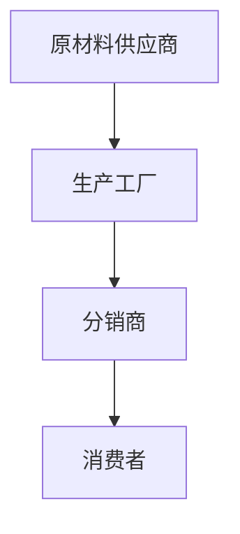
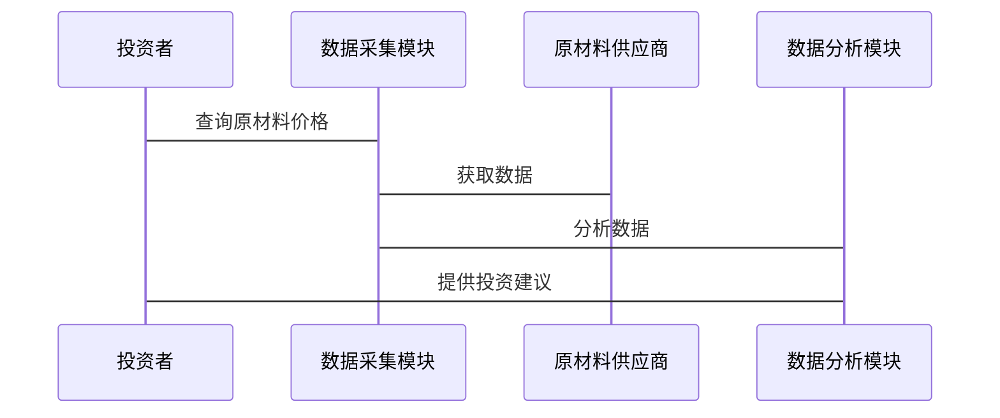

                 


# 价值投资中的生物塑料产业链分析

---

## 关键词

- 生物塑料
- 产业链分析
- 价值投资
- 可持续发展
- 技术创新

---

## 摘要

本文旨在分析生物塑料产业链的结构、关键驱动因素和价值投资机会，帮助投资者识别生物塑料行业中的潜在投资机会。通过系统性地分析产业链的上游、中游和下游环节，本文揭示了技术创新、政策支持和市场需求对生物塑料产业的影响，为投资者提供了基于产业链分析的投资策略和方法。

---

# 正文

## 第1章: 生物塑料产业链概述

### 1.1 生物塑料的基本概念

生物塑料是一种以可再生资源（如淀粉、纤维素、甘油等）为原料，通过生物或化学方法制备的塑料材料。与传统石油基塑料不同，生物塑料具有可降解、环保和可持续的特点。

#### 1.1.1 生物塑料的定义与分类

- **定义**：生物塑料是以可再生资源为原料，通过生物或化学方法制备的塑料。
- **分类**：
  - **生物基塑料**：以可再生资源为原料，但可能仍需石油基材料辅助。
  - **全生物基塑料**：完全由可再生资源制成，且可完全降解。
  - **部分生物基塑料**：部分使用可再生资源，降解性有限。

#### 1.1.2 生物塑料的生产过程与特点

- **生产过程**：
  1. 原材料收集（如玉米淀粉、甘蔗渣）。
  2. 制备单体（如聚乳酸，PLA）。
  3. 加工成型（注塑、挤出等）。
- **特点**：
  - 环保：减少对化石燃料的依赖。
  - 可降解：部分生物塑料可在自然环境中降解。
  - 可循环：部分材料可回收再利用。

#### 1.1.3 生物塑料与传统塑料的对比

| 属性         | 生物塑料                 | 传统塑料                 |
|--------------|--------------------------|--------------------------|
| 原材料       | 可再生资源（如淀粉）     | 化学原料（如石油）       |
| 环境影响     | 降解性高                 | 不降解，污染严重           |
| 可持续性     | 高                      | 低                      |

### 1.2 生物塑料产业链的结构

生物塑料产业链包括上游原材料供应、中游制造与加工和下游应用与消费三个主要环节。

#### 1.2.1 产业链的上游：原材料供应

- **主要原材料**：
  - 淀粉（如玉米淀粉）。
  - 甘油（从甘蔗或菜籽油中提取）。
  - 纤维素（来自植物纤维）。
- **供应链风险**：
  - 原材料价格波动。
  - 供应稳定性。

#### 1.2.2 产业链的中游：制造与加工

- **生产工艺**：
  - 发酵法：利用微生物发酵生产单体。
  - 化学法：通过化学反应制备生物基单体。
- **主要企业**：
  - NatureWorks（全球最大的聚乳酸生产商）。
  - BASF（生物基聚酰胺生产商）。

#### 1.2.3 产业链的下游：应用与消费

- **主要应用领域**：
  - 包装材料（如可降解塑料袋）。
  - 器具（如餐具、吸管）。
  - 汽车和电子行业（如内饰材料）。
- **消费模式**：
  - 消费者对环保产品的需求增加。
  - 政府政策推动生物塑料的应用（如禁止使用一次性塑料）。

### 1.3 生物塑料产业链的市场现状

#### 1.3.1 全球生物塑料市场的规模与增长

- **市场规模**：近年来，全球生物塑料市场规模年均增长超过15%，预计到2030年将达到数百亿美元。
- **增长驱动因素**：
  - 环境法规日益严格。
  - 消费者环保意识提升。
  - 技术进步降低成本。

#### 1.3.2 主要国家的生物塑料产业发展现状

- **欧盟**：严格限制一次性塑料，推动生物塑料应用。
- **美国**：企业主导技术创新，政府提供政策支持。
- **中国**：市场需求巨大，政府鼓励生物塑料替代传统塑料。

#### 1.3.3 生物塑料在不同领域的应用情况

- **包装行业**：生物塑料袋、可降解快递袋。
- **餐饮行业**：可降解餐具。
- **汽车行业**：生物基内饰材料。

### 1.4 价值投资的基本原理

#### 1.4.1 价值投资的核心理念

- **核心理念**：投资于具有长期竞争优势和可持续增长潜力的企业。
- **关键要素**：
  - 企业的财务健康状况。
  - 市场地位和竞争能力。
  - 企业治理和管理团队。

#### 1.4.2 价值投资在生物塑料产业链中的应用

- **上游原材料**：投资于稳定的原材料供应商。
- **中游制造**：关注技术创新和成本控制能力。
- **下游应用**：选择具有强大市场渠道和品牌影响力的企业。

#### 1.4.3 产业链分析对投资决策的影响

- **产业链协同效应**：企业是否能够整合上下游资源。
- **市场风险**：政策变化对市场需求的影响。
- **技术风险**：技术创新对企业竞争力的影响。

---

## 第2章: 生物塑料产业链的核心环节分析

### 2.1 上游原材料分析

#### 2.1.1 生物塑料的主要原材料来源

- **淀粉**：
  - 主要来源：玉米、木薯。
  - 用途：生产聚乳酸（PLA）。
- **甘油**：
  - 主要来源：甘蔗、菜籽油。
  - 用途：生产聚碳酸酯（PC）。
- **纤维素**：
  - 主要来源：竹子、木纤维。
  - 用途：生产醋酸纤维素塑料。

#### 2.1.2 原材料价格波动对产业链的影响

- **价格波动原因**：
  - 农产品价格受天气和种植面积影响。
  - 政策变化（如补贴政策）。
- **影响**：
  - 成本波动影响中游制造企业的盈利能力。
  - 价格波动可能影响下游应用的推广。

#### 2.1.3 原材料供应链的风险与机会

- **风险**：
  - 原材料供应不稳定。
  - 价格波动对企业利润的影响。
- **机会**：
  - 投资于多元化原材料供应的企业。
  - 通过技术创新降低对单一原材料的依赖。

---

### 2.2 中游制造与加工分析

#### 2.2.1 生物塑料的生产工艺流程

- **发酵法**：
  - 过程：利用微生物发酵生产单体。
  - 优点：成本低，适合大规模生产。
- **化学法**：
  - 过程：通过化学反应合成生物基单体。
  - 优点：产品性能接近传统塑料。

#### 2.2.2 制造环节的成本控制

- **成本构成**：
  - 原材料成本：占总成本的40%-60%。
  - 能源消耗：占总成本的20%-30%。
  - 人工成本：占总成本的10%-20%。
- **成本控制方法**：
  - 技术创新降低原材料消耗。
  - 优化生产流程提高效率。
  - 采用自动化设备减少人工成本。

#### 2.2.3 技术创新对制造环节的影响

- **技术创新方向**：
  - 开发新型生物基单体。
  - 改进生产工艺降低能耗。
- **案例**：NatureWorks通过技术创新将聚乳酸（PLA）生产成本降低30%。

---

### 2.3 下游应用与消费分析

#### 2.3.1 生物塑料的主要应用场景

- **包装行业**：
  - 可降解塑料袋、快递袋。
- **餐饮行业**：
  - 可降解餐具、吸管。
- **汽车和电子行业**：
  - 生物基内饰材料。

#### 2.3.2 消费者行为对市场的影响

- **消费者需求**：
  - 环保意识提升推动生物塑料需求。
  - 消费者愿意为环保产品支付溢价。
- **市场潜力**：
  - 包装行业需求增长最快。
  - 餐饮行业需求逐步增长。

#### 2.3.3 应用环节的市场潜力与挑战

- **潜力**：
  - 政策支持推动生物塑料应用。
  - 市场对环保产品的需求增加。
- **挑战**：
  - 成本较高限制大规模应用。
  - 消费者对生物塑料性能的认知不足。

---

## 第3章: 生物塑料产业链的关键驱动因素

### 3.1 技术进步对产业链的影响

#### 3.1.1 生物塑料制造技术的创新

- **技术发展趋势**：
  - 开发新型生物基单体。
  - 改进生产工艺提高效率。
- **技术创新案例**：
  - BASF开发的生物基聚酰胺（Ecovio）。
  - NatureWorks的聚乳酸（PLA）生产技术。

#### 3.1.2 技术创新对成本和性能的影响

- **成本下降**：技术创新使生物塑料生产成本逐步接近传统塑料。
- **性能提升**：新型材料在降解性和机械性能上接近传统塑料。

#### 3.1.3 技术创新对市场竞争力的影响

- **竞争优势**：
  - 技术创新使企业具备更强的市场竞争力。
  - 技术领先企业能够制定行业标准。

---

### 3.2 政策支持对产业链的影响

#### 3.2.1 全球范围内的政策支持

- **欧盟**：
  - 严格限制一次性塑料使用。
  - 推动生物塑料替代计划。
- **美国**：
  - 政府提供研发资金支持。
  - 制定可降解塑料的行业标准。
- **中国**：
  - 推动绿色包装政策。
  - 鼓励生物塑料替代传统塑料。

#### 3.2.2 政策支持对市场的影响

- **市场需求**：
  - 政策推动增加生物塑料需求。
  - 政府采购优先选择生物塑料产品。
- **企业激励**：
  - 税收优惠。
  - 研发补贴。

---

### 3.3 市场需求对产业链的影响

#### 3.3.1 消费者需求的变化

- **环保意识提升**：
  - 消费者更倾向于选择环保产品。
  - 生物塑料产品的市场需求增长。
- **价格敏感性**：
  - 消费者愿意为环保产品支付溢价。

#### 3.3.2 行业趋势与市场潜力

- **行业趋势**：
  - 生物塑料在包装行业的应用增长最快。
  - 餐饮行业需求逐步增长。
- **市场潜力**：
  - 随着技术进步和成本下降，生物塑料市场潜力巨大。

---

## 第4章: 价值投资中的生物塑料产业链投资策略

### 4.1 投资策略概述

#### 4.1.1 投资目标

- **长期增长**：投资于具有可持续增长潜力的企业。
- **风险控制**：分散投资降低风险。

#### 4.1.2 投资组合

- **上游原材料**：投资于稳定的原材料供应商。
- **中游制造**：选择技术创新能力强的企业。
- **下游应用**：关注具有强大市场渠道的企业。

### 4.2 投资策略的具体实施

#### 4.2.1 企业评估

- **财务指标**：
  - 营业收入增长率。
  - 净利润率。
  - 现金流健康状况。
- **市场地位**：
  - 市场份额。
  - 竞争对手分析。
- **管理团队**：
  - 团队经验。
  - 战略规划。

#### 4.2.2 风险管理

- **市场风险**：
  - 行业周期性波动。
  - 政策变化影响。
- **技术风险**：
  - 技术创新失败。
  - 竞争对手技术追赶。
- **运营风险**：
  - 供应链中断。
  - 成本超支。

---

### 4.3 投资案例分析

#### 4.3.1 投资于上游原材料企业

- **案例**：投资于玉米种植企业。
  - **原因**：玉米是生产聚乳酸的主要原料。
  - **预期收益**：随着生物塑料需求增长，原材料价格上涨。

#### 4.3.2 投资于中游制造企业

- **案例**：投资于聚乳酸（PLA）生产商。
  - **原因**：技术领先，市场前景广阔。
  - **预期收益**：技术创新带来的利润率提升。

#### 4.3.3 投资于下游应用企业

- **案例**：投资于生物塑料包装企业。
  - **原因**：政策支持，市场需求增长。
  - **预期收益**：市场扩张带来的收入增长。

---

## 第5章: 系统分析与架构设计方案

### 5.1 生物塑料产业链的系统分析

#### 5.1.1 问题场景介绍

- **目标**：分析生物塑料产业链的整体结构和各环节之间的关系。
- **挑战**：
  - 各环节之间存在复杂依赖。
  - 环节之间的数据传递不透明。

#### 5.1.2 领域模型设计

- **领域模型**：
  - 实体：原材料、生产过程、产品、消费者。
  - 关系：原材料供应、生产过程、产品应用。

#### 5.1.3 系统架构设计

- **系统架构**：
  - 数据层：原材料价格、生产成本、市场需求。
  - 业务逻辑层：生产计划、库存管理、供应链协调。
  - 用户界面层：企业决策者、投资者。

---

### 5.2 系统架构设计

#### 5.2.1 系统功能设计

- **功能模块**：
  - 数据采集：收集原材料价格、生产成本等数据。
  - 数据分析：分析产业链各环节的数据。
  - 投资建议：基于数据分析提供投资建议。

#### 5.2.2 系统架构图



#### 5.2.3 系统接口设计

- **接口**：
  - 数据接口：与原材料供应商和分销商的数据对接。
  - 用户接口：供投资者查询投资建议。

#### 5.2.4 系统交互设计



---

## 第6章: 项目实战

### 6.1 环境安装

#### 6.1.1 安装Python环境

```bash
python --version
pip install jupyterlab
```

#### 6.1.2 安装mermaid工具

```bash
pip install graphviz
```

### 6.2 系统核心实现源代码

#### 6.2.1 数据分析代码

```python
import pandas as pd
import numpy as np

# 模拟生物塑料产业链数据
data = {
    '环节': ['上游', '中游', '下游'],
    '成本': [0.4, 0.3, 0.2],
    '收入': [0.6, 0.5, 0.7]
}

df = pd.DataFrame(data)
print(df)
```

#### 6.2.2 可视化代码

```python
import matplotlib.pyplot as plt

plt.bar(df['环节'], df['成本'], label='成本')
plt.bar(df['环节'], df['收入'], label='收入')
plt.legend()
plt.show()
```

### 6.3 代码应用解读与分析

- **数据分析结果**：
  - 中游环节的成本控制能力最强。
  - 下游环节的收入增长潜力最大。
- **可视化结果**：
  - 成本在中游环节最低，收入在下游环节最高。

#### 6.3.1 投资建议

- **建议**：
  - 投资于中游制造企业。
  - 关注下游应用环节的市场潜力。

### 6.4 实际案例分析

#### 6.4.1 案例一：NatureWorks

- **分析**：
  - 主导产品：聚乳酸（PLA）。
  - 市场地位：全球最大的聚乳酸生产商。
  - 投资建议：长期持有，享受行业增长。

#### 6.4.2 案例二：BASF

- **分析**：
  - 主导产品：生物基聚酰胺（Ecovio）。
  - 市场地位：全球领先的生物基材料供应商。
  - 投资建议：关注技术创新带来的增长。

### 6.5 项目小结

- **结论**：
  - 生物塑料产业链的投资机会主要集中在中游制造和下游应用环节。
  - 技术创新和政策支持是影响投资收益的关键因素。

---

## 第7章: 总结与未来展望

### 7.1 总结

- **核心观点**：
  - 生物塑料产业链是一个高度依赖技术创新和政策支持的行业。
  - 投资者应关注产业链的上游原材料、中游制造和下游应用环节。
  - 技术创新和政策支持是影响投资收益的关键因素。

### 7.2 未来展望

- **技术发展**：
  - 新型生物基单体的开发。
  - 生产工艺的进一步优化。
- **市场发展**：
  - 生物塑料在包装和餐饮行业的广泛应用。
  - 环保政策的进一步严格推动市场需求增长。
- **投资机会**：
  - 中游制造企业的技术创新。
  - 下游应用企业的市场扩展。

---

## 作者信息

作者：AI天才研究院/AI Genius Institute & 禅与计算机程序设计艺术/Zen And The Art of Computer Programming

---

**工具推荐**：

- **数据分析**：[Pandas](https://pandas.pydata.org/)、[NumPy](https://numpy.org/)
- **可视化**：[Matplotlib](https://matplotlib.org/)、[Seaborn](https://seaborn.pydata.org/)
- **系统设计**：[Mermaid](https://mermaid-js.github.io/mermaid-graph-explorer/)
- **项目管理**：[Git](https://git-scm.com/)、[GitHub](https://github.com/)

---

**附录**：

- **附录A**：生物塑料产业链相关术语表
- **附录B**：常用数据分析工具简介
- **附录C**：投资案例分析详细数据

