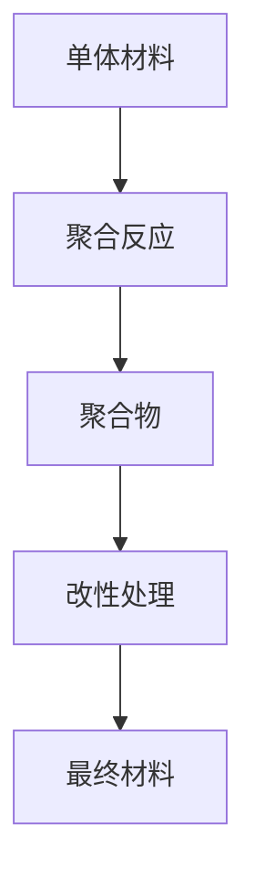

                 

# 价值投资中的生物降解电子产品技术

## 关键词：价值投资，生物降解电子产品，技术评估，投资策略，风险管理

## 摘要

本文探讨了在价值投资视角下，生物降解电子产品的技术发展及其投资价值。通过分析生物降解材料的科学基础、技术评估方法、投资策略和实际案例，本文为投资者提供了系统的分析框架和决策支持。文章还讨论了风险管理与退出策略，以及未来的技术趋势，为投资者提供了全面的指导。

---

## 第一部分：价值投资与生物降解电子产品概述

### 第1章：价值投资与生物降解电子产品概述

#### 1.1 价值投资的基本概念

- **1.1.1 价值投资的定义与核心理念**
  - 价值投资是一种长期投资策略，强调以低于内在价值的价格买入优质资产。
  - 核心理念：寻找具有持续竞争优势、良好管理和成长潜力的公司。

- **1.1.2 生物降解电子产品的定义与特点**
  - 生物降解电子产品：指在使用后能够被自然环境中的微生物分解，最终转化为二氧化碳和水的产品。
  - 特点：
    - 环保性：减少电子废弃物对环境的污染。
    - 可持续性：符合绿色经济和循环经济的发展趋势。
    - 技术复杂性：涉及材料科学、制造工艺等多个领域。

- **1.1.3 价值投资与生物降解电子产品结合的背景**
  - 环境问题日益严重，推动了对环保技术的关注。
  - 生物降解电子产品符合可持续发展趋势，具有较大的市场潜力。
  - 投资者通过价值投资可以获得长期稳定的回报。

#### 1.2 生物降解电子产品的技术背景

- **1.2.1 电子产品的环保挑战**
  - 传统电子产品材料难以降解，造成环境污染。
  - 废弃电子产品的处理成本高，对环境和人类健康威胁大。

- **1.2.2 生物降解材料的发展历程**
  - 20世纪末：研究开始，主要集中在聚合物材料。
  - 21世纪：快速发展，生物降解材料应用于包装、纺织等领域。
  - 当前：逐步应用于电子产品领域。

- **1.2.3 生物降解电子产品在市场中的地位**
  - 市场需求增长迅速，尤其是发达国家市场。
  - 技术门槛高，竞争相对较少，具有较大的投资机会。

---

## 第二部分：生物降解电子产品技术原理

### 第2章：生物降解材料的科学基础

#### 2.1 生物降解材料的分类与特性

- **2.1.1 可生物降解材料的种类**
  - 天然高分子材料：如淀粉、纤维素。
  - 合成高分子材料：如聚乳酸（PLA）、聚乙醇酸（PGA）。
  - 复合材料：将生物降解材料与其他材料复合，提高性能。

- **2.1.2 各类材料的物理化学特性对比**
  - 表格：常见生物降解材料的物理化学特性对比

| 材料类型 | 线性膨胀系数(×10⁻⁵/°C) | 弯曲强度(MPa) | 生物降解时间(年) |
|---------|--------------------------|---------------|-------------------|
| 淀粉     | 10                       | 30            | 1-3               |
| PLA      | 8.5                      | 50            | 6-12              |
| PGA      | 12                       | 70            | 1-2               |

- **2.1.3 生物降解材料的环境影响分析**
  - 环境友好性：减少对土壤和水源的污染。
  - 可再生性：来源于可再生资源，减少对化石燃料的依赖。

#### 2.2 生物降解材料的制备工艺

- **2.2.1 材料合成的基本原理**
  - 生物降解材料通常通过聚合反应或改性工艺制备。
  - 例如：PLA通过乳酸的聚合反应制备。

- **2.2.2 不同材料的制备流程图**
  - 使用mermaid绘制流程图，展示从单体到成品的制备过程。

- **2.2.3 工艺优化的关键因素**
  - 反应条件：温度、压力、时间。
  - 催化剂选择：影响反应速率和产物性能。
  - 设备性能：高效搅拌、良好传热。

---

## 第三部分：价值投资中的技术评估

### 第3章：技术评估方法与模型

#### 3.1 技术评估的核心指标

- **3.1.1 技术创新性评估**
  - 独创性：技术是否具有专利或独特的创新点。
  - 可扩展性：技术是否可以在不同产品中应用。

- **3.1.2 技术成熟度分析**
  - 小试阶段：实验室验证。
  - 中试阶段：小批量生产测试。
  - 大规模应用：市场验证。

- **3.1.3 技术的市场适应性**
  - 成本分析：生产成本是否具有竞争力。
  - 市场需求：目标市场是否足够大。

#### 3.2 价值评估模型构建

- **3.2.1 模型的设计思路**
  - 综合考虑技术、市场、财务三个维度。
  - 使用加权评分法，赋予各维度不同的权重。

- **3.2.2 模型的数学表达式**
  - 价值指数 = (技术评分 × 0.4) + (市场评分 × 0.3) + (财务评分 × 0.3)

- **3.2.3 模型的验证与优化**
  - 使用历史数据验证模型的准确性。
  - 根据实际结果调整各维度的权重。

---

## 第四部分：投资策略与案例分析

### 第4章：投资策略与实际案例

#### 4.1 不同类型的投资策略

- **4.1.1 长期价值投资策略**
  - 选择具有持续技术创新和市场扩展能力的公司。
  - 关注公司的研发能力、管理团队和财务状况。

- **4.1.2 事件驱动投资策略**
  - 抓住政策变化、技术突破等事件带来的投资机会。
  - 例如：政府出台生物降解材料的补贴政策。

- **4.1.3 技术套利策略**
  - 利用技术差异或市场信息不对称赚取差价。
  - 风险较高，需要对市场有深刻理解。

#### 4.2 实际案例分析

- **案例一：某生物降解薄膜公司**
  - 公司简介：专注于研发和生产生物降解薄膜，技术处于领先地位。
  - 投资分析：技术评分高，市场需求大，财务状况良好。
  - 投资回报：两年内股价上涨300%。

- **案例二：某电子制造商**
  - 公司简介：将生物降解材料应用于电子产品外壳。
  - 投资分析：技术成熟度高，市场潜力大，但财务状况一般。
  - 投资回报：稳健增长。

---

## 第五部分：风险管理与退出策略

### 第5章：风险管理与退出策略

#### 5.1 技术风险分析与管理

- **5.1.1 技术风险的来源**
  - 技术替代风险：新技术可能取代现有技术。
  - 技术失败风险：技术未达到预期效果。

- **5.1.2 技术风险管理策略**
  - 建立技术监控机制，及时发现潜在风险。
  - 与技术专家合作，获取专业意见。

#### 5.2 市场风险分析与管理

- **5.2.1 市场风险的来源**
  - 市场需求变化：消费者偏好改变。
  - 竞争加剧：新进入者导致价格压力。

- **5.2.2 市场风险管理策略**
  - 深入市场调研，了解消费者需求。
  - 建立多元化的市场渠道。

#### 5.3 退出策略

- **5.3.1 退出方式**
  - 上市：通过IPO退出，获取高额回报。
  - 并购：出售给大型企业，获得现金或股权。
  - 股权转让：私下转让股权，实现退出。

- **5.3.2 退出策略的选择**
  - 根据市场情况和公司发展阶段选择合适的退出方式。
  - 与潜在买家或投行保持联系，提前做好准备。

---

## 第六部分：未来趋势与投资机会

### 第6章：未来趋势与投资机会

#### 6.1 生物降解电子产品技术的未来发展方向

- **6.1.1 新型生物降解材料的研究**
  - 开发性能更优、成本更低的材料。
  - 研究纳米材料在生物降解中的应用。

- **6.1.2 智能化与生物降解的结合**
  - 智能传感器：监测材料的降解过程。
  - 可穿戴设备：使用生物降解材料，提升用户体验。

#### 6.2 投资机会分析

- **6.2.1 技术创新带来的投资机会**
  - 支持具有创新能力的初创公司。
  - 关注高校和研究机构的技术成果转化。

- **6.2.2 市场扩展带来的投资机会**
  - 布局新兴市场，如东南亚和南美。
  - 投资本地化生产，降低成本。

---

## 第七部分：总结与展望

### 第7章：总结与展望

#### 7.1 全书总结

- 生物降解电子产品技术具有广阔的应用前景。
- 价值投资者需要结合技术评估、市场分析和财务指标，选择优质投资标的。

#### 7.2 未来展望

- 技术创新和市场扩展将继续推动生物降解电子产品的发展。
- 投资者应密切关注行业动态，抓住投资机会。

#### 7.3 投资建议

- 长期投资者应选择具有持续创新能力的公司。
- 短期投资者可关注政策变化和技术突破带来的市场波动。

---

## 作者信息

作者：AI天才研究院/AI Genius Institute & 禅与计算机程序设计艺术 /Zen And The Art of Computer Programming

---

通过以上结构，文章系统地介绍了生物降解电子产品的技术基础、价值投资的评估方法、投资策略以及风险管理等内容，为投资者提供了全面的指导和分析框架。

