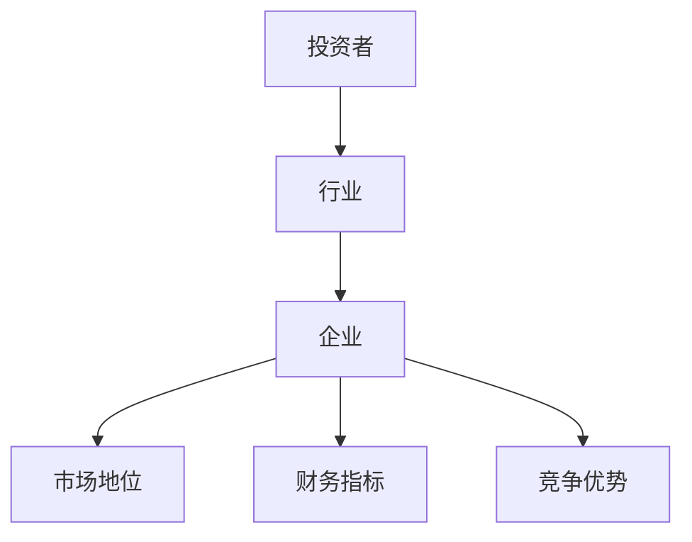
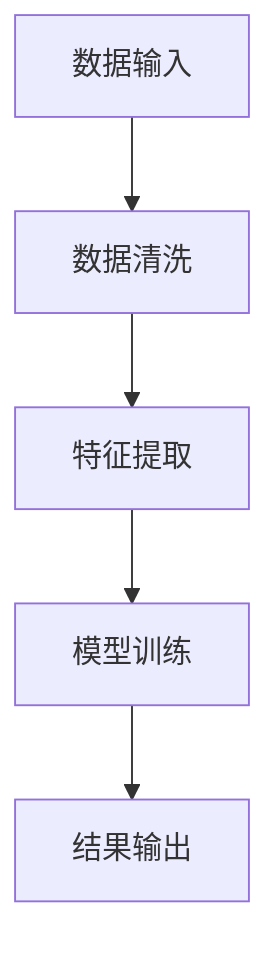
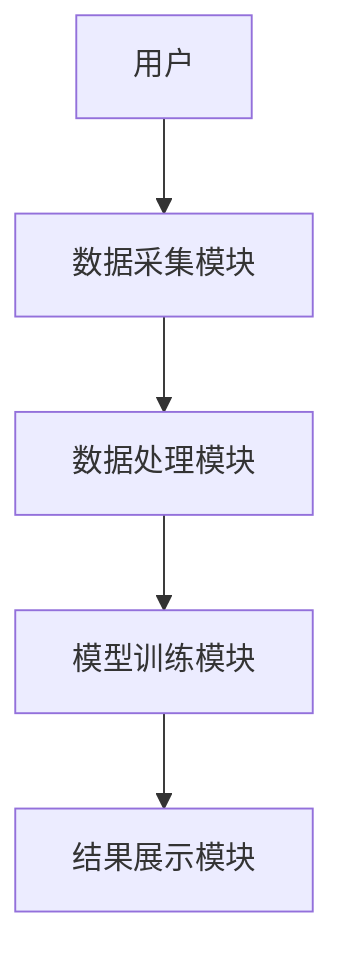
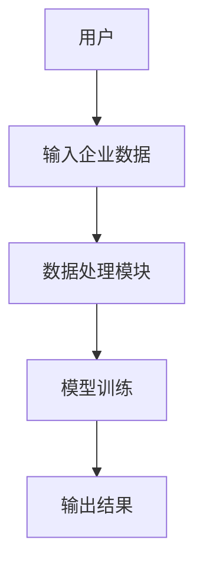

                 


# 价值投资中的行业领导者识别

> 关键词：价值投资、行业领导者、数据分析、投资策略、机器学习

> 摘要：本文深入探讨了价值投资中的行业领导者识别方法，结合技术分析和机器学习算法，提供了系统化的识别标准和实战案例，帮助投资者在复杂市场中找到优质投资标的。

---

# 第一部分: 价值投资的背景与概念

## # 第1章: 价值投资的定义与核心理念

### ## 1.1 价值投资的定义与核心理念
- ### 1.1.1 价值投资的起源与发展
  - 价值投资起源于20世纪初，由本杰明·格雷厄姆和戴维·多德提出，强调以低于内在价值的价格买入优质股票。
  - 20世纪70年代，彼得·林奇等投资者进一步发展了价值投资策略，使其更加多元化和实战化。
- ### 1.1.2 价值投资的核心理念与原则
  - 买入被市场低估的股票，长期持有，等待其价值回归。
  - 重点关注企业的基本面，如盈利能力、财务健康和行业地位。
  - 风险控制是价值投资的重要原则，避免过度杠杆和非系统性风险。
- ### 1.1.3 价值投资与成长投资的区别
  - 价值投资注重低估值和安全边际，而成长投资注重高成长性和未来潜力。
  - 价值投资者倾向于投资成熟企业，而成长投资者倾向于投资新兴行业。

### ## 1.2 行业领导者的定义与特征
- ### 1.2.1 行业领导者的定义
  - 行业领导者是指在行业内具有显著竞争优势、市场份额和品牌影响力的企业。
  - 这类企业通常具有较高的利润率和稳定的现金流。
- ### 1.2.2 行业领导者的特征与优势
  - 市场份额高，具有定价权。
  - 财务状况健康，盈利能力强。
  - 具有强大的竞争优势，如技术壁垒、成本优势或品牌影响力。
- ### 1.2.3 行业领导者与普通企业的对比分析
  - 普通企业可能在某一领域表现优异，但缺乏全局竞争优势。
  - 行业领导者通常具有更强的抗风险能力和长期增长潜力。

### ## 1.3 价值投资与行业领导者的关系
- ### 1.3.1 价值投资的核心目标
  - 寻找具有长期竞争优势的行业领导者，以低于其内在价值的价格买入。
- ### 1.3.2 行业领导者在价值投资中的重要性
  - 行业领导者通常具有较高的安全边际和长期增长潜力。
  - 选择行业领导者可以降低投资风险，提高投资回报率。
- ### 1.3.3 价值投资视角下的行业领导者识别标准
  - 公司治理结构优秀，管理层稳定且有战略眼光。
  - 具有持续的创新能力，能够适应市场变化。
  - 财务状况健康，具有较强的盈利能力和现金流。

---

# 第二部分: 行业领导者识别标准

## # 第2章: 市场地位分析

### ## 2.1 市场占有率的计算与分析
- 市场占有率是衡量企业市场地位的重要指标，通常通过市场份额计算公式：
  $$ \text{市场占有率} = \frac{\text{企业销售额}}{\text{行业总销售额}} \times 100\% $$
- 高市场占有率表明企业在行业内具有较强的竞争力。

### ## 2.2 行业集中度与竞争格局
- 行业集中度高通常意味着行业内领导企业的市场份额较大。
- 使用赫芬达尔-赫希曼指数（HHI）衡量行业集中度：
  $$ \text{HHI} = \sum_{i=1}^{n} s_i^2 $$
  其中，\( s_i \) 是第i家企业的市场份额占比。

### ## 2.3 品牌影响力评估
- 品牌影响力是衡量企业市场地位的重要因素，通常通过品牌价值评估模型进行衡量。

## # 第3章: 财务指标分析

### ## 3.1 财务健康状况的评估指标
- 关键财务指标包括：
  - 净利润增长率：$$ \text{净利润增长率} = \frac{\text{本期净利润} - \text{上期净利润}}{\text{上期净利润}} \times 100\% $$
  - 资产负债率：$$ \text{资产负债率} = \frac{\text{总负债}}{\text{总资产}} \times 100\% $$
  - 现金流健康：关注经营活动现金流是否为正。

### ## 3.2 盈利能力分析与财务比率
- 核心财务比率包括：
  - 净资产收益率（ROE）：$$ \text{ROE} = \frac{\text{净利润}}{\text{净资产}} $$
  - 毛利率：$$ \text{毛利率} = \frac{\text{营业收入} - \text{营业成本}}{\text{营业收入}} \times 100\% $$

### ## 3.3 现金流与资产负债表分析
- 强调现金流的重要性，健康的现金流是企业长期发展的保障。

## # 第4章: 竞争优势分析

### ## 4.1 核心竞争力的定义与评估
- 核心竞争力是企业长期竞争优势的来源，通常包括技术创新、成本优势和商业模式创新。

### ## 4.2 技术壁垒与竞争优势
- 技术壁垒高，竞争对手难以复制，企业具有较强的定价权。

### ## 4.3 供应链与成本优势
- 优秀的供应链管理和成本控制能力是行业领导者的重要特征。

---

# 第三部分: 行业领导者识别的核心概念与联系

## # 第5章: 核心概念原理

### ## 5.1 价值投资中的行业领导者的识别逻辑
- 综合考虑市场地位、财务指标和竞争优势，构建多维度评估体系。

### ## 5.2 概念属性特征对比表格
| 特性                | 行业领导者                     | 成长型企业                   |
|---------------------|-------------------------------|-----------------------------|
| 市场地位            | 高市场份额                   | 中等市场份额               |
| 财务指标            | 高利润率和稳定现金流         | 利润率较高，现金流不稳定   |
| 竞争优势           | 强大的技术壁垒和成本优势     | 技术创新能力强             |

### ## 5.3 ER实体关系图架构


---

# 第四部分: 行业领导者识别的算法原理

## # 第6章: 数据挖掘与机器学习在行业领导者识别中的应用

### ## 6.1 数据预处理与特征提取
- 数据清洗：处理缺失值、异常值和重复数据。
- 特征提取：从财务数据、市场数据和文本数据中提取特征。

### ## 6.2 机器学习算法的选择与应用
- 使用聚类分析和回归分析。
- 算法流程图：


### ## 6.3 数学模型与公式
- 使用多元线性回归模型：
  $$ y = \beta_0 + \beta_1x_1 + \beta_2x_2 + \cdots + \beta_nx_n + \epsilon $$
  其中，\( y \) 是目标变量，\( x_i \) 是特征变量，\( \beta \) 是回归系数。

---

# 第五部分: 系统分析与架构设计方案

## # 第7章: 系统功能设计

### ## 7.1 项目介绍
- 开发一个基于机器学习的行业领导者识别系统，帮助投资者快速筛选优质标的。

### ## 7.2 系统架构设计


### ## 7.3 系统交互流程图


---

# 第六部分: 项目实战

## # 第8章: 环境安装与系统实现

### ## 8.1 环境安装
- 安装Python、Pandas、Scikit-learn等库。

### ## 8.2 核心代码实现
```python
import pandas as pd
from sklearn.linear_model import LinearRegression

# 数据加载
data = pd.read_csv('industry_data.csv')

# 特征与目标变量分离
X = data.drop('label', axis=1)
y = data['label']

# 模型训练
model = LinearRegression()
model.fit(X, y)

# 模型预测
predictions = model.predict(X)
```

---

# 第七部分: 总结与最佳实践

## # 第9章: 总结

### ## 9.1 项目小结
- 本文系统地介绍了价值投资中的行业领导者识别方法，结合技术分析和机器学习算法，提供了实战案例和系统设计。

## # 第10章: 最佳实践 tips

### ## 10.1 注意事项
- 投资有风险，需谨慎选择标的。
- 定期复盘和调整投资策略。

### ## 10.2 拓展阅读
- 推荐阅读《价值投资入门》和《Python机器学习实战》。

---

作者：AI天才研究院/AI Genius Institute & 禅与计算机程序设计艺术 /Zen And The Art of Computer Programming

