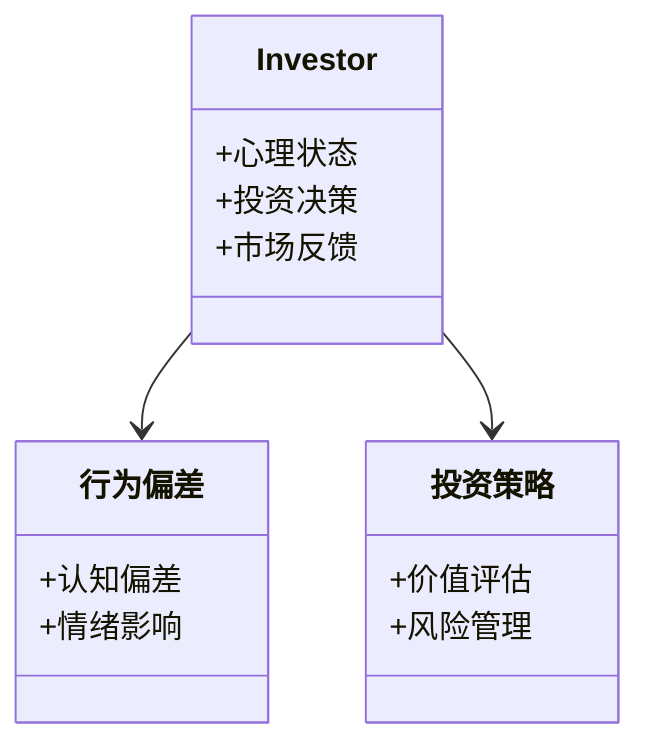
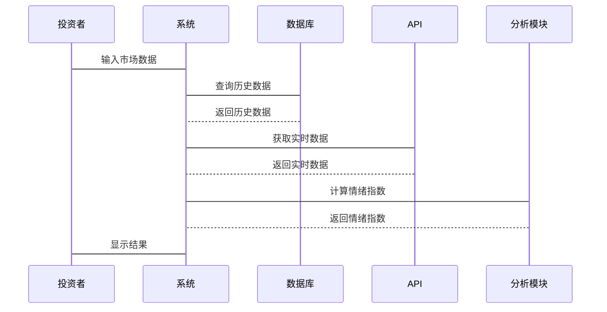

                 


# 价值投资中的行为金融学：克服自身偏见

## 关键词：
- 价值投资
- 行为金融学
- 投资决策
- 认知偏差
- 情绪影响
- 理性决策

## 摘要：
价值投资是一种基于对公司内在价值评估的投资策略，而行为金融学则研究了投资者在决策过程中受到的心理和行为偏差的影响。本文将深入探讨在价值投资中如何运用行为金融学的理论和方法，识别并克服投资者自身的认知偏差和情绪影响，从而做出更理性的投资决策。通过分析行为金融学的核心概念、数学模型以及实际案例，本文旨在为投资者提供一套克服偏见的工具和方法，帮助他们在复杂的金融市场中实现长期稳健的投资回报。

---

# 第1章: 价值投资与行为金融学概述

## 1.1 价值投资的基本概念

### 1.1.1 价值投资的定义
价值投资是一种以公司基本面分析为基础的投资策略，旨在通过识别市场价格与内在价值之间的差异，寻找被低估的投资标的。其核心理念是购买低于内在价值的资产，并长期持有，等待市场对其价值的重新评估。

$$\text{价值投资的核心公式：} \text{市场价格} < \text{内在价值}$$

### 1.1.2 价值投资的核心理念
价值投资强调安全边际、长期视角和逆向思维。投资者需要在市场恐慌时寻找机会，在市场狂热时保持冷静。

### 1.1.3 价值投资的历史与发展
价值投资的鼻祖是本杰明·格雷厄姆，他提出的“安全边际”概念为现代价值投资奠定了基础。后来的投资者如菲利普·费雪和沃伦·巴菲特进一步发展了这一理论。

## 1.2 行为金融学的基本概念

### 1.2.1 行为金融学的定义
行为金融学是研究投资者在金融市场中的行为偏差和情绪影响的学科。它结合了心理学、行为学和经济学的理论，试图解释和预测投资者的决策过程。

### 1.2.2 行为金融学与传统金融学的区别
- **传统金融学**：假设投资者是理性的，市场是有效的，价格反映所有可用信息。
- **行为金融学**：承认投资者是有限理性的，市场存在非有效性的行为偏差。

### 1.2.3 行为金融学的核心理论
行为金融学的核心理论包括前景理论、损失厌恶和羊群效应等，这些理论揭示了投资者在决策中的非理性行为。

## 1.3 价值投资与行为金融学的联系

### 1.3.1 价值投资中的行为偏差
价值投资者在实践中也容易受到行为偏差的影响，例如过度自信、损失厌恶和确认偏差。

### 1.3.2 行为金融学对价值投资的启示
行为金融学帮助价值投资者识别和克服自身的行为偏差，从而更理性地执行投资策略。

### 1.3.3 价值投资中的行为决策分析
通过行为金融学的框架，投资者可以更好地理解自己的决策过程，避免情绪化决策。

## 1.4 本章小结
本章介绍了价值投资和行为金融学的基本概念，并探讨了它们之间的联系。行为金融学为价值投资者提供了一个分析自身偏见的框架，从而帮助他们做出更理性的决策。

---

# 第2章: 行为金融学的核心概念

## 2.1 行为偏差与认知偏差

### 2.1.1 行为偏差的定义与分类
行为偏差是投资者在决策过程中因心理因素导致的非理性行为。常见的行为偏差包括过度自信、损失厌恶和从众心理。

### 2.1.2 认知偏差的定义与分类
认知偏差是人们对信息处理和判断中的系统性错误。例如，确认偏差、锚定效应和忽略沉没成本等。

### 2.1.3 常见的行为偏差与认知偏差对比
| 行为偏差       | 认知偏差       |
|----------------|----------------|
| 过度自信       | 确认偏差       |
| 损失厌恶       | 锚定效应       |
| 羊群效应       | 领地偏差       |

## 2.2 情绪与决策的关系

### 2.2.1 情绪在决策中的作用
情绪是投资者决策的重要因素，但过度的情绪波动可能导致非理性决策。

### 2.2.2 情绪对投资决策的影响
恐惧和贪婪是影响投资决策的主要情绪因素。投资者在市场下跌时容易恐慌，而在市场上涨时容易贪婪。

### 2.2.3 情绪与理性决策的平衡
投资者需要通过纪律和策略来平衡情绪和理性，避免情绪主导决策。

## 2.3 社会心理与市场行为

### 2.3.1 社会心理的定义与特点
社会心理是指个体在群体中的心理状态和行为模式，具有从众性和传染性。

### 2.3.2 社会心理对市场行为的影响
市场的波动和泡沫往往由社会心理驱动，例如羊群效应和市场情绪的传染。

### 2.3.3 市场情绪的传染与扩散
市场情绪可以通过媒体、社交网络等渠道迅速传播，影响投资者的决策。

## 2.4 本章小结
本章分析了行为偏差、认知偏差和情绪对投资决策的影响，强调了行为金融学在理解投资者行为中的重要性。

---

# 第3章: 行为偏差对投资决策的影响

## 3.1 常见的行为偏差对投资决策的影响

### 3.1.1 过度自信偏差
投资者往往高估自己的能力，导致过度交易和不合理投资决策。

### 3.1.2 损失厌恶偏差
投资者对损失的厌恶程度远高于对收益的偏好，导致卖出决策过于保守。

### 3.1.3 羊群效应偏差
投资者倾向于跟随市场趋势，忽视独立分析，导致市场波动加剧。

## 3.2 行为偏差对价值投资策略的影响

### 3.2.1 行为偏差对选股策略的影响
投资者可能因为锚定效应而忽视公司的基本面变化。

### 3.2.2 行为偏差对买入决策的影响
过度自信可能导致投资者在高位买入，而损失厌恶则可能导致在低位卖出。

### 3.2.3 行为偏差对卖出决策的影响
投资者可能因为羊群效应而在市场恐慌时卖出，错失长期收益。

## 3.3 识别和克服行为偏差的方法

### 3.3.1 自我反思与认知
投资者需要定期反思自己的决策，识别潜在的行为偏差。

### 3.3.2 制定明确的投资策略
通过制定纪律性的投资计划，减少情绪化决策的影响。

### 3.3.3 建立有效的决策框架
使用行为金融学的工具和方法，帮助投资者克服偏见。

## 3.4 本章小结
本章分析了行为偏差对投资决策的具体影响，并提出了克服偏差的方法，帮助投资者更理性地执行价值投资策略。

---

# 第4章: 行为金融学的数学模型与算法

## 4.1 前景理论（Prospect Theory）

### 4.1.1 前景理论的定义与核心假设
前景理论由Kahneman和Tversky提出，认为投资者对收益和损失的感知是非对称的。

### 4.1.2 前景理论的数学公式
$$ V(P) = \alpha \times \text{收益} + \beta \times \text{损失} $$

### 4.1.3 前景理论在投资决策中的应用
前景理论可以帮助投资者理解其对收益和损失的非对称感知，从而更好地管理风险和预期。

## 4.2 情绪指数模型（Mood Index Model）

### 4.2.1 情绪指数模型的定义
情绪指数模型通过分析市场情绪来预测市场走势，常用的情绪指标包括恐慌指数（VIX）。

### 4.2.2 情绪指数模型的数学公式
$$ \text{情绪指数} = \alpha \times \text{市场波动} + \beta \times \text{交易量} $$

### 4.2.3 情绪指数模型的实现
通过收集市场数据，计算情绪指数，并将其与市场走势进行对比，验证模型的有效性。

---

# 第5章: 系统分析与架构设计

## 5.1 问题场景介绍
投资者在面对市场波动时，容易受到情绪和认知偏差的影响，导致非理性决策。

## 5.2 系统功能设计

### 5.2.1 领域模型（Mermaid类图）


## 5.3 系统架构设计

### 5.3.1 系统架构图（Mermaid架构图）


## 5.4 系统接口设计

### 5.4.1 接口描述
投资者通过用户界面输入市场数据，系统通过API接口获取实时数据，并进行分析和预测。

## 5.5 系统交互设计

### 5.5.1 交互序列图（Mermaid序列图）


---

# 第6章: 项目实战

## 6.1 环境安装

### 6.1.1 安装Python
安装Python 3.x版本，并配置环境变量。

### 6.1.2 安装依赖库
安装`pandas`, `numpy`, `scikit-learn`等库。

## 6.2 系统核心实现源代码

### 6.2.1 情绪指数计算代码
```python
import pandas as pd
import numpy as np

def calculate_mood_index(prices, volumes):
    # 计算情绪指数
    mood_index = np.mean(prices * volumes)
    return mood_index

# 示例数据
prices = pd.Series([100, 105, 98, 102, 104])
volumes = pd.Series([1000, 800, 1200, 900, 1100])

mood_index = calculate_mood_index(prices, volumes)
print("情绪指数:", mood_index)
```

### 6.2.2 前景理论应用代码
```python
def prospect_theory_utility(gain, loss):
    # 前景理论的效用函数
    alpha = 0.5
    beta = 0.5
    utility = alpha * gain - beta * loss
    return utility

gain = 100
loss = 50
utility = prospect_theory_utility(gain, loss)
print("效用值:", utility)
```

## 6.3 代码应用解读与分析
通过上述代码，投资者可以计算市场情绪指数，并利用前景理论评估投资决策的效用。

## 6.4 实际案例分析

### 6.4.1 案例背景
以某只股票为例，分析其市场价格与内在价值的差异，以及市场情绪对投资决策的影响。

### 6.4.2 分析过程
使用情绪指数模型和前景理论，评估股票的投资价值，并制定相应的投资策略。

### 6.4.3 案例总结
通过案例分析，验证行为金融学模型的有效性，并总结投资经验。

## 6.5 本章小结
本章通过实际案例展示了行为金融学在价值投资中的应用，帮助投资者更好地理解和克服自身偏见。

---

# 第7章: 总结与展望

## 7.1 本章总结
本文从价值投资和行为金融学的基本概念出发，分析了行为偏差对投资决策的影响，并提出了克服偏见的方法和工具。

## 7.2 最佳实践 tips
- 定期反思投资决策，识别行为偏差。
- 制定纪律性的投资计划，避免情绪化决策。
- 运用行为金融学模型，优化投资策略。

## 7.3 未来展望
未来的研究可以进一步结合人工智能和大数据技术，开发更智能的行为金融学分析工具。

---

# 作者：AI天才研究院/AI Genius Institute & 禅与计算机程序设计艺术 /Zen And The Art of Computer Programming

