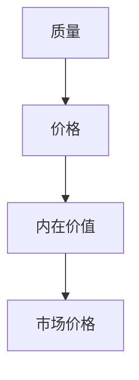
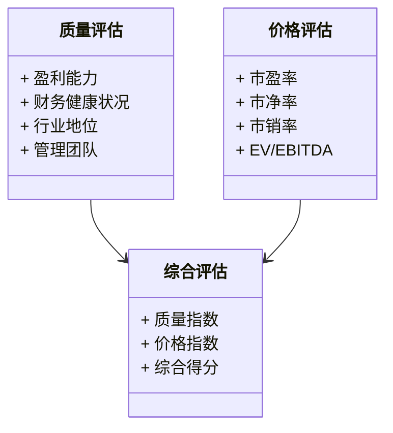
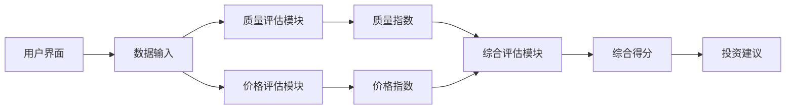

                 


# 价值投资中的质量vs价格权衡

> 关键词：价值投资，质量，价格，权衡，投资策略，数学模型

> 摘要：本文深入探讨了价值投资中质量与价格的权衡问题。通过分析质量与价格的定义、核心概念、数学模型、系统架构以及项目实战，本文为投资者提供了一个全面的框架，以帮助他们在投资决策中实现质量与价格的最优平衡。

---

## 第1章: 价值投资中的质量与价格概述

### 1.1 价值投资的核心理念

价值投资是一种长期投资策略，强调以低于内在价值的价格购买优质资产。其核心理念包括：

- **长期视角**：关注企业的长期盈利能力，而非短期价格波动。
- **安全边际**：通过购买价格低于内在价值的资产来降低风险。
- **基本面分析**：通过分析企业的财务状况、行业地位和管理团队等基本面因素来评估其内在价值。

### 1.2 质量与价格的定义与关系

#### 1.2.1 质量的定义
质量在投资中通常指企业的基本面状况，包括：
- **盈利能力**：如净利润率、ROE（净资产收益率）等。
- **财务健康状况**：如资产负债率、现金流状况等。
- **行业地位**：如市场占有率、竞争优势等。
- **管理团队**：如管理层的经验和战略能力。

#### 1.2.2 价格的定义
价格在投资中通常指资产的市场价格，如股票的市盈率、市净率等。

#### 1.2.3 质量与价格的关系
质量与价格是相互关联的，高质量的资产通常具有较高的内在价值，但市场价格可能因市场情绪波动而偏离其内在价值。投资者的目标是找到市场价格低于内在价值的高质量资产。

---

## 第2章: 质量与价格的核心概念

### 2.1 质量的核心概念

#### 2.1.1 质量的评估指标
- **盈利能力**：净利润率、ROE、毛利率等。
- **财务健康状况**：资产负债率、现金流、流动比率等。
- **行业地位**：市场占有率、竞争对手分析、行业趋势等。
- **管理团队**：管理层的经验、战略规划能力等。

#### 2.1.2 质量的分析方法
- **财务报表分析**：通过分析资产负债表、利润表和现金流量表来评估企业的财务状况。
- **行业分析**：通过分析行业趋势、竞争格局来评估企业的行业地位。
- **管理团队评估**：通过公开信息、行业声誉等来评估管理层的能力。

### 2.2 价格的核心概念

#### 2.2.1 价格的评估指标
- **市盈率（P/E）**：股价与每股收益的比值。
- **市净率（P/B）**：股价与每股净资产的比值。
- **市销率（P/S）**：股价与每股销售收入的比值。
- **EV/EBITDA**：企业价值与息税折旧及摊销前利润的比值。

#### 2.2.2 价格的分析方法
- **相对估值法**：通过比较同行业公司或指数的估值水平来评估当前资产的估值。
- **绝对估值法**：通过DCF（现金流折现法）等方法计算资产的内在价值。

#### 2.2.3 质量与价格的关系图解


---

## 第3章: 质量与价格的数学模型与公式

### 3.1 质量评估的数学模型

#### 3.1.1 质量评估公式
$$
\text{质量指数} = \alpha \times \text{盈利能力} + \beta \times \text{财务健康状况} + \gamma \times \text{行业地位} + \delta \times \text{管理团队}
$$

其中，$\alpha, \beta, \gamma, \delta$ 是各因素的权重系数。

#### 3.1.2 质量评估的权重分配
权重分配可以根据行业特点和投资目标进行调整，例如：
- 制药业：更注重研发能力和财务健康状况。
- 零售业：更注重市场份额和管理团队。

### 3.2 价格评估的数学模型

#### 3.2.1 价格评估公式
$$
\text{内在价值} = \frac{\text{自由现金流}}{\text{折现率}}
$$

#### 3.2.2 价格评估的动态调整
$$
\text{调整后价格} = \text{内在价值} \times (1 - \text{安全边际比例})
$$

### 3.3 质量与价格的权衡模型

#### 3.3.1 质量与价格的综合评估公式
$$
\text{综合得分} = \lambda \times \text{质量指数} + (1 - \lambda) \times \text{价格指数}
$$

其中，$\lambda$ 是质量指数的权重，通常在0到1之间。

#### 3.3.2 质量与价格的权衡系数
- 当 $\lambda = 0.7$ 时，表示质量的重要性高于价格。
- 当 $\lambda = 0.3$ 时，表示价格的重要性高于质量。

---

## 第4章: 系统分析与架构设计方案

### 4.1 问题场景介绍

#### 4.1.1 投资者面临的挑战
投资者在选择投资标的时，需要在高质量但高价的资产与低质量但低价的资产之间做出权衡。

#### 4.1.2 系统设计的目标
设计一个能够量化质量与价格关系的系统，帮助投资者找到最优的投资组合。

### 4.2 系统功能设计

#### 4.2.1 领域模型设计（Mermaid类图）


#### 4.2.2 系统架构设计（Mermaid架构图）


---

## 第5章: 项目实战

### 5.1 环境安装

#### 5.1.1 工具安装
- Python 3.8+
- Jupyter Notebook
- pandas、numpy、scipy库

#### 5.1.2 安装代码
```python
pip install pandas numpy scipy
```

### 5.2 核心实现源代码

#### 5.2.1 质量与价格评估代码
```python
import pandas as pd
import numpy as np

# 示例数据
data = {
    '公司': ['A', 'B', 'C'],
    '盈利能力': [0.2, 0.3, 0.1],
    '财务健康状况': [0.8, 0.6, 0.9],
    '行业地位': [0.7, 0.5, 0.6],
    '管理团队': [0.9, 0.8, 0.7],
    '市盈率': [15, 20, 12],
    '市净率': [2, 3, 1.5],
    '市销率': [0.5, 0.6, 0.4],
    'EV/EBITDA': [8, 10, 6]
}

df = pd.DataFrame(data)

# 质量指数计算
weights = {'盈利能力': 0.3, '财务健康状况': 0.2, '行业地位': 0.2, '管理团队': 0.3}
quality_index = df[list(weights.keys())].apply(lambda x: sum(x[i] * weights[i] for i in weights), axis=1)

# 价格指数计算
price_indices = ['市盈率', '市净率', '市销率', 'EV/EBITDA']
price_weights = {'市盈率': 0.4, '市净率': 0.3, '市销率': 0.2, 'EV/EBITDA': 0.1}
price_index = df[price_indices].apply(lambda x: sum(x[i] * price_weights[i] for i in price_weights), axis=1)

# 综合得分计算
lambda_value = 0.7
composite_score = lambda_value * quality_index + (1 - lambda_value) * price_index
df['综合得分'] = composite_score

print(df)
```

#### 5.2.2 代码应用解读
- **质量指数**：通过加权平均计算各公司的质量指数。
- **价格指数**：通过加权平均计算各公司的价格指数。
- **综合得分**：根据质量与价格的权衡系数 $\lambda$，计算综合得分。

### 5.3 实际案例分析

#### 5.3.1 案例介绍
以三家公司（A、B、C）为例，计算其质量指数、价格指数和综合得分。

#### 5.3.2 分析结果
- 公司A：质量指数=0.2*0.3+0.8*0.2+0.7*0.2+0.9*0.3=0.6+0.16+0.14+0.27=1.17
- 公司B：质量指数=0.3*0.3+0.6*0.2+0.5*0.2+0.8*0.3=0.09+0.12+0.1+0.24=0.55
- 公司C：质量指数=0.1*0.3+0.9*0.2+0.6*0.2+0.7*0.3=0.03+0.18+0.12+0.21=0.54

- 价格指数：
  - 公司A：15*0.4 + 2*0.3 + 0.5*0.2 + 8*0.1 = 6 + 0.6 + 0.1 + 0.8 = 7.5
  - 公司B：20*0.4 + 3*0.3 + 0.6*0.2 + 10*0.1 = 8 + 0.9 + 0.12 + 1 = 10.02
  - 公司C：12*0.4 + 1.5*0.3 + 0.4*0.2 + 6*0.1 = 4.8 + 0.45 + 0.08 + 0.6 = 6.03

- 综合得分：
  - 公司A：0.7*1.17 + 0.3*7.5 = 0.819 + 2.25 = 3.069
  - 公司B：0.7*0.55 + 0.3*10.02 = 0.385 + 3.006 = 3.391
  - 公司C：0.7*0.54 + 0.3*6.03 = 0.378 + 1.809 = 2.187

#### 5.3.3 投资建议
根据综合得分，公司B的得分最高，表明其在质量与价格的权衡中表现最佳，建议优先考虑公司B的投资。

---

## 第6章: 最佳实践与总结

### 6.1 最佳实践

#### 6.1.1 长期视角
- 长期持有优质资产，避免频繁交易。

#### 6.1.2 分散投资
- 通过分散投资降低风险，避免过度集中于某一资产或行业。

#### 6.1.3 定期复盘
- 定期评估投资组合的表现，根据市场变化调整策略。

### 6.2 小结
价值投资中的质量与价格权衡是一个复杂的决策过程，需要综合考虑企业的基本面状况和市场价格水平。通过建立系统的评估模型和科学的决策框架，投资者可以更好地实现质量与价格的最优平衡。

### 6.3 注意事项

- **数据质量**：确保输入数据的准确性和完整性。
- **模型调整**：根据市场环境和投资目标调整权重系数。
- **风险控制**：定期评估投资组合的风险暴露，及时调整投资策略。

### 6.4 拓展阅读
- 《投资学基础》
- 《价值投资实战》
- 《金融数据分析与建模》

---

## 附录

### 附录1: 术语表

- **质量指数**：反映企业基本面状况的综合指标。
- **价格指数**：反映资产市场价格水平的综合指标。
- **综合得分**：结合质量与价格的综合评估指标。

### 附录2: 工具推荐

- **数据分析工具**：Python、R、Excel。
- **投资研究工具**：Morningstar、S&P Capital IQ、FactSet。

---

## 作者信息

作者：AI天才研究院/AI Genius Institute & 禅与计算机程序设计艺术 /Zen And The Art of Computer Programming

