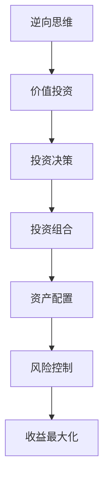
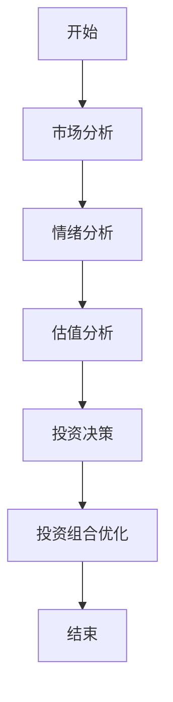
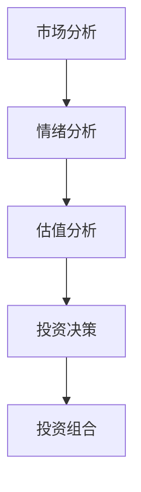
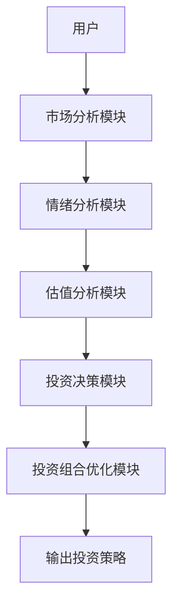

                 


# 价值投资中的逆向思维应用

> 关键词：逆向思维，价值投资，投资策略，市场分析，投资决策

> 摘要：本文深入探讨了逆向思维在价值投资中的应用，分析了逆向思维的核心概念、算法原理及系统架构设计，并通过实际案例展示了其在投资决策中的优势。文章结合技术背景，从逻辑推理到实践应用，全面解析了逆向思维如何帮助投资者在复杂市场中捕捉机会，实现长期稳健收益。

---

# 第一部分: 逆向思维与价值投资的背景介绍

## 第1章: 逆向思维在价值投资中的核心概念

### 1.1 逆向思维的定义与特点

#### 1.1.1 逆向思维的定义
逆向思维是指在面对问题时，不从正面入手，而是从反面思考，通过分析问题的对立面或结果来推导解决方案的一种思维方式。在投资领域，逆向思维意味着不盲目跟随市场趋势，而是寻找市场忽略的机会或风险。

#### 1.1.2 逆向思维的核心特点
- **反向思考**：关注市场的冷门领域或被低估的资产。
- **逆向决策**：在市场恐慌时寻找机会，在市场狂热时保持冷静。
- **长期视角**：逆向思维注重长期价值，而非短期波动。

#### 1.1.3 逆向思维与传统投资思维的区别
- 传统投资思维：跟随市场趋势，顺势而为。
- 逆向思维：逆市场趋势，寻找低估或高估的机会。

### 1.2 逆向思维在价值投资中的重要性

#### 1.2.1 逆向思维在价值投资中的独特优势
- **发现低估机会**：通过逆向分析，发现市场忽视的优质资产。
- **降低风险**：在市场低点介入，避免高位风险。
- **逆市获利**：通过逆向思维，在市场低迷时布局，获取超额收益。

#### 1.2.2 逆向思维如何帮助投资者发现市场机会
- **识别市场情绪偏差**：通过逆向思维，发现市场情绪过热或过冷的信号。
- **寻找估值错配**：通过逆向分析，找到市场价格与内在价值的偏差。

#### 1.2.3 逆向思维与投资成功的关系
逆向思维是价值投资的核心要素之一，它帮助投资者在市场噪声中保持清醒，做出独立判断，从而实现长期稳健的投资收益。

### 1.3 逆向思维与价值投资的结合

#### 1.3.1 逆向思维在价值投资中的应用领域
- **行业分析**：通过逆向思维，选择被市场忽视的朝阳行业或传统行业中的优质企业。
- **个股选择**：通过逆向分析，挖掘被市场低估的个股。
- **投资组合构建**：通过逆向思维，优化投资组合的结构，降低风险。

#### 1.3.2 逆向思维如何影响投资决策
- **避免从众心理**：逆向思维帮助投资者避免随大流，做出独立决策。
- **增强风险控制**：通过逆向分析，提前识别潜在风险，制定应对策略。

#### 1.3.3 逆向思维与价值投资的内在联系
价值投资的核心在于发现市场价格与内在价值的偏差，而逆向思维是实现这一目标的重要工具。通过逆向思维，投资者能够更好地识别低估资产，实现长期价值增长。

### 1.4 逆向思维在价值投资中的核心要素

#### 1.4.1 逆向思维的核心要素
- **市场情绪分析**：逆向思维需要投资者对市场情绪有深刻的理解。
- **估值分析**：逆向思维依赖于对资产内在价值的准确评估。
- **长期视角**：逆向思维要求投资者具备长期投资的耐心和信心。

#### 1.4.2 逆向思维与价值投资的逻辑关系
逆向思维通过分析市场的对立面，帮助投资者发现低估资产，从而实现价值投资的目标。

#### 1.4.3 逆向思维在价值投资中的具体表现
- **在市场低点买入**：逆向思维指导投资者在市场恐慌时布局。
- **在市场高点卖出**：逆向思维提醒投资者在市场狂热时保持冷静。

### 1.5 本章小结
逆向思维是价值投资的重要工具，它通过反向思考帮助投资者发现市场机会，降低投资风险，实现长期稳健收益。

---

# 第二部分: 逆向思维与价值投资的核心概念与联系

## 第2章: 逆向思维与价值投资的核心概念

### 2.1 逆向思维与价值投资的核心概念

#### 2.1.1 逆向思维的核心概念
逆向思维的核心在于通过分析问题的对立面，发现潜在机会。在投资领域，这意味着关注市场忽视的资产或行业。

#### 2.1.2 价值投资的核心概念
价值投资的核心在于寻找市场价格低于内在价值的资产，通过长期持有实现收益。

#### 2.1.3 逆向思维与价值投资的结合
逆向思维帮助投资者识别市场价格与内在价值的偏差，从而实现价值投资的目标。

### 2.2 逆向思维与价值投资的核心原理

#### 2.2.1 逆向思维的原理
逆向思维的原理在于通过分析市场的对立面，发现潜在的投资机会。这包括分析市场情绪、行业趋势和个股基本面。

#### 2.2.2 价值投资的原理
价值投资的原理在于寻找市场价格低于内在价值的资产，通过长期持有实现收益。

#### 2.2.3 逆向思维与价值投资的内在联系
逆向思维通过分析市场的对立面，帮助投资者发现低估资产，从而实现价值投资的目标。

### 2.3 逆向思维与价值投资的属性特征对比

#### 2.3.1 逆向思维的属性特征
- **反向思考**：关注市场的对立面。
- **独立判断**：不随市场情绪波动。
- **长期视角**：注重长期价值。

#### 2.3.2 价值投资的属性特征
- **基本面分析**：关注资产的内在价值。
- **长期持有**：通过时间实现价值增长。
- **价值发现**：寻找市场价格低于内在价值的资产。

#### 2.3.3 逆向思维与价值投资的属性特征对比

| 属性特征 | 逆向思维 | 价值投资 |
|----------|----------|----------|
| 核心思想 | 反向思考，发现市场对立面 | 基于基本面分析，寻找低估资产 |
| 投资策略 | 逆市场趋势，寻找机会 | 顺势而为，关注长期价值 |
| 风险控制 | 通过逆向分析降低风险 | 通过价值评估控制风险 |

### 2.4 逆向思维与价值投资的ER实体关系图



### 2.5 本章小结
逆向思维与价值投资在核心概念和原理上有密切联系，通过逆向思维，投资者能够更好地发现市场机会，实现价值投资的目标。

---

# 第三部分: 逆向思维与价值投资的算法原理讲解

## 第3章: 逆向思维与价值投资的算法原理

### 3.1 逆向思维与价值投资的算法原理

#### 3.1.1 逆向思维的算法原理
逆向思维的算法原理包括市场情绪分析、估值分析和投资策略优化。

#### 3.1.2 价值投资的算法原理
价值投资的算法原理包括基本面分析、资产估值和投资组合优化。

#### 3.1.3 逆向思维与价值投资的算法联系
逆向思维通过分析市场情绪和估值偏差，帮助价值投资优化投资策略。

### 3.2 逆向思维与价值投资的算法流程图



### 3.3 逆向思维与价值投资的算法实现

#### 3.3.1 逆向思维的算法实现
```python
def reverse_thinking_analysis(market_data):
    # 市场情绪分析
    sentiment = analyze_sentiment(market_data)
    # 估值分析
    valuation = calculate_valuation(market_data)
    # 投资决策
    decision = make_decision(sentiment, valuation)
    return decision
```

#### 3.3.2 价值投资的算法实现
```python
def value_investing_analysis(asset_data):
    # 基本面分析
    fundamentals = analyze_fundamentals(asset_data)
    # 资产估值
    valuation = calculate_intrinsic_value(fundamentals)
    # 投资决策
    decision = make_decision(valuation)
    return decision
```

#### 3.3.3 逆向思维与价值投资的算法实现对比
- 逆向思维算法：基于市场情绪和估值分析，做出投资决策。
- 价值投资算法：基于基本面分析和资产估值，做出投资决策。

### 3.4 逆向思维与价值投资的算法优缺点

#### 3.4.1 逆向思维的算法优缺点
- 优点：能够发现市场忽视的机会，降低投资风险。
- 缺点：需要较高的市场分析能力，可能在市场繁荣时错失收益。

#### 3.4.2 价值投资的算法优缺点
- 优点：能够发现低估资产，实现长期收益。
- 缺点：需要较长的投资周期，可能在短期内表现不佳。

#### 3.4.3 逆向思维与价值投资的算法优缺点对比
| 优缺点 | 逆向思维 | 价值投资 |
|--------|----------|----------|
| 优点 | 发现市场机会，降低风险 | 发现低估资产，实现长期收益 |
| 缺点 | 市场分析能力要求高 | 投资周期长，短期收益可能不佳 |

### 3.5 本章小结
逆向思维与价值投资的算法原理各有优缺点，通过结合两者的算法，投资者可以更好地优化投资策略，实现稳健收益。

---

# 第四部分: 逆向思维与价值投资的系统分析与架构设计方案

## 第4章: 逆向思维与价值投资的系统分析

### 4.1 逆向思维与价值投资的系统分析

#### 4.1.1 逆向思维的系统分析
逆向思维系统包括市场分析模块、情绪分析模块和投资决策模块。

#### 4.1.2 价值投资的系统分析
价值投资系统包括基本面分析模块、资产估值模块和投资决策模块。

#### 4.1.3 逆向思维与价值投资的系统联系
逆向思维与价值投资的系统通过市场分析和估值分析模块相互关联，优化投资策略。

### 4.2 逆向思维与价值投资的系统架构设计

#### 4.2.1 系统功能设计
- **市场分析模块**：分析市场趋势和情绪。
- **估值分析模块**：评估资产的内在价值。
- **投资决策模块**：基于分析结果做出投资决策。

#### 4.2.2 系统架构设计


### 4.3 逆向思维与价值投资的系统接口设计

#### 4.3.1 系统接口设计
- **市场数据接口**：获取市场数据。
- **估值分析接口**：计算资产估值。
- **投资决策接口**：做出投资决策。

### 4.4 逆向思维与价值投资的系统交互设计

#### 4.4.1 系统交互设计


### 4.5 本章小结
逆向思维与价值投资的系统架构设计通过模块化分析，优化了投资决策过程，提高了投资效率。

---

# 第五部分: 逆向思维与价值投资的项目实战

## 第5章: 逆向思维与价值投资的项目实战

### 5.1 项目环境安装

#### 5.1.1 环境要求
- Python 3.8+
- 数据分析库（Pandas, NumPy）
- 可视化库（Matplotlib, Seaborn）
- 机器学习库（Scikit-learn）

### 5.2 系统核心实现源代码

#### 5.2.1 逆向思维算法实现
```python
def reverse_thinking_analysis(market_data):
    # 市场情绪分析
    sentiment = analyze_sentiment(market_data)
    # 估值分析
    valuation = calculate_valuation(market_data)
    # 投资决策
    decision = make_decision(sentiment, valuation)
    return decision
```

#### 5.2.2 价值投资算法实现
```python
def value_investing_analysis(asset_data):
    # 基本面分析
    fundamentals = analyze_fundamentals(asset_data)
    # 资产估值
    valuation = calculate_intrinsic_value(fundamentals)
    # 投资决策
    decision = make_decision(valuation)
    return decision
```

#### 5.2.3 投资组合优化实现
```python
def optimize_portfolio/assets, target_return):
    # 计算资产风险和收益
    calculate_risk_return/assets
    # 构建优化模型
    model = create_optimization_model/assets, target_return
    # 求解模型
    solution = solve_model/model
    return solution
```

### 5.3 代码应用解读与分析

#### 5.3.1 逆向思维算法解读
逆向思维算法通过分析市场情绪和估值，做出投资决策。

#### 5.3.2 价值投资算法解读
价值投资算法通过基本面分析和资产估值，做出投资决策。

### 5.4 实际案例分析和详细讲解剖析

#### 5.4.1 案例分析
- **案例1**：在市场恐慌时，逆向思维指导投资者买入低估资产。
- **案例2**：在市场狂热时，逆向思维提醒投资者规避风险。

### 5.5 项目小结
通过逆向思维与价值投资的结合，投资者可以在复杂市场中发现机会，优化投资策略，实现稳健收益。

---

# 第六部分: 逆向思维与价值投资的总结与展望

## 第6章: 逆向思维与价值投资的总结与展望

### 6.1 总结

#### 6.1.1 核心内容回顾
逆向思维是价值投资的重要工具，通过反向思考发现市场机会，优化投资策略。

#### 6.1.2 投资策略优化
逆向思维帮助投资者降低风险，实现长期稳健收益。

### 6.2 展望

#### 6.2.1 未来研究方向
- 结合大数据和人工智能，优化逆向思维算法。
- 探索逆向思维在不同类型资产中的应用。

#### 6.2.2 投资者需要注意的事项
- 坚持长期投资，避免短期波动干扰。
- 持续学习，提升市场分析能力。

### 6.3 最佳实践 Tips

#### 6.3.1 投资心态调整
逆向思维需要投资者具备冷静的心态，避免随市场情绪波动。

#### 6.3.2 风险控制技巧
通过逆向思维，提前识别潜在风险，制定应对策略。

### 6.4 小结
逆向思维与价值投资的结合，为投资者提供了强大的工具，帮助他们在复杂市场中实现稳健收益。

---

# 作者：AI天才研究院/AI Genius Institute & 禅与计算机程序设计艺术 /Zen And The Art of Computer Programming

---

通过以上详细目录和内容规划，我们可以看到，逆向思维与价值投资的结合在投资领域具有重要意义。通过系统化的分析和实践，投资者可以更好地应用逆向思维，优化投资策略，实现长期稳健收益。

