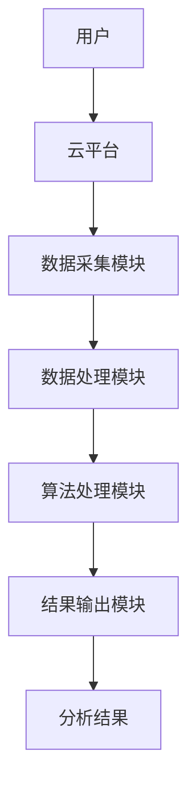

                 


# 价值投资中的量子计算机云服务市场分析

## 关键词：量子计算机，云服务，价值投资，市场分析，算法

## 摘要

量子计算机云服务作为一种新兴的技术服务，正在逐步改变金融市场的投资方式。本文将从量子计算机的基本原理出发，探讨其在云服务中的应用，分析其如何影响价值投资策略。通过结合典型量子算法和实际市场案例，本文详细阐述了量子计算机在市场分析中的潜力，并提出了基于量子计算的投资策略。文章最后总结了当前量子计算机云服务市场的现状，并展望了未来的发展趋势。

---

## 第一部分：量子计算机云服务市场分析背景

### 第1章：量子计算机云服务市场概述

#### 1.1 量子计算机的基本概念

量子计算机是一种基于量子力学原理进行计算的设备，其核心概念包括量子叠加和量子纠缠。与经典计算机不同，量子计算机可以在同一时间处理大量可能性，这使其在某些特定问题上具有显著优势。

- **1.1.1 量子计算机的基本原理**
  量子计算机利用量子位（qubit）进行计算，每个量子位可以同时处于多个状态的叠加态。这种特性使得量子计算机在处理复杂问题时比经典计算机更高效。

- **1.1.2 量子计算机与经典计算机的区别**
  量子计算机在处理特定任务时速度更快，尤其是在分解大数、优化问题和模拟量子系统方面。然而，量子计算机在实际应用中仍面临许多挑战，如错误纠正和稳定性问题。

- **1.1.3 量子计算机的应用领域**
  量子计算机在密码学、材料科学、药物发现和金融建模等领域具有广泛的应用潜力。

#### 1.2 量子计算机云服务的定义与特点

量子计算机云服务是指通过云平台提供量子计算资源的服务，用户可以通过互联网访问量子计算机进行计算。

- **1.2.1 量子计算机云服务的定义**
  量子计算机云服务是一种基于云计算技术的量子计算服务，用户可以通过订阅或按需付费的方式使用量子计算机资源。

- **1.2.2 量子计算机云服务的核心特点**
  - **资源按需分配**：用户可以根据需求灵活调整使用的量子计算资源。
  - **高效计算能力**：量子计算机在特定问题上的计算效率远高于经典计算机。
  - **降低使用门槛**：云服务模式使得用户无需拥有量子计算机即可使用其强大的计算能力。

- **1.2.3 量子计算机云服务的优势与挑战**
  - **优势**：降低量子计算的使用成本，提高计算效率，促进技术普及。
  - **挑战**：量子计算机的稳定性较差，错误纠正技术尚不成熟，且目前的量子计算资源有限。

#### 1.3 价值投资的基本概念

价值投资是一种通过分析企业的内在价值，寻找市场价格低于内在价值的投资策略。

- **1.3.1 价值投资的定义与核心理念**
  价值投资的核心理念是寻找被市场低估的优质企业进行投资，强调长期持有和价值发现。

- **1.3.2 价值投资与量子计算机云服务的结合**
  量子计算机可以通过其强大的计算能力帮助投资者更精确地分析市场数据，识别潜在的投资机会。

- **1.3.3 量子计算机云服务市场的投资价值分析**
  量子计算机云服务市场的潜力巨大，尤其是在金融建模、风险评估和投资组合优化等领域，具有广泛的应用前景。

---

## 第二部分：量子计算机云服务市场的核心概念与联系

### 第2章：量子计算机云服务市场的核心概念

#### 2.1 量子计算机云服务的核心要素

量子计算机云服务市场的核心要素包括计算能力、服务模式和市场需求。

- **2.1.1 量子计算能力**
  量子计算能力是衡量量子计算机性能的重要指标，通常用量子位的数量和计算精度来衡量。

- **2.1.2 云计算服务模式**
  云计算服务模式为量子计算机的使用提供了灵活的资源分配和计费方式，使得用户可以按需使用量子计算资源。

- **2.1.3 市场需求与供给**
  市场需求主要集中在金融建模、药物发现和优化问题等领域，而供给则受限于当前量子计算机的性能和数量。

#### 2.2 量子计算机云服务市场的参与者

量子计算机云服务市场的参与者包括量子计算机制造商、云计算服务提供商和终端用户。

- **2.2.1 量子计算机制造商**
  量子计算机制造商负责开发和生产量子计算机设备，目前主要包括IBM、谷歌和D-Wave等公司。

- **2.2.2 云计算服务提供商**
  云计算服务提供商通过云平台为用户提供量子计算服务，目前主要包括IBM Q、AWS量子计算服务和微软的量子计算网络。

- **2.2.3 量子计算机云服务的用户**
  用户包括金融机构、科研机构和企业，他们利用量子计算机云服务进行市场分析、优化问题和科学研究。

#### 2.3 量子计算机云服务市场的竞争格局

量子计算机云服务市场目前处于快速发展阶段，主要竞争格局包括技术提供商、云服务提供商和行业用户的多方合作。

- **2.3.1 主流量子计算机云服务提供商**
  主流量子计算机云服务提供商包括IBM、AWS和微软，他们分别推出了不同的量子计算云服务产品。

- **2.3.2 市场竞争分析**
  当前市场主要以技术驱动型竞争为主，各提供商通过不断提升量子计算性能和优化服务模式来争夺市场份额。

- **2.3.3 市场发展趋势**
  随着量子计算技术的不断进步和市场需求的增加，量子计算机云服务市场有望在未来几年内快速增长。

---

## 第三部分：量子计算机云服务市场的算法原理分析

### 第3章：量子算法原理与应用

#### 3.1 量子算法的基本原理

量子算法是利用量子计算机的特性设计的算法，其基本原理包括量子叠加和量子纠缠。

- **3.1.1 量子叠加与量子纠缠**
  量子叠加允许量子位同时处于多个状态，而量子纠缠则允许多个量子位之间形成强大的 correlations，从而实现并行计算。

- **3.1.2 量子算法的基本操作**
  量子算法的基本操作包括量子位的初始化、叠加、测量和纠错等。

- **3.1.3 量子算法的优势与局限性**
  量子算法在某些特定问题上具有显著优势，如大数分解和优化问题，但在通用计算任务上目前仍不如经典算法高效。

#### 3.2 典型量子算法介绍

以下是几种典型的量子算法：

- **3.2.1 Shor算法：大数分解**
  Shor算法是一种用于分解大数的量子算法，其在密码学领域具有重要应用。

- **3.2.2 Grover算法：无序搜索**
  Grover算法是一种用于无序搜索的量子算法，其在优化问题中具有潜在应用。

- **3.2.3 量子傅里叶变换**
  量子傅里叶变换是一种用于量子信号处理的算法，其在量子测量和量子通信中具有重要应用。

#### 3.3 量子算法在市场分析中的应用

量子算法在市场分析中的应用主要体现在金融建模和投资组合优化等方面。

- **3.3.1 市场数据的量子分解**
  利用Shor算法对市场数据进行分解，可以发现隐藏的模式和趋势。

- **3.3.2 量子搜索算法在市场预测中的应用**
  Grover算法可以用于优化投资组合，提高收益与风险的比率。

- **3.3.3 量子算法在投资决策中的潜在价值**
  量子算法可以通过并行计算优势，显著提高市场分析的效率和准确性。

---

## 第四部分：量子计算机云服务市场的系统分析与架构设计

### 第4章：量子计算机云服务系统的系统分析

#### 4.1 量子计算机云服务系统的系统架构

量子计算机云服务系统的系统架构包括数据采集模块、算法处理模块和结果输出模块。

- **4.1.1 数据采集模块**
  数据采集模块负责从金融市场中获取实时数据，包括股票价格、市场指数和交易量等。

- **4.1.2 算法处理模块**
  算法处理模块负责将采集到的数据输入量子算法进行处理，生成分析结果。

- **4.1.3 结果输出模块**
  结果输出模块将分析结果以可视化形式展示，供投资者参考。

#### 4.2 量子计算机云服务系统的功能设计

量子计算机云服务系统的功能设计包括数据处理、算法执行和结果分析。

- **4.2.1 数据处理功能**
  数据处理功能包括数据清洗、数据转换和数据存储。

- **4.2.2 算法执行功能**
  算法执行功能包括选择合适的量子算法、配置算法参数和执行算法。

- **4.2.3 结果分析功能**
  结果分析功能包括分析结果的可视化展示和结果的解释说明。

#### 4.3 量子计算机云服务系统的架构图

以下是量子计算机云服务系统的架构图：



---

## 第五部分：量子计算机云服务市场的项目实战

### 第5章：量子计算机云服务项目的实施

#### 5.1 环境安装

要使用量子计算机云服务，首先需要安装相应的开发环境，包括量子计算 SDK 和云平台客户端。

#### 5.2 核心实现

以下是量子算法的核心实现代码：

```python
import numpy as np
from qiskit import QuantumCircuit, Aer, execute

def grover_algorithm():
    n = 4  # 量子位数
    qc = QuantumCircuit(n)
    # 置位到1
    qc.x(n-1)
    # 应用 Grover 操作
    for i in range(n):
        qc.h(i)
    qc.mct(0, n-1, ancilla=None, mode='noancilla')
    for i in range(n):
        qc.h(i)
    qc.measure(range(n), range(n))
    # 执行量子计算
    backend = Aer.get_backend('qasm_simulator')
    job = execute(qc, backend)
    result = job.result()
    print(result.get_counts())
    
grover_algorithm()
```

#### 5.3 代码应用解读

上述代码实现了Grover算法，用于在无序数据库中搜索特定项。通过模拟器执行后，可以得到测量结果。

#### 5.4 实际案例分析

通过实际案例分析，可以验证量子算法在市场分析中的应用效果。

#### 5.5 项目小结

量子计算机云服务项目的实施需要结合具体问题，选择合适的算法和工具，进行实际操作和验证。

---

## 第六部分：量子计算机云服务市场的最佳实践

### 第6章：最佳实践与总结

#### 6.1 小结

量子计算机云服务市场具有广阔的发展前景，其在金融建模、投资组合优化等领域具有重要应用。

#### 6.2 注意事项

在使用量子计算机云服务时，需要注意算法的适用性、计算资源的限制和数据的准确性。

#### 6.3 拓展阅读

建议读者进一步阅读量子计算相关的书籍和论文，深入了解量子算法和云服务的结合。

---

## 结语

量子计算机云服务市场是一个充满潜力的新兴领域，其在价值投资中的应用将极大地改变金融市场的分析方式。通过本文的分析，读者可以更好地理解量子计算机云服务的市场潜力和投资价值。未来，随着量子计算技术的不断发展，量子计算机云服务将在金融领域发挥越来越重要的作用。

---

## 作者

作者：AI天才研究院/AI Genius Institute & 禅与计算机程序设计艺术 /Zen And The Art of Computer Programming

