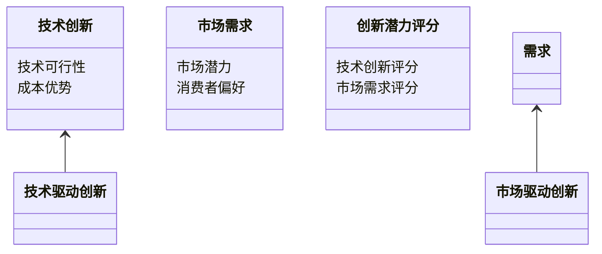

                 


# 价值投资中的颠覆性创新识别

## 关键词：价值投资，颠覆性创新，创新识别，投资策略，技术驱动，市场驱动

## 摘要：  
本文深入探讨了在价值投资中如何识别和利用颠覆性创新。通过分析颠覆性创新的定义、特征及其对投资决策的影响，结合技术驱动和市场驱动的双重视角，构建了创新评估模型，并提供了实际案例分析。文章还详细介绍了算法原理、数学模型和系统架构，为投资者提供了从理论到实践的全面指导。

---

# 第1章: 颠覆性创新与价值投资概述

## 1.1 颠覆性创新的定义与特征

### 1.1.1 颠覆性创新的定义  
颠覆性创新是指通过引入新技术、新产品或新模式，从根本上改变行业格局或消费者行为的创新。与延续性创新不同，颠覆性创新通常针对市场中的未被满足的需求，或以更低的成本提供更好的产品或服务。

### 1.1.2 颠覆性创新的核心特征  
- **低成本**：颠覆性创新往往以更低的价格提供更好的产品或服务，吸引价格敏感的客户。  
- **新技术驱动**：颠覆性创新通常依赖于新技术的引入，这些技术能够显著改变行业的竞争格局。  
- **非主流市场**：颠覆性创新往往从边缘市场或非主流客户群体开始，逐步向主流市场渗透。  
- **渐进性**：颠覆性创新通常是从局部改进开始，逐步演变成对行业格局的颠覆。

### 1.1.3 颠覆性创新与延续性创新的区别  
| 属性 | 颠覆性创新 | 延续性创新 |
|------|------------|------------|
| 目标客户 | 非主流客户 | 主流客户 |
| 技术依赖 | 高度依赖新技术 | 依赖现有技术 |
| 市场定位 | 从边缘市场进入主流市场 | 针对现有市场提供改进产品 |
| 风险 | 高 | 低 |

## 1.2 价值投资的基本原理

### 1.2.1 价值投资的定义  
价值投资是一种投资策略，旨在通过分析公司的基本面（如财务状况、行业地位、管理团队等），寻找被市场低估的投资机会。

### 1.2.2 价值投资的核心理念  
- **市场有效假说**：市场并非总是有效，存在被低估的股票。  
- **安全边际**：投资时应留有安全边际，即买入价格低于内在价值。  
- **长期视角**：关注公司的长期价值，而非短期市场波动。

### 1.2.3 价值投资与成长投资的区别  
| 属性 | 价值投资 | 成长投资 |
|------|------------|------------|
| 投资目标 | 寻找被低估的股票 | 寻找高增长的股票 |
| 风险偏好 | 低风险偏好 | 高风险偏好 |
| 持股时间 | 长期持有 | 短期持有 |

## 1.3 颠覆性创新与价值投资的结合

### 1.3.1 颠覆性创新在价值投资中的意义  
颠覆性创新能够帮助投资者发现那些具有潜在高增长的公司，这些公司可能尚未被市场充分认识到，从而提供价值投资的机会。

### 1.3.2 颠覆性创新识别对投资决策的影响  
通过识别颠覆性创新，投资者可以提前发现具有竞争优势的公司，从而在公司价值被市场发现之前进行投资。

### 1.3.3 颠覆性创新与价值投资的结合案例  
以特斯拉为例，该公司通过电动汽车和可再生能源技术，颠覆了传统汽车行业，为投资者提供了巨大的价值增长空间。

## 1.4 本章小结  
本章介绍了颠覆性创新和价值投资的基本概念，并分析了两者的结合。颠覆性创新为价值投资提供了新的视角，帮助投资者发现潜在的高增长机会。

---

# 第2章: 颠覆性创新的识别方法

## 2.1 技术驱动的颠覆性创新识别

### 2.1.1 技术创新的评估标准  
- **技术可行性**：技术是否可行且易于实现。  
- **成本优势**：新技术是否能显著降低生产成本。  
- **市场潜力**：技术是否能带来显著的市场增长。

### 2.1.2 技术生命周期与颠覆性创新的关系  
颠覆性创新通常发生在技术生命周期的早期阶段，通过逐步改进和优化，最终实现对现有技术的颠覆。

### 2.1.3 技术驱动型颠覆性创新的识别步骤  
1. 分析行业技术趋势。  
2. 识别潜在的技术突破。  
3. 评估技术的市场潜力。  
4. 选择具有竞争优势的技术。

## 2.2 市场驱动的颠覆性创新识别

### 2.2.1 市场需求的分析方法  
- **需求调研**：通过问卷调查、访谈等方式了解市场需求。  
- **市场趋势分析**：分析市场增长潜力和消费者偏好。  
- **竞争对手分析**：研究竞争对手的产品和服务。

### 2.2.2 市场变化对颠覆性创新的影响  
市场变化（如消费者需求的变化）是颠覆性创新的重要驱动力，能够促使企业推出新的产品或服务。

### 2.2.3 市场驱动型颠覆性创新的识别步骤  
1. 分析市场趋势。  
2. 识别未被满足的需求。  
3. 评估市场需求的可行性。  
4. 选择具有市场潜力的产品。

## 2.3 综合驱动的颠覆性创新识别

### 2.3.1 技术与市场结合的颠覆性创新特征  
- **技术与市场双重驱动**：颠覆性创新通常由技术和市场双重因素驱动。  
- **竞争优势明显**：产品或服务在技术和市场上具有显著竞争优势。  
- **可持续性**：颠覆性创新能够在较长时期内保持竞争优势。

### 2.3.2 综合驱动型颠覆性创新的识别框架  
1. 分析技术和市场的双重驱动因素。  
2. 识别技术与市场结合的潜在机会。  
3. 评估机会的可行性和潜力。  
4. 选择具有综合优势的机会。

### 2.3.3 综合驱动型颠覆性创新的案例分析  
以智能手机行业为例，苹果通过整合创新技术和市场需求，推出了颠覆性的iPhone产品，改变了整个行业格局。

## 2.4 本章小结  
本章介绍了技术驱动和市场驱动的颠覆性创新识别方法，并提出了综合驱动的识别框架。通过综合分析技术和市场因素，投资者可以更准确地识别颠覆性创新机会。

---

# 第3章: 价值投资中的创新评估模型

## 3.1 创新评估模型的构建

### 3.1.1 模型构建的背景与目标  
本文旨在构建一个基于颠覆性创新的评估模型，帮助投资者识别具有潜在高增长的公司。

### 3.1.2 模型的核心假设与限制  
- 假设：颠覆性创新能够带来显著的市场增长。  
- 限制：模型仅适用于技术驱动和市场驱动的创新。

### 3.1.3 模型的输入变量与输出变量  
- 输入变量：技术创新性、市场需求潜力、公司财务状况。  
- 输出变量：创新潜力评分。

## 3.2 创新潜力评分算法

### 3.2.1 创新潜力评分的定义  
创新潜力评分是对公司创新潜力的量化评估，分为五级：低、较低、中等、较高、高。

### 3.2.2 创新潜力评分算法的步骤  
1. 评估技术创新性（权重40%）。  
2. 评估市场需求潜力（权重30%）。  
3. 评估公司财务状况（权重30%）。  
4. 计算综合评分。

### 3.2.3 创新潜力评分算法的数学模型  
$$ \text{创新潜力评分} = 0.4 \times T + 0.3 \times M + 0.3 \times F $$  
其中，$T$表示技术创新性评分，$M$表示市场需求潜力评分，$F$表示公司财务状况评分。

## 3.3 创新潜力评分算法的实现

### 3.3.1 算法实现步骤  
1. 收集技术创新性、市场需求潜力和公司财务状况的数据。  
2. 对每个变量进行评分（满分10分）。  
3. 计算综合评分。  
4. 根据评分结果进行分类。

### 3.3.2 Python实现代码  
```python
def calculate_innovation_potential(tech_score, market_score, finance_score):
    potential = 0.4 * tech_score + 0.3 * market_score + 0.3 * finance_score
    if potential >= 8:
        return "高"
    elif potential >= 6:
        return "较高"
    elif potential >= 4:
        return "中等"
    elif potential >= 2:
        return "较低"
    else:
        return "低"

# 示例数据
tech_score = 9
market_score = 8
finance_score = 7

potential = calculate_innovation_potential(tech_score, market_score, finance_score)
print(f"创新潜力评分：{potential}")
```

## 3.4 本章小结  
本章构建了一个创新潜力评分模型，通过量化评估技术创新性、市场需求潜力和公司财务状况，帮助投资者识别颠覆性创新机会。

---

# 第4章: 颠覆性创新识别的系统架构设计

## 4.1 问题场景介绍  
本文旨在设计一个基于颠覆性创新识别的系统，帮助投资者快速发现潜在的高增长公司。

## 4.2 系统功能设计

### 4.2.1 领域模型  


### 4.2.2 系统架构设计  
```mermaid
container 技术驱动创新识别系统 {
    system 创新识别模块 {
        技术创新评估
        市场需求评估
    }
    system 评分计算模块 {
        技术创新评分
        市场需求评分
        综合评分
    }
    system 输出模块 {
        创新潜力评分
    }
}
```

## 4.3 系统接口设计  
- 输入接口：技术创新性、市场需求潜力、公司财务状况。  
- 输出接口：创新潜力评分。

## 4.4 系统交互设计  
```mermaid
sequenceDiagram
    User -> 创新识别模块: 提供技术创新性、市场需求潜力和公司财务状况数据
    创新识别模块 -> 技术创新评估: 评估技术创新性
    创新识别模块 -> 市场需求评估: 评估市场需求潜力
    技术创新评估 -> 技术创新评分
    市场需求评估 -> 市场需求评分
    创新识别模块 -> 评分计算模块: 提供技术创新评分和市场需求评分
    评分计算模块 -> 综合评分
    评分计算模块 -> 输出模块: 提供创新潜力评分
    输出模块 -> User: 返回创新潜力评分
```

## 4.5 本章小结  
本章设计了一个基于颠覆性创新识别的系统架构，通过技术创新评估、市场需求评估和综合评分计算，帮助投资者快速识别颠覆性创新机会。

---

# 第5章: 项目实战——颠覆性创新识别案例分析

## 5.1 项目背景  
本文以某科技公司为例，分析其颠覆性创新潜力。

## 5.2 数据收集与处理  
- 技术创新性数据：公司研发投入、专利数量。  
- 市场需求潜力数据：市场规模、消费者偏好。  
- 公司财务状况数据：收入增长率、利润率。

## 5.3 创新潜力评分计算  
```python
tech_score = 8
market_score = 7
finance_score = 6

potential = calculate_innovation_potential(tech_score, market_score, finance_score)
print(f"创新潜力评分：{potential}")
```

## 5.4 案例分析与结果解读  
根据评分结果，该公司创新潜力评分为“较高”，具有较大的投资价值。

## 5.5 本章小结  
本章通过实际案例分析，展示了如何利用创新潜力评分模型识别颠覆性创新机会。

---

# 第6章: 最佳实践与总结

## 6.1 投资策略  
- **关注技术驱动和市场驱动的创新**：投资者应关注那些具有技术创新和市场需求潜力的公司。  
- **长期投资视角**：颠覆性创新通常需要较长时间才能体现其价值。  
- **分散投资**：通过分散投资降低风险。

## 6.2 风险管理  
- **市场风险**：颠覆性创新可能面临市场竞争加剧的风险。  
- **技术风险**：技术创新可能失败或被替代的风险。  
- **财务风险**：公司财务状况不稳定的风险。

## 6.3 拓展阅读  
推荐书籍：  
- 《创新者的窘境》—— Clayton Christensen  
- 《价值投资实战策略》—— Warren Buffett

## 6.4 本章小结  
本章总结了本文的主要内容，并提出了投资策略和风险管理建议，为投资者提供了实用的指导。

---

# 作者：AI天才研究院/AI Genius Institute & 禅与计算机程序设计艺术/Zen And The Art of Computer Programming

