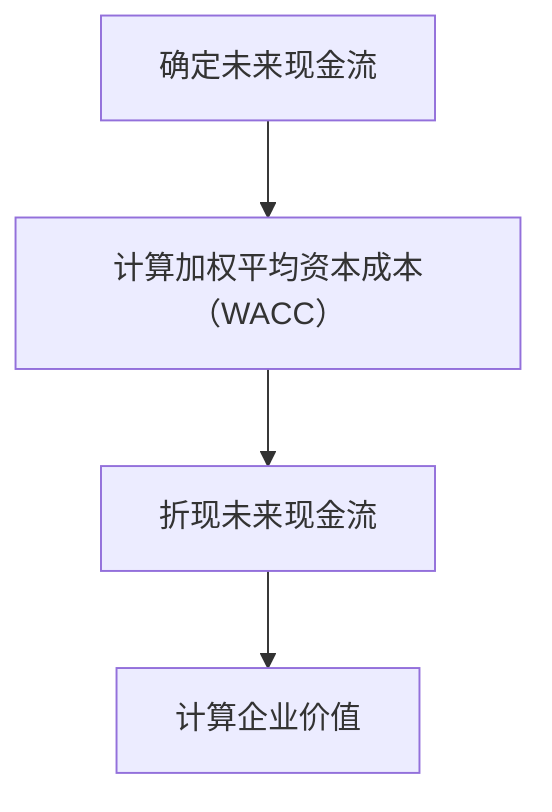

                 


# 价值投资原则：在估值差异中寻找机会

> 关键词：价值投资，估值差异，内在价值，安全边际，市场波动，投资策略，财务分析

> 摘要：本文深入探讨了价值投资的核心原则，分析了如何通过评估企业的内在价值，在估值差异中寻找投资机会。文章从背景介绍、核心概念、算法原理、系统分析、项目实战等多角度展开，结合实例和图表，详细讲解了价值投资的策略与实践。

---

## 第1章：价值投资概述

### 1.1 价值投资的定义与历史

价值投资是一种长期投资策略，专注于寻找市场低估的股票，基于对企业内在价值的深入分析。起源于20世纪，以本杰明·格雷厄姆和戴维·多德为代表，强调安全边际和长期持有。

#### 1.1.1 价值投资的起源与发展
- 格雷厄姆与多德的贡献奠定了价值投资的基础。
- 价值投资在实践中经历了多次检验，尤其在2008年金融危机后，其稳定性受到关注。

#### 1.1.2 价值投资的核心理念
- 价格与价值的差异是投资机会的来源。
- 长期持有优质资产，避免短期波动干扰。

#### 1.1.3 价值投资与其它投资策略的区别
- 与趋势投资、技术分析不同，价值投资注重基本面分析。

---

## 第2章：内在价值评估

### 2.1 财务报表分析

#### 2.1.1 收入、利润和现金流的计算
- 收入：企业的营业收入。
- 利润：净利润，反映企业盈利能力。
- 现金流：经营活动现金流，衡量企业造血能力。

#### 2.1.2 资产负债表的核心要素
- 流动资产：现金、应收账款。
- 非流动资产：固定资产、无形资产。
- 负债：流动负债、长期负债。

#### 2.1.3 现金流量表的重要性
- 反映企业资金流动情况，判断企业财务健康状况。

### 2.2 财务比率分析

#### 2.2.1 常见财务比率及其计算公式
| 指标 | 计算公式 |
|------|----------|
| 市盈率 | P/E = 价格/每股收益 |
| 市净率 | P/B = 价格/每股净资产 |

#### 2.2.2 市盈率与市净率的比较
- 市盈率适用于盈利稳定的公司，市净率适用于资产密集型行业。

#### 2.2.3 负债率与杠杆比率的分析
- 负债率：负债总额/资产总额。
- 杠杆比率：债务/股权，衡量企业杠杆风险。

### 2.3 现金流与DCF模型

#### 2.3.1 自由现金流的计算方法
$$ \text{自由现金流} = \text{净利润} - \text{折旧} - \text{资本支出} $$

#### 2.3.2 现金流折现模型（DCF）概述
- 基于未来现金流的现值计算企业价值。

#### 2.3.3 DCF模型的详细步骤


## 第3章：市场波动与投资者情绪

### 3.1 市场波动的成因
- 市场情绪对企业估值的影响。
- 市场周期与投资机会的关联。

### 3.2 行为金融学视角

#### 3.2.1 投资者心理偏差
- 过度自信与从众心理。
- 惶惧情绪与市场反应。

---

## 第4章：投资组合构建与风险管理

### 4.1 投资组合的基本原理
- 资产配置的重要性。
- 分散投资以降低风险。

### 4.2 风险管理策略
- 定期评估投资组合。
- 调整持仓以应对市场变化。

---

## 第5章：成功案例分析

### 5.1 巴菲特的伯克希尔哈撒韦公司
- 长期投资策略和风险管理措施。

---

## 第6章：当前市场与未来趋势

### 6.1 当前市场状况
- 分析当前市场中的估值差异。
- 探讨未来投资机会。

---

## 附录

### 附录A：DCF模型的Python实现
```python
def calculate_dcf(cash_flows, discount_rate):
    present_value = sum(cash_flow / (1 + discount_rate) ** t for t, cash_flow in enumerate(cash_flows))
    return present_value

cash_flows = [100, 150, 200, 250]
discount_rate = 0.10
dcf_value = calculate_dcf(cash_flows, discount_rate)
print(f"DCF Value: {dcf_value}")
```

### 附录B：价值投资书籍推荐
- 《The Intelligent Investor》
- 《The Theory of Investment Value》

---

## 小结

价值投资是一种基于基本面分析的投资策略，通过评估企业的内在价值，寻找市场低估的投资机会。本文从内在价值评估、市场波动分析、投资组合构建等多个角度，详细讲解了价值投资的策略与实践，帮助投资者在估值差异中寻找机会。

---

作者：AI天才研究院/AI Genius Institute & 禅与计算机程序设计艺术 /Zen And The Art of Computer Programming

