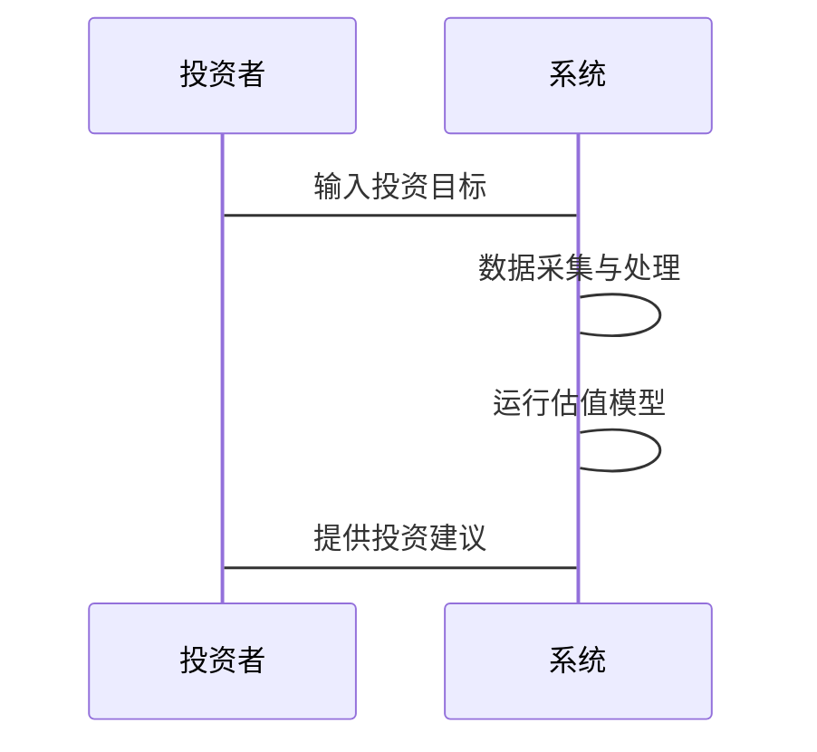

                 

# 价值投资在不同市场环境下的应用

---

## 关键词
价值投资、市场环境、内在价值、安全边际、投资策略、风险管理、系统架构

---

## 摘要
价值投资是一种以基本面分析为基础的投资策略，强调通过深入分析企业的内在价值，寻找市场估值低于其内在价值的投资机会。本文系统地探讨了价值投资在不同市场环境下的应用，包括熊市、牛市和震荡市中的策略差异，分析了价值投资的核心概念和数学模型，并结合实际案例，提出了投资决策支持系统的架构设计。通过系统性分析和实战案例，本文为投资者提供了在复杂市场环境中运用价值投资的深度指导。

---

# 第一部分: 价值投资的背景与核心概念

## 第1章: 价值投资的起源与发展

### 1.1 价值投资的起源
#### 1.1.1 价值投资的定义与核心理念
价值投资是一种以长期持有的投资策略，核心理念是购买低于其内在价值的资产。格雷厄姆在《证券分析》中首次系统阐述了价值投资理论，强调安全边际和防御性投资。

#### 1.1.2 价值投资的起源与发展历程
价值投资起源于20世纪初，经历了格雷厄姆和巴菲特的发展，逐渐成为一种成熟的投资理念。其核心在于寻找市场低估的股票，通过安全边际降低投资风险。

#### 1.1.3 价值投资与其他投资理念的区别
与趋势投资和技术分析不同，价值投资注重基本面分析，强调长期持有的策略。通过对比其他投资方法，突显价值投资的独特性。

### 1.2 价值投资的核心理论
#### 1.2.1 格雷厄姆的价值投资理论
格雷厄姆提出的防御性投资策略，强调安全边际和内在价值的计算，通过低市盈率和低市净率寻找低估股票。

#### 1.2.2 巴菲特的价值投资方法
巴菲特将格雷厄姆的理论与彼得·林奇的成长股投资相结合，注重企业的竞争优势和管理层能力，寻找具有持续增长潜力的企业。

#### 1.2.3 现代价值投资的发展与演变
现代价值投资结合了新的金融工具和分析方法，如量化分析和大数据技术，扩展了应用范围，提高了投资效率。

### 1.3 价值投资的适用场景
#### 1.3.1 不同市场环境下的价值投资策略
在熊市中，价值投资强调安全边际，注重低估股票；牛市中，需警惕估值泡沫，震荡市中则需灵活调整策略。

#### 1.3.2 价值投资在熊市与牛市中的表现
熊市中，价值投资往往表现优异，因为市场低估了优质资产；牛市中，若市场估值过高，价值投资可能表现不佳。

#### 1.3.3 价值投资在新兴市场与成熟市场的差异
新兴市场波动性更大，价值投资需考虑市场流动性风险；成熟市场波动较小，更适合长期投资策略。

### 1.4 本章小结
本章通过分析价值投资的起源、核心理论及其在不同市场环境下的策略，帮助读者理解其基本概念和应用场景。

---

## 第2章: 价值投资的核心概念与分析框架

### 2.1 价值投资的核心概念
#### 2.1.1 内在价值的定义与计算方法
内在价值是企业未来现金流的现值，常用DCF模型计算。例如，假设企业未来现金流为 $100，贴现率为10%，则内在价值为 $111.11。

#### 2.1.2 市场价值与内在价值的关系
市场价值围绕内在价值波动，当市场价值低于内在价值时，存在投资机会。

#### 2.1.3 安全边际的概念与应用
安全边际是内在价值与市场价值之间的差额，用于降低投资风险。例如，若内在价值为 $100，市场价值为 $80，安全边际为 $20。

### 2.2 价值投资的分析框架
#### 2.2.1 财务报表分析方法
通过分析利润表、资产负债表和现金流量表，评估企业的财务状况。例如，ROE（净资产收益率）是衡量企业盈利能力的重要指标。

#### 2.2.2 行业分析与竞争优势评估
行业分析包括市场规模、竞争结构和周期性，竞争优势评估包括成本优势、品牌优势等。

#### 2.2.3 管理层分析与企业治理结构
管理层的诚信和能力对企业长期发展至关重要，需关注管理层的过往记录和治理结构。

### 2.3 价值投资的估值模型
#### 2.3.1 现金流折现模型（DCF）
DCF模型通过预测未来现金流并贴现计算内在价值。例如，假设现金流为 $100，贴现率为10%，则价值为 $100 / 0.10 = $1,000。

#### 2.3.2 市盈率与市净率分析
市盈率（P/E）=股价/每股收益，市净率（P/B）=股价/每股净资产。例如，若P/E为10，行业平均P/E为15，则该股票可能被低估。

#### 2.3.3 股息率与股息增长模型
股息率=股息/股价，股息增长模型假设股息以固定速率增长，计算其现值。

### 2.4 本章小结
本章详细介绍了价值投资的核心概念，包括内在价值、安全边际和估值模型，并探讨了分析框架的应用。

---

## 第3章: 价值投资在不同市场环境下的应用

### 3.1 熊市环境下的价值投资策略
#### 3.1.1 熊市中的价值投资机会
熊市中市场恐慌，股票估值可能低于内在价值，提供买入机会。例如，若股票A的内在价值为 $100，熊市中价格跌至 $80，此时买入。

#### 3.1.2 熊市中的安全边际策略
在熊市中，增大安全边际，选择估值极低的股票，降低投资风险。

#### 3.1.3 熊市中的风险管理与仓位控制
通过分散投资和严格止损控制风险，避免重大损失。例如，将资金分散投资于多个低估股票，避免单一股票的大幅波动。

### 3.2 牛市环境下的价值投资策略
#### 3.2.1 牛市中的价值投资机会
牛市中市场情绪高涨，需警惕高估值股票，寻找被市场忽视的低估股票。例如，若股票B的P/E为20，行业平均为15，需谨慎。

#### 3.2.2 牛市中的估值泡沫与风险识别
识别高估值股票，避免追高，寻找具有持续增长潜力的企业。

#### 3.2.3 牛市中的投资组合调整策略
根据市场变化调整投资组合，增加防御性股票的权重，减少高风险资产。

### 3.3 震荡市环境下的价值投资策略
#### 3.3.1 震荡市中的投资机会与风险
震荡市中市场波动大，需寻找估值稳定且具有成长性的股票，同时控制仓位。

#### 3.3.2 震荡市中的短期与长期策略结合
短期策略如波段操作，长期策略如价值投资，结合两者以应对市场波动。

#### 3.3.3 震荡市中的投资纪律与心态管理
严格遵守投资纪律，避免情绪化决策，保持心态稳定。

### 3.4 本章小结
本章分析了价值投资在熊市、牛市和震荡市中的策略差异，强调根据不同市场环境调整投资策略。

---

## 第4章: 价值投资的系统性分析与架构设计

### 4.1 价值投资的系统性分析框架
#### 4.1.1 投资目标与策略的系统性设计
设定明确的投资目标，如追求绝对收益，制定长期投资计划。

#### 4.1.2 投资组合的构建与优化
根据市场环境和投资目标，优化投资组合，分散风险。

#### 4.1.3 风险管理与绩效评估
建立风险管理机制，定期评估投资绩效，调整策略。

### 4.2 价值投资的系统架构设计
#### 4.2.1 投资决策支持系统的功能模块
- 数据采集模块：收集财务数据、市场数据。
- 估值模型模块：计算内在价值、安全边际。
- 风险评估模块：评估市场风险、个股风险。

#### 4.2.2 系统架构设计（Mermaid图）

#### 4.2.3 系统交互设计（Mermaid图）

### 4.3 本章小结
本章通过系统架构设计，展示了如何构建投资决策支持系统，帮助投资者系统性地进行价值投资。

---

## 第5章: 价值投资的项目实战

### 5.1 项目背景与目标
以某家上市公司为例，分析其财务状况、行业地位和竞争优势，评估其内在价值。

### 5.2 数据收集与处理
使用Python收集公司过去5年的财务数据，计算关键指标如ROE、P/E等。

### 5.3 估值模型的应用
应用DCF模型计算公司内在价值，比较市场价值与内在价值，判断是否低估。

### 5.4 投资决策与执行
根据分析结果制定投资策略，决定买入、持有或卖出。

### 5.5 项目小结
通过实战案例，展示了价值投资在实际中的应用，强调理论与实践的结合。

---

## 第6章: 价值投资的最佳实践与注意事项

### 6.1 最佳实践
- 定期复盘与调整策略。
- 保持学习，更新知识。
- 严格遵守投资纪律。

### 6.2 注意事项
- 避免过度分散投资。
- 重视风险管理，控制仓位。
- 理解市场波动，避免情绪化决策。

### 6.3 拓展阅读
推荐阅读《证券分析》、《巴菲特致股东的信》等书籍，深入理解价值投资理论。

---

## 小结
价值投资是一种长期有效的投资策略，通过系统性分析和实战应用，投资者可以在不同市场环境中灵活运用。遵循价值投资的原则，结合系统架构设计，投资者能够做出更明智的投资决策。

---

## 作者：AI天才研究院/AI Genius Institute & 禅与计算机程序设计艺术 /Zen And The Art of Computer Programming

---

以上是《价值投资在不同市场环境下的应用》的详细目录大纲，涵盖了从基础理论到系统设计和实战应用的各个方面，结合了技术与投资的深度分析，为读者提供了全面的价值投资指导。

