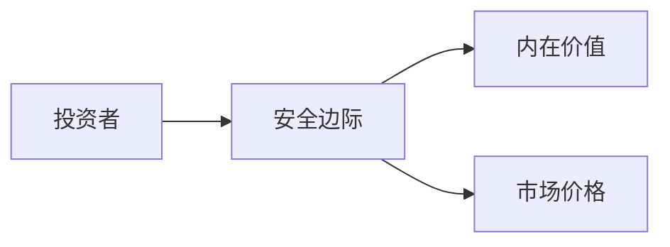
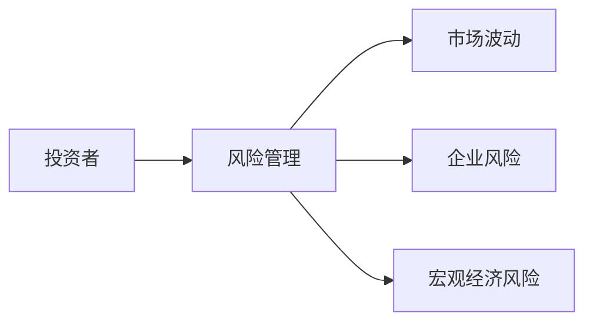

                 

# 价值投资的核心原则：安全边际

## 关键词：
- 价值投资
- 安全边际
- 投资策略
- 风险管理
- 股票估值

## 摘要：
本书深入探讨了价值投资中的核心原则——安全边际。通过详细分析安全边际的定义、计算方法及其在不同投资策略中的应用，读者将学会如何通过安全边际来评估投资标的的价值，降低投资风险，实现稳健的投资回报。书中结合理论与实践，提供了丰富的实例和系统化的架构，帮助投资者在复杂多变的市场环境中做出明智的投资决策。

---

## 目录大纲

### 第一部分：价值投资与安全边际概述

#### 第1章：价值投资的基本概念
1.1 价值投资的定义与核心理念
1.2 安全边际的定义与特点
1.3 安全边际的计算方法
1.4 安全边际的应用场景

#### 第2章：安全边际的核心原则
2.1 安全边际的哲学基础
2.2 安全边际的数学模型
2.3 安全边际的属性特征对比
2.4 安全边际的ER实体关系图

#### 第3章：安全边际与价值评估
3.1 价值评估的基本方法
3.2 安全边际与价值评估的关系
3.3 安全边际在不同估值方法中的应用

### 第二部分：安全边际在投资中的应用

#### 第4章：安全边际与风险管理
4.1 安全边际在风险管理中的作用
4.2 安全边际与常见风险因素的分析
4.3 安全边际的系统架构图

#### 第5章：安全边际与其他投资策略的结合
5.1 安全边际在成长型投资中的应用
5.2 安全边际在股息投资中的应用
5.3 安全边际在投资组合中的综合运用

#### 第6章：安全边际的动态调整
6.1 安全边际的动态调整方法
6.2 不同市场环境下的安全边际调整策略
6.3 安全边际的动态调整案例分析

### 第三部分：总结与展望

#### 第7章：总结与建议
7.1 全书内容回顾
7.2 实用建议与最佳实践
7.3 未来投资趋势展望

---

## 正文内容

### 第1章：价值投资的基本概念

#### 1.1 价值投资的定义与核心理念
价值投资是一种长期投资策略，强调购买那些市场价格低于其内在价值的资产。其核心理念是寻找被市场低估的投资标的，通过长期持有实现资本增值。价值投资的关键在于对企业的基本面进行深入分析，寻找具有持续竞争优势和良好财务状况的企业。

#### 1.2 安全边际的定义与特点
安全边际是指投资标的市场价格与其内在价值之间的差异。当市场价格远低于内在价值时，投资标的具有较高的安全边际，能够为投资者提供较高的安全性和潜在回报。安全边际的核心特点包括：
1. **防御性**：通过预留安全空间，降低投资风险。
2. **稳健性**：确保在市场波动中仍能获得正收益。
3. **可操作性**：可以通过多种估值方法进行量化计算。

#### 1.3 安全边际的计算方法
安全边际可以通过以下几种方法进行计算：
1. **市盈率法**：计算目标市盈率与当前市盈率的差异。
2. **市净率法**：比较目标市净率与当前市净率的差异。
3. **股息率法**：评估股息率与合理股息率之间的差距。

#### 1.4 安全边际的应用场景
安全边际广泛应用于多种投资场景，包括：
1. **防御性投资**：在市场低迷时寻找具有高安全边际的投资标的。
2. **增长型投资**：在成长型企业中寻找价格合理的投资机会。
3. **投资组合管理**：通过分散投资降低整体风险。

### 第2章：安全边际的核心原则

#### 2.1 安全边际的哲学基础
安全边际的哲学基础包括谨慎性原则和风险与收益的平衡。投资者应保持谨慎，避免过度乐观，合理评估投资风险，追求风险调整后的收益最大化。

#### 2.2 安全边际的数学模型
安全边际的计算公式为：
$$ \text{安全边际} = \text{内在价值} - \text{市场价格} $$

#### 2.3 安全边际的属性特征对比
| 属性 | 特征 |
|------|------|
| 计算方法 | 简单 | 复杂 |
| 适用范围 | 广泛 | 有限 |

#### 2.4 安全边际的ER实体关系图

### 第3章：安全边际与价值评估

#### 3.1 价值评估的基本方法
价值评估的主要方法包括：
1. **现金流折现法**：通过折现未来现金流评估企业内在价值。
2. **相对估值法**：比较同类企业的估值指标。
3. **股权自由现金流法**：评估企业未来现金流的现值。

#### 3.2 安全边际与价值评估的关系
安全边际作为价值评估的修正因素，帮助投资者避免高估或低估投资标的的价值。通过合理评估安全边际，投资者可以更准确地判断投资标的的潜在收益和风险。

#### 3.3 安全边际在不同估值方法中的应用
1. **现金流折现法**：通过安全边际调整折现率或未来现金流预测。
2. **相对估值法**：比较目标估值与市场估值，确定安全边际。
3. **股权自由现金流法**：评估股权价值时考虑安全边际的影响。

### 第4章：安全边际与风险管理

#### 4.1 安全边际在风险管理中的作用
安全边际通过预留价格折扣，降低市场波动对企业价值的影响。投资者可以通过安全边际的调整，有效管理市场风险和企业特有风险。

#### 4.2 安全边际与常见风险因素的分析
1. **市场波动**：安全边际帮助投资者应对市场价格波动。
2. **企业财务状况**：通过安全边际评估企业的财务健康状况。
3. **宏观经济环境**：在不同经济周期中调整安全边际。

#### 4.3 安全边际的系统架构图

### 第5章：安全边际与其他投资策略的结合

#### 5.1 安全边际在成长型投资中的应用
成长型投资强调企业未来的增长潜力。通过安全边际，投资者可以寻找那些价格合理、具备持续增长能力的企业。

#### 5.2 安全边际在股息投资中的应用
股息投资注重企业的股息支付能力。安全边际帮助投资者筛选那些股息率合理、财务稳定的公司。

#### 5.3 安全边际在投资组合中的综合运用
通过将安全边际应用于不同的投资策略，投资者可以构建一个多元化、风险可控的投资组合，实现长期稳健的收益。

### 第6章：安全边际的动态调整

#### 6.1 安全边际的动态调整方法
投资者需要根据市场环境和企业基本面的变化，动态调整安全边际。例如，在市场上涨时适当降低安全边际，在市场下跌时增加安全边际。

#### 6.2 不同市场环境下的安全边际调整策略
1. **牛市**：适当降低安全边际，抓住优质资产的上涨机会。
2. **熊市**：提高安全边际，寻找被低估的投资标的。

#### 6.3 安全边际的动态调整案例分析
通过具体案例分析，展示如何根据市场变化调整安全边际，优化投资组合。

### 第7章：总结与建议

#### 7.1 全书内容回顾
总结全书的主要内容，强调安全边际在价值投资中的重要性。

#### 7.2 实用建议与最佳实践
为投资者提供实用的建议，如定期评估投资组合的安全边际，避免过度集中投资等。

#### 7.3 未来投资趋势展望
展望未来投资趋势，强调安全边际在长期投资中的持续重要性。

---

## 作者信息

作者：AI天才研究院/AI Genius Institute & 禅与计算机程序设计艺术/Zen And The Art of Computer Programming

---

通过系统地分析和详细讲解，本书将帮助投资者深入理解安全边际的原则和应用，做出更加稳健和明智的投资决策。

