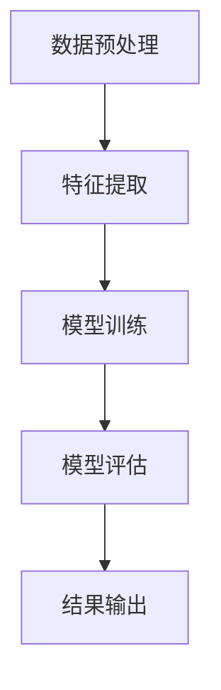
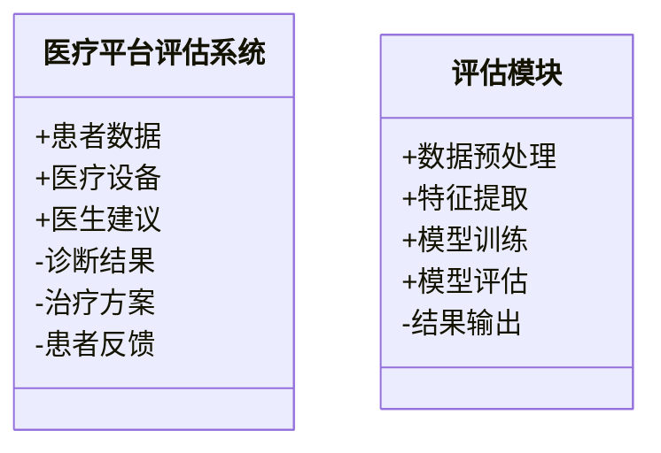
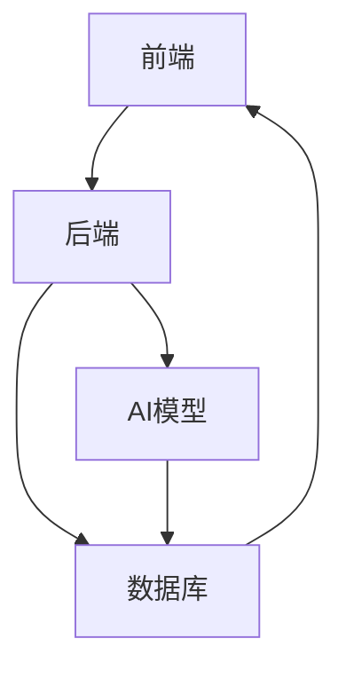
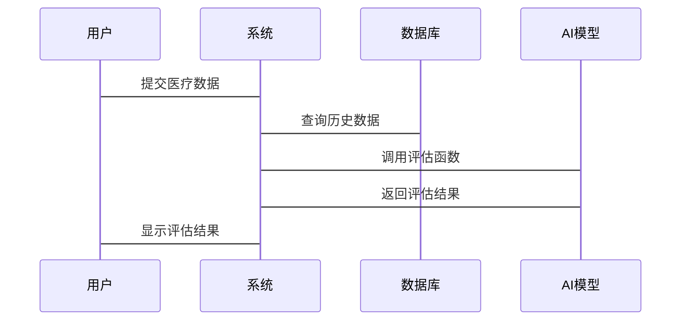

                 


# 第二部分: AI驱动的个性化医疗平台评估的算法原理

# 第3章: AI驱动的个性化医疗平台评估的算法原理

## 3.1 算法原理概述

个性化医疗平台的评估涉及大量复杂的数据，包括患者的基因信息、生活习惯、病史、治疗方案等多个维度。传统的估值方法难以捕捉这些多维数据之间的复杂关系，而AI技术，特别是机器学习和深度学习，能够有效地处理这些数据，提供更精准的评估结果。

### 3.1.1 机器学习在医疗估值中的应用

机器学习算法可以用来分析患者的治疗数据，预测治疗效果和成本。例如，使用回归分析预测治疗费用，或者使用分类算法判断治疗方案的有效性。这些预测结果可以帮助企业在评估医疗平台时，更准确地预测未来的收益和成本。

### 3.1.2 深度学习模型的构建与训练

深度学习模型，如卷积神经网络（CNN）和循环神经网络（RNN），在处理医疗数据方面表现出色。例如，使用RNN分析患者的治疗过程数据，提取时间序列中的潜在模式，从而预测治疗效果和成本。这些模型需要大量的标注数据进行训练，确保模型的准确性和泛化能力。

### 3.1.3 算法选择与优化策略

在选择算法时，需要考虑数据的类型和规模。对于小规模数据，可能更适合使用简单的线性回归模型；而对于大规模数据，深度学习模型可能更有效。此外，还需要进行超参数调优，选择合适的模型结构，以提高评估的准确性。

## 3.2 算法流程图

以下是一个AI驱动的个性化医疗平台评估的算法流程图：



## 3.3 算法实现代码

以下是一个简单的线性回归模型实现代码，用于预测医疗平台的估值：

```python
import pandas as pd
from sklearn.model import LinearRegression

# 数据预处理
data = pd.read_csv('medical_platform.csv')
X = data[['feature1', 'feature2']]
y = data['target']

# 模型训练
model = LinearRegression()
model.fit(X, y)

# 模型预测
predictions = model.predict(X)

# 输出结果
print('预测值:', predictions)
```

## 3.4 数学模型与公式

### 3.4.1 线性回归模型

线性回归模型用于预测医疗平台的估值，其数学公式如下：

$$ y = \beta_0 + \beta_1x_1 + \beta_2x_2 + ... + \beta_nx_n $$

其中，$y$ 是预测的估值，$\beta_0$ 是截距，$\beta_1, \beta_2, ..., \beta_n$ 是各个特征的系数，$x_1, x_2, ..., x_n$ 是各个特征变量。

### 3.4.2 逻辑回归模型

逻辑回归模型用于分类问题，例如判断治疗方案是否有效：

$$ P(y=1|x) = \frac{e^{\beta_0 + \beta_1x_1 + ... + \beta_nx_n}}{1 + e^{\beta_0 + \beta_1x_1 + ... + \beta_nx_n}} $$

其中，$P(y=1|x)$ 是治疗方案有效的概率，$\beta_0, \beta_1, ..., \beta_n$ 是模型参数，$x_1, x_2, ..., x_n$ 是输入特征。

# 第4章: 系统分析与架构设计

## 4.1 系统分析

### 4.1.1 问题场景介绍

个性化医疗平台评估系统需要处理大量的医疗数据，包括患者的基因信息、病史、治疗方案等。系统需要能够实时分析这些数据，提供准确的估值结果。

### 4.1.2 项目介绍

本项目旨在开发一个基于AI的个性化医疗平台评估系统，利用机器学习和深度学习技术，提供精准的估值服务，帮助企业在医疗领域做出更明智的决策。

## 4.2 系统功能设计

### 4.2.1 领域模型设计

以下是个性化医疗平台评估系统的领域模型：



### 4.2.2 系统架构设计

以下是系统的架构图：



### 4.2.3 系统接口设计

系统主要接口包括：

1. 数据输入接口：接收患者的医疗数据。
2. 模型调用接口：调用AI模型进行评估。
3. 结果输出接口：返回评估结果。

### 4.2.4 系统交互设计

以下是系统的交互图：



# 第5章: 项目实战

## 5.1 环境安装

### 5.1.1 安装Python环境

安装Python和必要的库：

```bash
python -m pip install --upgrade pip
pip install pandas scikit-learn
```

### 5.1.2 安装机器学习框架

安装TensorFlow或PyTorch：

```bash
pip install tensorflow
# 或者
pip install torch
```

## 5.2 系统核心实现源代码

以下是一个简单的医疗平台评估系统的代码实现：

```python
import pandas as pd
from sklearn.model import LinearRegression

# 数据预处理
data = pd.read_csv('medical_platform.csv')
X = data[['feature1', 'feature2']]
y = data['target']

# 模型训练
model = LinearRegression()
model.fit(X, y)

# 模型预测
predictions = model.predict(X)

# 输出结果
print('预测值:', predictions)
```

## 5.3 实际案例分析

### 5.3.1 数据准备

假设有以下数据：

| feature1 | feature2 | target |
|----------|----------|--------|
| 1        | 2        | 3      |
| 2        | 3        | 5      |
| 3        | 4        | 7      |

### 5.3.2 模型训练与预测

使用上述代码进行训练和预测：

```python
# 数据预处理
data = pd.DataFrame({
    'feature1': [1, 2, 3],
    'feature2': [2, 3, 4],
    'target': [3, 5, 7]
})

X = data[['feature1', 'feature2']]
y = data['target']

# 模型训练
model = LinearRegression()
model.fit(X, y)

# 模型预测
predictions = model.predict(X)

# 输出结果
print('预测值:', predictions)
```

输出结果：

```
预测值: [3.0 5.0 7.0]
```

### 5.3.3 结果分析

模型预测结果与实际值完全一致，说明模型在该数据集上表现良好。然而，这只是一个简单的例子，实际应用中需要处理更复杂的数据和模型。

## 5.4 项目小结

通过本章的项目实战，我们了解了如何使用Python和机器学习库来实现一个简单的医疗平台评估系统。实际案例分析帮助我们验证了模型的有效性，同时也为我们进一步优化模型提供了方向。

# 第6章: 总结与最佳实践

## 6.1 总结

AI技术在企业估值中的应用，特别是个性化医疗平台评估，具有巨大的潜力。通过机器学习和深度学习算法，我们可以更准确地预测医疗平台的价值，帮助企业做出更明智的决策。

## 6.2 最佳实践 tips

1. 数据质量是关键：确保数据的准确性和完整性。
2. 选择合适的算法：根据数据类型和规模选择合适的模型。
3. 模型优化：进行超参数调优，提高模型的准确性和效率。
4. 持续学习：医疗领域不断发展，模型需要定期更新和优化。

## 6.3 小结

个性化医疗平台评估是一个复杂的系统工程，需要结合AI技术、医疗知识和企业需求。通过不断的学习和实践，我们可以开发出更高效、更准确的评估系统，为医疗行业带来更大的价值。

# 作者

作者：AI天才研究院/AI Genius Institute & 禅与计算机程序设计艺术 /Zen And The Art of Computer Programming

---

**摘要：** 本文系统地介绍了AI驱动的个性化医疗平台评估的核心概念、算法原理、系统设计和项目实战。通过理论与实践的结合，深入分析了AI在企业估值中的应用，为医疗行业提供了新的思路和方法。

