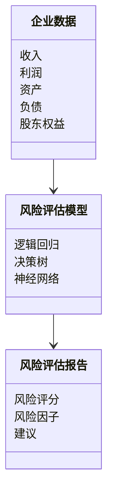

                 


# 《企业估值中的AI驱动的自动化风险评估平台评估》

---

## 关键词：
- 企业估值、AI驱动、自动化风险评估、机器学习、金融技术、风险管理

---

## 摘要：
本文深入探讨了AI驱动的自动化风险评估平台在企业估值中的应用，从背景、原理、算法、系统架构到实际项目实现，全面解析了如何利用人工智能技术提升企业风险评估的效率和准确性。通过结合传统金融分析方法与现代AI技术，本文提出了一个基于机器学习和深度学习的自动化风险评估系统，旨在为企业估值提供更加智能化、数据化的解决方案。

---

# 第一章: 企业估值与风险评估的背景

## 1.1 企业估值的基本概念
### 1.1.1 企业估值的定义与核心要素
企业估值是通过对企业的财务状况、市场表现、管理能力等多方面因素的综合分析，评估其市场价值或内在价值的过程。核心要素包括：
1. 财务数据：收入、利润、资产、负债等。
2. 市场数据：行业趋势、竞争环境、宏观经济状况。
3. 风险因素：市场风险、信用风险、操作风险等。

### 1.1.2 传统企业估值方法的局限性
传统估值方法（如DCF模型、PE估值等）依赖于人工分析和主观判断，存在以下问题：
1. 数据处理效率低。
2. 风险因素难以量化。
3. 信息更新不及时。
4. 需要大量人工干预。

### 1.1.3 风险评估在企业估值中的重要性
风险评估是企业估值的核心环节，直接影响估值结果的准确性和可靠性。传统的风险评估方法依赖于经验判断，难以应对复杂的市场环境和数据量的爆炸式增长。因此，引入AI技术成为必然趋势。

---

## 1.2 AI驱动的自动化风险评估的背景
### 1.2.1 AI技术在金融领域的应用现状
AI技术已在金融领域的多个场景中得到广泛应用，包括股票预测、信用评估、欺诈检测等。然而，企业在风险评估和估值方面的AI应用仍处于初级阶段。

### 1.2.2 自动化风险评估的必要性
随着企业规模的不断扩大和市场环境的复杂化，传统的人工风险评估方式已无法满足需求。自动化风险评估能够显著提升效率、降低成本，并能够实时捕捉市场变化。

### 1.2.3 企业估值与风险评估的结合
企业估值需要综合考虑多种风险因素，而AI技术能够通过数据挖掘和建模，帮助企业更准确地识别和量化这些风险，从而提高估值的准确性。

---

## 1.3 本章小结
本章通过分析企业估值的基本概念和传统方法的局限性，阐述了AI驱动的自动化风险评估的必要性及其在企业估值中的重要性。

---

# 第二章: 风险评估的核心概念与原理

## 2.1 风险评估的基本原理
### 2.1.1 风险的定义与分类
风险是指在未来一定时期内，由于不确定因素的影响，导致企业实际收益与预期收益发生偏差的可能性。风险可以分为市场风险、信用风险、操作风险等。

### 2.1.2 风险评估的主要指标
- **波动率**：衡量资产价格的波动程度。
- **VaR（Value at Risk）**：在给定置信水平下，可能发生的最大损失。
- **信用评分**：用于评估企业或个人的信用风险。

### 2.1.3 风险评估的基本流程
1. 数据收集与预处理。
2. 风险因素识别。
3. 模型构建与训练。
4. 模型验证与优化。
5. 风险评估报告生成。

---

## 2.2 AI在风险评估中的应用
### 2.2.1 机器学习在风险预测中的作用
- **监督学习**：用于分类和回归任务，如信用评分。
- **无监督学习**：用于异常检测，如欺诈检测。
- **半监督学习**：结合少量标注数据和大量未标注数据进行模型训练。

### 2.2.2 自然语言处理在风险分析中的应用
NLP技术可以用于分析企业财报、新闻标题等文本数据，提取情感倾向和关键词，辅助风险评估。

### 2.2.3 图神经网络在风险传播中的应用
图神经网络可以建模企业之间的关联关系，用于分析风险在企业间的传播路径和影响范围。

---

## 2.3 本章小结
本章详细介绍了风险评估的基本原理和AI技术在风险评估中的应用，为后续章节的算法实现奠定了理论基础。

---

# 第三章: AI驱动的自动化风险评估的算法原理

## 3.1 传统风险评估算法
### 3.1.1 逻辑回归模型
逻辑回归是一种常用的二分类算法，适用于信用评分等场景。其核心公式为：
$$ P(y=1|x) = \frac{1}{1 + e^{-\beta x}} $$

### 3.1.2 决策树模型
决策树是一种基于树状结构的分类模型，适用于特征选择和非线性关系的建模。

### 3.1.3 随机森林模型
随机森林是一种基于决策树的集成学习算法，通过投票机制提高模型的准确性和稳定性。

---

## 3.2 基于深度学习的风险评估算法
### 3.2.1 神经网络模型
神经网络是一种多层的深度学习模型，适用于复杂的非线性关系建模。

### 3.2.2 卷积神经网络（CNN）在风险评估中的应用
CNN常用于处理图像和序列数据，可以应用于时间序列分析和图像识别。

### 3.2.3 循环神经网络（RNN）在时间序列风险分析中的应用
RNN适用于时间序列数据的建模，可以捕捉数据中的时序依赖关系。

---

## 3.3 算法原理的数学模型与公式
### 3.3.1 逻辑回归的数学公式
$$ P(y=1|x) = \frac{1}{1 + e^{-\beta x}} $$

### 3.3.2 决策树的分类原理
- 决策树通过特征分裂构建树状结构，最终预测结果为叶子节点的类别。

### 3.3.3 神经网络的损失函数
$$ L = -\sum_{i=1}^{n} y_i \log(a_i) + (1 - y_i) \log(1 - a_i) $$

---

## 3.4 本章小结
本章详细介绍了传统机器学习和深度学习算法在风险评估中的应用，并通过数学公式和流程图的形式，直观地展示了算法的实现过程。

---

# 第四章: 系统分析与架构设计方案

## 4.1 系统功能设计
### 4.1.1 系统需求分析
- 数据采集模块：从数据库、API等多渠道获取企业数据。
- 数据预处理模块：清洗、特征提取和数据增强。
- 模型训练模块：基于机器学习和深度学习算法构建风险评估模型。
- 模型部署模块：将模型部署到生产环境，提供API接口。

### 4.1.2 领域模型设计


---

## 4.2 系统架构设计


---

## 4.3 系统接口设计
- 数据采集接口：从数据库或API获取企业数据。
- 模型训练接口：接收数据并返回训练好的模型。
- 风险评估接口：接收企业信息并返回风险评估结果。

---

## 4.4 本章小结
本章通过系统功能设计、领域模型设计和架构设计，详细描述了AI驱动的自动化风险评估平台的实现方案。

---

# 第五章: 项目实战

## 5.1 环境配置
### 5.1.1 安装Python和相关库
```bash
pip install numpy pandas scikit-learn tensorflow matplotlib
```

### 5.1.2 数据集准备
- 数据来源：企业财务数据、市场数据、新闻数据等。
- 数据格式：CSV或数据库。

---

## 5.2 数据预处理与特征工程
### 5.2.1 数据清洗
- 删除缺失值。
- 处理异常值。

### 5.2.2 特征提取
- 从财务数据中提取关键指标（如ROE、毛利率等）。
- 从文本数据中提取关键词（如“亏损”、“增长”等）。

---

## 5.3 模型训练与部署
### 5.3.1 选择算法
- 逻辑回归：适用于二分类问题。
- 随机森林：适用于特征较多的场景。
- 神经网络：适用于复杂的非线性关系。

### 5.3.2 训练模型
```python
from sklearn.linear_model import LogisticRegression
model = LogisticRegression()
model.fit(X_train, y_train)
```

### 5.3.3 部署模型
```python
from flask import Flask, request, jsonify

app = Flask(__name__)
@app.route('/predict', methods=['POST'])
def predict():
    data = request.json
    prediction = model.predict([data['features']])
    return jsonify({'result': prediction.tolist()})

if __name__ == '__main__':
    app.run()
```

---

## 5.4 案例分析
### 5.4.1 数据来源与预处理
假设我们从某企业数据库中获取了以下数据：
| 收入 | 利润 | 资产 | 负债 | 信用评分 |
|------|------|------|------|----------|
| 100  | 20   | 500  | 300  | 0.8      |

### 5.4.2 模型训练
使用逻辑回归模型进行训练，最终得到模型参数：
$$ P(y=1|x) = \frac{1}{1 + e^{-0.01x + 0.02}} $$

### 5.4.3 模型评估
通过混淆矩阵、准确率、召回率等指标评估模型性能。

### 5.4.4 风险评估报告
根据模型预测结果，生成风险评估报告，包括风险评分、风险因子和建议。

---

## 5.5 本章小结
本章通过实际项目案例，详细展示了AI驱动的自动化风险评估平台的实现过程，包括环境配置、数据预处理、模型训练和部署。

---

# 第六章: 扩展与优化

## 6.1 模型优化
### 6.1.1 集成学习
- 使用随机森林、梯度提升树等集成算法提高模型性能。

### 6.1.2 超参数调优
- 使用网格搜索或随机搜索优化模型参数。

### 6.1.3 模型解释性
- 使用SHAP值、特征重要性分析等方法解释模型结果。

---

## 6.2 系统优化
### 6.2.1 高可用性设计
- 使用负载均衡、容灾备份等技术提高系统可靠性。

### 6.2.2 高效数据处理
- 使用分布式计算框架（如Spark）处理大规模数据。

---

## 6.3 本章小结
本章通过模型优化和系统优化，进一步提升了AI驱动的自动化风险评估平台的性能和可靠性。

---

# 第七章: 总结与展望

## 7.1 总结
本文系统地介绍了AI驱动的自动化风险评估平台的构建过程，从理论到实践，详细讲解了算法原理、系统设计和项目实现。

## 7.2 未来展望
随着AI技术的不断发展，未来的风险评估平台将更加智能化、自动化和个性化。同时，如何应对数据隐私、模型解释性等挑战，也是未来研究的重点方向。

---

# 作者：AI天才研究院/AI Genius Institute & 禅与计算机程序设计艺术 /Zen And The Art of Computer Programming

---

以上是《企业估值中的AI驱动的自动化风险评估平台评估》的完整目录大纲，希望对您有所帮助！

