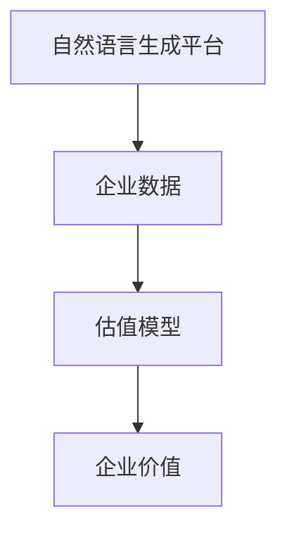
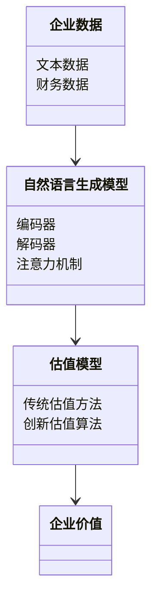
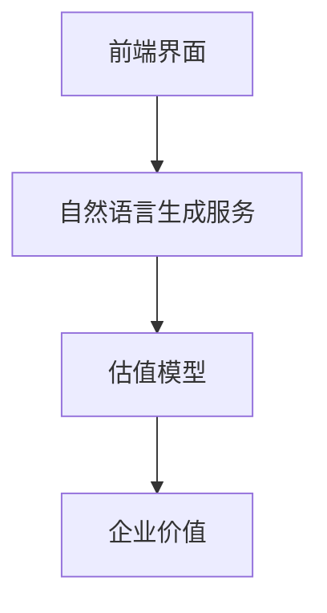
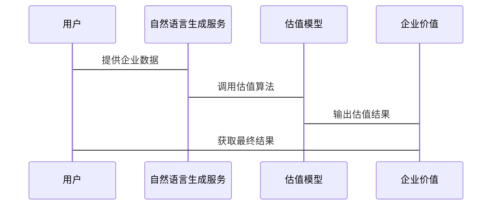

                 


# 企业估值中的AI驱动的自然语言生成平台评估

> 关键词：企业估值，AI驱动，自然语言生成，生成式AI，深度学习，企业价值评估

> 摘要：本文深入探讨了在企业估值过程中，如何利用AI驱动的自然语言生成技术来提升评估的准确性和效率。通过分析自然语言生成的核心原理、企业估值的关键指标以及两者的结合方式，本文提出了一种创新的企业估值方法。文章详细介绍了生成式AI的算法框架、数学模型、系统架构设计以及实际项目案例，展示了如何通过自然语言生成技术优化企业估值流程。

---

# 第一部分: 企业估值与AI驱动的自然语言生成平台概述

## 第1章: 企业估值中的AI驱动自然语言生成平台背景

### 1.1 问题背景与挑战

#### 1.1.1 传统企业估值方法的局限性
传统的企业估值方法主要依赖于财务数据和市场指标，例如市盈率、市净率、现金流折现法等。然而，这些方法往往忽略了企业文本信息（如公司公告、管理层报告）中的非结构化数据，导致估值结果可能存在偏差或遗漏重要信息。

#### 1.1.2 自然语言生成在企业估值中的潜力
自然语言生成（Natural Language Generation, NLP）技术能够从大量文本数据中提取关键信息，并自动生成结构化的报告。通过结合NLP技术，企业估值可以更加全面，不仅考虑财务数据，还能结合文本信息进行综合评估。

#### 1.1.3 当前市场对企业估值的需求
随着市场的复杂化，企业估值需要考虑更多动态因素，如行业趋势、政策变化、管理层战略等。传统的静态估值方法难以满足现代市场的需求，而AI驱动的自然语言生成技术提供了一种动态、全面的解决方案。

### 1.2 问题描述与目标

#### 1.2.1 企业估值的核心问题
企业估值的核心问题是如何准确评估企业的内在价值，同时考虑市场环境、行业趋势等外部因素。传统方法依赖于财务数据，但忽略了文本信息中的潜在价值。

#### 1.2.2 自然语言生成平台在企业估值中的应用目标
通过自然语言生成技术，自动生成企业相关的文本报告，提取关键信息，并结合财务数据进行综合评估。目标是提高估值的准确性和效率，同时降低人工分析的成本。

#### 1.2.3 解决方案的边界与外延
自然语言生成平台主要用于辅助企业估值，其边界在于文本信息的生成与分析，外延则包括与估值相关的数据采集、模型训练和结果解读。

### 1.3 核心概念与联系

#### 1.3.1 自然语言生成的基本原理
自然语言生成是指通过计算机生成符合人类语言习惯的文本。其基本原理包括文本编码、解码和生成三个阶段，通常使用深度学习模型（如Transformer）实现。

#### 1.3.2 企业估值的关键指标
企业估值的关键指标包括净利润、营业收入、市盈率、市净率等。这些指标反映了企业的财务状况和市场表现。

#### 1.3.3 两者的关联性与协同作用
自然语言生成技术可以提取企业公告、新闻报道中的非结构化信息，结合财务数据进行综合分析，从而提高估值的全面性和准确性。

### 1.4 本章小结
本章介绍了企业估值中的自然语言生成技术的应用背景、目标及核心概念。通过对比传统估值方法的局限性，突出了AI驱动自然语言生成技术的重要性和潜力。

---

# 第二部分: 自然语言生成与企业估值的核心概念

## 第2章: 自然语言生成技术原理

### 2.1 自然语言生成的基本原理

#### 2.1.1 生成式AI的定义与分类
生成式AI是一种能够生成人类可读文本的人工智能技术，主要分为基于规则的生成和基于模型的生成两类。

#### 2.1.2 大模型在自然语言生成中的作用
大模型（如GPT、BERT）通过大量的数据训练，能够生成高质量的文本，适用于多种场景，如报告生成、文本摘要等。

#### 2.1.3 自然语言生成的流程与特点
自然语言生成的流程包括数据预处理、模型训练、生成与优化。其特点包括自动化、高效性和可定制性。

### 2.2 企业估值的关键指标与模型

#### 2.2.1 企业估值的核心指标
企业估值的核心指标包括收入、利润、现金流、市场份额等。这些指标反映了企业的经营状况和市场竞争力。

#### 2.2.2 传统估值模型的优缺点
传统估值模型（如DCF模型）具有理论基础扎实、易于理解的优点，但其对非结构化数据的处理能力有限。

#### 2.2.3 结合自然语言生成的创新估值方法
通过自然语言生成技术，可以自动生成企业报告，提取文本信息，结合财务数据进行综合评估，从而提高估值的准确性和全面性。

### 2.3 自然语言生成与企业估值的结合

#### 2.3.1 NLP在企业文本分析中的应用
NLP技术可以用于企业公告、新闻报道的文本分析，提取关键信息，如战略调整、市场动态等。

#### 2.3.2 自然语言生成在企业报告中的应用
自然语言生成技术可以自动生成企业估值报告，包括财务分析、市场趋势、估值建议等内容。

#### 2.3.3 生成式AI对估值结果的影响
生成式AI能够提高估值的效率和准确性，同时降低人工分析的成本。

### 2.4 核心概念对比表

| 概念 | 自然语言生成 | 企业估值 |
|------|-------------|----------|
| 核心目标 | 生成人类可读文本 | 评估企业价值 |
| 输入 | 文本数据、上下文 | 企业财务数据、市场数据 |
| 输出 | 自动生成报告、预测文本 | 企业估值结果 |
| 技术基础 | 语言模型、深度学习 | 金融模型、统计分析 |

### 2.5 ER实体关系图



### 2.6 本章小结
本章详细介绍了自然语言生成技术的基本原理及其在企业估值中的应用。通过对比分析，突出了两者的结合方式和协同作用。

---

# 第三部分: 自然语言生成平台的算法原理

## 第3章: 自然语言生成算法详解

### 3.1 生成式AI的算法框架

#### 3.1.1 Transformer架构
Transformer是一种基于注意力机制的深度学习模型，由编码器和解码器组成，广泛应用于自然语言生成任务。

#### 3.1.2 解码器与编码器的结合
解码器负责生成输出文本，编码器负责处理输入文本，两者通过注意力机制实现信息交互。

#### 3.1.3 注意力机制的作用
注意力机制能够关注输入文本中的重要部分，从而提高生成文本的质量和相关性。

### 3.2 企业估值模型的算法实现

#### 3.2.1 传统估值模型的改进
通过引入自然语言生成技术，改进传统估值模型，使其能够处理非结构化数据。

#### 3.2.2 结合NLP的创新算法
结合自然语言生成和深度学习，提出一种创新的估值算法，能够同时处理文本和财务数据。

#### 3.2.3 深度学习在估值中的应用
深度学习模型可以同时处理多种数据类型，提高估值的准确性和全面性。

### 3.3 自然语言生成与企业估值的协同算法

#### 3.3.1 多任务学习框架
通过多任务学习，模型可以同时进行文本生成和估值预测，实现协同优化。

#### 3.3.2

---

## 第4章: 系统分析与架构设计方案

### 4.1 问题场景介绍
企业估值系统需要处理大量文本数据和财务数据，通过自然语言生成技术生成报告，辅助估值决策。

### 4.2 系统功能设计

#### 4.2.1 领域模型


### 4.3 系统架构设计

#### 4.3.1 系统架构图


### 4.4 系统接口设计
系统接口包括数据输入接口、模型调用接口和结果输出接口。

### 4.5 系统交互设计



### 4.6 本章小结
本章详细介绍了企业估值系统的架构设计和功能模块，展示了自然语言生成技术在系统中的应用。

---

## 第5章: 项目实战

### 5.1 环境安装
需要安装Python、TensorFlow、Keras等工具。

### 5.2 系统核心实现源代码

#### 5.2.1 自然语言生成模型代码
```python
import tensorflow as tf
from tensorflow.keras.layers import Input, Dense, LSTM, Bidirectional
from tensorflow.keras.models import Model

# 定义编码器
encoder_input = Input(shape=(max_length,))
encoder_lstm = LSTM(128, return_sequences=True)(encoder_input)
encoder_output = Bidirectional(LSTM(64, return_sequences=True))(encoder_output)

# 定义解码器
decoder_input = Input(shape=(None, 64))
decoder_lstm = LSTM(128, return_sequences=True)(decoder_input)
decoder_dense = Dense(vocab_size, activation='softmax')(decoder_lstm)

# 定义模型
model = Model(inputs=[encoder_input, decoder_input], outputs=decoder_dense)
model.compile(optimizer='adam', loss='sparse_categorical_crossentropy')
```

#### 5.2.2 估值模型代码
```python
import pandas as pd
from sklearn.linear_model import LinearRegression

# 数据预处理
data = pd.read_csv('企业数据.csv')
X = data[['收入', '利润', '市场份额']]
y = data['估值']

# 模型训练
model = LinearRegression()
model.fit(X, y)

# 模型预测
new_data = pd.DataFrame({'收入': [1000000], '利润': [200000], '市场份额': [0.3]})
predicted_value = model.predict(new_data)
print(predicted_value)
```

### 5.3 代码应用解读与分析
通过代码实现自然语言生成和估值模型的结合，展示如何利用AI技术优化企业估值流程。

### 5.4 实际案例分析
以具体企业为例，展示如何利用自然语言生成平台进行估值分析。

### 5.5 本章小结
本章通过实际项目案例，展示了自然语言生成技术在企业估值中的具体应用，验证了其有效性和实用性。

---

## 第6章: 总结与展望

### 6.1 本章总结
本文详细探讨了自然语言生成技术在企业估值中的应用，提出了创新的估值方法，并通过实际案例验证了其可行性。

### 6.2 未来展望
未来，随着AI技术的不断发展，自然语言生成技术在企业估值中的应用将更加广泛和深入。研究者可以进一步优化算法，提高估值的准确性和效率。

---

## 第7章: 附录

### 7.1 工具与库
- Python
- TensorFlow
- Keras
- Pandas
- Scikit-learn

### 7.2 数据集
- 企业财务数据
- 新闻报道
- 公司公告

---

# 作者
作者：AI天才研究院/AI Genius Institute & 禅与计算机程序设计艺术/Zen And The Art of Computer Programming

---

以上是文章的完整内容，涵盖从理论到实践的各个方面，详细展示了AI驱动的自然语言生成技术在企业估值中的应用。希望本文能够为相关领域的研究者和实践者提供有价值的参考。

