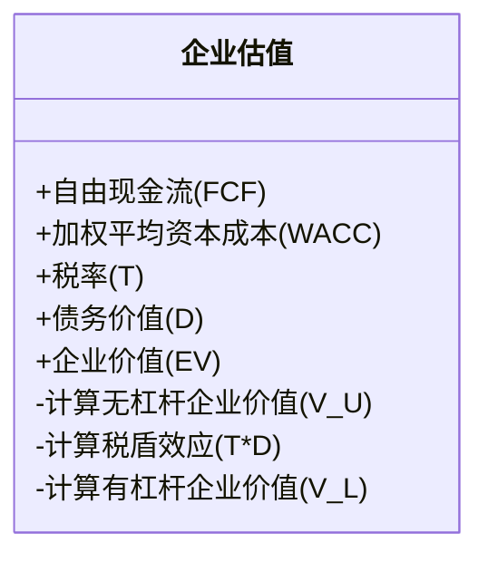
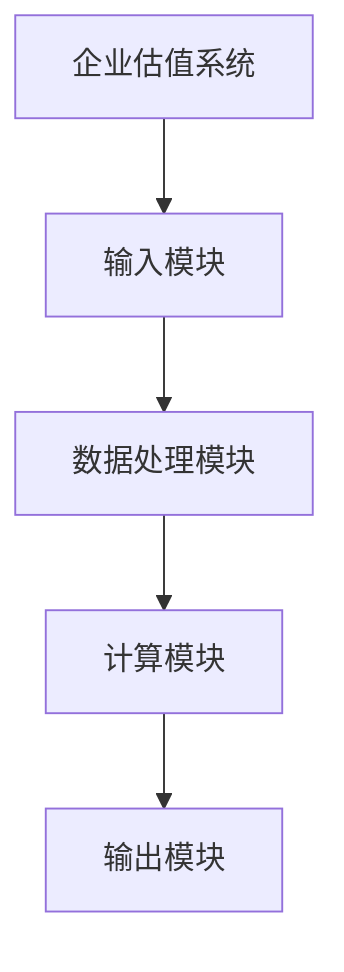

                 


# 企业估值中的APV法

## 关键词：企业估值，APV法，调整现值法，杠杆企业价值，资本成本

## 摘要：本文深入探讨了企业在估值过程中应用APV法的核心原理和实践应用。通过详细分析APV法的理论基础、数学模型、系统架构以及实际案例，本文旨在帮助读者全面理解APV法在企业估值中的重要性，并掌握其实际应用方法。文章从背景介绍、核心概念、算法原理、系统设计、项目实战等多维度展开，结合丰富具体的案例和详尽的公式推导，为读者提供了一套完整的APV法知识体系。

---

## 第一章: APV法的背景与概述

### 1.1 企业估值的基本概念

#### 1.1.1 企业估值的定义与意义

企业估值是指对企业整体价值的评估，是企业在市场上的价值表现。它不仅是企业融资、并购等商业活动的基础，也是投资者评估企业投资价值的重要依据。企业估值的核心在于确定企业的内在价值，即基于企业未来现金流的现值。

#### 1.1.2 企业估值的主要方法

企业估值的主要方法包括：

- **市场法**：基于市场可比交易案例进行估值。
- **收益法**：基于企业未来现金流折现进行估值。
- **资产法**：基于企业资产负债表中的资产价值进行估值。

#### 1.1.3 APV法在企业估值中的地位

APV法（Adjusted Present Value Method）是一种基于收益法的估值方法，主要用于考虑杠杆对企业价值的影响。它通过调整无杠杆企业价值和税盾效应，得到有杠杆企业价值。

### 1.2 APV法的核心概念

#### 1.2.1 APV法的定义

APV法是一种将无杠杆企业价值和税盾效应结合起来的估值方法。其核心在于通过调整无杠杆企业价值，考虑债务的税盾效应，从而得到有杠杆企业价值。

#### 1.2.2 APV法与传统现值法的区别

| **比较维度** | **APV法** | **传统现值法** |
|--------------|------------|----------------|
| 适用场景     | 考虑杠杆影响 | 不考虑杠杆影响 |
| 计算复杂度   | 较高        | 较低            |
| 税盾效应     | 考虑        | 不考虑          |

#### 1.2.3 APV法的适用场景

- 适用于需要考虑债务融资的企业估值。
- 适用于杠杆对价值影响显著的行业。

### 1.3 APV法的理论基础

#### 1.3.1 资本资产定价模型（CAPM）

CAPM用于确定权益资本成本，公式为：

$$ R_e = R_f + \beta (R_m - R_f) $$

其中：
- \( R_e \)：权益资本成本
- \( R_f \)：无风险利率
- \( \beta \)：贝塔系数
- \( R_m \)：市场平均收益率

#### 1.3.2 加权平均资本成本（WACC）

WACC用于确定加权平均资本成本，公式为：

$$ WACC = \frac{E}{E+D} R_e + \frac{D}{E+D} R_d (1 - T) $$

其中：
- \( E \)：权益价值
- \( D \)：债务价值
- \( R_e \)：权益资本成本
- \( R_d \)：债务资本成本
- \( T \)：税率

#### 1.3.3 无杠杆与有杠杆企业价值的区别

无杠杆企业价值仅考虑股权资本，而有杠杆企业价值考虑了债务资本和税盾效应。

### 1.4 本章小结

本章介绍了企业估值的基本概念、主要方法以及APV法的核心概念和理论基础。通过对比分析，明确了APV法在企业估值中的地位和适用场景。

---

## 第二章: APV法的核心原理与数学模型

### 2.1 APV法的理论框架

#### 2.1.1 无杠杆企业价值的计算

无杠杆企业价值是基于无杠杆资本成本的现值，公式为：

$$ V_U = \frac{FCF_U}{WACC_U} $$

其中：
- \( FCF_U \)：无杠杆自由现金流
- \( WACC_U \)：无杠杆加权平均资本成本

#### 2.1.2 有杠杆企业价值的调整

有杠杆企业价值是在无杠杆企业价值的基础上，考虑税盾效应，公式为：

$$ V_L = V_U + T \times D $$

其中：
- \( T \)：税率
- \( D \)：债务价值

#### 2.1.3 APV法与杠杆的关系

APV法通过调整无杠杆企业价值和税盾效应，得到有杠杆企业价值。公式为：

$$ APV = \frac{FCF}{WACC} + T \times D $$

### 2.2 APV法的公式推导

#### 2.2.1 无杠杆企业价值公式

$$ V_U = \frac{FCF_U}{WACC_U} $$

#### 2.2.2 有杠杆企业价值公式

$$ V_L = V_U + T \times D $$

#### 2.2.3 APV法的综合公式

$$ APV = \frac{FCF}{WACC} + T \times D $$

### 2.3 APV法的变量分析

#### 2.3.1 自由现金流（FCF）

自由现金流是企业在偿还债务和再投资后的剩余现金流。

#### 2.3.2 权益资本成本（Re）

权益资本成本是投资者要求的回报率。

#### 2.3.3 债务资本成本（Rd）

债务资本成本是债务持有人要求的回报率。

#### 2.3.4 税率（T）

税率影响税盾效应的大小。

#### 2.3.5 企业价值（EV）

企业价值是企业整体的市场价值。

### 2.4 本章小结

本章详细推导了APV法的公式，分析了各变量之间的关系，并通过公式对比，明确了APV法的核心原理。

---

## 第三章: APV法的系统分析与架构设计

### 3.1 问题场景介绍

#### 3.1.1 企业估值的典型问题

企业在估值过程中常见的问题包括：

- 如何确定合理的资本结构？
- 如何量化税盾效应的影响？
- 如何选择合适的折现率？

#### 3.1.2 APV法的应用场景

APV法适用于需要考虑债务融资的企业估值。

### 3.2 系统功能设计

#### 3.2.1 领域模型



#### 3.2.2 系统架构



### 3.3 系统接口设计

#### 3.3.1 输入接口

- 自由现金流（FCF）
- 加权平均资本成本（WACC）
- 税率（T）
- 债务价值（D）

#### 3.3.2 输出接口

- 无杠杆企业价值（V_U）
- 税盾效应（T*D）
- 有杠杆企业价值（V_L）

### 3.4 系统交互流程

```mermaid
sequenceDiagram
    participant 用户
    participant 输入模块
    participant 计算模块
    participant 输出模块
    用户 -> 输入模块: 提供FCF、WACC、T、D
    输入模块 -> 计算模块: 传递参数
    计算模块 -> 输出模块: 返回V_U、T*D、V_L
    用户 <- 输出模块: 显示结果
```

### 3.5 本章小结

本章通过系统分析和架构设计，明确了APV法在企业估值中的实现流程和交互逻辑。

---

## 第四章: APV法的项目实战

### 4.1 环境配置

#### 4.1.1 工具安装

安装Python和必要的库：

```bash
pip install numpy pandas matplotlib
```

#### 4.1.2 数据准备

准备企业的财务数据，包括自由现金流、税率、债务价值等。

### 4.2 核心代码实现

#### 4.2.1 计算无杠杆企业价值

```python
def calculate_unlevered_value(FCF, WACC):
    return FCF / WACC
```

#### 4.2.2 计算税盾效应

```python
def calculate_tax_shield(T, D):
    return T * D
```

#### 4.2.3 计算有杠杆企业价值

```python
def calculate_levered_value(V_U, T, D):
    return V_U + T * D
```

### 4.3 代码应用解读

通过实际案例，展示如何使用上述代码计算企业价值。

#### 4.3.1 案例分析

假设某企业自由现金流为100万元，WACC为8%，税率25%，债务价值为500万元。

计算无杠杆企业价值：

$$ V_U = \frac{100}{0.08} = 1250 \text{万元} $$

计算税盾效应：

$$ T \times D = 0.25 \times 500 = 125 \text{万元} $$

计算有杠杆企业价值：

$$ V_L = 1250 + 125 = 1375 \text{万元} $$

### 4.4 本章小结

本章通过实际案例，展示了APV法在企业估值中的具体应用，详细解读了代码实现和计算过程。

---

## 第五章: 最佳实践与注意事项

### 5.1 最佳实践

#### 5.1.1 合理选择资本结构

根据企业实际情况，合理选择债务与股权的比例。

#### 5.1.2 准确估计现金流

现金流的估计应基于企业实际经营状况和市场环境。

#### 5.1.3 定期更新估值模型

市场环境和企业状况变化时，应及时更新估值模型。

### 5.2 注意事项

#### 5.2.1 税率变化的影响

税率变化会影响税盾效应，从而影响企业价值。

#### 5.2.2 假设条件的敏感性

APV法的假设条件敏感，需注意其对结果的影响。

### 5.3 拓展阅读

推荐阅读以下书籍和文章：

- 《企业价值评估：方法与实践》
- “The Theory of Corporate Finance” by Modigliani and Miller

### 5.4 本章小结

本章总结了APV法的应用注意事项，并提供了最佳实践建议，同时推荐了进一步阅读的资料。

---

## 作者：AI天才研究院/AI Genius Institute & 禅与计算机程序设计艺术 /Zen And The Art of Computer Programming

---

**本文通过系统分析和实际案例，全面介绍了APV法在企业估值中的应用。从理论基础到数学公式，从系统设计到项目实战，本文为读者提供了一套完整的APV法知识体系。希望本文能为企业的估值实践提供有益的参考和指导。**

